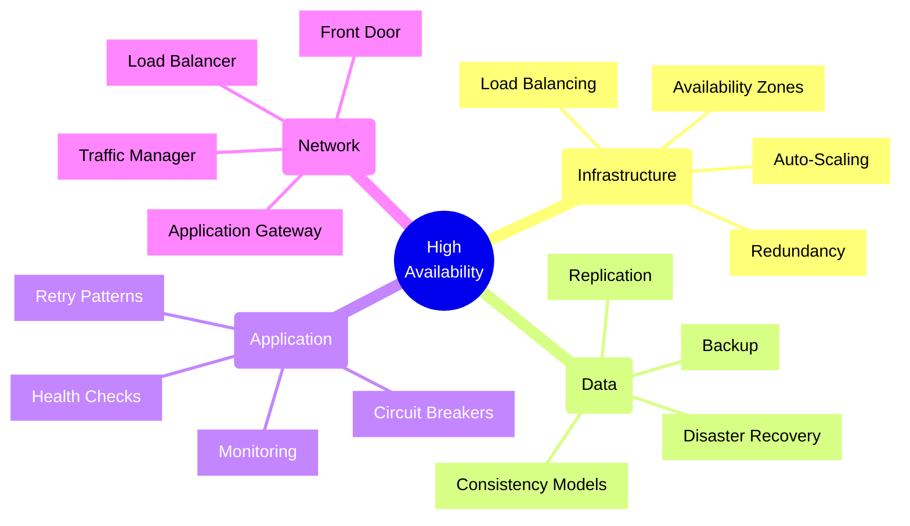
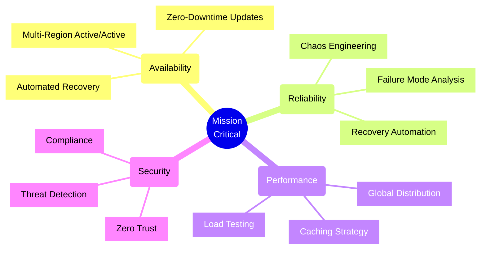
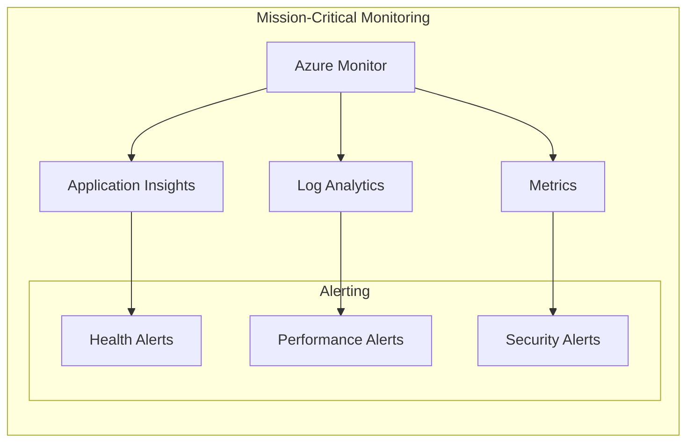
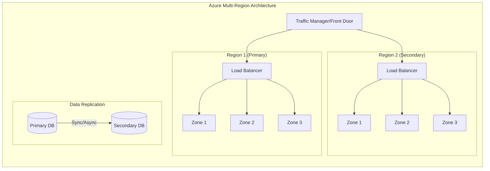
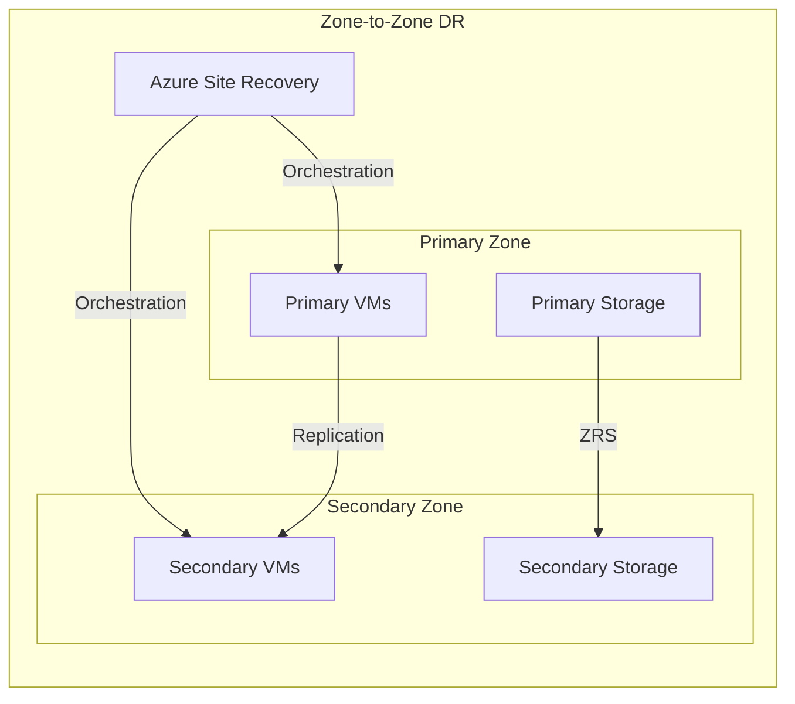
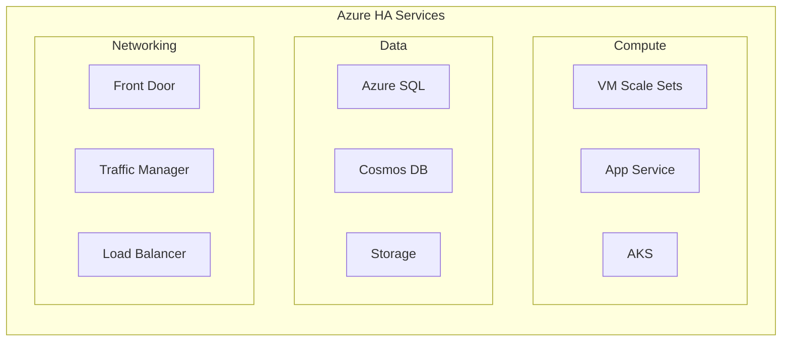
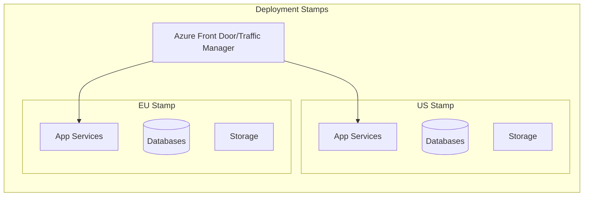

# High Availability Design Principles and Implementations



High Availability (HA) is the ability of a system to remain operational and accessible even in the face of component failures. Here's a comprehensive guide to high availability design principles and their implementations, with a focus on Azure cloud services and tools:

## 1. Redundancy

### Principles
- Eliminating single points of failure
- Component duplication
- Geographic distribution
- Active-Active vs Active-Passive configurations

### Azure Implementation
```bicep
// Azure Load Balancer with multiple instances
resource loadBalancer 'Microsoft.Network/loadBalancers@2021-05-01' = {
  name: 'ha-loadbalancer'
  location: resourceGroup().location
  sku: {
    name: 'Standard'
    tier: 'Regional'
  }
  properties: {
    frontendIPConfigurations: [
      {
        name: 'frontend'
        properties: {
          publicIPAddress: {
            id: publicIP.id
          }
        }
      }
    ]
    backendAddressPools: [
      {
        name: 'backend'
      }
    ]
    probes: [
      {
        name: 'http-probe'
        properties: {
          protocol: 'Http'
          port: 80
          requestPath: '/health'
          intervalInSeconds: 5
          numberOfProbes: 2
        }
      }
    ]
  }
}

// Availability Set for VMs
resource availabilitySet 'Microsoft.Compute/availabilitySets@2021-07-01' = {
  name: 'ha-aset'
  location: resourceGroup().location
  sku: {
    name: 'Aligned'
  }
  properties: {
    platformFaultDomainCount: 3
    platformUpdateDomainCount: 5
  }
}
```

### Tools and Services
- **Azure Availability Zones**: Physical and logical separation of resources
- **Azure Availability Sets**: Fault domain and update domain separation
- **Azure Site Recovery**: Cross-region replication and failover
- **Azure Traffic Manager**: Global DNS-based load balancing
- **Azure Front Door**: Global HTTP/HTTPS load balancing with WAF

## 2. Fault Detection and Recovery

### Principles
- Health monitoring
- Automated failover
- Self-healing systems
- Circuit breakers

### Implementation Example
```java
// Circuit Breaker Pattern Implementation
@CircuitBreaker(name = "backendService", fallbackMethod = "fallbackMethod")
public String backendServiceCall() {
    return restTemplate.getForObject("/api/data", String.class);
}

public String fallbackMethod(Exception ex) {
    return "Fallback Response due to: " + ex.getMessage();
}

// Health Check Implementation
@Component
public class DatabaseHealthIndicator extends AbstractHealthIndicator {
    @Override
    protected void doHealthCheck(Health.Builder builder) {
        try {
            int result = jdbcTemplate.queryForObject("SELECT 1", Integer.class);
            if (result == 1) {
                builder.up();
            } else {
                builder.down();
            }
        } catch (Exception e) {
            builder.down(e);
        }
    }
}
```

## 3. Load Distribution and Balancing

### Principles
- Traffic distribution
- Session persistence
- Health probes
- Geographic routing

### Implementation Example
```nginx
# Nginx High Availability Configuration
upstream backend {
    server backend1.example.com:8080 max_fails=3 fail_timeout=30s;
    server backend2.example.com:8080 max_fails=3 fail_timeout=30s;
    server backend3.example.com:8080 backup;
    
    keepalive 32;
    least_conn;
}

server {
    listen 80;
    server_name example.com;
    
    location / {
        proxy_pass http://backend;
        proxy_next_upstream error timeout invalid_header http_500;
        proxy_next_upstream_tries 3;
        proxy_connect_timeout 5s;
        health_check interval=5s fails=3 passes=2;
    }
}
```

## 4. Data Replication and Consistency

### Principles
- Synchronous vs Asynchronous replication
- Data consistency models
- Backup strategies
- Point-in-time recovery

### Implementation Example
```sql
-- PostgreSQL Streaming Replication Configuration
-- On Primary Server (postgresql.conf)
wal_level = replica
max_wal_senders = 10
wal_keep_size = 16

-- On Replica Server (recovery.conf)
primary_conninfo = 'host=primary_host port=5432 user=repl password=password'
restore_command = 'cp /path/to/archive/%f %p'
recovery_target_timeline = 'latest'

-- Azure SQL Database Geo-Replication
CREATE DATABASE SecondaryDatabase 
AS COPY OF PrimaryDatabase
(SERVICE_OBJECTIVE = 'HS_Gen5_2');

-- Set up Active Geo-Replication
ALTER DATABASE SecondaryDatabase
ADD SECONDARY ON SERVER SecondaryServer;
```

## 5. Disaster Recovery

### Principles
- Recovery Point Objective (RPO)
- Recovery Time Objective (RTO)
- Business Continuity Planning
- Disaster Recovery Testing

### Implementation Example
```typescript
// Azure Site Recovery Configuration
import * as pulumi from "@pulumi/pulumi";
import * as azure from "@pulumi/azure-native";

const vault = new azure.recoveryservices.Vault("example-vault", {
    resourceGroupName: resourceGroup.name,
    location: "eastus",
    sku: {
        name: "Standard"
    },
    properties: {
        monitoringSettings: {
            alertSettings: {
                alertsForAllJobFailures: "Enabled"
            }
        }
    }
});

const policy = new azure.recoveryservices.ReplicationPolicy("example-policy", {
    resourceGroupName: resourceGroup.name,
    resourceName: vault.name,
    properties: {
        providerSpecificInput: {
            instanceType: "A2A",
            recoveryPointHistoryInMinutes: 1440,
            applicationConsistentSnapshotFrequencyInMinutes: 240
        }
    }
});
```

## Integration with System Design Patterns

For detailed implementation of design patterns that support high availability, refer to the [System Design Principles and Patterns](System_Design_Principles_and_Patterns.md) document, specifically:

- Circuit Breaker Pattern implementation for Azure Functions
- Data Consistency Patterns with Cosmos DB
- Monitoring Patterns with Application Insights
- Azure-specific Pattern Selection Framework

The patterns described in the System Design document complement the high availability implementations described here by providing:

1. **Foundational Patterns**
   - Circuit breaker implementations
   - Retry strategies
   - Bulkhead pattern
   - Cache-aside pattern

2. **Azure-Specific Implementations**
   - VM Scale Set configurations
   - Application Insights setup
   - Cosmos DB multi-region deployments
   - Azure Front Door configurations

## Mission-Critical Workload Considerations



### Design Principles for Mission-Critical Systems

1. **Zero-Downtime Architecture**
   - Active-active multi-region deployment
   - Zero-downtime updates and maintenance
   - Automated failover and recovery
   - Real-time monitoring and alerting

2. **Resiliency Requirements**
   - RTO < 1 hour (typically minutes)
   - RPO < 1 minute
   - 99.99% or higher availability
   - Geographic redundancy

3. **Data Consistency**
   - Multi-region write capability
   - Strong consistency where required
   - Conflict resolution strategies
   - Data sovereignty compliance

### Azure Service Level Agreements (SLAs)

| Service | Tier | SLA | Requirements |
|---------|------|-----|--------------|
| Virtual Machines | Single Instance | 99.9% | Premium SSD/Ultra Disk |
| Virtual Machines | Availability Set | 99.95% | 2+ instances |
| Virtual Machines | Availability Zones | 99.99% | 2+ instances across zones |
| App Service | Standard | 99.95% | Multiple instances |
| App Service | Premium v3 | 99.99% | Zone redundant deployment |
| Azure SQL Database | Business Critical | 99.995% | Zone redundant deployment |
| Cosmos DB | Multi-region | 99.999% | Multi-region writes |
| Azure Storage | ZRS | 99.9999999999% (11 9's) | Data durability |

### Implementation Checklist for Mission-Critical Workloads

```yaml
# Example Azure Front Door Configuration for Global Distribution
resource "azurerm_frontdoor" "example" {
  name                = "mission-critical-frontend"
  resource_group_name = azurerm_resource_group.example.name

  routing_rule {
    name               = "routing-rule"
    accepted_protocols = ["Http", "Https"]
    patterns_to_match  = ["/*"]
    
    frontend_endpoints = ["frontend-endpoint"]
    
    forwarding_configuration {
      forwarding_protocol = "MatchRequest"
      backend_pool_name   = "backend-pool"
    }
  }

  backend_pool {
    name = "backend-pool"
    
    backend {
      host_header      = "primary-region.azurewebsites.net"
      address          = "primary-region.azurewebsites.net"
      http_port        = 80
      https_port       = 443
      priority         = 1
      weight          = 50
    }
    
    backend {
      host_header      = "secondary-region.azurewebsites.net"
      address          = "secondary-region.azurewebsites.net"
      http_port        = 80
      https_port       = 443
      priority         = 1
      weight          = 50
    }

    load_balancing_name = "load-balancing-settings"
    health_probe_name   = "health-probe"
  }
}
```

### Monitoring Strategy for Mission-Critical Systems

1. **Health Metrics**
   - Service health status
   - Resource utilization
   - Performance metrics
   - Error rates

2. **Business Metrics**
   - Transaction success rates
   - Response times
   - User experience metrics
   - Business impact metrics

3. **Compliance Monitoring**
   - Security posture
   - Compliance status
   - Audit logs
   - Access patterns



## Cross-Region Deployment Patterns



## Azure-Specific Availability Patterns

### 1. Zone-to-Zone Disaster Recovery
Suitable for scenarios where:
- Metro disaster recovery strategy is needed
- Complex networking infrastructure exists
- Legal jurisdiction requires data to remain within region
- Lower RPO is required due to reduced replication distance



### 2. Regional High Availability
For mission-critical workloads requiring maximum uptime:

1. **Virtual Machine Scale Sets**
   - Automatic VM distribution across zones
   - Built-in auto-scaling capabilities
   - Automated instance health management

2. **Azure App Service**
   - Zone redundancy in Premium v3 and above
   - Auto-healing capabilities
   - Built-in load balancing

3. **Azure Storage**
   - Zone-redundant storage (ZRS)
   - Geo-redundant storage (GRS)
   - Read-access geo-redundant storage (RA-GRS)

### 3. Service-Specific HA Features



#### Azure SQL Database
- Built-in replication
- Automatic failover groups
- Zone-redundant deployments
- Point-in-time recovery

#### Cosmos DB
- 99.999% SLA with multi-region writes
- Automatic failover
- Multiple consistency levels
- Global distribution

#### Azure Storage
```yaml
# Storage Account with ZRS and soft delete
resource "azurerm_storage_account" "example" {
  name                     = "hazrstorage"
  resource_group_name      = azurerm_resource_group.example.name
  location                 = azurerm_resource_group.example.location
  account_tier             = "Standard"
  account_replication_type = "ZRS"

  blob_properties {
    delete_retention_policy {
      days = 7
    }
    container_delete_retention_policy {
      days = 7
    }
    versioning_enabled = true
  }
}
```

### 4. Deployment Stamps Pattern
Recommended for SaaS solutions to:
- Isolate blast radius
- Provide geographic independence
- Enable independent scaling
- Simplify management



## Azure-Specific Best Practices

1. **Authentication and Security**
   - Use Managed Identities instead of connection strings/keys
   - Store secrets in Azure Key Vault
   - Implement proper RBAC with least privilege
   - Enable encryption at rest and in transit

2. **Monitoring and Diagnostics**
   - Implement Azure Monitor for comprehensive monitoring
   - Use Application Insights for application telemetry
   - Set up Log Analytics for centralized logging
   - Configure proper alerting thresholds

3. **Data Management**
   - Use geo-redundant storage for critical data
   - Implement Azure Backup for regular backups
   - Configure point-in-time recovery for databases
   - Use Azure Site Recovery for DR

4. **Network Design**
   - Implement Azure Front Door for global load balancing
   - Use Application Gateway for L7 load balancing
   - Configure Network Security Groups properly
   - Implement Azure DDoS Protection

5. **Auto-Scaling**
   - Use VM Scale Sets for IaaS workloads
   - Configure App Service auto-scaling rules
   - Implement AKS cluster auto-scaling
   - Monitor and optimize scaling thresholds

## Essential Azure Tools for HA Implementation

1. **Infrastructure Management**
   - Azure CLI/PowerShell
   - Azure Resource Manager templates
   - Bicep for infrastructure as code
   - Azure DevOps for CI/CD

2. **Monitoring and Analytics**
   - Azure Monitor
   - Application Insights
   - Log Analytics
   - Azure Service Health

3. **Security and Compliance**
   - Azure Key Vault
   - Microsoft Defender for Cloud
   - Azure Policy
   - Azure RBAC

4. **Disaster Recovery**
   - Azure Site Recovery
   - Azure Backup
   - Azure Storage redundancy options
   - Traffic Manager/Front Door

## High Availability Principles

1. **Design for Failure**
   - Assume components will fail
   - Plan for graceful degradation
   - Implement retry policies
   - Use circuit breakers

2. **Implement Proper Monitoring**
   - Set up comprehensive monitoring
   - Use proper alerting thresholds
   - Monitor system health
   - Track key metrics

3. **Data Management**
   - Implement proper backup strategies
   - Use data replication
   - Maintain data consistency
   - Plan for disaster recovery

4. **Performance Considerations**
   - Monitor system performance
   - Implement caching strategies
   - Use load balancing
   - Optimize resource usage

5. **Security Integration**
   - Implement security at every layer
   - Use proper authentication/authorization
   - Encrypt sensitive data
   - Regular security audits

Remember: High availability is not just about implementing redundant components; it's about creating a comprehensive strategy that ensures your system remains operational under various conditions. Always consider your specific requirements and constraints when implementing high availability solutions.