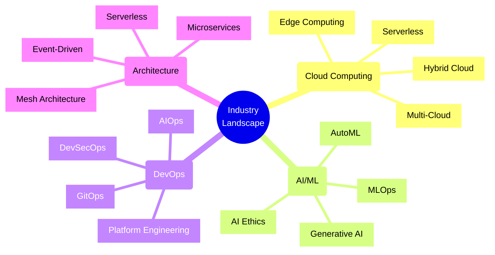
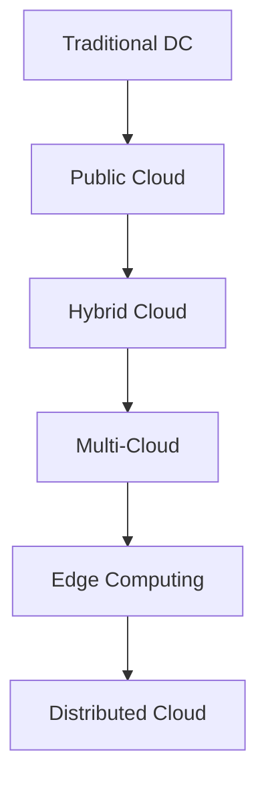
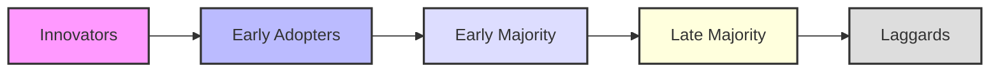
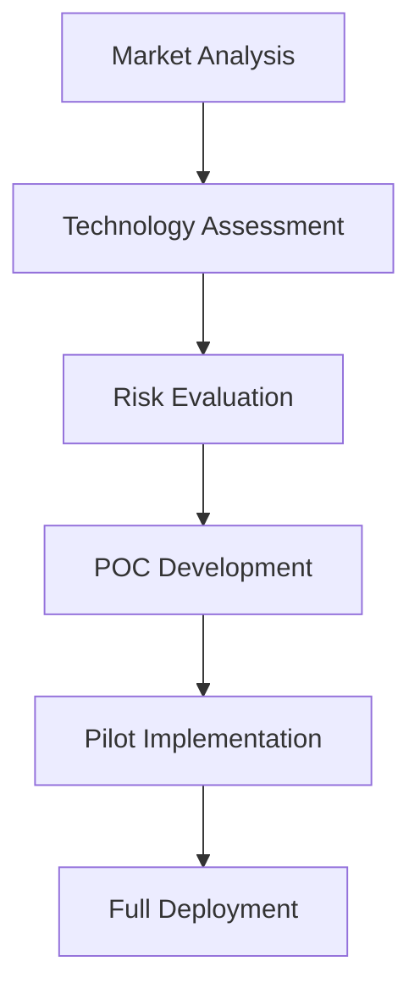
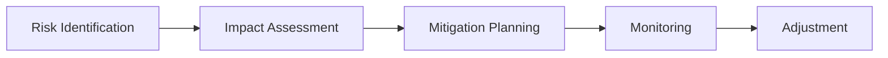
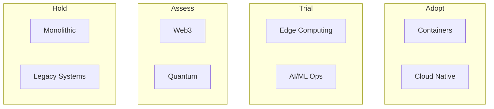

# Industry Trends and Competitive Landscape

## Overview
Understanding industry trends and the competitive landscape is crucial for software architects to make informed decisions about technology choices and architectural patterns.



## Current Trends Analysis

### Cloud Computing Evolution


### Major Technology Waves
| Wave | Impact | Adoption Rate | Maturity |
|------|---------|--------------|-----------|
| Cloud Native | High | Widespread | Mature |
| AI/ML | High | Growing | Emerging |
| Edge Computing | Medium | Early | Emerging |
| Quantum Computing | Low | Experimental | Nascent |

## Competitive Analysis Framework

### Technology Stack Comparison
```yaml
evaluation_criteria:
  technical:
    - Performance
    - Scalability
    - Security
    - Reliability
  business:
    - Cost
    - Time to Market
    - Vendor Lock-in
    - Support
  operational:
    - Maintainability
    - Monitoring
    - Deployment
    - Recovery
```

### Market Position Matrix
| Position | Technology | Market Share | Growth Rate |
|----------|------------|--------------|-------------|
| Leader | Cloud Platform A | 32% | 15% |
| Challenger | Cloud Platform B | 20% | 25% |
| Visionary | Edge Platform C | 10% | 40% |
| Niche | Specialized D | 5% | 10% |

## Best Practices Checklist

### Technology Assessment
- [ ] Regular technology radar updates
- [ ] Competitor analysis
- [ ] Innovation tracking
- [ ] Risk assessment
- [ ] Cost-benefit analysis

### Market Monitoring
- [ ] Industry reports review
- [ ] Conference trends analysis
- [ ] Academic research tracking
- [ ] Start-up ecosystem monitoring
- [ ] Patent analysis

### Competitive Intelligence
- [ ] Technology stack analysis
- [ ] Architecture pattern tracking
- [ ] Performance benchmarking
- [ ] Feature comparison
- [ ] Cost structure analysis

## Technology Adoption Lifecycle

### Innovation Adoption Curve


### Technology Maturity Assessment
| Technology | Maturity | Risk | Adoption | Trend |
|------------|----------|------|-----------|--------|
| Containers | High | Low | Widespread | Stable |
| Serverless | Medium | Medium | Growing | Up |
| Edge Computing | Low | High | Early | Up |
| Web3 | Low | High | Limited | Volatile |

## Competitive Intelligence Tools

### Market Analysis
- Industry Reports (Gartner, Forrester)
- Technology Radars
- Patent Databases
- Academic Publications
- Conference Proceedings

### Technical Analysis
- GitHub Trends
- Stack Overflow Surveys
- Developer Surveys
- Benchmarking Tools
- Architecture Patterns

## Implementation Strategy

### Technology Selection Process


### Risk Management


## Industry-Specific Considerations

### Financial Services
```yaml
key_trends:
  - Blockchain/DLT
  - Real-time Processing
  - Open Banking
  - AI/ML in Trading
  - Zero-Trust Security
challenges:
  - Regulatory Compliance
  - Legacy Integration
  - Security
  - Performance
```

### Healthcare
```yaml
key_trends:
  - Telemedicine
  - IoT Medical Devices
  - AI Diagnostics
  - Interoperability
  - Privacy
challenges:
  - HIPAA Compliance
  - Data Security
  - Integration
  - Reliability
```

## Emerging Technologies Impact

### Impact Assessment Matrix
| Technology | Business Impact | Technical Impact | Implementation Complexity |
|------------|----------------|------------------|------------------------|
| AI/ML | High | High | High |
| Blockchain | Medium | High | High |
| IoT | High | Medium | Medium |
| Edge Computing | High | Medium | Medium |

### Technology Radar


## Common Challenges

### Technical Challenges
| Challenge | Strategy |
|-----------|----------|
| Legacy Integration | Hybrid Architecture |
| Skill Gaps | Training & Partners |
| Technical Debt | Modernization Plan |
| Security | Zero-Trust Model |

### Business Challenges
| Challenge | Strategy |
|-----------|----------|
| Cost Management | Cloud Optimization |
| Time to Market | Agile/DevOps |
| Competition | Innovation Focus |
| Regulations | Compliance First |

## Additional Resources

### Market Research
1. Industry Reports
   - Gartner Magic Quadrant
   - Forrester Wave
   - IDC MarketScape

2. Technology Trends
   - ThoughtWorks Tech Radar
   - State of DevOps
   - Stack Overflow Survey

3. Learning Resources
   - Architecture Patterns
   - Case Studies
   - Conference Proceedings
   - Academic Research

4. Tools and Platforms
   - Competitive Analysis Tools
   - Benchmarking Platforms
   - Market Intelligence Tools
   - Patent Databases