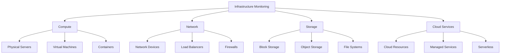
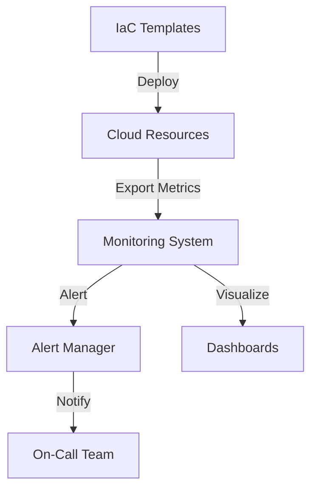
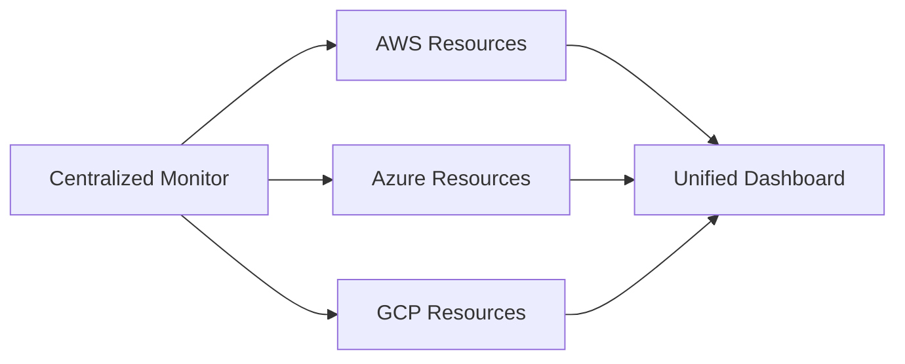
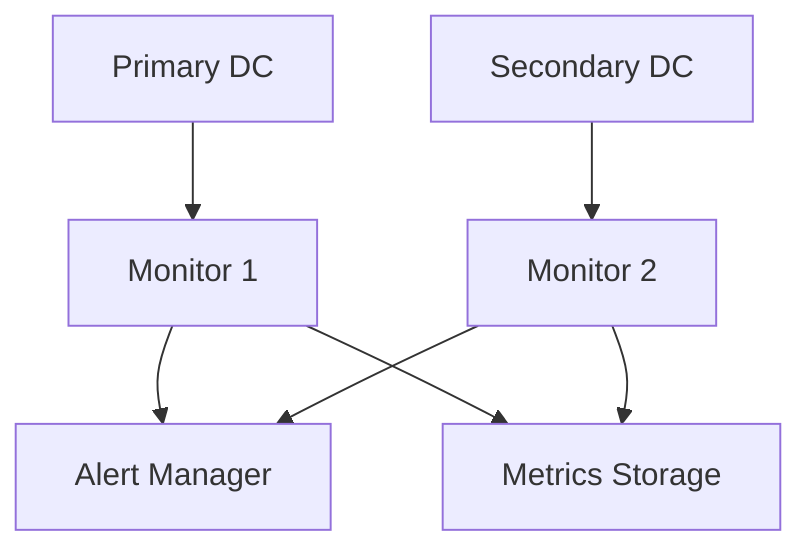

# Infrastructure Monitoring

## Overview
Infrastructure monitoring provides visibility into the health, performance, and availability of infrastructure components including servers, networks, containers, and cloud resources.



## Key Components

### Compute Monitoring
- CPU utilization
- Memory usage
- Process stats
- Thread counts
- System load
- Container metrics

### Network Monitoring
- Bandwidth usage
- Latency
- Packet loss
- Error rates
- DNS health
- SSL certificates

### Storage Monitoring
- Disk usage
- IOPS
- Latency
- Queue length
- Cache hits/misses
- Replication lag

### Cloud Resource Monitoring
- Service health
- Resource utilization
- Costs
- Quotas
- API limits
- Regional availability

## Best Practices Checklist

### Implementation
- [ ] Define monitoring scope
- [ ] Select metrics
- [ ] Set thresholds
- [ ] Configure alerts
- [ ] Plan scaling

### Operations
- [ ] Monitor costs
- [ ] Review alerts
- [ ] Update baselines
- [ ] Maintain documentation
- [ ] Regular audits

### Security
- [ ] Access control
- [ ] Audit logging
- [ ] Encryption
- [ ] Compliance
- [ ] Network security

## Implementation Examples

### Server Monitoring (Node Exporter)
```yaml
scrape_configs:
  - job_name: 'node'
    static_configs:
      - targets: ['node-exporter:9100']
    metrics_path: '/metrics'
    scrape_interval: 15s
    relabel_configs:
      - source_labels: [__address__]
        target_label: instance
```

### Container Monitoring (cAdvisor)
```yaml
version: '3'
services:
  cadvisor:
    image: gcr.io/cadvisor/cadvisor
    volumes:
      - /:/rootfs:ro
      - /var/run:/var/run:ro
      - /sys:/sys:ro
      - /var/lib/docker/:/var/lib/docker:ro
    ports:
      - "8080:8080"
```

## Monitoring Patterns

### Infrastructure as Code Monitoring


### Multi-Cloud Monitoring


## Resource Monitoring Examples

### CPU Monitoring
```typescript
interface CPUMetrics {
  usage: {
    user: number;
    system: number;
    idle: number;
    iowait: number;
  };
  load: {
    load1: number;
    load5: number;
    load15: number;
  };
  temperature: number;
}

class CPUMonitor {
  async collectMetrics(): Promise<CPUMetrics> {
    // Implementation
  }
}
```

### Memory Monitoring
```typescript
interface MemoryMetrics {
  total: number;
  used: number;
  free: number;
  cached: number;
  buffers: number;
  swapTotal: number;
  swapUsed: number;
}

class MemoryMonitor {
  async collectMetrics(): Promise<MemoryMetrics> {
    // Implementation
  }
}
```

## Alert Configurations

### Resource Alerts
```yaml
alerts:
  - name: HighCPUUsage
    condition: cpu_usage > 90
    duration: 5m
    severity: warning
    
  - name: DiskSpaceLow
    condition: disk_free < 10
    duration: 10m
    severity: critical
    
  - name: HighMemoryUsage
    condition: memory_used / memory_total > 0.95
    duration: 5m
    severity: warning
```

### Network Alerts
```yaml
alerts:
  - name: HighLatency
    condition: network_latency > 100ms
    duration: 5m
    severity: warning
    
  - name: PacketLoss
    condition: packet_loss_rate > 0.01
    duration: 1m
    severity: critical
    
  - name: NetworkSaturation
    condition: network_bandwidth_used / network_bandwidth_total > 0.8
    duration: 5m
    severity: warning
```

## Visualization Examples

### System Dashboard
```json
{
  "dashboard": {
    "title": "System Overview",
    "panels": [
      {
        "title": "CPU Usage",
        "type": "gauge",
        "targets": [
          {
            "expr": "100 - (avg by (instance) (irate(node_cpu_seconds_total{mode=\"idle\"}[5m])) * 100)"
          }
        ]
      },
      {
        "title": "Memory Usage",
        "type": "graph",
        "targets": [
          {
            "expr": "node_memory_MemTotal_bytes - node_memory_MemAvailable_bytes"
          }
        ]
      }
    ]
  }
}
```

## High Availability Monitoring

### Redundant Monitoring


## Capacity Planning

### Resource Forecasting
```typescript
interface ResourceForecast {
  resource: string;
  currentUsage: number;
  projectedUsage: number;
  timeToExhaustion: number;
  recommendedAction: string;
}

class CapacityPlanner {
  async forecast(metrics: MetricHistory[]): Promise<ResourceForecast> {
    // Implementation
  }
}
```

## Best Practices Examples

### Metric Naming
```text
# Good
infrastructure_cpu_usage_percent{host="server1",environment="prod"}
infrastructure_memory_used_bytes{container="api",pod="web-1"}

# Bad
cpu
server1_mem
```

### Alert Definition
```yaml
alert_rules:
  - name: "Infrastructure Health"
    rules:
      - alert: SystemDiskFull
        expr: disk_used_percent > 85
        for: 10m
        labels:
          severity: warning
        annotations:
          summary: "Disk usage high on {{ $labels.instance }}"
          description: "Disk usage is {{ $value }}%"
          
      - alert: SystemLoad
        expr: system_load5 > 3
        for: 5m
        labels:
          severity: warning
        annotations:
          summary: "High system load on {{ $labels.instance }}"
          description: "5-minute load average is {{ $value }}"
```

## Additional Resources
1. Documentation
   - [Node Exporter Documentation](https://prometheus.io/docs/guides/node-exporter/)
   - [cAdvisor Documentation](https://github.com/google/cadvisor)
   - [Cloud Provider Monitoring Documentation]

2. Learning Resources
   - Infrastructure Monitoring Best Practices
   - Capacity Planning
   - Alert Management
   - Performance Optimization