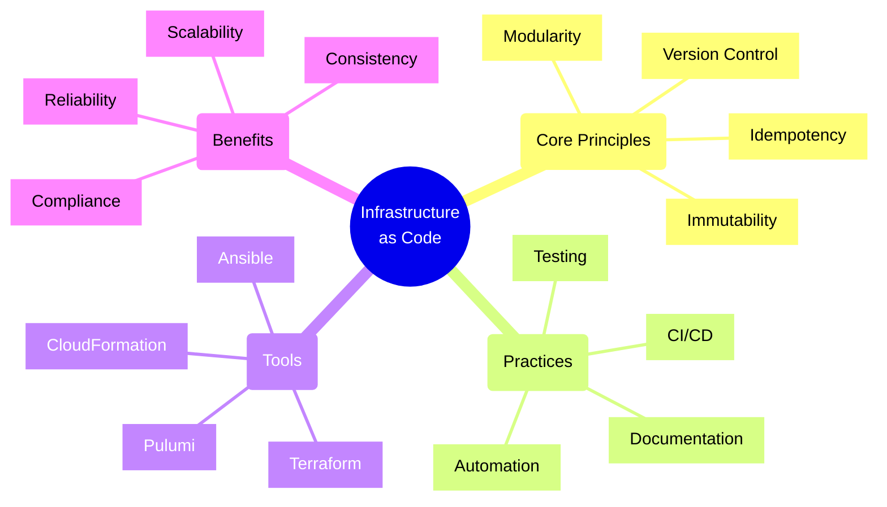
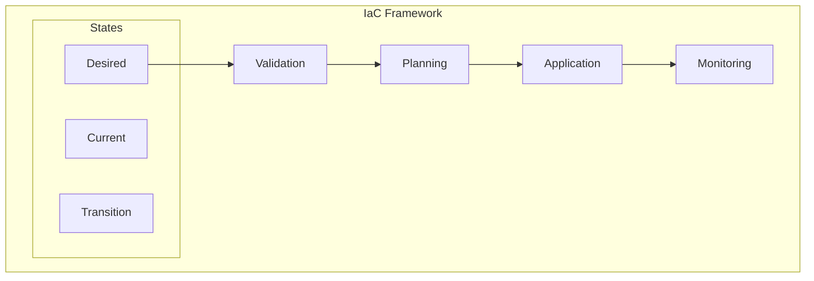
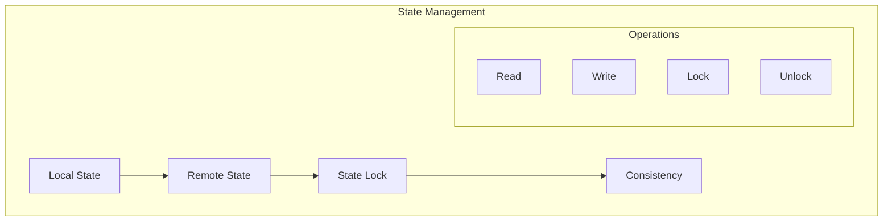
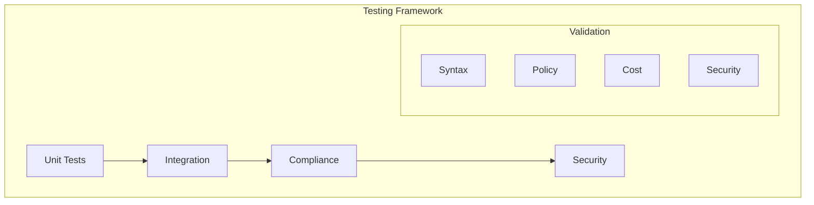

# Infrastructure as Code Principles



## Core Implementation Patterns

### 1. Resource Definition Pattern



Implementation Example:
```typescript
// Infrastructure resource manager
class InfrastructureManager {
    constructor(
        private resourceProvider: ResourceProvider,
        private stateManager: StateManager,
        private validator: ResourceValidator,
        private planner: ExecutionPlanner
    ) {}

    async deployInfrastructure(
        definition: InfraDefinition
    ): Promise<DeploymentResult> {
        try {
            // Validate definition
            await this.validator.validateDefinition(
                definition
            );

            // Get current state
            const currentState = await this.stateManager
                .getCurrentState();

            // Plan changes
            const plan = await this.planner.createPlan(
                currentState,
                definition
            );

            // Execute plan
            const result = await this.executeDeployment(plan);

            // Update state
            await this.stateManager.updateState(result);

            return result;
        } catch (error) {
            await this.handleDeploymentError(error);
            throw error;
        }
    }

    private async executeDeployment(
        plan: ExecutionPlan
    ): Promise<DeploymentResult> {
        const operations = plan.getOperations();
        const results: OperationResult[] = [];

        for (const op of operations) {
            try {
                // Execute operation
                const result = await this.executeOperation(op);
                results.push(result);

                // Validate result
                await this.validateOperationResult(result);

                // Update dependencies
                await this.updateDependencies(result);
            } catch (error) {
                return this.handleOperationError(
                    error,
                    op,
                    results
                );
            }
        }

        return this.createDeploymentResult(results);
    }
}
```

### 2. State Management Pattern



Implementation Example:
```typescript
// Infrastructure state manager
class StateManager {
    constructor(
        private storage: StateStorage,
        private lockManager: LockManager,
        private consistency: ConsistencyChecker
    ) {}

    async updateState(
        changes: ResourceChanges
    ): Promise<void> {
        const lockId = await this.lockManager.acquireLock();

        try {
            // Read current state
            const currentState = await this.storage
                .readState();

            // Apply changes
            const newState = await this.applyChanges(
                currentState,
                changes
            );

            // Validate consistency
            await this.consistency.checkConsistency(
                newState
            );

            // Write new state
            await this.storage.writeState(newState);
        } finally {
            await this.lockManager.releaseLock(lockId);
        }
    }

    private async applyChanges(
        current: State,
        changes: ResourceChanges
    ): Promise<State> {
        const newState = current.clone();

        for (const change of changes) {
            switch (change.type) {
                case 'CREATE':
                    await this.handleCreate(newState, change);
                    break;
                case 'UPDATE':
                    await this.handleUpdate(newState, change);
                    break;
                case 'DELETE':
                    await this.handleDelete(newState, change);
                    break;
            }
        }

        return newState;
    }
}
```

### 3. Testing and Validation Pattern



Implementation Example:
```typescript
// Infrastructure test manager
class InfrastructureTestManager {
    constructor(
        private testRunner: TestRunner,
        private policyChecker: PolicyChecker,
        private securityScanner: SecurityScanner,
        private costEstimator: CostEstimator
    ) {}

    async validateInfrastructure(
        definition: InfraDefinition
    ): Promise<ValidationResult> {
        // Run syntax validation
        await this.validateSyntax(definition);

        // Run unit tests
        const unitResults = await this.runUnitTests(
            definition
        );

        // Check policies
        const policyResults = await this.checkPolicies(
            definition
        );

        // Scan security
        const securityResults = await this.scanSecurity(
            definition
        );

        // Estimate costs
        const costEstimate = await this.estimateCosts(
            definition
        );

        return {
            syntax: true,
            unitTests: unitResults,
            policyChecks: policyResults,
            security: securityResults,
            costs: costEstimate
        };
    }

    private async runUnitTests(
        definition: InfraDefinition
    ): Promise<TestResult[]> {
        const tests = await this.testRunner.discoverTests(
            definition
        );

        return Promise.all(
            tests.map(test =>
                this.testRunner.runTest(test, definition)
            )
        );
    }

    async validateDeployment(
        deployment: Deployment
    ): Promise<void> {
        // Validate resources
        await this.validateResources(deployment);

        // Check dependencies
        await this.checkDependencies(deployment);

        // Verify configurations
        await this.verifyConfigurations(deployment);

        // Validate compliance
        await this.validateCompliance(deployment);
    }
}
```

## Best Practices

1. **Code Management**
   - Use version control
   - Implement branching strategy
   - Review changes
   - Track history

2. **Testing Strategy**
   - Unit test modules
   - Integration test stacks
   - Test in stages
   - Validate compliance

3. **Security & Compliance**
   - Encrypt sensitive data
   - Use least privilege
   - Implement audit trails
   - Regular security scans

4. **Operational Excellence**
   - Document everything
   - Automate deployment
   - Monitor changes
   - Regular maintenance

Remember: Infrastructure as Code transforms infrastructure management into a software engineering discipline. Apply software development best practices while considering infrastructure-specific requirements and constraints.