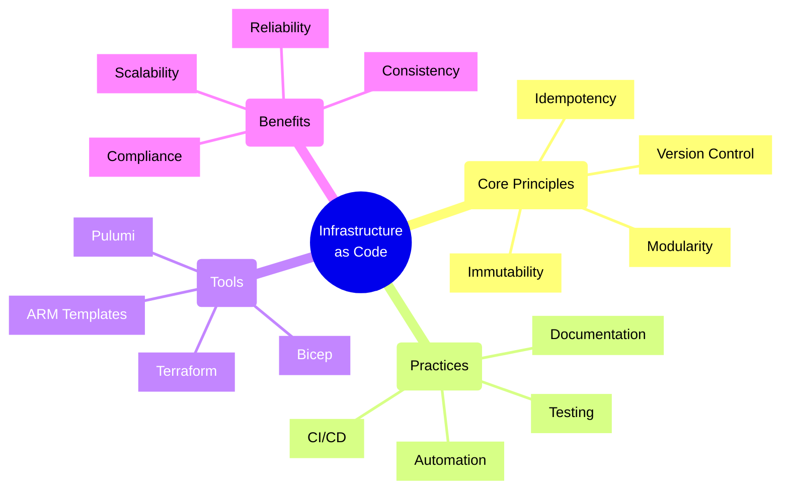
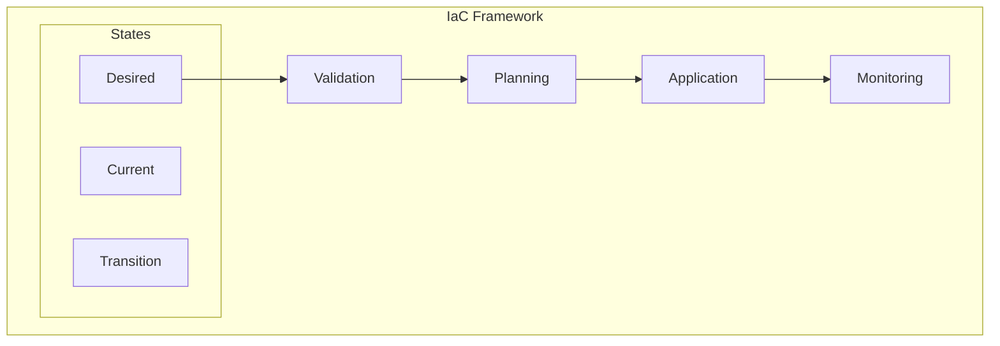
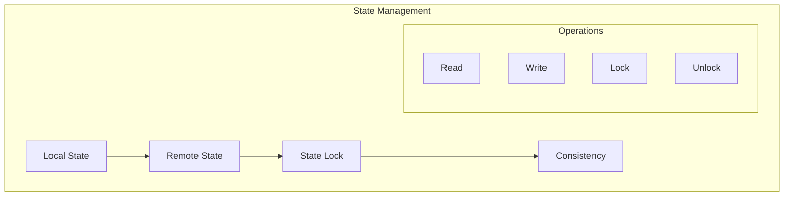
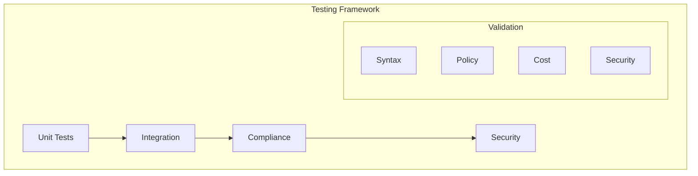

# Infrastructure as Code Principles

## Core Implementation Patterns

### 1. Resource Definition Pattern

Key Considerations:
- Always validate deployments before applying (e.g., `terraform plan`, `az deployment what-if`)
- Use parameterization for environment-specific values
- Implement proper state management
- Handle dependencies explicitly
- Follow least privilege principle

### 2. State Management Pattern

Best Practices:
1. Store state in secure, remote location
2. Enable state locking to prevent concurrent modifications
3. Use state encryption for sensitive data
4. Implement state versioning
5. Regular state backups
6. Clean up orphaned resources

### 3. Testing and Validation Pattern

Validation Checklist:
- [ ] Syntax validation
- [ ] Policy compliance
- [ ] Security baseline
- [ ] Cost estimation
- [ ] Resource naming conventions
- [ ] Tag compliance
- [ ] Network security rules
- [ ] Identity and access management

## Security Best Practices

1. **Authentication & Authorization**
   - Use managed identities when possible
   - Implement proper RBAC
   - Store secrets in Key Vault
   - Regular access reviews

2. **Resource Security**
   - Enable encryption at rest
   - Configure network security
   - Use private endpoints
   - Implement proper firewalls

3. **Compliance & Governance**
   - Policy enforcement
   - Regular auditing
   - Tagging strategy
   - Cost management

## Operational Excellence

1. **Documentation**
   - Architecture diagrams
   - Dependencies
   - Configuration values
   - Recovery procedures

2. **Automation**
   - CI/CD pipelines
   - Automated testing
   - Deployment validation
   - Rollback procedures

3. **Monitoring**
   - Resource health
   - Deployment status
   - Cost tracking
   - Performance metrics

Remember: Infrastructure as Code is about treating infrastructure with the same discipline as application code, while recognizing its unique characteristics and requirements.