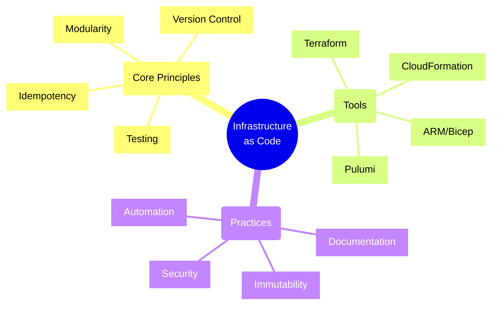
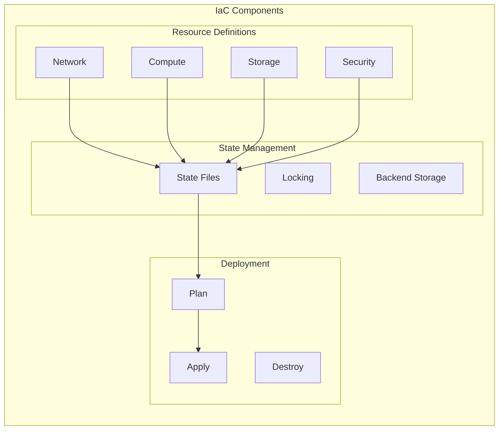
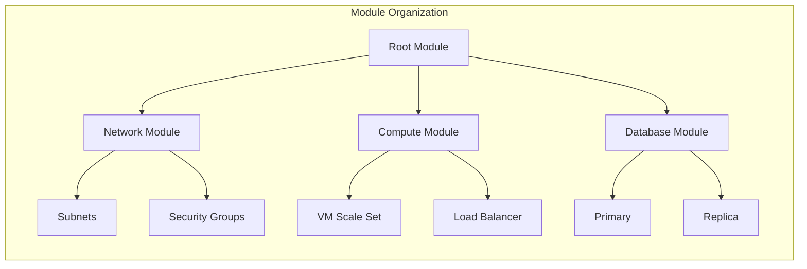
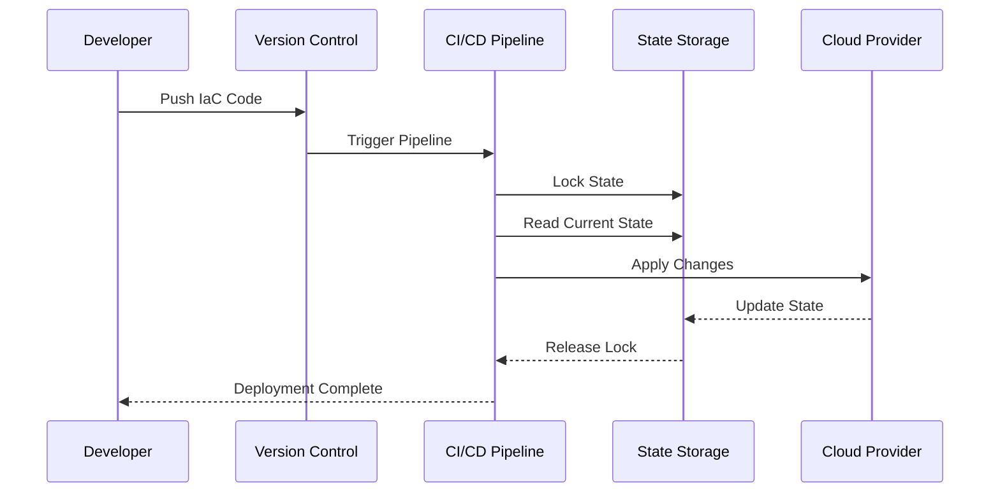
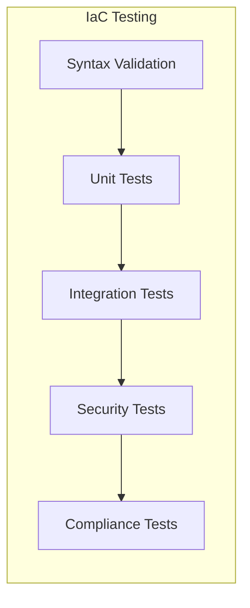
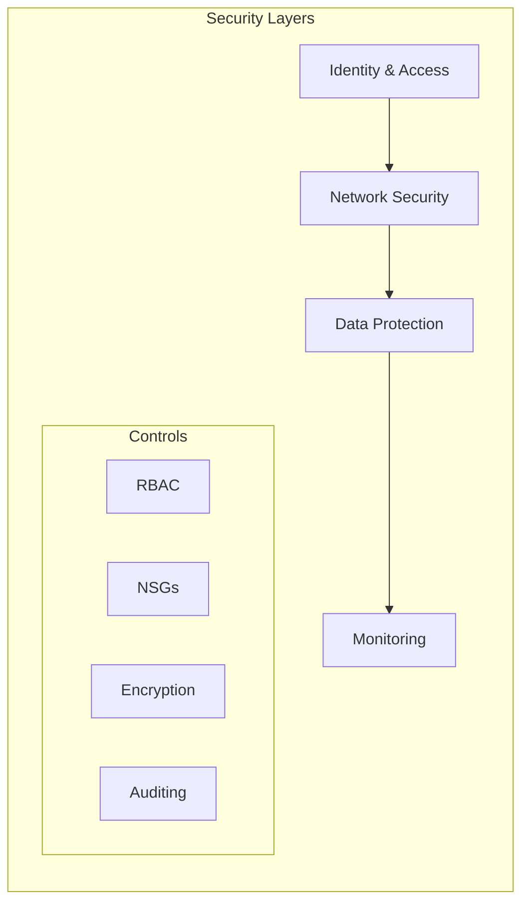
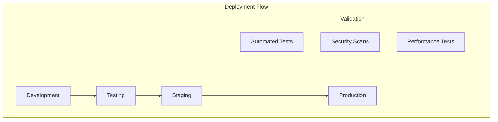

# Infrastructure as Code (IaC) Principles



## Core IaC Principles

### 1. Infrastructure Definition



### 2. Declarative Syntax
```hcl
# Terraform Example
resource "azurerm_resource_group" "example" {
  name     = "production-resources"
  location = "East US"

  tags = {
    environment = "production"
    department  = "engineering"
  }
}

resource "azurerm_virtual_network" "example" {
  name                = "production-network"
  resource_group_name = azurerm_resource_group.example.name
  location            = azurerm_resource_group.example.location
  address_space       = ["10.0.0.0/16"]

  subnet {
    name           = "internal"
    address_prefix = "10.0.1.0/24"
  }
}
```

## Infrastructure Modularity

### 1. Module Structure



### 2. Module Example
```hcl
# modules/webapp/main.tf
module "app_service" {
  source              = "./modules/webapp"
  name                = "production-webapp"
  resource_group_name = module.resource_group.name
  location            = module.resource_group.location

  app_settings = {
    "WEBSITE_RUN_FROM_PACKAGE" = "1"
    "WEBSITES_ENABLE_APP_SERVICE_STORAGE" = "false"
  }

  connection_strings = [
    {
      name  = "Database"
      type  = "SQLServer"
      value = "Server=server;Database=db;User Id=user;Password=pass;"
    }
  ]
}
```

## State Management

### 1. Remote State Pattern
```hcl
# Backend Configuration
terraform {
  backend "azurerm" {
    resource_group_name  = "tfstate"
    storage_account_name = "tfstate"
    container_name      = "tfstate"
    key                 = "prod.terraform.tfstate"
  }
}
```

### 2. State Flow



## Testing Strategies

### 1. Test Levels



### 2. Test Implementation
```typescript
// Infrastructure Test Example
describe('Virtual Network Configuration', () => {
    it('should have the correct address space', () => {
        const vnet = plan.getResourceById('azurerm_virtual_network.example');
        expect(vnet.address_space).toContain('10.0.0.0/16');
    });

    it('should have required subnets', () => {
        const subnets = plan.getResourcesByType('azurerm_subnet');
        expect(subnets).toHaveLength(3);
        expect(subnets[0].name).toBe('frontend');
        expect(subnets[1].name).toBe('backend');
        expect(subnets[2].name).toBe('database');
    });
});
```

## Security Best Practices

### 1. Secret Management
```hcl
# Using Key Vault for Secrets
data "azurerm_key_vault_secret" "db_password" {
  name         = "database-password"
  key_vault_id = data.azurerm_key_vault.example.id
}

resource "azurerm_app_service" "example" {
  # ...existing configuration...

  app_settings = {
    "DatabasePassword" = data.azurerm_key_vault_secret.db_password.value
  }
}
```

### 2. Security Controls



## Deployment Strategies

### 1. Progressive Deployment



### 2. Rollback Strategy
```hcl
# Version Tagging
resource "azurerm_app_service" "example" {
  name                = "production-app"
  location            = azurerm_resource_group.example.location
  resource_group_name = azurerm_resource_group.example.name

  tags = {
    version     = "1.2.0"
    deployment  = "20250430"
    rollback_to = "1.1.0"
  }
}
```

## Best Practices

1. **Version Control**
   - Use Git for IaC code
   - Implement branch protection
   - Review changes through PRs
   - Tag releases properly

2. **Documentation**
   - Document variables
   - Explain module usage
   - Maintain README files
   - Include examples

3. **State Management**
   - Use remote state
   - Enable state locking
   - Implement state backup
   - Separate state per environment

4. **Security**
   - Encrypt sensitive data
   - Use least privilege
   - Implement compliance checks
   - Regular security audits

Remember: Infrastructure as Code is about treating infrastructure with the same rigor as application code. Always follow software engineering best practices when working with IaC.