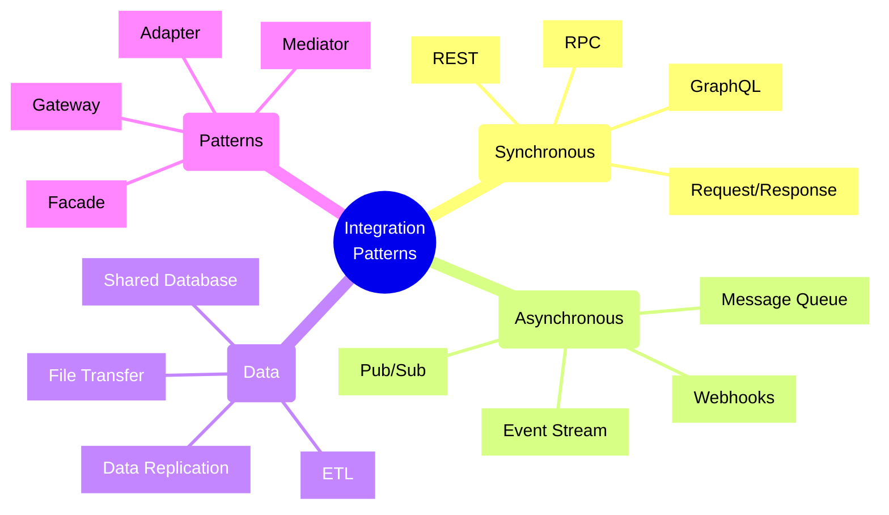
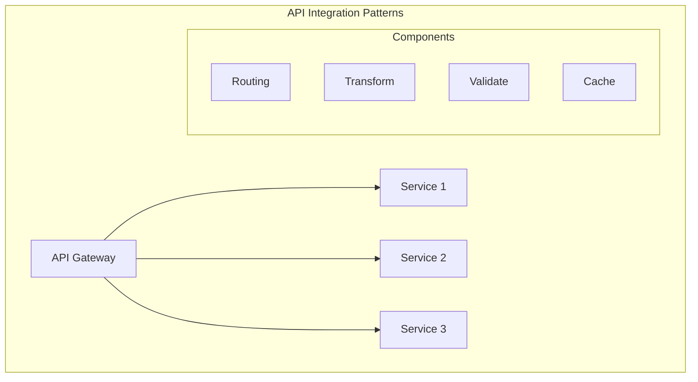
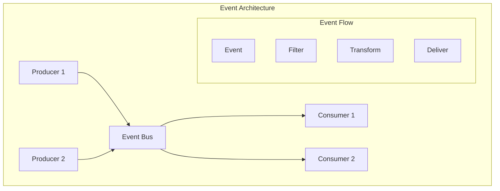

# Integration Patterns and Antipatterns

## Core Integration Styles

### 1. API Integration

### 2. Event-Driven Integration

## Implementation Checklist

### API Integration
- [ ] Define API contracts
- [ ] Implement versioning
- [ ] Set up authentication
- [ ] Configure rate limiting
- [ ] Implement monitoring
- [ ] Set up documentation
- [ ] Configure caching
- [ ] Error handling
- [ ] Performance optimization

### Event Integration
- [ ] Define event schema
- [ ] Set up message broker
- [ ] Configure dead letters
- [ ] Implement retry logic
- [ ] Set up monitoring
- [ ] Configure error handling
- [ ] Event versioning
- [ ] Testing strategy
- [ ] Performance tuning

### Data Integration
- [ ] Define data models
- [ ] Set up synchronization
- [ ] Configure validation
- [ ] Implement transforms
- [ ] Set up monitoring
- [ ] Error handling
- [ ] Data quality checks
- [ ] Recovery process
- [ ] Performance metrics

### Security Setup
- [ ] Authentication
- [ ] Authorization
- [ ] Encryption
- [ ] API security
- [ ] Network security
- [ ] Audit logging
- [ ] Secret management
- [ ] Security testing
- [ ] Compliance checks

## Common Antipatterns

### Integration Antipatterns to Avoid

1. **Direct Database Integration**
   - Tight coupling
   - Schema dependency
   - Versioning issues
   - Performance impact
   - Security risks

2. **Point-to-Point Integration**
   - Limited scalability
   - High maintenance
   - Complex dependencies
   - Difficult changes
   - Poor reusability

3. **Shared Code Libraries**
   - Version conflicts
   - Deployment coupling
   - Language dependency
   - Update complexity
   - Testing challenges

4. **Big Bang Integration**
   - High risk
   - Complex rollback
   - Long testing cycles
   - Resource intensive
   - Coordination overhead

## Trade-offs

### Synchronous vs. Asynchronous
- **Synchronous Integration**
  - Pros:
    * Immediate response
    * Simpler error handling
    * Better consistency
  - Cons:
    * Higher coupling
    * Less scalable
    * Availability impact

### Centralized vs. Distributed
- **Centralized Integration**
  - Pros:
    * Better control
    * Easier monitoring
    * Consistent policies
  - Cons:
    * Single point of failure
    * Performance bottleneck
    * Scale limitations

### Custom vs. Standard
- **Custom Integration**
  - Pros:
    * Perfect fit
    * Full control
    * Specific features
  - Cons:
    * Higher cost
    * More maintenance
    * Limited reuse

### Real-time vs. Batch
- **Real-time Integration**
  - Pros:
    * Immediate updates
    * Better user experience
    * Fresh data
  - Cons:
    * Higher complexity
    * More resources
    * Higher cost

## Best Practices

1. **Design Principles**
   - Loose coupling
   - High cohesion
   - Clear contracts
   - Error handling
   - Versioning
   - Documentation
   - Testing strategy

2. **Security**
   - Authentication
   - Authorization
   - Encryption
   - Audit logging
   - Access control
   - Monitoring
   - Regular reviews

3. **Performance**
   - Caching strategy
   - Load balancing
   - Throttling
   - Monitoring
   - Optimization
   - Scalability
   - Benchmarking

4. **Operations**
   - Monitoring setup
   - Alert configuration
   - Backup strategy
   - Recovery plans
   - Documentation
   - Training
   - Regular reviews

## Integration Metrics Matrix

| Category | Metric | Target | Alert Level |
|----------|--------|--------|-------------|
| Latency | Response Time | <200ms | >500ms |
| Reliability | Success Rate | >99.9% | <99% |
| Throughput | Requests/sec | >1000 | <500 |
| Error Rate | Failed/Total | <0.1% | >1% |
| Availability | Uptime | >99.95% | <99.9% |
| Security | Auth Success | >99.99% | <99.9% |

Remember: Choose integration patterns based on your specific requirements and constraints. Avoid antipatterns by understanding their implications and following established best practices.