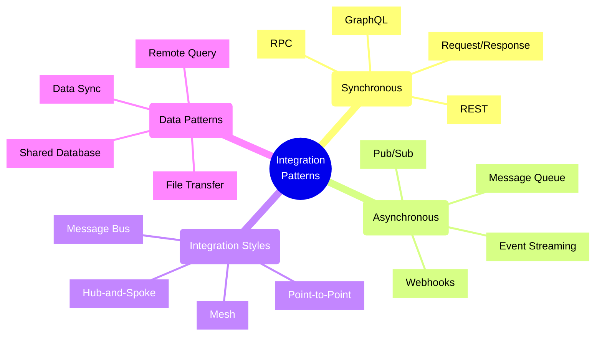
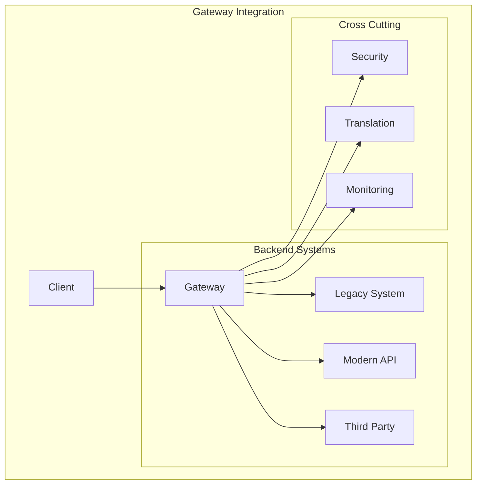
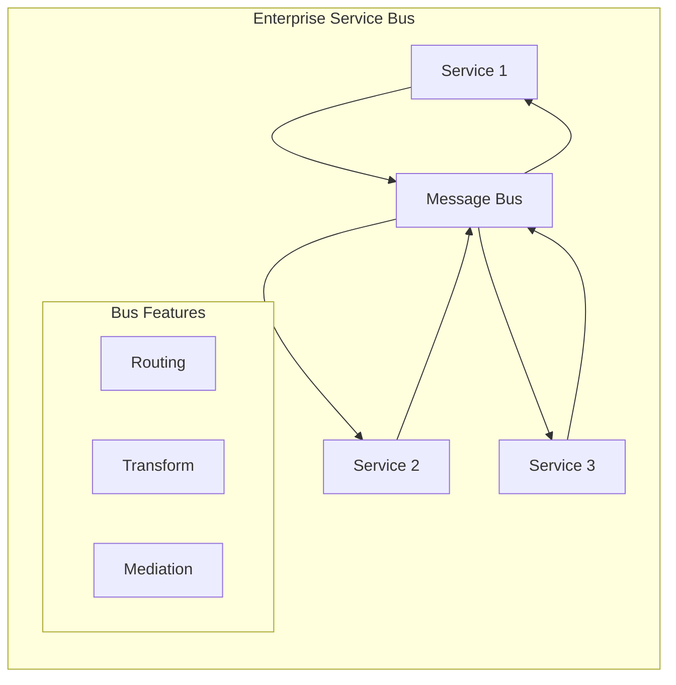
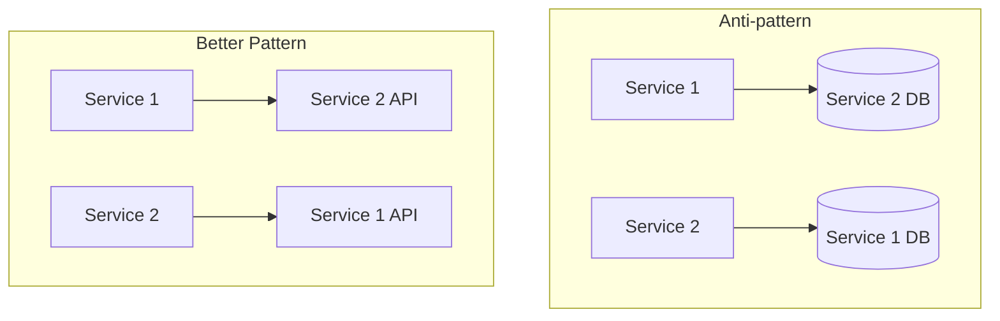
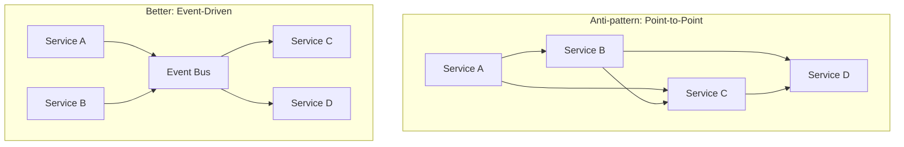

# Integration Patterns and Anti-patterns



## Common Integration Patterns

### 1. Gateway Pattern



Implementation Example:
```typescript
// Gateway with protocol translation
class IntegrationGateway {
    private legacyClient: SoapClient;
    private restClient: RestClient;
    private messageQueue: MessageQueue;

    async processOrder(order: Order): Promise<OrderResult> {
        try {
            // Call legacy SOAP service
            const inventoryStatus = await this.legacyClient.checkInventory({
                sku: order.sku,
                quantity: order.quantity
            });

            // Call modern REST API
            const pricingInfo = await this.restClient.getPricing(order.sku);

            // Publish event to message queue
            await this.messageQueue.publish('order.created', {
                orderId: order.id,
                status: 'processing'
            });

            return {
                status: 'success',
                inventory: inventoryStatus,
                pricing: pricingInfo
            };
        } catch (error) {
            // Error translation
            throw new GatewayError(this.translateError(error));
        }
    }
}
```

### 2. Message Bus Pattern



Implementation Example:
```typescript
// Message bus with routing and transformation
class MessageBus {
    private subscribers: Map<string, Function[]>;
    private transformers: Map<string, Function>;

    publish(topic: string, message: any): void {
        const transformer = this.transformers.get(topic);
        const transformedMessage = transformer ? 
            transformer(message) : message;

        const topicSubscribers = this.subscribers.get(topic) || [];
        
        // Fan-out to all subscribers
        topicSubscribers.forEach(subscriber => {
            try {
                subscriber(transformedMessage);
            } catch (error) {
                this.handleError(topic, error);
            }
        });
    }

    subscribe(topic: string, handler: Function): void {
        const current = this.subscribers.get(topic) || [];
        this.subscribers.set(topic, [...current, handler]);
    }

    addTransformer(topic: string, transformer: Function): void {
        this.transformers.set(topic, transformer);
    }
}
```

## Common Anti-patterns

### 1. Direct Database Integration
❌ **Problem**: Services directly accessing each other's databases
✅ **Solution**: Use API contracts and event-driven integration



### 2. Chatty Integration
❌ **Problem**: Too many small network calls between services
✅ **Solution**: Batch operations and use appropriate granularity

Example Fix:
```typescript
// Before: Chatty integration
async function processOrders(orders: Order[]) {
    for (const order of orders) {
        await validateOrder(order);
        await checkInventory(order);
        await processPayment(order);
    }
}

// After: Batched operations
async function processOrders(orders: Order[]) {
    const validationResults = await validateOrders(orders);
    const inventoryResults = await checkInventoryBatch(orders);
    const paymentResults = await processPaymentsBatch(orders);
    
    return orders.map(order => ({
        order,
        validation: validationResults[order.id],
        inventory: inventoryResults[order.id],
        payment: paymentResults[order.id]
    }));
}
```

### 3. Point-to-Point Integration Hell
❌ **Problem**: Direct dependencies between all services
✅ **Solution**: Use message broker or event bus



## Integration Strategies

### 1. File-Based Integration
Best for:
- Batch processing
- Large data transfers
- Legacy system integration
- Offline processing

```typescript
// File-based integration with watch pattern
class FileIntegrator {
    private watchDir: string;
    private processedDir: string;
    private errorDir: string;

    async watchAndProcess(): Promise<void> {
        const watcher = fs.watch(this.watchDir);
        
        for await (const { filename } of watcher) {
            try {
                const data = await this.readAndValidate(filename);
                await this.processData(data);
                await this.moveToProcessed(filename);
            } catch (error) {
                await this.moveToError(filename);
                this.logError(filename, error);
            }
        }
    }
}
```

### 2. Event-Driven Integration
Best for:
- Real-time updates
- Loose coupling
- Scalable systems
- Complex workflows

```typescript
// Event-driven integration with Azure Event Grid
import { EventGridPublisherClient } from "@azure/eventgrid";

class EventIntegrator {
    private client: EventGridPublisherClient;

    async publishEvents(events: BusinessEvent[]): Promise<void> {
        const eventGridEvents = events.map(event => ({
            eventType: event.type,
            subject: `/${event.domain}/${event.id}`,
            dataVersion: "1.0",
            data: event.payload,
            eventTime: new Date()
        }));

        await this.client.send(eventGridEvents);
    }
}
```

## Best Practices

1. **Design Principles**
   - Keep integration simple and focused
   - Use appropriate synchronization patterns
   - Implement proper error handling
   - Design for failure

2. **Security Considerations**
   - Implement proper authentication
   - Use secure protocols
   - Apply principle of least privilege
   - Monitor integration points

3. **Performance Optimization**
   - Use appropriate batch sizes
   - Implement caching where possible
   - Monitor integration latency
   - Optimize payload size

4. **Monitoring and Debugging**
   - Implement correlation IDs
   - Log integration events
   - Monitor integration health
   - Set up alerts for failures

Remember: Integration patterns should be chosen based on specific requirements, considering factors like reliability, latency, and complexity. Avoid anti-patterns by understanding their implications and using appropriate alternatives.