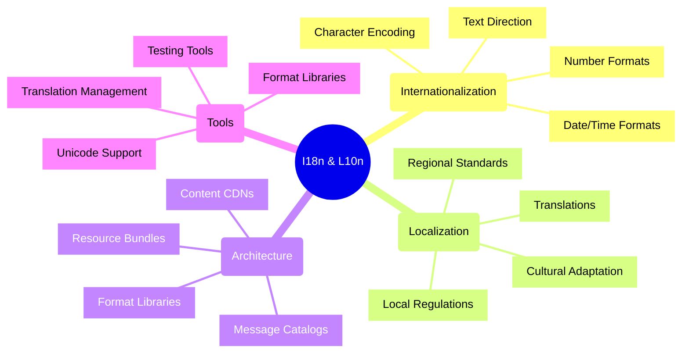
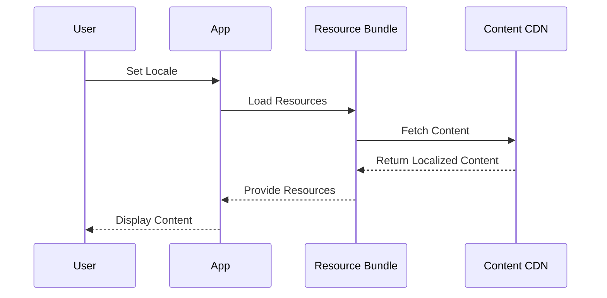
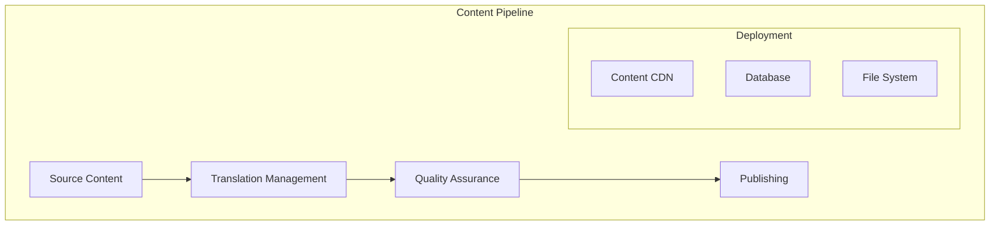
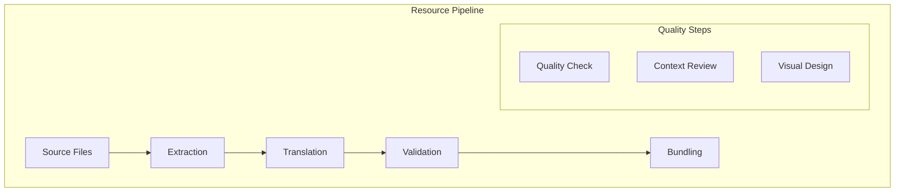

# Internationalization and Localization

## Core Concepts Overview



## Implementation Architecture

### 1. Resource Loading Flow



### 2. Content Management



## Implementation Examples

### 1. React Internationalization
```typescript
// Example: React i18n Setup with react-intl
import { IntlProvider, FormattedMessage, FormattedNumber, FormattedDate } from 'react-intl';

interface AppProps {
    locale: string;
    messages: Record<string, string>;
}

const App: React.FC<AppProps> = ({ locale, messages }) => {
    return (
        <IntlProvider messages={messages} locale={locale}>
            <div>
                {/* Basic text translation */}
                <h1>
                    <FormattedMessage 
                        id="welcome"
                        defaultMessage="Welcome, {name}!"
                        values={{ name: 'User' }}
                    />
                </h1>
                
                {/* Number formatting */}
                <p>
                    <FormattedNumber 
                        value={1234567.89}
                        style="currency"
                        currency="EUR"
                    />
                </p>
                
                {/* Date formatting */}
                <p>
                    <FormattedDate
                        value={new Date()}
                        year="numeric"
                        month="long"
                        day="numeric"
                    />
                </p>
            </div>
        </IntlProvider>
    );
};
```

### 2. Backend Localization
```typescript
// Example: Express.js Middleware for Localization
class LocalizationMiddleware {
    private supportedLocales: string[];
    private defaultLocale: string;
    private messages: Map<string, Record<string, string>>;
    
    constructor(options: LocalizationOptions) {
        this.supportedLocales = options.supportedLocales;
        this.defaultLocale = options.defaultLocale;
        this.messages = new Map();
        
        // Load message catalogs
        this.supportedLocales.forEach(locale => {
            this.messages.set(locale, this.loadMessages(locale));
        });
    }
    
    middleware() {
        return async (req: Request, res: Response, next: NextFunction) => {
            // Determine locale from various sources
            const locale = this.determineLocale(req);
            
            // Attach localization helpers to response
            res.locals.t = (key: string, params: object = {}) => {
                return this.translate(locale, key, params);
            };
            
            res.locals.formatNumber = (num: number, options: Intl.NumberFormatOptions = {}) => {
                return new Intl.NumberFormat(locale, options).format(num);
            };
            
            res.locals.formatDate = (date: Date, options: Intl.DateTimeFormatOptions = {}) => {
                return new Intl.DateTimeFormat(locale, options).format(date);
            };
            
            next();
        };
    }
    
    private determineLocale(req: Request): string {
        const localeFromQuery = req.query.locale as string;
        const localeFromHeader = req.acceptsLanguages(this.supportedLocales);
        
        return this.supportedLocales.includes(localeFromQuery) ? 
            localeFromQuery : 
            localeFromHeader || this.defaultLocale;
    }
}
```

## Implementation Checklist

### Design Phase
- [ ] Identify target markets/languages
- [ ] Plan content strategy
- [ ] Choose i18n framework
- [ ] Design resource structure
- [ ] Plan deployment strategy
- [ ] Consider regulations

### Development Phase
- [ ] Implement i18n framework
- [ ] Set up resource loading
- [ ] Configure number/date formats
- [ ] Handle text direction
- [ ] Implement language switching
- [ ] Add translation workflow

### Operations Phase
- [ ] Monitor translations
- [ ] Update content
- [ ] Track usage
- [ ] Performance optimization
- [ ] Content delivery
- [ ] Regular audits

## Best Practices

### 1. Content Management
- Externalize strings
- Use message catalogs
- Support plural forms
- Handle fallbacks
- Version resources

### 2. Performance
- Use CDNs
- Lazy loading
- Bundle optimization
- Cache resources
- Minimize requests

### 3. Development
- Unicode support
- RTL support
- Format libraries
- Testing tools
- CI/CD integration

## Common Challenges and Solutions

| Challenge | Solution | Implementation |
|-----------|----------|----------------|
| String Context | Provide metadata | Translation comments |
| Format Variations | Use ICU format | {count, plural, one{item} other{items}} |
| Cultural Differences | Cultural review | Local market validation |
| Performance | CDN + Caching | Resource bundling |

## Resource Management Framework



## Azure Implementation

### 1. Content Delivery
- Use Azure CDN
- Geographic routing
- Edge caching
- A/B testing
- Performance monitoring

### 2. Translation Services
- Azure Cognitive Services Translator
- Custom translations
- Neural machine translation
- Document translation
- Real-time translation

## Testing Framework

### 1. Automated Tests
- String extraction
- Resource loading
- Format validation
- RTL layout
- Performance tests

### 2. Manual Tests
- Cultural review
- Visual inspection
- Context validation
- User testing
- Regional compliance

## Common Patterns

### 1. Resource Loading
- Lazy loading
- Bundling
- Cache strategies
- Fallback chain
- Version control

### 2. Language Detection
- Browser preference
- User selection
- IP geolocation
- Previous choice
- Default fallback

### 3. Content Updates
- Live updates
- Version control
- Change tracking
- Approval workflow
- Deployment strategy

Remember:
- Plan for internationalization early
- Test with real content
- Consider cultural differences
- Monitor performance
- Regular content updates
- Maintain documentation
- Test thoroughly