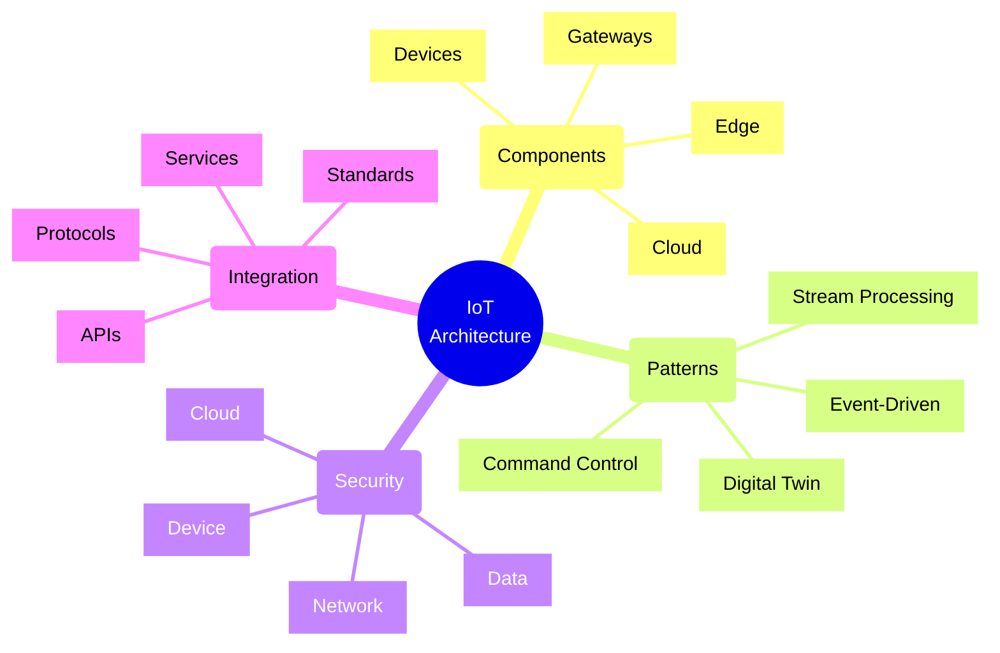
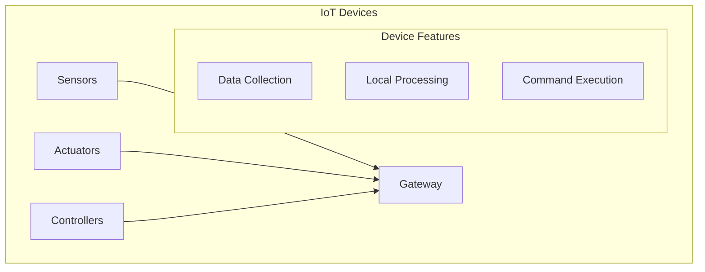
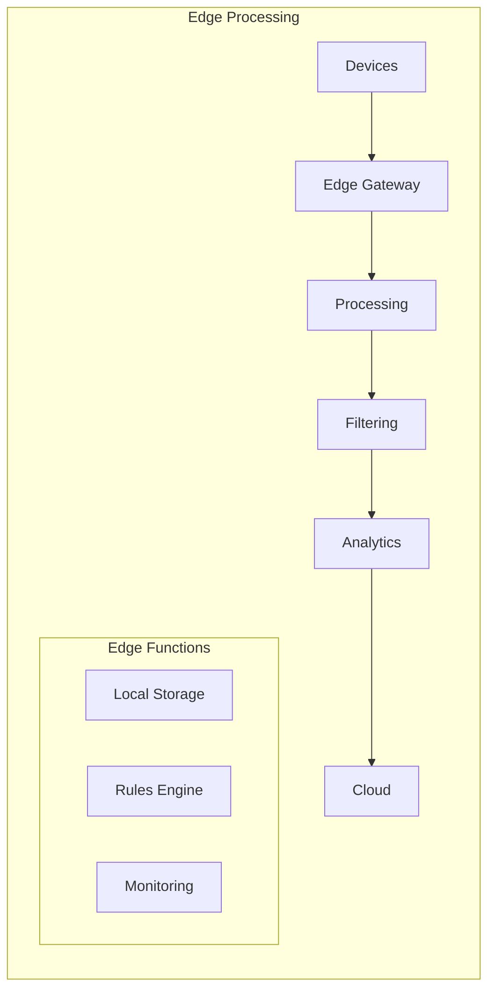

# IoT Architecture Patterns



## Core Architecture Components

### 1. Device Layer



### 2. Edge Layer



## Implementation Patterns

### 1. Event Processing Pattern
```typescript
interface IoTEvent {
    deviceId: string;
    timestamp: Date;
    type: EventType;
    data: any;
    metadata: EventMetadata;
}

class IoTEventProcessor {
    constructor(
        private eventHub: EventHub,
        private storageService: StorageService,
        private analyticsService: AnalyticsService
    ) {}

    async processEvent(event: IoTEvent): Promise<void> {
        // Validate and enrich event
        await this.validateEvent(event);
        
        // Process based on type
        switch (event.type) {
            case EventType.TELEMETRY:
                await this.processTelemetry(event);
                break;
            case EventType.ALERT:
                await this.processAlert(event);
                break;
            case EventType.STATUS:
                await this.processStatus(event);
                break;
        }
    }
}
```

### 2. Digital Twin Pattern
```typescript
interface DigitalTwin {
    id: string;
    properties: TwinProperties;
    telemetry: TwinTelemetry;
    relationships: TwinRelationship[];
    
    updateProperties(props: Partial<TwinProperties>): Promise<void>;
    processTelemetry(data: TwinTelemetry): Promise<void>;
    executeCommand(command: DeviceCommand): Promise<CommandResult>;
}

class SmartDeviceTwin implements DigitalTwin {
    constructor(
        private deviceService: DeviceService,
        private twinService: TwinService,
        private commandService: CommandService
    ) {}

    async executeCommand(command: DeviceCommand): Promise<CommandResult> {
        // Validate command
        await this.validateCommand(command);
        
        // Execute on device
        const result = await this.commandService.execute(
            this.id,
            command
        );
        
        // Update twin state
        await this.updateProperties({
            lastCommand: command,
            lastCommandResult: result
        });
        
        return result;
    }
}
```

## Common Patterns

### 1. Device Management
- Registration
- Authentication
- Configuration
- Monitoring
- Updates
- Decommissioning

### 2. Data Management
- Collection
- Validation
- Processing
- Storage
- Analysis
- Archival

### 3. Command Control
- Command validation
- Delivery assurance
- Execution tracking
- Response handling
- Retry logic
- Error management

### 4. Security
- Device identity
- Authentication
- Authorization
- Data encryption
- Network security
- Audit logging

## Implementation Framework

### Device Layer
| Component | Purpose | Protocol | Security |
|-----------|---------|----------|-----------|
| Sensors | Data collection | MQTT, CoAP | TLS, DTLS |
| Actuators | Action execution | MQTT | TLS |
| Gateway | Protocol bridge | Multiple | TLS, IPSec |
| Controller | Local control | Custom | Custom |

### Communication Patterns
| Pattern | Use Case | Pros | Cons |
|---------|----------|------|------|
| Request/Response | Commands | Direct feedback | Higher latency |
| Publish/Subscribe | Telemetry | Scalable | Eventual consistency |
| Stream | Time series | Real-time | Resource intensive |
| Batch | Historic data | Efficient | Delayed processing |

## Azure IoT Implementation

### 1. Core Services
- IoT Hub for device connectivity
- IoT Edge for edge processing
- Digital Twins for device modeling
- Stream Analytics for real-time processing
- Time Series Insights for analytics

### 2. Integration Services
- Event Grid for event routing
- Service Bus for messaging
- Functions for serverless processing
- Logic Apps for workflows
- API Management for APIs

### 3. Storage Services
- Blob Storage for raw data
- Table Storage for device metadata
- Cosmos DB for device state
- Data Lake for analytics
- SQL Database for reporting

## Best Practices

### 1. Device Design
- Minimize power usage
- Implement retry logic
- Cache offline data
- Validate commands
- Handle errors
- Update capability
- Secure storage

### 2. Architecture Design
- Plan for scale
- Define data lifecycle
- Implement security
- Monitor performance
- Handle failures
- Manage updates
- Document patterns

### 3. Operations
- Monitor devices
- Track performance
- Manage updates
- Handle security
- Backup data
- Plan recovery
- Audit access

Remember:
- Security is critical
- Scale is important
- Reliability is key
- Updates are necessary
- Monitoring is essential
- Documentation matters
- Testing is crucial