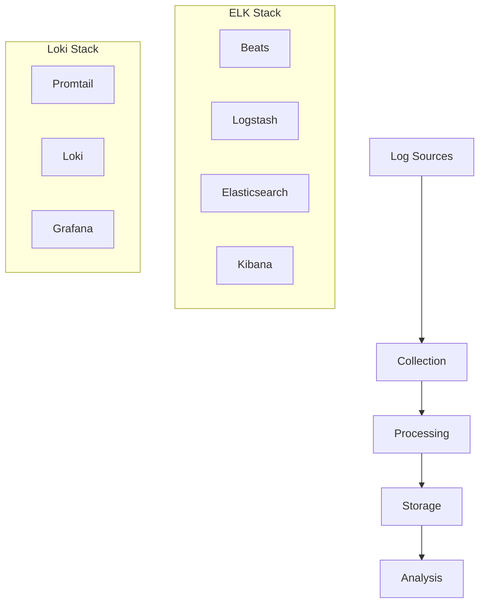
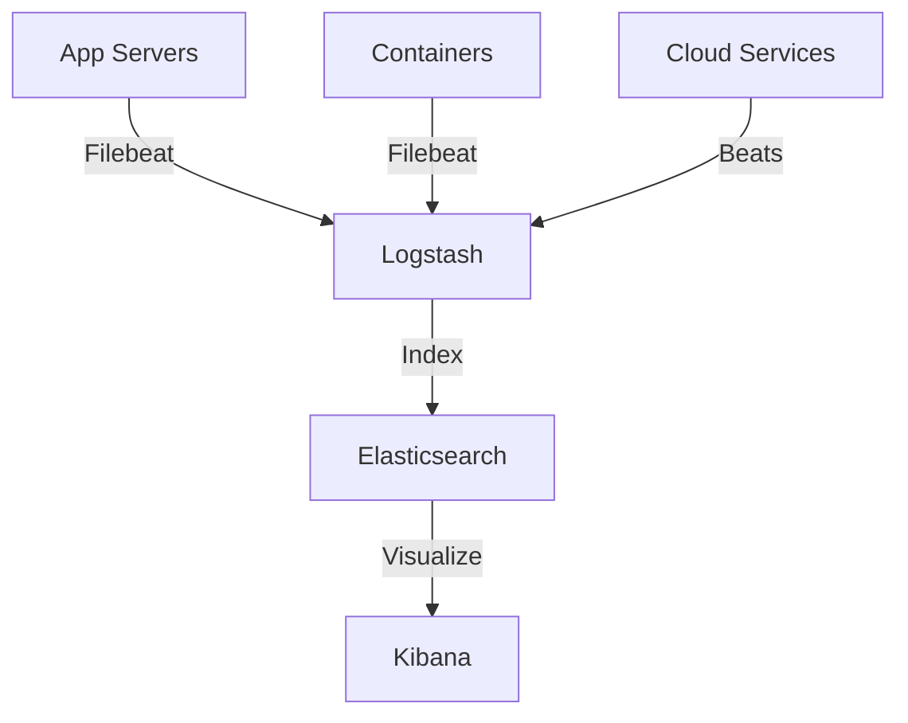
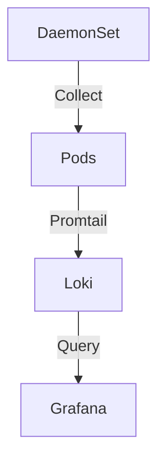
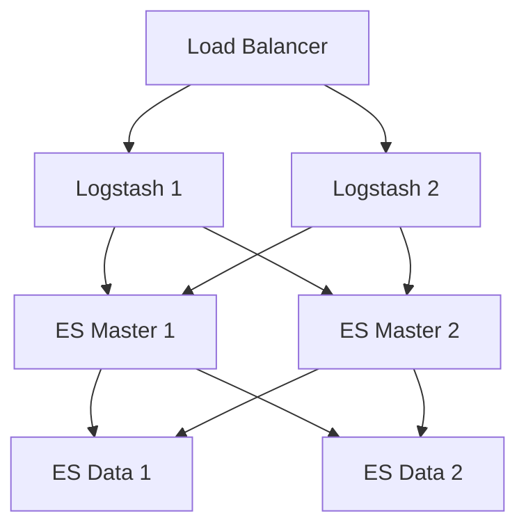
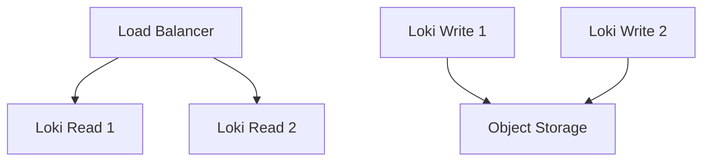

# Log Aggregation Systems

## Overview
Log aggregation systems collect, process, and analyze log data from multiple sources in a centralized location.



## Major Systems

### ELK Stack (Elasticsearch, Logstash, Kibana)
- Full-text search
- Complex data processing
- Rich visualization
- Machine learning capabilities
- Distributed architecture
- RESTful API

### Loki
- Log aggregation for Kubernetes
- Label-based indexing
- Grafana integration
- Low resource usage
- Prometheus-like queries
- Cost-effective storage

## Best Practices Checklist

### Data Collection
- [ ] Define log formats
- [ ] Plan retention policies
- [ ] Configure log rotation
- [ ] Set up shipping methods
- [ ] Implement parsing rules

### Storage and Indexing
- [ ] Plan index lifecycle
- [ ] Configure sharding
- [ ] Set up replication
- [ ] Manage hot/warm/cold tiers
- [ ] Optimize storage costs

### Security
- [ ] Encrypt data in transit
- [ ] Implement access control
- [ ] Audit log access
- [ ] Mask sensitive data
- [ ] Secure endpoints

## Implementation Examples

### Filebeat Configuration
```yaml
filebeat.inputs:
- type: log
  enabled: true
  paths:
    - /var/log/*.log
    - /var/log/nginx/*.log

output.elasticsearch:
  hosts: ["elasticsearch:9200"]
  index: "filebeat-%{[agent.version]}-%{+yyyy.MM.dd}"
  
processors:
  - add_host_metadata: ~
  - add_cloud_metadata: ~
```

### Logstash Pipeline
```ruby
input {
  beats {
    port => 5044
  }
}

filter {
  grok {
    match => { "message" => "%{COMBINEDAPACHELOG}" }
  }
  date {
    match => [ "timestamp", "dd/MMM/yyyy:HH:mm:ss Z" ]
    target => "@timestamp"
  }
}

output {
  elasticsearch {
    hosts => ["elasticsearch:9200"]
    index => "logstash-%{+YYYY.MM.dd}"
  }
}
```

### Loki Configuration
```yaml
auth_enabled: false

server:
  http_listen_port: 3100

ingester:
  lifecycler:
    address: 127.0.0.1
    ring:
      kvstore:
        store: inmemory
      replication_factor: 1
    final_sleep: 0s
  chunk_idle_period: 5m
  chunk_retain_period: 30s

schema_config:
  configs:
    - from: 2020-05-15
      store: boltdb
      object_store: filesystem
      schema: v11
      index:
        prefix: index_
        period: 24h
```

## Query Languages

### Elasticsearch Query DSL
```json
{
  "query": {
    "bool": {
      "must": [
        { "match": { "service": "api" }},
        { "range": {
            "@timestamp": {
              "gte": "now-1h",
              "lt": "now"
            }
          }
        }
      ]
    }
  }
}
```

### LogQL (Loki)
```logql
{app="api"} |= "error"
  | json
  | duration > 10s
  | rate[5m]
```

## Architecture Patterns

### Centralized Logging


### Kubernetes Logging


## Data Processing

### Log Parsing
```ruby
# Logstash Grok Pattern
grok {
  match => {
    "message" => "%{TIMESTAMP_ISO8601:timestamp} %{LOGLEVEL:level} %{GREEDYDATA:message}"
  }
}
```

### Log Transformation
```ruby
# Logstash Filter
filter {
  mutate {
    add_field => { "environment" => "production" }
    remove_field => [ "message" ]
    rename => { "host" => "server_name" }
  }
}
```

## Visualization Examples

### Kibana Dashboard
```json
{
  "dashboard": {
    "title": "Application Logs",
    "panels": [
      {
        "type": "visualization",
        "gridData": {
          "x": 0,
          "y": 0,
          "w": 24,
          "h": 15
        },
        "version": "7.9.0",
        "panelIndex": "1",
        "embeddableConfig": {
          "title": "Error Rate"
        }
      }
    ]
  }
}
```

## High Availability Setup

### ELK Stack HA


### Loki HA


## Performance Optimization

### Elasticsearch
1. Indexing Optimization
   - Bulk operations
   - Optimal sharding
   - Index lifecycle policies

2. Query Optimization
   - Field mapping
   - Search optimization
   - Caching strategies

### Loki
1. Storage Optimization
   - Chunk size
   - Retention rules
   - Compression

2. Query Performance
   - Label optimization
   - Time range limits
   - Cardinality control

## Best Practices Examples

### Log Format
```json
{
  "timestamp": "2025-05-02T10:00:00Z",
  "level": "ERROR",
  "service": "api",
  "trace_id": "abc123",
  "message": "Connection timeout",
  "context": {
    "user_id": "user123",
    "request_id": "req456"
  }
}
```

### Index Template
```json
{
  "index_patterns": ["logs-*"],
  "settings": {
    "number_of_shards": 1,
    "number_of_replicas": 1
  },
  "mappings": {
    "properties": {
      "@timestamp": { "type": "date" },
      "level": { "type": "keyword" },
      "message": { "type": "text" },
      "trace_id": { "type": "keyword" }
    }
  }
}
```

## Additional Resources
1. Documentation
   - [Elasticsearch Documentation](https://www.elastic.co/guide/index.html)
   - [Loki Documentation](https://grafana.com/docs/loki/latest/)
   - [Logstash Documentation](https://www.elastic.co/guide/en/logstash/current/index.html)

2. Learning Resources
   - Log Management Best Practices
   - Query Optimization
   - Storage Management
   - High Availability Setup