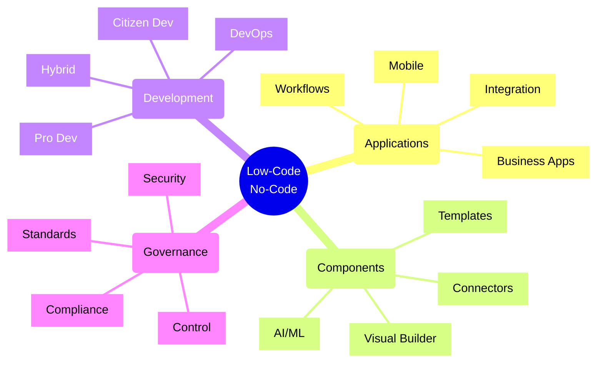
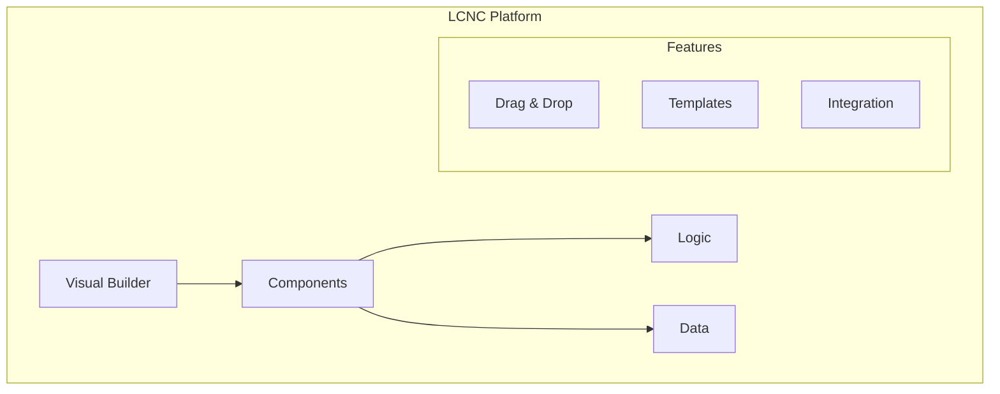
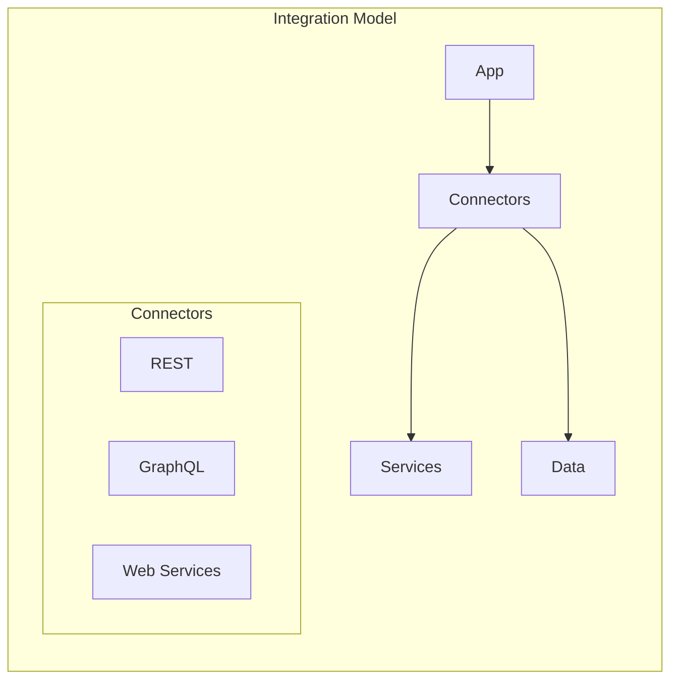

# Low-Code/No-Code Platforms



## Core Architecture Components

### 1. Platform Architecture



### 2. Integration Architecture



## Implementation Patterns

### 1. Business Application Pattern
```typescript
interface AppDefinition {
    components: Component[];
    workflows: Workflow[];
    dataModels: DataModel[];
    integrations: Integration[];
}

class LowCodeApp {
    constructor(
        private builder: AppBuilder,
        private connectors: ConnectorService,
        private deployment: DeploymentService
    ) {}

    async buildApp(definition: AppDefinition): Promise<void> {
        // Create data models
        await this.builder.createDataModels(definition.dataModels);
        
        // Setup components
        await this.builder.createComponents(definition.components);
        
        // Configure workflows
        await this.builder.createWorkflows(definition.workflows);
        
        // Setup integrations
        await this.setupIntegrations(definition.integrations);
    }

    private async setupIntegrations(integrations: Integration[]): Promise<void> {
        for (const integration of integrations) {
            await this.connectors.configure(integration);
        }
    }
}
```

### 2. Workflow Automation Pattern
```typescript
interface WorkflowDefinition {
    triggers: Trigger[];
    actions: Action[];
    conditions: Condition[];
    errorHandling: ErrorHandler[];
}

class WorkflowAutomation {
    constructor(
        private workflow: WorkflowEngine,
        private connectors: ConnectorRegistry,
        private monitor: MonitoringService
    ) {}

    async createWorkflow(definition: WorkflowDefinition): Promise<string> {
        // Setup triggers
        const triggers = await this.setupTriggers(definition.triggers);
        
        // Configure actions
        const actions = await this.setupActions(definition.actions);
        
        // Setup conditions
        const conditions = await this.setupConditions(definition.conditions);
        
        // Create workflow
        return await this.workflow.create({
            triggers,
            actions,
            conditions,
            errorHandling: definition.errorHandling
        });
    }
}
```

## Common Patterns

### 1. Application Types
- Form-based apps
- Workflow automation
- Data visualization
- Mobile apps
- Web portals
- Integration apps

### 2. Integration Types
- Database connections
- API integration
- File handling
- Email/messaging
- Authentication
- Custom connectors

### 3. Development Models
- Citizen development
- Professional development
- Hybrid approach
- Collaboration model
- Version control
- Release management

### 4. Governance
- Access control
- Data security
- Compliance
- Standards
- Monitoring
- Audit trails

## Implementation Framework

### Application Components
| Component | Purpose | Features | Considerations |
|-----------|---------|----------|----------------|
| Forms | Data input | Validation | UX design |
| Views | Data display | Filtering | Performance |
| Workflows | Automation | Actions | Complexity |
| Reports | Analytics | Export | Data access |

### Integration Methods
| Method | Use Case | Pros | Cons |
|--------|----------|------|------|
| REST API | Web services | Standard | Limited |
| Database | Data access | Direct | Security |
| Custom | Special needs | Flexible | Complex |
| Events | Real-time | Reactive | Overhead |

## Azure Power Platform Implementation

### 1. Core Components
- Power Apps for applications
- Power Automate for workflows
- Power BI for analytics
- Power Virtual Agents for chatbots
- Dataverse for data storage

### 2. Integration Services
- Azure Logic Apps
- API Management
- Azure Functions
- Service Bus
- Event Grid

### 3. Development Tools
- Power Platform CLI
- Solution Packager
- Azure DevOps
- GitHub Actions
- Application Insights

## Best Practices

### 1. Application Design
- Simple interfaces
- Reusable components
- Clear workflows
- Data validation
- Error handling
- Performance focus
- Documentation

### 2. Development Process
- Component reuse
- Version control
- Testing strategy
- Deployment plans
- Monitoring setup
- Security review
- Documentation

### 3. Governance
- Access controls
- Data policies
- Standards
- Monitoring
- Auditing
- Training
- Support

Remember:
- User experience
- Performance
- Security
- Governance
- Scalability
- Maintainability
- Documentation