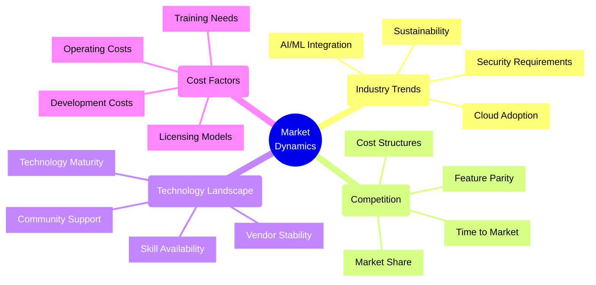
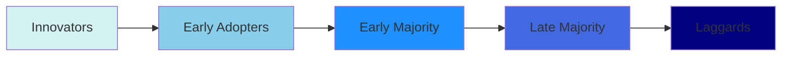
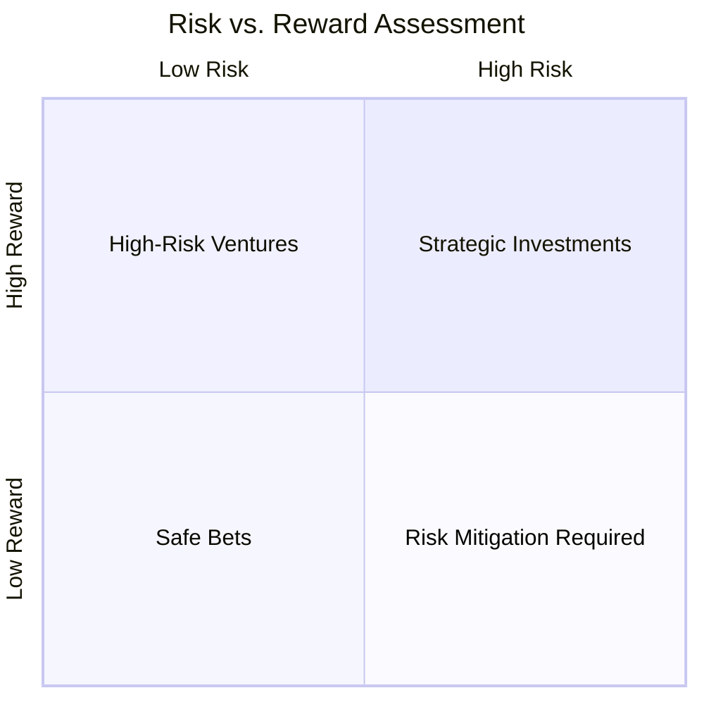

# Market Dynamics Affecting Technical Choices

## Overview

## Key Considerations

### 1. Market Position Analysis

- Current market share and positioning
- Competitive landscape assessment
- Target market requirements
- Growth trajectory and scalability needs

### 2. Technology Adoption Curves

### 3. Cost-Benefit Analysis Framework

| Factor | Considerations | Impact Weight |
|--------|---------------|---------------|
| Initial Development | Time to market, resource availability | High |
| Maintenance | Long-term support, updates | Medium |
| Training | Skill availability, learning curve | Medium |
| Infrastructure | Scaling costs, cloud vs on-prem | High |
| Security | Compliance requirements, risk mitigation | High |

## Decision Making Framework

### 1. Assessment Checklist

- [ ] Market trend analysis completed
- [ ] Competitor technology stack reviewed
- [ ] Cost projections calculated
- [ ] Skill availability assessed
- [ ] Vendor stability evaluated
- [ ] Community support analyzed
- [ ] Security requirements mapped
- [ ] Compliance needs identified
- [ ] Scalability requirements defined
- [ ] ROI calculations performed

### 2. Risk Assessment Matrix

## Implementation Strategy

### 1. Phased Approach

1. **Research Phase**
   - Market analysis
   - Technology assessment
   - Cost modeling
   - Risk evaluation

2. **Planning Phase**
   - Resource allocation
   - Timeline development
   - Budget planning
   - Risk mitigation strategies

3. **Execution Phase**
   - Incremental implementation
   - Continuous validation
   - Market feedback integration
   - Performance monitoring

### 2. Key Success Metrics

- Time to market
- Development efficiency
- Operating costs
- User adoption rates
- Market share impact
- Revenue generation
- Customer satisfaction
- Technical debt ratio

## Best Practices

1. **Regular Market Assessment**
   - Monitor industry trends
   - Track competitor movements
   - Evaluate emerging technologies
   - Assess market demands

2. **Technology Portfolio Management**
   - Balanced innovation adoption
   - Risk-adjusted investments
   - Technical debt management
   - Skill development planning

3. **Cost Optimization**
   - ROI-driven decisions
   - Resource optimization
   - License management
   - Infrastructure efficiency

4. **Risk Management**
   - Vendor diversification
   - Technology obsolescence planning
   - Security compliance
   - Market volatility mitigation