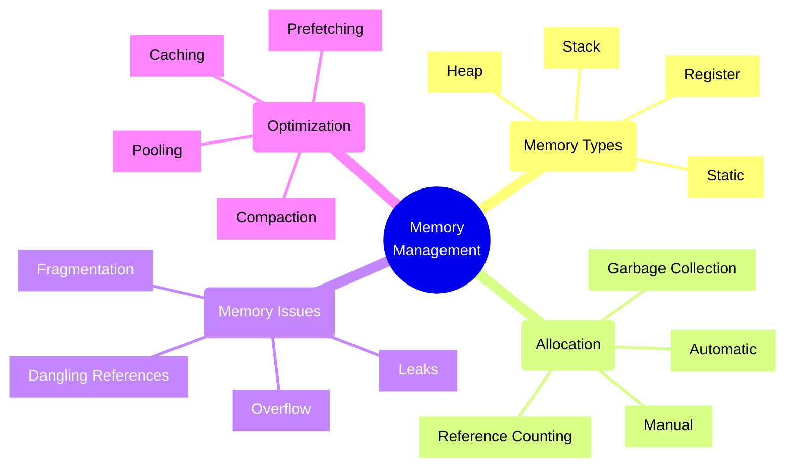
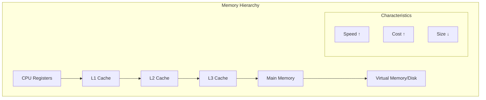
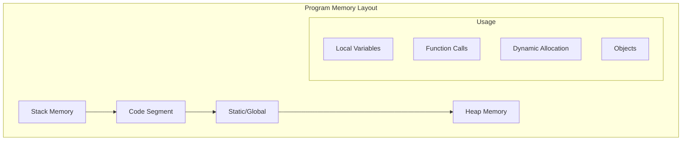
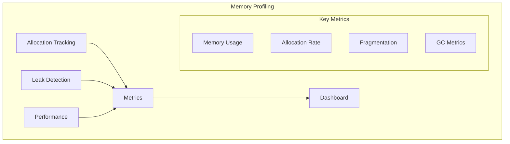

# Memory Management Concepts

## Core Concepts Overview



## Memory Architecture

### 1. Memory Hierarchy



### 2. Memory Types



## Implementation Examples

### 1. Memory Pool Pattern
```typescript
// Example: Object Pool Implementation
class ObjectPool<T> {
    private pool: T[] = [];
    private maxSize: number;
    
    constructor(
        private factory: () => T,
        maxSize: number = 100
    ) {
        this.maxSize = maxSize;
    }
    
    acquire(): T {
        // Reuse existing object if available
        if (this.pool.length > 0) {
            return this.pool.pop()!;
        }
        
        // Create new object if pool not full
        return this.factory();
    }
    
    release(obj: T): void {
        // Only store if pool not full
        if (this.pool.length < this.maxSize) {
            this.pool.push(obj);
        }
    }
}

// Usage Example
const bufferPool = new ObjectPool<Buffer>(
    () => Buffer.alloc(1024),
    1000
);
```

### 2. Manual Memory Management
```cpp
// Example: Manual Memory Management in C++
class ResourceManager {
public:
    ResourceManager() {
        // Allocate memory
        data = new int[100];
    }
    
    ~ResourceManager() {
        // Free memory
        delete[] data;
    }
    
    void process() {
        // Use memory safely
        for (int i = 0; i < 100; i++) {
            data[i] = i;
        }
    }
    
private:
    int* data;
};
```

## Memory Management Patterns

### 1. Stack Allocation
- Automatic memory management
- Last-In-First-Out (LIFO)
- Fast allocation/deallocation
- Limited by stack size
- Used for local variables

### 2. Heap Allocation
- Dynamic memory management
- Flexible size
- Slower than stack
- Requires explicit management
- Used for dynamic data

### 3. Garbage Collection
- Automatic heap management
- Different collection strategies
  - Mark and Sweep
  - Reference Counting
  - Generational Collection
- Memory overhead
- Pause times consideration

## Implementation Checklist

### Design Phase
- [ ] Analyze memory requirements
- [ ] Choose allocation strategy
- [ ] Plan resource lifecycle
- [ ] Define cleanup strategy
- [ ] Consider performance needs
- [ ] Plan error handling

### Development Phase
- [ ] Implement resource management
- [ ] Set up monitoring
- [ ] Handle memory errors
- [ ] Optimize allocations
- [ ] Test memory usage
- [ ] Document patterns

### Operations Phase
- [ ] Monitor memory usage
- [ ] Track memory leaks
- [ ] Optimize performance
- [ ] Handle OOM scenarios
- [ ] Regular profiling
- [ ] Update documentation

## Best Practices

### 1. Resource Management
- Use RAII pattern
- Implement dispose patterns
- Handle cleanup properly
- Use smart pointers
- Monitor resource usage

### 2. Performance
- Pool frequently used objects
- Minimize allocations
- Use value types where possible
- Optimize data structures
- Profile memory usage

### 3. Error Handling
- Graceful OOM handling
- Memory leak detection
- Proper error reporting
- Recovery strategies
- Monitoring and alerts

## Memory Issues and Solutions

| Issue | Description | Solution | Prevention |
|-------|-------------|----------|------------|
| Memory Leak | Resource not freed | Memory tracking | Proper cleanup |
| Fragmentation | Memory not contiguous | Compaction | Pool allocation |
| Stack Overflow | Stack space exceeded | Increase stack | Recursive limits |
| Dangling Pointer | Invalid reference | Null after free | Smart pointers |

## Memory Profiling Framework



## Language-Specific Patterns

### 1. C# Memory Management
```csharp
// Example: IDisposable Pattern
public class ResourceHandler : IDisposable
{
    private bool disposed = false;
    private IntPtr handle;
    
    protected virtual void Dispose(bool disposing)
    {
        if (!disposed)
        {
            if (disposing)
            {
                // Free managed resources
            }
            
            // Free unmanaged resources
            if (handle != IntPtr.Zero)
            {
                Marshal.FreeHGlobal(handle);
                handle = IntPtr.Zero;
            }
            
            disposed = true;
        }
    }
    
    public void Dispose()
    {
        Dispose(true);
        GC.SuppressFinalize(this);
    }
}
```

### 2. Java Memory Management
```java
// Example: Try-with-resources Pattern
public class ResourceManager implements AutoCloseable {
    private final Resource resource;
    
    public ResourceManager() {
        this.resource = acquireResource();
    }
    
    @Override
    public void close() {
        if (resource != null) {
            resource.release();
        }
    }
}
```

Remember:
- Understand memory model
- Profile early and often
- Use appropriate patterns
- Monitor memory usage
- Handle errors gracefully
- Document memory requirements
- Test under load