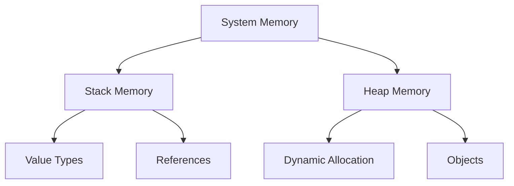
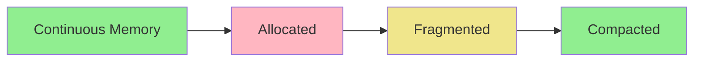
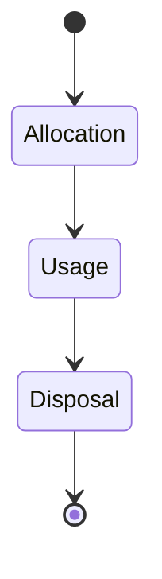

# Memory Management Concepts

## Overview

Understanding memory management is crucial for designing efficient and scalable systems. This guide covers key concepts and best practices.

## Core Concepts

### 1. Memory Types

### 2. Memory Allocation Patterns

| Pattern | Use Case | Considerations |
|---------|----------|----------------|
| Stack | Local variables, Value types | Fast, Size limited |
| Heap | Objects, Dynamic data | Flexible, Garbage collection overhead |
| Memory Pool | Object reuse, Performance critical | Complex management, Fixed size |
| Memory Mapping | Large files, Shared memory | OS dependent, Security considerations |

## Common Challenges

### 1. Memory Leaks
- Unreleased resources
- Circular references
- Cached data growth
- Event handler accumulation

### 2. Memory Fragmentation

### 3. Performance Impact
- Garbage collection pauses
- Page faults
- Cache misses
- Memory thrashing

## Best Practices

### 1. Resource Management

#### Object Lifecycle

#### Implementation Patterns
- Dispose pattern
- Using statements
- Weak references
- Object pooling

### 2. Memory Optimization

- Right-size data structures
- Avoid unnecessary object creation
- Use value types when appropriate
- Implement caching strategies
- Consider memory-mapped files

### 3. Monitoring and Profiling

#### Key Metrics
- Memory usage trends
- Allocation rates
- Collection frequencies
- Page faults
- Memory pressure

#### Tools
- Memory profilers
- Performance counters
- Heap analyzers
- Leak detectors

## Language-Specific Considerations

### 1. Managed Languages (C#, Java)
- Garbage collection strategies
- Generational memory
- Finalization
- Large object heap

### 2. Unmanaged Languages (C++)
- Manual memory management
- RAII pattern
- Smart pointers
- Memory alignment

### 3. Mixed Environments
- Interop considerations
- Marshaling
- Pinned objects
- Native memory tracking

## Architecture Implications

### 1. System Design
- Memory budgeting
- Process isolation
- Shared memory architecture
- Out-of-process caching

### 2. Scalability Considerations
- Memory limits
- Process boundaries
- Container memory constraints
- Cloud instance sizing

### 3. Reliability Patterns
- Memory circuit breakers
- Graceful degradation
- Recovery strategies
- Health monitoring

## Implementation Checklist

- [ ] Define memory budgets
- [ ] Implement disposal patterns
- [ ] Set up monitoring
- [ ] Configure profiling
- [ ] Document memory requirements
- [ ] Plan scaling thresholds
- [ ] Test memory constraints
- [ ] Validate recovery procedures

## Performance Tuning

### 1. Analysis
- Memory usage patterns
- Allocation hot spots
- Collection impact
- Resource constraints

### 2. Optimization
- Data structure selection
- Pooling strategies
- Caching policies
- Resource sharing

### 3. Validation
- Load testing
- Memory stress testing
- Long-running tests
- Recovery scenarios