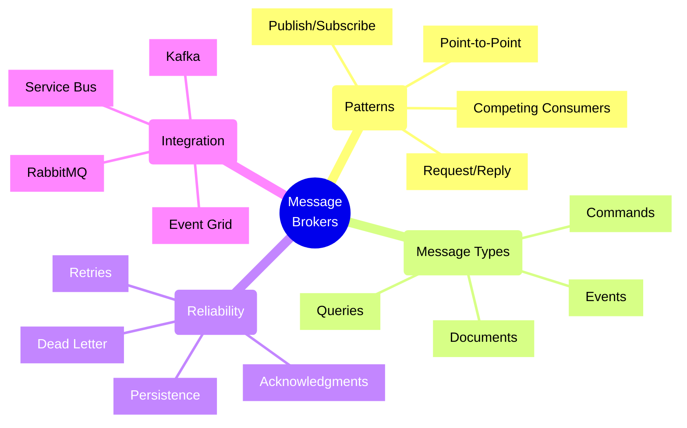
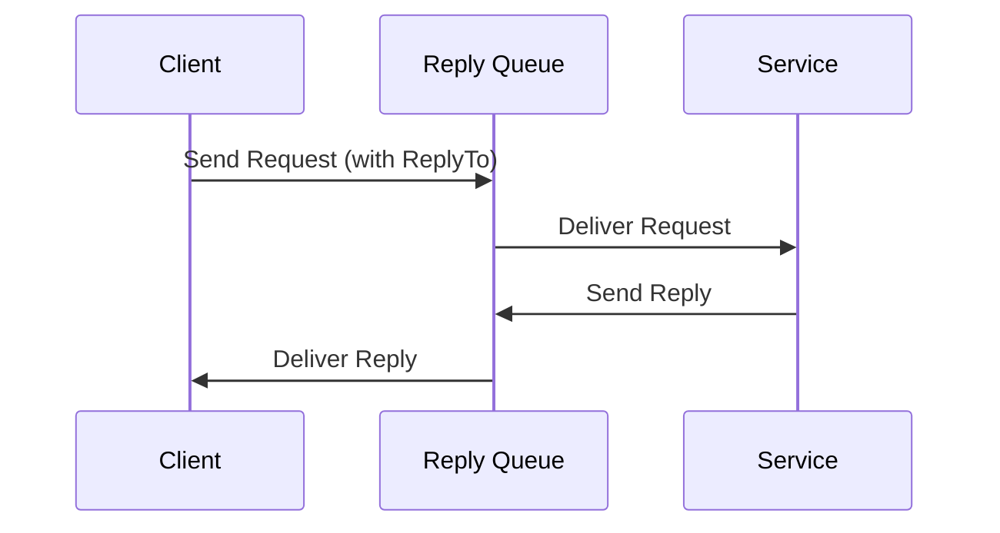
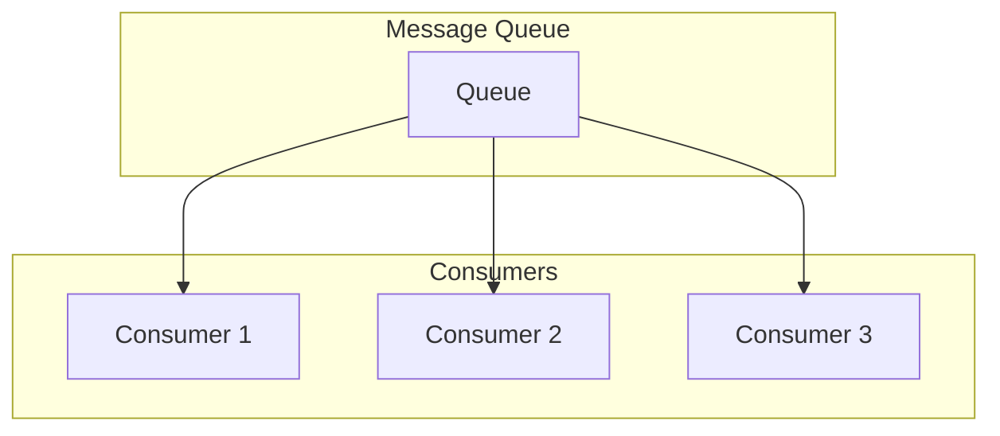
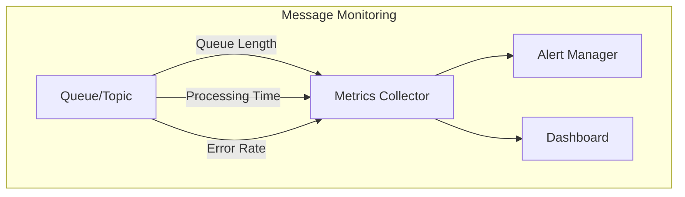

# Message Broker Architectures and Patterns



## Overview

Message brokers enable loose coupling and asynchronous communication between services in distributed systems. This guide covers common patterns and implementations using Azure Service Bus and RabbitMQ with C# and Python examples.

## Core Patterns

### 1. Publish/Subscribe Pattern

#### C# Implementation using Azure Service Bus
```csharp
using Azure.Messaging.ServiceBus;
using Azure.Identity;

public class EventPublisher
{
    private readonly ServiceBusClient _client;
    private readonly string _topicName;

    public EventPublisher(string serviceBusNamespace, string topicName)
    {
        // Use managed identity for authentication
        _client = new ServiceBusClient(
            serviceBusNamespace,
            new DefaultAzureCredential());
        _topicName = topicName;
    }

    public async Task PublishEventAsync<T>(T eventData)
    {
        var sender = _client.CreateSender(_topicName);
        
        try
        {
            var message = new ServiceBusMessage(JsonSerializer.Serialize(eventData))
            {
                ContentType = "application/json",
                Subject = typeof(T).Name,
                CorrelationId = Guid.NewGuid().ToString()
            };

            await sender.SendMessageAsync(message);
        }
        catch (Exception ex)
        {
            // Log and handle exception
            throw;
        }
        finally
        {
            await sender.DisposeAsync();
        }
    }
}

public class EventSubscriber
{
    private readonly ServiceBusClient _client;
    private readonly string _topicName;
    private readonly string _subscriptionName;

    public EventSubscriber(string serviceBusNamespace, string topicName, string subscriptionName)
    {
        _client = new ServiceBusClient(
            serviceBusNamespace,
            new DefaultAzureCredential());
        _topicName = topicName;
        _subscriptionName = subscriptionName;
    }

    public async Task StartProcessingAsync(
        Func<ServiceBusReceivedMessage, Task> messageHandler)
    {
        var processor = _client.CreateProcessor(
            _topicName, 
            _subscriptionName,
            new ServiceBusProcessorOptions
            {
                MaxConcurrentCalls = 1,
                AutoCompleteMessages = false
            });

        processor.ProcessMessageAsync += async args =>
        {
            try
            {
                await messageHandler(args.Message);
                await args.CompleteMessageAsync(args.Message);
            }
            catch (Exception ex)
            {
                // Log error and abandon message
                await args.AbandonMessageAsync(args.Message);
            }
        };

        processor.ProcessErrorAsync += args =>
        {
            // Log error
            return Task.CompletedTask;
        };

        await processor.StartProcessingAsync();
    }
}
```

#### Python Implementation using RabbitMQ
```python
import pika
import json
from typing import Any, Callable
import logging
from contextlib import contextmanager

class EventPublisher:
    def __init__(self, host: str, exchange: str):
        self.host = host
        self.exchange = exchange
        
    @contextmanager
    def connection(self):
        connection = pika.BlockingConnection(
            pika.ConnectionParameters(host=self.host)
        )
        try:
            yield connection
        finally:
            connection.close()
            
    def publish_event(self, routing_key: str, event_data: Any):
        with self.connection() as connection:
            channel = connection.channel()
            
            # Declare exchange
            channel.exchange_declare(
                exchange=self.exchange,
                exchange_type='topic',
                durable=True
            )
            
            # Publish message
            channel.basic_publish(
                exchange=self.exchange,
                routing_key=routing_key,
                body=json.dumps(event_data),
                properties=pika.BasicProperties(
                    delivery_mode=2,  # Make message persistent
                    content_type='application/json'
                )
            )
            
            logging.info(f"Published event: {routing_key}")

class EventSubscriber:
    def __init__(self, host: str, exchange: str, queue: str):
        self.host = host
        self.exchange = exchange
        self.queue = queue
        
    def start_consuming(self, routing_key: str, callback: Callable[[Any], None]):
        connection = pika.BlockingConnection(
            pika.ConnectionParameters(host=self.host)
        )
        channel = connection.channel()
        
        # Declare exchange and queue
        channel.exchange_declare(
            exchange=self.exchange,
            exchange_type='topic',
            durable=True
        )
        
        channel.queue_declare(
            queue=self.queue,
            durable=True
        )
        
        channel.queue_bind(
            exchange=self.exchange,
            queue=self.queue,
            routing_key=routing_key
        )
        
        def message_handler(ch, method, properties, body):
            try:
                data = json.loads(body)
                callback(data)
                ch.basic_ack(delivery_tag=method.delivery_tag)
            except Exception as e:
                logging.error(f"Error processing message: {e}")
                ch.basic_nack(delivery_tag=method.delivery_tag, requeue=True)
        
        channel.basic_qos(prefetch_count=1)
        channel.basic_consume(
            queue=self.queue,
            on_message_callback=message_handler
        )
        
        logging.info(f"Started consuming from {self.queue}")
        channel.start_consuming()
```

### 2. Request/Reply Pattern



### 3. Competing Consumers Pattern



## Message Types and Use Cases

1. **Commands**
   - Direct actions to be performed
   - Single handler
   - Example: PlaceOrder, CancelSubscription

2. **Events**
   - Notifications of state changes
   - Multiple handlers
   - Example: OrderPlaced, UserRegistered

3. **Documents**
   - Data transfer between services
   - Complete state
   - Example: CustomerProfile, ProductCatalog

## Reliability Patterns

### 1. Dead Letter Queue Implementation

```python
from azure.servicebus import ServiceBusClient, ServiceBusMessage
from azure.identity import DefaultAzureCredential

class ReliableMessageHandler:
    def __init__(self, namespace: str, queue_name: str):
        credential = DefaultAzureCredential()
        self.servicebus_client = ServiceBusClient(
            fully_qualified_namespace=namespace,
            credential=credential
        )
        self.queue_name = queue_name
    
    async def process_messages(self):
        async with self.servicebus_client:
            receiver = self.servicebus_client.get_queue_receiver(
                queue_name=self.queue_name
            )
            async with receiver:
                try:
                    messages = await receiver.receive_messages(
                        max_message_count=10,
                        max_wait_time=5
                    )
                    for msg in messages:
                        try:
                            # Process the message
                            await self.process_message(msg)
                            await receiver.complete_message(msg)
                        except Exception as e:
                            # Move to dead letter queue if max retries reached
                            if msg.delivery_count >= 3:
                                await receiver.dead_letter_message(
                                    msg,
                                    reason="Max retries exceeded",
                                    error_description=str(e)
                                )
                            else:
                                await receiver.abandon_message(msg)
                except Exception as e:
                    logging.error(f"Error receiving messages: {e}")
                    raise
```

### 2. Circuit Breaker Pattern

```csharp
public class MessageBrokerCircuitBreaker
{
    private readonly string _serviceBusNamespace;
    private readonly string _queueName;
    private readonly CircuitBreaker _circuitBreaker;

    public MessageBrokerCircuitBreaker(
        string serviceBusNamespace, 
        string queueName)
    {
        _serviceBusNamespace = serviceBusNamespace;
        _queueName = queueName;
        _circuitBreaker = new CircuitBreaker(
            taskProvider: () => SendMessageInternalAsync(),
            failureThreshold: 3,
            recoveryTime: TimeSpan.FromSeconds(30)
        );
    }

    public async Task SendMessageAsync(string message)
    {
        await _circuitBreaker.ExecuteAsync(() => 
            new ServiceBusMessage(message));
    }

    private async Task SendMessageInternalAsync(ServiceBusMessage message)
    {
        var client = new ServiceBusClient(
            _serviceBusNamespace,
            new DefaultAzureCredential());
        var sender = client.CreateSender(_queueName);

        try
        {
            await sender.SendMessageAsync(message);
        }
        finally
        {
            await sender.DisposeAsync();
            await client.DisposeAsync();
        }
    }
}
```

## Best Practices

1. **Message Design**
   - Keep messages self-contained
   - Use versioning for message schemas
   - Include correlation IDs
   - Consider message size limits

2. **Error Handling**
   - Implement dead letter queues
   - Use retry policies
   - Monitor failed messages
   - Implement circuit breakers

3. **Performance**
   - Use batch processing when possible
   - Implement back pressure
   - Monitor queue lengths
   - Scale consumers horizontally

4. **Security**
   - Use managed identities
   - Implement message encryption
   - Use RBAC for queue access
   - Monitor unusual patterns

## Monitoring Pattern



Remember: Message brokers are crucial for building resilient, scalable distributed systems. Choose patterns and implementations based on your specific requirements for reliability, scalability, and message delivery guarantees.