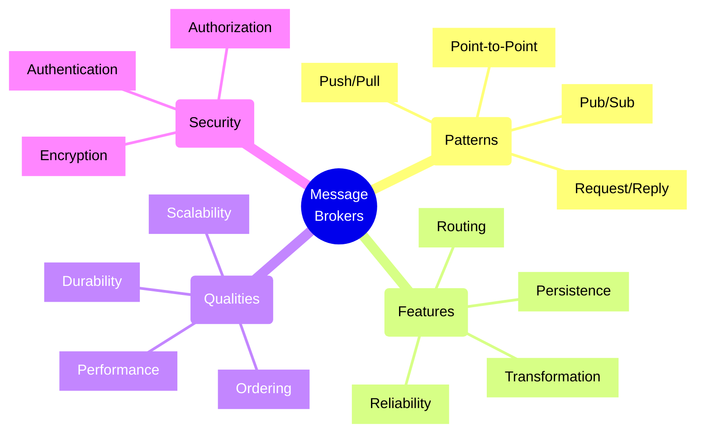
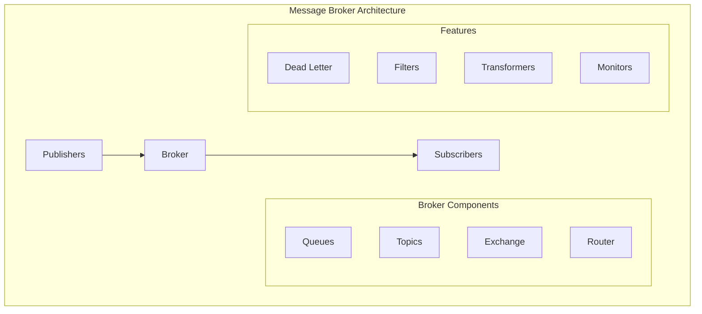
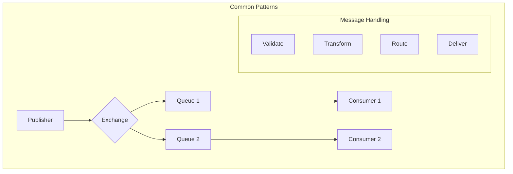

# Message Broker Architectures

## Core Components

## Implementation Checklist

### Reliability Features
- [ ] Configure message persistence
- [ ] Set up dead letter queues
- [ ] Implement retry mechanisms
- [ ] Configure message expiry
- [ ] Set up acknowledgments
- [ ] Implement error handling
- [ ] Configure failover
- [ ] Set up monitoring
- [ ] Test failure scenarios

### Performance Optimization
- [ ] Configure queue sizes
- [ ] Set message TTL
- [ ] Optimize batch sizes
- [ ] Configure prefetch counts
- [ ] Set up connection pools
- [ ] Implement caching
- [ ] Configure thread pools
- [ ] Monitor throughput
- [ ] Test performance

### Security Configuration
- [ ] Set up authentication
- [ ] Configure authorization
- [ ] Enable TLS/SSL
- [ ] Implement access controls
- [ ] Set up encryption
- [ ] Configure network security
- [ ] Enable audit logging
- [ ] Regular security reviews
- [ ] Test security measures

### Monitoring Setup
- [ ] Configure health checks
- [ ] Set up metrics collection
- [ ] Implement logging
- [ ] Configure alerts
- [ ] Monitor queue depths
- [ ] Track message rates
- [ ] Set up dashboards
- [ ] Configure tracing
- [ ] Test monitoring systems

## Trade-offs

### Reliability vs. Performance
- **High Reliability**
  - Pros:
    * Guaranteed delivery
    * No message loss
    * Better consistency
  - Cons:
    * Higher latency
    * More resource usage
    * Increased complexity

### Scalability vs. Consistency
- **High Scalability**
  - Pros:
    * Better throughput
    * Improved performance
    * More flexibility
  - Cons:
    * Potential ordering issues
    * Complex state management
    * More failure scenarios

### Push vs. Pull
- **Push Model**
  - Pros:
    * Real-time delivery
    * Lower latency
    * Better for events
  - Cons:
    * Consumer overload risk
    * More complex error handling
    * Higher resource usage

### Persistence vs. Speed
- **Full Persistence**
  - Pros:
    * No message loss
    * Better recovery
    * Message replay
  - Cons:
    * Higher latency
    * More storage needed
    * Increased cost

## Message Flow Patterns

## Best Practices

1. **Message Design**
   - Keep messages small
   - Use proper schemas
   - Include metadata
   - Version messages
   - Handle duplicates
   - Plan for failures
   - Document formats

2. **Queue Management**
   - Set size limits
   - Monitor depths
   - Configure TTL
   - Handle dead letters
   - Manage connections
   - Regular cleanup
   - Monitor performance

3. **Error Handling**
   - Implement retries
   - Log failures
   - Handle timeouts
   - Manage poison messages
   - Configure alerts
   - Document procedures
   - Test recovery

4. **Operational Excellence**
   - Monitor actively
   - Scale proactively
   - Backup regularly
   - Test failover
   - Document procedures
   - Train team members
   - Regular reviews

## Performance Metrics Matrix

| Aspect | Metric | Target | Alert Threshold |
|--------|--------|--------|----------------|
| Latency | Message Delay | <100ms | >500ms |
| Throughput | Messages/sec | >1000 | <500 |
| Queue Depth | Message Count | <10000 | >50000 |
| Error Rate | Failed/Total | <0.1% | >1% |
| CPU Usage | Utilization | <70% | >85% |
| Memory | Available | >30% | <15% |

Remember: Message broker architecture choices significantly impact system behavior. Consider your use cases carefully and choose patterns that match your requirements for reliability, performance, and scalability.