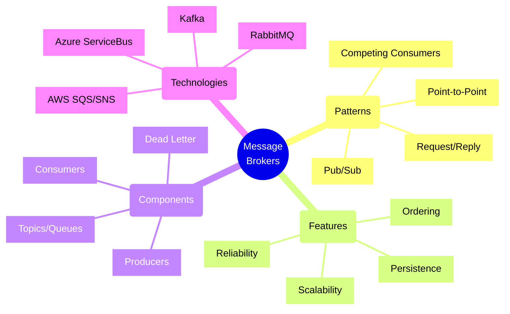
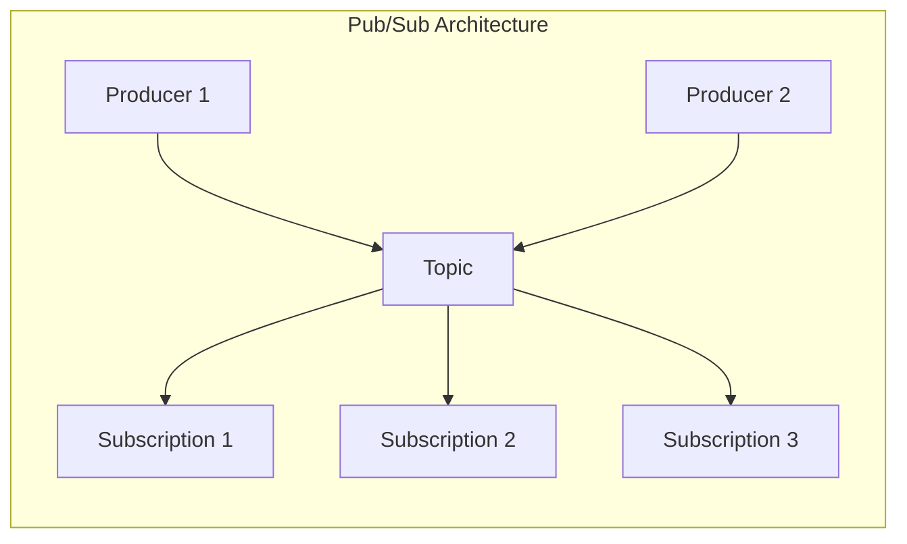
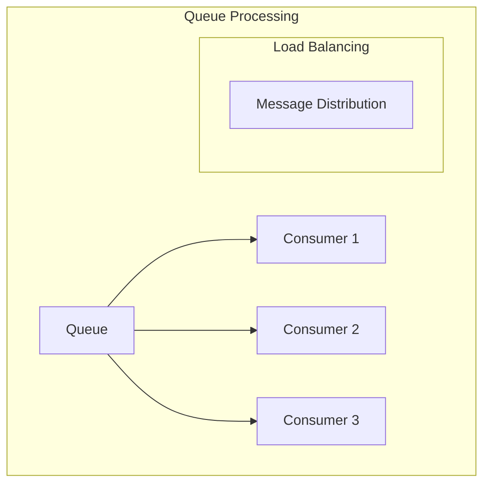
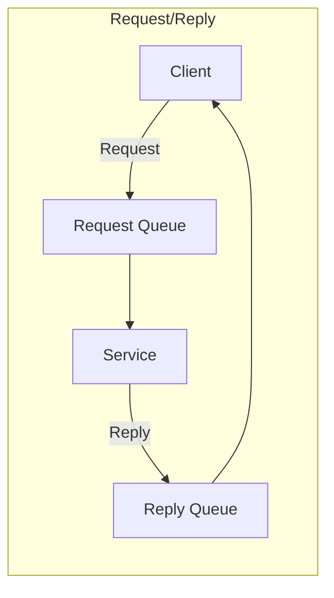
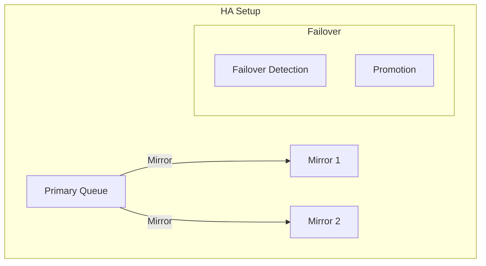

# Message Broker Architectures



## Core Message Patterns

### 1. Publish/Subscribe Pattern



Implementation Example (using Azure Service Bus):
```typescript
// Message publisher with retry policy
class EventPublisher {
    constructor(
        private serviceBusClient: ServiceBusClient,
        private topicName: string
    ) {}

    async publishEvent<T extends DomainEvent>(
        event: T,
        options: PublishOptions = {}
    ): Promise<void> {
        const sender = this.serviceBusClient.createSender(this.topicName);
        
        try {
            const message = {
                body: event,
                contentType: 'application/json',
                messageId: uuidv4(),
                correlationId: options.correlationId,
                subject: event.eventType,
                userProperties: {
                    eventType: event.eventType,
                    version: '1.0',
                    source: 'order-service'
                }
            };

            await this.executeWithRetry(() => 
                sender.sendMessages(message)
            );
        } finally {
            await sender.close();
        }
    }

    private async executeWithRetry(
        operation: () => Promise<void>
    ): Promise<void> {
        const retryOptions = {
            maxRetries: 3,
            delay: 1000,
            backoffCoefficient: 2
        };

        let attempt = 0;
        while (attempt <= retryOptions.maxRetries) {
            try {
                await operation();
                return;
            } catch (error) {
                if (attempt === retryOptions.maxRetries) {
                    throw error;
                }
                await this.delay(
                    retryOptions.delay * 
                    Math.pow(retryOptions.backoffCoefficient, attempt)
                );
                attempt++;
            }
        }
    }
}

// Message subscriber with dead letter handling
class EventSubscriber {
    constructor(
        private serviceBusClient: ServiceBusClient,
        private topicName: string,
        private subscriptionName: string
    ) {}

    async subscribe(
        handler: (event: DomainEvent) => Promise<void>
    ): Promise<void> {
        const receiver = this.serviceBusClient.createReceiver(
            this.topicName,
            this.subscriptionName
        );

        receiver.subscribe({
            processMessage: async (message) => {
                try {
                    await handler(message.body);
                    await message.complete();
                } catch (error) {
                    if (this.isTransientError(error)) {
                        await message.abandon();
                    } else {
                        await this.moveToDeadLetter(
                            message,
                            error.message
                        );
                    }
                }
            },
            processError: async (error) => {
                console.error('Error processing message:', error);
            }
        });
    }

    private async moveToDeadLetter(
        message: ServiceBusMessage,
        reason: string
    ): Promise<void> {
        await message.deadLetter({
            deadLetterReason: reason,
            deadLetterErrorDescription: reason
        });
    }
}
```

### 2. Competing Consumers Pattern



Implementation Example (using RabbitMQ):
```typescript
// Competing consumer implementation
class WorkQueue {
    constructor(
        private channel: amqp.Channel,
        private queueName: string
    ) {}

    async processMessages(
        processor: (msg: WorkItem) => Promise<void>,
        concurrency: number
    ): Promise<void> {
        // Set up prefetch for fair dispatch
        await this.channel.prefetch(concurrency);

        // Set up queue with dead letter exchange
        await this.channel.assertQueue(this.queueName, {
            durable: true,
            arguments: {
                'x-dead-letter-exchange': 'dlx',
                'x-dead-letter-routing-key': `${this.queueName}.dlq`
            }
        });

        // Start consuming with multiple consumers
        for (let i = 0; i < concurrency; i++) {
            this.channel.consume(
                this.queueName,
                async (msg) => {
                    if (!msg) return;

                    try {
                        const workItem = JSON.parse(msg.content.toString());
                        await processor(workItem);
                        this.channel.ack(msg);
                    } catch (error) {
                        if (this.shouldRetry(error, msg)) {
                            this.channel.nack(msg, false, true);
                        } else {
                            this.channel.reject(msg, false);
                        }
                    }
                },
                { noAck: false }
            );
        }
    }

    private shouldRetry(
        error: Error,
        msg: amqp.ConsumeMessage
    ): boolean {
        const retryCount = this.getRetryCount(msg);
        return retryCount < 3 && this.isTransientError(error);
    }

    private getRetryCount(msg: amqp.ConsumeMessage): number {
        const deaths = msg.properties.headers['x-death'] || [];
        return deaths.reduce((count, death) => 
            count + death.count, 0
        );
    }
}
```

### 3. Request/Reply Pattern



Implementation Example (using Apache Kafka):
```typescript
// Request/reply pattern with correlation
class RequestReplyClient {
    constructor(
        private producer: kafka.Producer,
        private consumer: kafka.Consumer,
        private requestTopic: string,
        private replyTopic: string
    ) {}

    async request<T, R>(
        request: T,
        timeout: number = 5000
    ): Promise<R> {
        const correlationId = uuidv4();
        
        // Set up reply consumer before sending request
        const replyPromise = this.awaitReply<R>(correlationId, timeout);

        // Send request
        await this.producer.send({
            topic: this.requestTopic,
            messages: [{
                key: correlationId,
                value: JSON.stringify(request),
                headers: {
                    correlationId,
                    replyTo: this.replyTopic
                }
            }]
        });

        // Wait for reply
        return replyPromise;
    }

    private awaitReply<R>(
        correlationId: string,
        timeout: number
    ): Promise<R> {
        return new Promise((resolve, reject) => {
            const timeoutId = setTimeout(() => {
                reject(new Error('Request timeout'));
            }, timeout);

            this.consumer.subscribe({
                topic: this.replyTopic,
                callback: (message) => {
                    if (message.headers.correlationId === correlationId) {
                        clearTimeout(timeoutId);
                        resolve(JSON.parse(message.value.toString()));
                    }
                }
            });
        });
    }
}

// Request/reply service implementation
class RequestReplyService {
    constructor(
        private consumer: kafka.Consumer,
        private producer: kafka.Producer,
        private requestTopic: string,
        private handler: (request: any) => Promise<any>
    ) {}

    async start(): Promise<void> {
        await this.consumer.subscribe({
            topic: this.requestTopic,
            callback: async (message) => {
                try {
                    const request = JSON.parse(message.value.toString());
                    const response = await this.handler(request);

                    await this.producer.send({
                        topic: message.headers.replyTo,
                        messages: [{
                            value: JSON.stringify(response),
                            headers: {
                                correlationId: message.headers.correlationId
                            }
                        }]
                    });
                } catch (error) {
                    // Handle error response
                    await this.sendErrorResponse(message, error);
                }
            }
        });
    }
}
```

## High Availability Patterns

### 1. Mirror Queue Pattern



Implementation Example:
```typescript
// High availability queue configuration
class HAQueueManager {
    constructor(
        private brokerNodes: BrokerNode[],
        private queueName: string
    ) {}

    async setupHAQueue(): Promise<void> {
        // Set up queue with mirroring
        const policy = {
            pattern: this.queueName,
            definition: {
                'ha-mode': 'all',
                'ha-sync-mode': 'automatic',
                'ha-promote-on-failure': true
            }
        };

        await this.applyHAPolicy(policy);
        await this.setupHealthCheck();
    }

    private async setupHealthCheck(): Promise<void> {
        const monitor = new QueueHealthMonitor(
            this.brokerNodes,
            this.queueName
        );

        monitor.onFailure(async (failedNode) => {
            await this.handleNodeFailure(failedNode);
        });

        await monitor.start();
    }

    private async handleNodeFailure(
        node: BrokerNode
    ): Promise<void> {
        // Promote mirror if primary fails
        if (node.isPrimary) {
            await this.promoteMirror();
        }

        // Notify operations
        await this.notifyOperations({
            event: 'NODE_FAILURE',
            node: node.id,
            queue: this.queueName,
            timestamp: new Date()
        });
    }
}
```

## Best Practices

1. **Message Design**
   - Use versioned schemas
   - Include metadata
   - Plan for backward compatibility
   - Consider message size

2. **Error Handling**
   - Implement dead letter queues
   - Use retry policies
   - Handle poison messages
   - Log failed messages

3. **Performance**
   - Configure prefetch counts
   - Implement batching
   - Monitor queue depths
   - Scale consumers appropriately

4. **Reliability**
   - Use persistent messages
   - Implement acknowledgments
   - Set up high availability
   - Monitor broker health

Remember: Message broker architectures are crucial for building reliable, scalable distributed systems. Choose patterns and configurations that match your specific requirements for reliability, scalability, and message delivery guarantees.