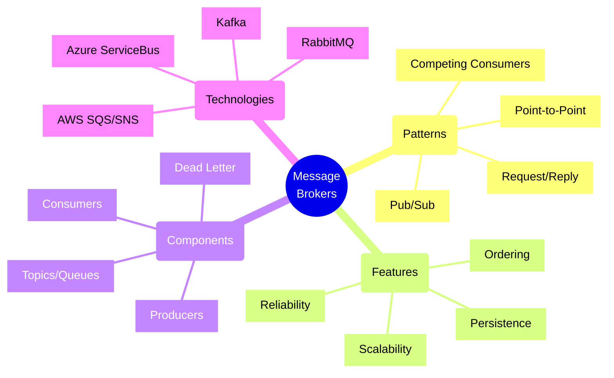
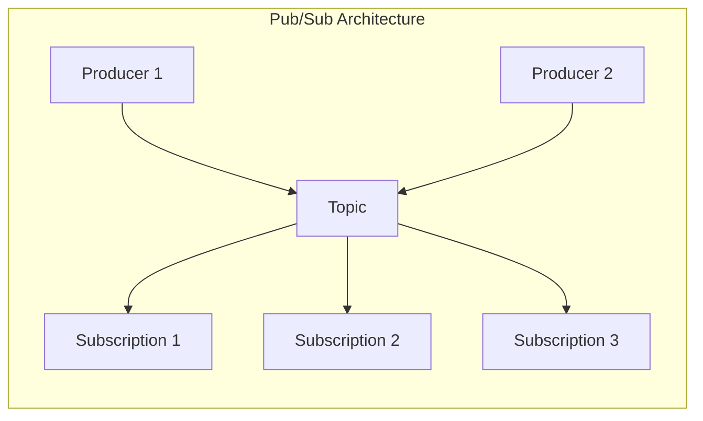
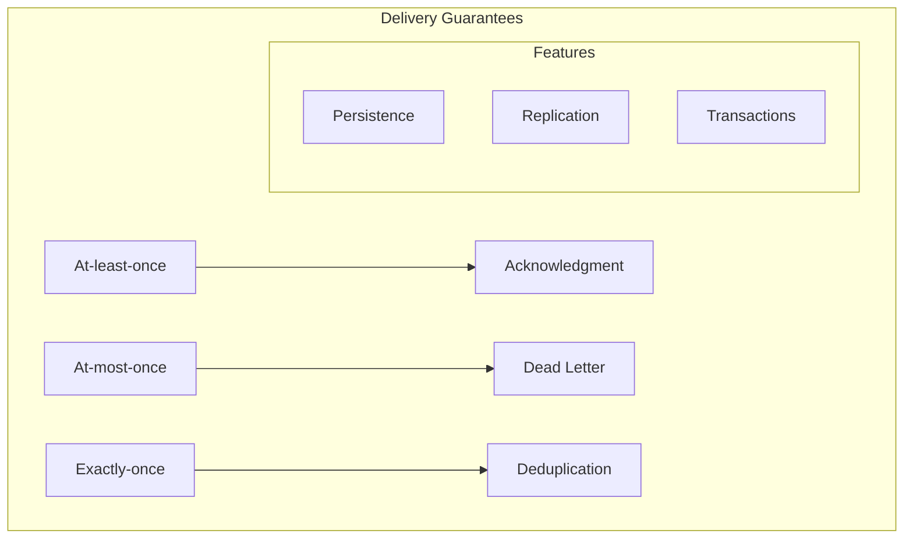
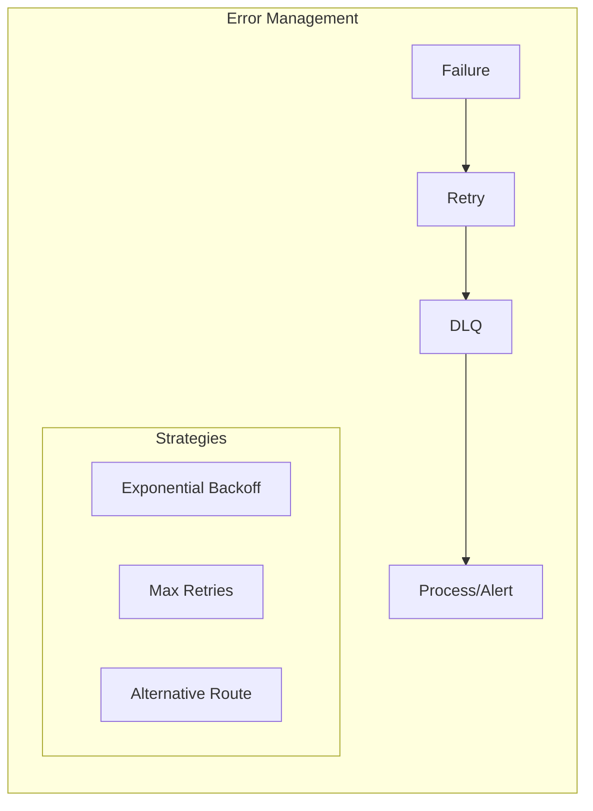
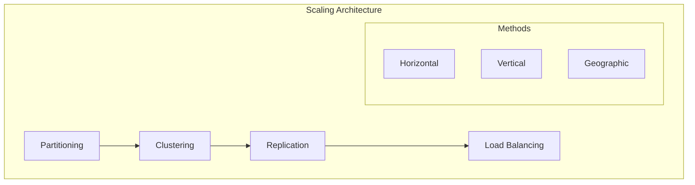
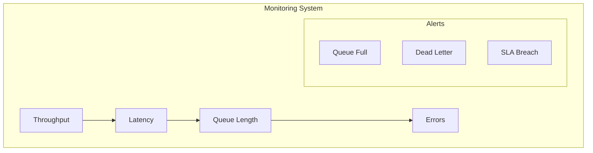
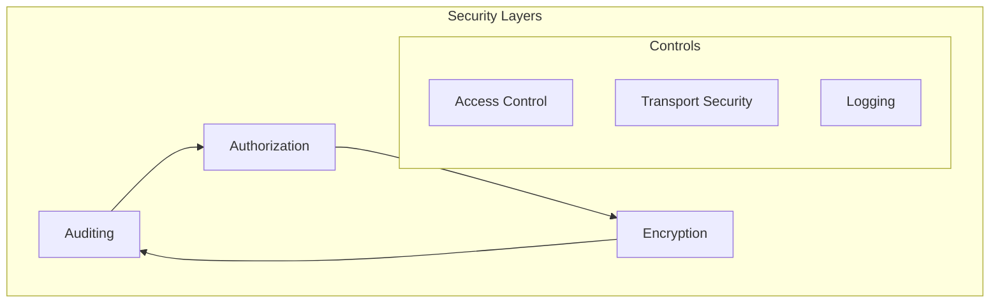

# Message Broker Architectures



## Core Message Patterns

### 1. Publish/Subscribe Pattern



Implementation Example (using Azure Service Bus):
```typescript
// Message publisher with retry policy
class EventPublisher {
    constructor(
        private serviceBusClient: ServiceBusClient,
        private topicName: string
    ) {}

    async publishEvent<T extends DomainEvent>(
        event: T,
        options: PublishOptions = {}
    ): Promise<void> {
        const sender = this.serviceBusClient.createSender(this.topicName);
        
        try {
            const message = {
                body: event,
                contentType: 'application/json',
                messageId: uuidv4(),
                correlationId: options.correlationId,
                subject: event.eventType,
                userProperties: {
                    eventType: event.eventType,
                    version: '1.0',
                    source: 'order-service'
                }
            };

            await this.executeWithRetry(() => 
                sender.sendMessages(message)
            );
        } finally {
            await sender.close();
        }
    }

    private async executeWithRetry(
        operation: () => Promise<void>
    ): Promise<void> {
        const retryOptions = {
            maxRetries: 3,
            delay: 1000,
            backoffCoefficient: 2
        };

        let attempt = 0;
        while (attempt <= retryOptions.maxRetries) {
            try {
                await operation();
                return;
            } catch (error) {
                if (attempt === retryOptions.maxRetries) {
graph TB
    subgraph "Message Components"
        H[Header] --> M[Metadata]
        M --> P[Payload]
        P --> F[Footer]
        
        subgraph "Attributes"
            ID[Message ID]
            TS[Timestamp]
            COR[Correlation ID]
            TTL[Time to Live]
        end
    end
```

### 2. Message Properties
1. **Required Properties**
   - Message ID
   - Timestamp
   - Content type
   - Content encoding

2. **Optional Properties**
   - Correlation ID
   - Reply to
   - Expiration
   - Priority

3. **Custom Headers**
   - Business metadata
   - Routing info
   - Tracking data
   - Version info

## Reliability Patterns

### 1. Message Delivery



#### Delivery Strategies
| Strategy | Guarantee | Performance | Use Case |
|----------|-----------|-------------|----------|
| At-least-once | High | Medium | Critical Data |
| At-most-once | Low | High | Metrics/Logs |
| Exactly-once | Very High | Low | Transactions |

### 2. Error Handling



## Performance Optimization

### 1. Scaling Patterns



### 2. Performance Checklist
- [ ] Message batching
- [ ] Consumer scaling
- [ ] Producer throttling
- [ ] Connection pooling
- [ ] Network optimization
- [ ] Memory management
- [ ] Disk I/O tuning
- [ ] Monitoring setup

## Monitoring Framework

### 1. Key Metrics



### 2. Monitoring Checklist
- [ ] Message rates
- [ ] Queue depths
- [ ] Consumer lag
- [ ] Error rates
- [ ] Resource usage
- [ ] Network latency
- [ ] Disk usage
- [ ] Alert thresholds

## Security Framework

### 1. Security Architecture



### 2. Security Checklist
- [ ] TLS configuration
- [ ] Authentication setup
- [ ] Authorization rules
- [ ] Message encryption
- [ ] Network security
- [ ] Audit logging
- [ ] Access controls
- [ ] Compliance checks

## Implementation Guidance

### 1. Best Practices
1. **Message Design**
   - Schema versioning
   - Backward compatibility
   - Forward compatibility
   - Message validation

2. **Error Handling**
   - Retry policies
   - Dead letter queues
   - Error logging
   - Alert mechanisms

3. **Performance**
   - Connection pooling
   - Message batching
   - Prefetch settings
   - Resource limits

### 2. Anti-patterns to Avoid
- Direct broker-to-broker communication
- Synchronous request-reply over queues
- Large message payloads
- Queue proliferation
- Missing message TTL
- Lack of monitoring
- Insufficient security
- No message schema

## Decision Framework

### 1. Broker Selection
| Feature | RabbitMQ | Kafka | Azure Service Bus |
|---------|----------|-------|-------------------|
| Patterns | All | Streaming | All |
| Scale | Medium | Very High | High |
| Latency | Very Low | Low | Low |
| Features | Rich | Basic | Rich |
| Management | Good | Complex | Excellent |

### 2. Architecture Decisions
1. **Message Flow**
   - Routing patterns
   - Exchange types
   - Queue design
   - Consumer groups

2. **Infrastructure**
   - High availability
   - Disaster recovery
   - Geographic distribution
   - Resource sizing

Remember: Message broker architectures should focus on reliability, scalability, and manageability while ensuring proper message delivery guarantees.