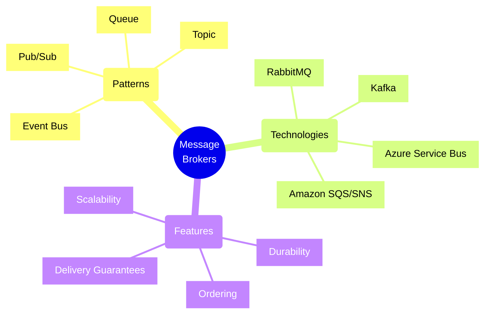
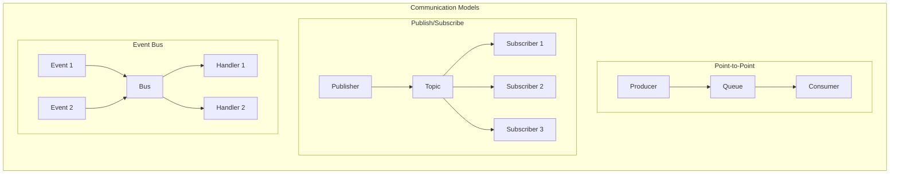
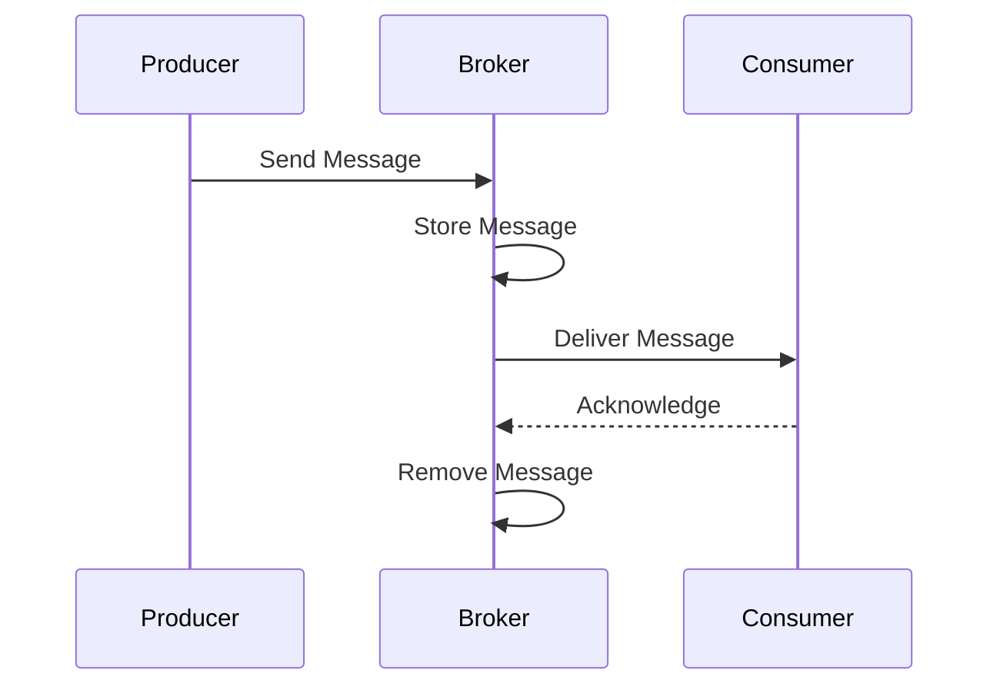
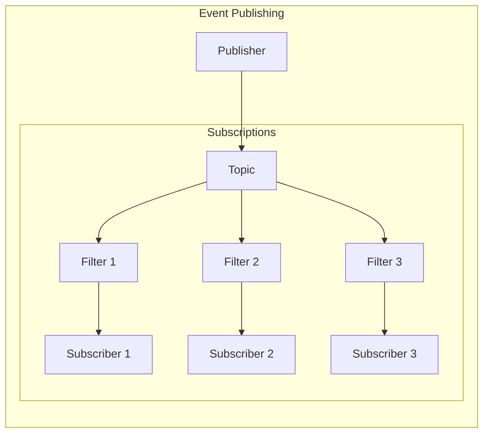
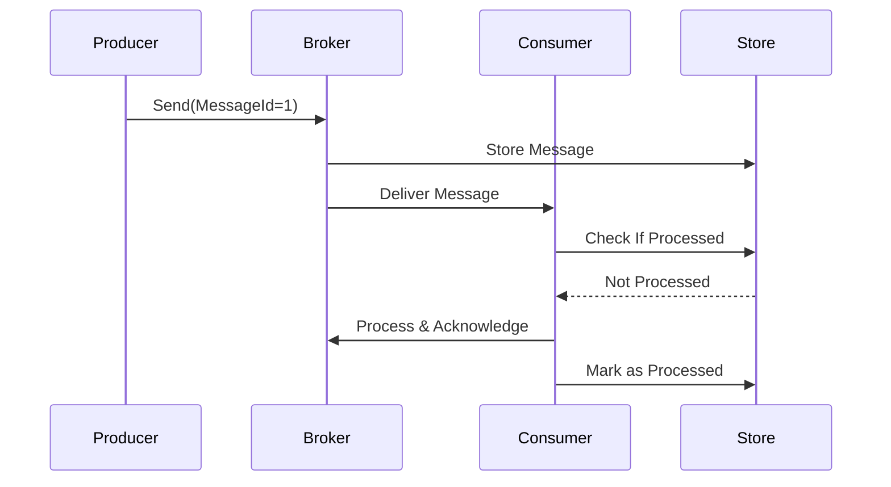
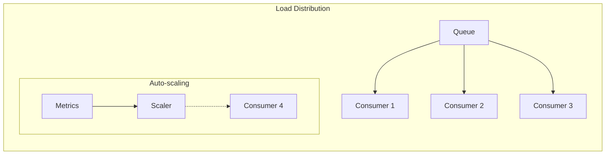
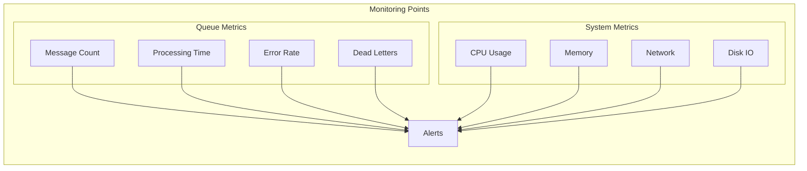

# Message Broker Architectures



## Core Message Patterns

### 1. Messaging Models



### 2. Message Flow Types



## Implementation Patterns

### 1. Queue Pattern
```typescript
// Azure Service Bus Queue Example
class OrderProcessor {
    private serviceBusClient: ServiceBusClient;
    private sender: ServiceBusSender;
    private receiver: ServiceBusReceiver;

    async sendOrder(order: Order): Promise<void> {
        const message = {
            body: order,
            contentType: "application/json",
            messageId: order.id
        };
        await this.sender.sendMessages(message);
    }

    async processOrders(): Promise<void> {
        const messages = await this.receiver.receiveMessages(10);
        for (const message of messages) {
            try {
                await this.processOrder(message.body);
                await this.receiver.completeMessage(message);
            } catch (error) {
                await this.receiver.abandonMessage(message);
            }
        }
    }
}
```

### 2. Pub/Sub Pattern



### Implementation Example
```typescript
// Event Publishing with Filtering
class EventPublisher {
    private topicClient: TopicClient;

    async publishEvent(event: Event): Promise<void> {
        const message = {
            body: event,
            label: event.type,
            userProperties: {
                category: event.category,
                priority: event.priority
            }
        };
        await this.topicClient.send(message);
    }
}

class EventSubscriber {
    private subscriptionClient: SubscriptionClient;

    async setupSubscription(): Promise<void> {
        const rules = [
            {
                name: "HighPriorityFilter",
                filter: "priority = 'high'"
            },
            {
                name: "OrdersFilter",
                filter: "category = 'orders'"
            }
        ];
        await this.subscriptionClient.addRules(rules);
    }
}
```

## Message Reliability Patterns

### 1. Exactly-Once Delivery



### 2. Dead Letter Pattern
```typescript
// Dead Letter Handling
class MessageProcessor {
    private receiver: MessageReceiver;
    private deadLetterSender: MessageSender;

    async processMessage(message: Message): Promise<void> {
        try {
            await this.processBusinessLogic(message);
            await this.receiver.complete(message);
        } catch (error) {
            if (message.deliveryCount > 3) {
                await this.moveToDeadLetter(message, error);
            } else {
                await this.receiver.abandon(message);
            }
        }
    }

    private async moveToDeadLetter(message: Message, error: Error): Promise<void> {
        const deadLetterMessage = {
            body: message.body,
            userProperties: {
                originalMessageId: message.messageId,
                error: error.message,
                failedAt: new Date().toISOString()
            }
        };
        await this.deadLetterSender.send(deadLetterMessage);
        await this.receiver.complete(message);
    }
}
```

## Scalability Patterns

### 1. Competing Consumers



### 2. Partitioning Pattern
```typescript
// Partitioned Queue Processing
class PartitionedProcessor {
    private partitionReceivers: Map<number, MessageReceiver>;

    async processPartition(partitionId: number): Promise<void> {
        const receiver = this.partitionReceivers.get(partitionId);
        const messages = await receiver.receiveMessages(100);

        await Promise.all(messages.map(async message => {
            try {
                await this.processMessage(message);
                await receiver.complete(message);
            } catch (error) {
                await receiver.abandon(message);
            }
        }));
    }
}
```

## Monitoring and Management

### 1. Health Metrics



## Best Practices

1. **Message Design**
   - Use clear message schemas
   - Include metadata
   - Version messages
   - Keep messages small

2. **Error Handling**
   - Implement retry policies
   - Use dead letter queues
   - Log failed messages
   - Monitor error rates

3. **Performance**
   - Batch messages when possible
   - Use async operations
   - Implement partitioning
   - Consider message compression

4. **Security**
   - Encrypt messages
   - Use access control
   - Implement authentication
   - Audit message access

Remember: Message brokers are crucial for building resilient, decoupled systems. Choose patterns and implementations that match your reliability and scalability requirements.