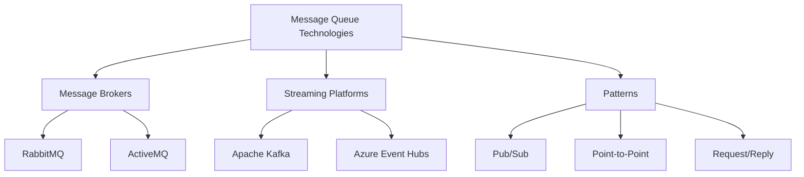
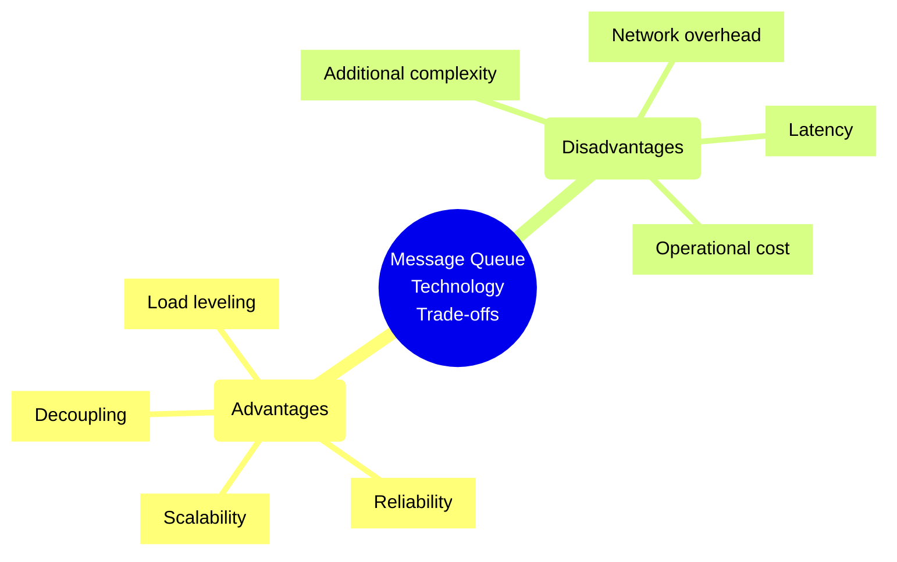
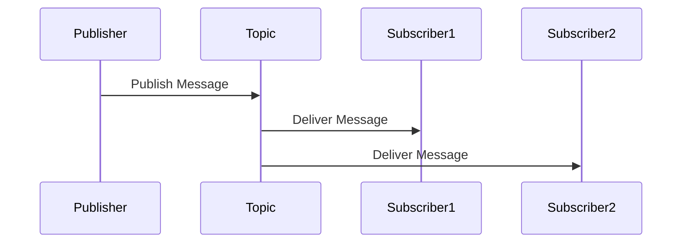
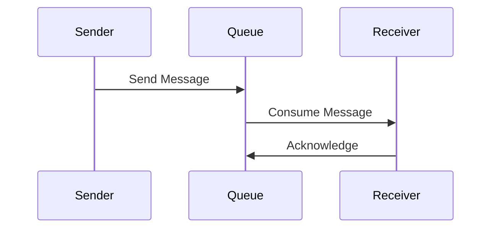
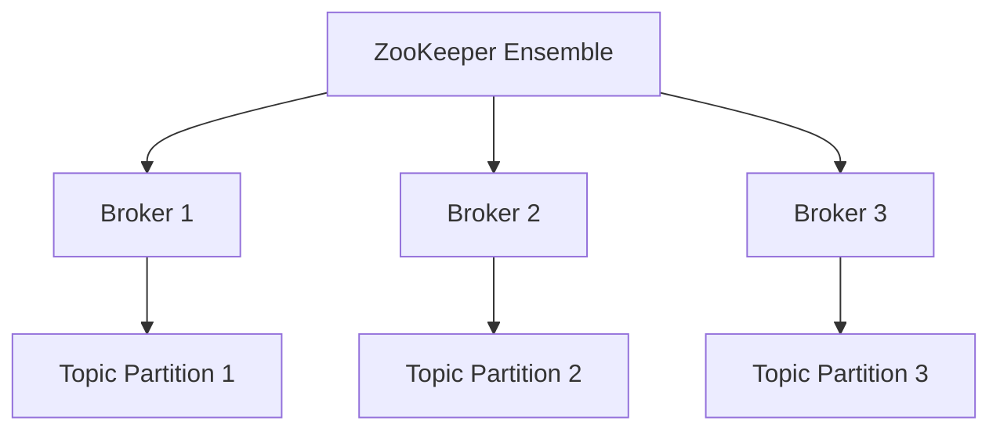
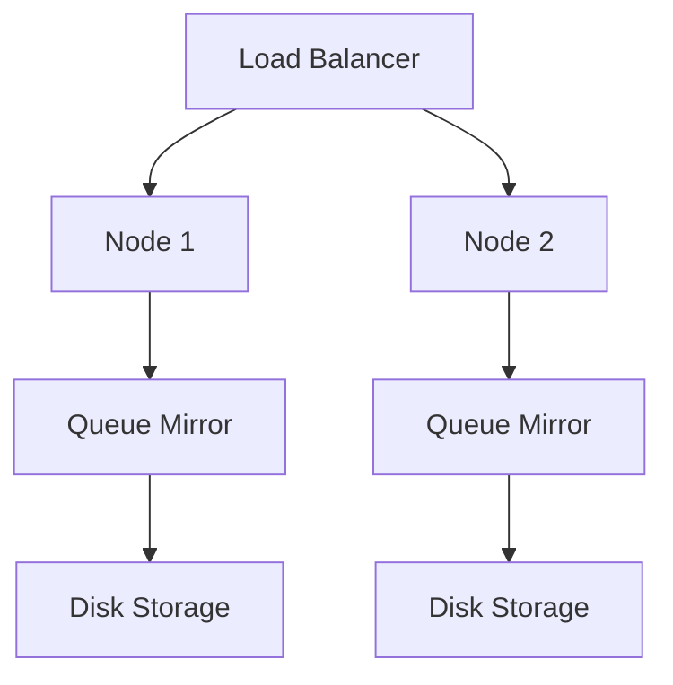

# Message Queue Technologies

## Overview
Message queues are communication systems that enable asynchronous communication between different parts of a distributed system.



## Key Technologies

### Apache Kafka
- Distributed streaming platform
- High throughput
- Horizontal scalability
- Topic-based architecture
- Persistent storage
- Exactly-once semantics

### RabbitMQ
- Traditional message broker
- Multiple messaging protocols
- Rich routing capabilities
- Flexible message routing
- Queue mirroring
- Plugin architecture

### Apache ActiveMQ
- JMS compliance
- Multiple protocol support
- Enterprise integration
- High availability
- Load balancing
- Message persistence

### Azure Service Bus
- Fully managed service
- Enterprise messaging
- AMQP support
- Role-based access
- Multiple communication patterns
- Dead letter queues

## Best Practices Checklist

### Architecture Design
- [ ] Define message schemas
- [ ] Plan message routing
- [ ] Design error handling
- [ ] Consider dead letter queues
- [ ] Plan scaling strategy

### Performance
- [ ] Configure persistence properly
- [ ] Optimize batch sizes
- [ ] Set appropriate TTL
- [ ] Monitor queue depths
- [ ] Plan resource allocation

### Security
- [ ] Implement authentication
- [ ] Configure authorization
- [ ] Enable encryption
- [ ] Audit message access
- [ ] Secure connections

## Trade-offs Analysis



## Implementation Patterns

### Publisher-Subscriber (Pub/Sub)


### Point-to-Point


## Sample Implementations

### Kafka Producer
```java
Properties props = new Properties();
props.put("bootstrap.servers", "localhost:9092");
props.put("key.serializer", "org.apache.kafka.common.serialization.StringSerializer");
props.put("value.serializer", "org.apache.kafka.common.serialization.StringSerializer");

Producer<String, String> producer = new KafkaProducer<>(props);
producer.send(new ProducerRecord<>("topic", "key", "value"));
```

### RabbitMQ Consumer
```python
def callback(ch, method, properties, body):
    print(f" [x] Received {body}")

channel.basic_consume(
    queue='hello',
    auto_ack=True,
    on_message_callback=callback
)
```

## Performance Considerations

### Producer Side
1. Batch Size
   - Message grouping
   - Compression ratio
   - Latency trade-off

2. Acknowledgment Strategy
   - Fire and forget
   - Synchronous confirmation
   - Asynchronous confirmation

### Consumer Side
1. Prefetch Count
   - Memory usage
   - Processing capacity
   - Fairness

2. Concurrency Model
   - Single-threaded
   - Multi-threaded
   - Process-based

## Monitoring Checklist
- [ ] Queue depth
- [ ] Message rate
- [ ] Consumer lag
- [ ] Error rate
- [ ] Network latency
- [ ] Disk usage
- [ ] Memory usage

## High Availability Configurations

### Kafka Cluster


### RabbitMQ Cluster


## Security Best Practices
1. Authentication
   - SASL
   - SSL/TLS certificates
   - Username/password
   - OAuth 2.0

2. Authorization
   - ACLs
   - Role-based access
   - Resource quotas
   - Topic restrictions

3. Network Security
   - TLS encryption
   - VPN/private networks
   - Network segmentation
   - Firewall rules

## Disaster Recovery
1. Backup Strategy
   - Regular snapshots
   - Log replication
   - Cross-region replication

2. Recovery Process
   - Message replay
   - Consumer offset management
   - Cluster rebuild procedures

## Integration Patterns
1. Message Routing
   - Content-based routing
   - Header-based routing
   - Topic-based routing

2. Message Transformation
   - Message enrichment
   - Message filtering
   - Message splitting

3. System Integration
   - Dead letter queues
   - Message bridges
   - Protocol bridges

## Tools and Ecosystem

### Monitoring
- Prometheus
- Grafana
- ELK Stack
- Datadog

### Management
- Kafka Manager
- RabbitMQ Management UI
- ActiveMQ Web Console

### Development
- Kafka Streams
- Spring Cloud Stream
- MassTransit
- Confluent Platform

## Additional Resources
1. Documentation
   - [Apache Kafka Documentation](https://kafka.apache.org/documentation/)
   - [RabbitMQ Documentation](https://www.rabbitmq.com/documentation.html)
   - [ActiveMQ Documentation](https://activemq.apache.org/components/classic/documentation)
   - [Azure Service Bus Documentation](https://docs.microsoft.com/en-us/azure/service-bus-messaging/)

2. Learning Resources
   - Message Queue Patterns
   - Performance Tuning
   - Security Best Practices
   - Monitoring Strategies