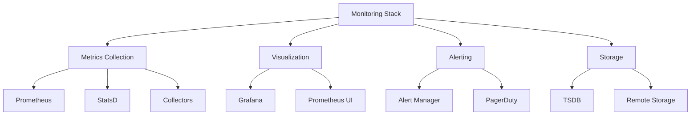
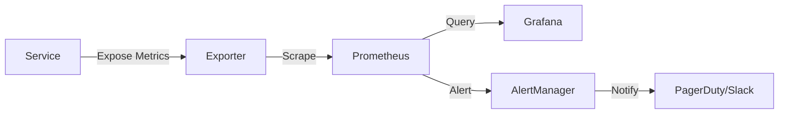
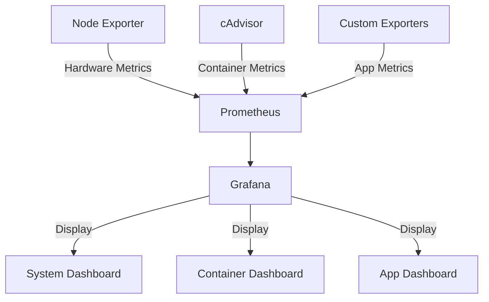
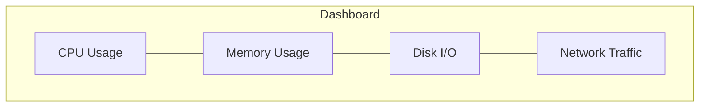
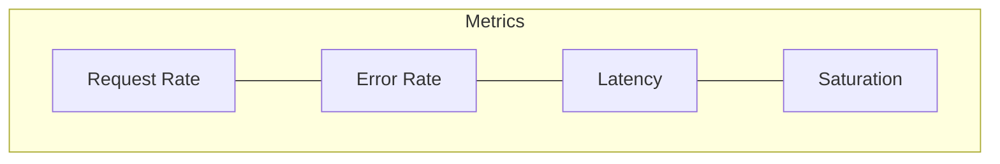
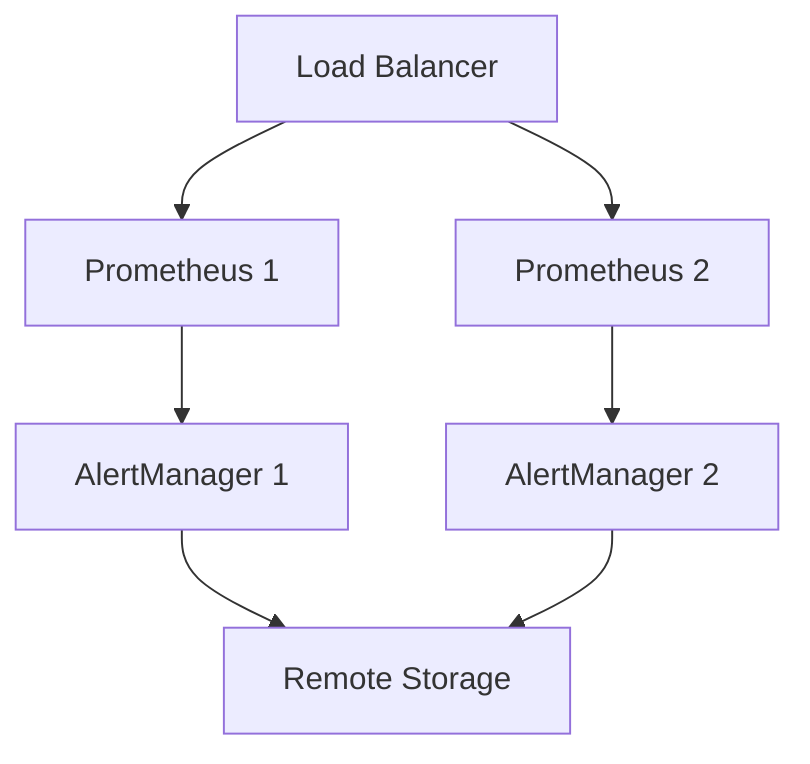
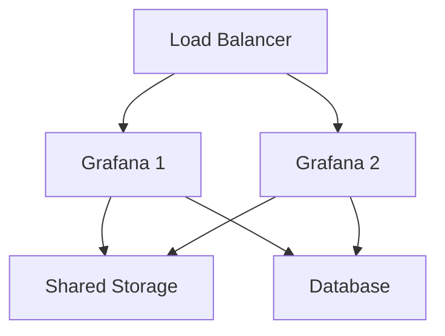

# Monitoring Tools

## Overview
Modern monitoring tools enable real-time observation, alerting, and visualization of system metrics and performance data.



## Key Components

### Prometheus
- Pull-based architecture
- Time-series database
- PromQL query language
- Service discovery
- Alert management
- Multi-dimensional data model

### Grafana
- Rich visualization
- Dashboard templates
- Data source integration
- Alerting system
- Role-based access
- Plugin ecosystem

## Best Practices Checklist

### Metrics Collection
- [ ] Define naming conventions
- [ ] Plan retention policies
- [ ] Configure scrape intervals
- [ ] Set up service discovery
- [ ] Implement recording rules

### Dashboard Design
- [ ] Use consistent layouts
- [ ] Add documentation
- [ ] Set appropriate time ranges
- [ ] Include drill-down capabilities
- [ ] Implement template variables

### Alerting
- [ ] Define clear thresholds
- [ ] Implement proper routing
- [ ] Set up escalations
- [ ] Add alert documentation
- [ ] Configure proper timing

## Implementation Examples

### Prometheus Configuration
```yaml
global:
  scrape_interval: 15s
  evaluation_interval: 15s

rule_files:
  - "alerts/*.yml"

scrape_configs:
  - job_name: 'prometheus'
    static_configs:
      - targets: ['localhost:9090']
  
  - job_name: 'node'
    static_configs:
      - targets: ['node-exporter:9100']
```

### Alert Rules
```yaml
groups:
- name: example
  rules:
  - alert: HighRequestLatency
    expr: http_request_duration_seconds{quantile="0.95"} > 1
    for: 10m
    labels:
      severity: warning
    annotations:
      summary: High request latency on {{ $labels.instance }}
      description: Request latency is above 1s (current value: {{ $value }}s)
```

## Monitoring Patterns

### Service Level Monitoring


### Infrastructure Monitoring


## Dashboard Examples

### System Overview


### Application Metrics


## PromQL Examples

### Basic Queries
```promql
# Rate of HTTP requests
rate(http_requests_total[5m])

# 95th percentile latency
histogram_quantile(0.95, sum(rate(http_request_duration_bucket[5m])) by (le))

# Error ratio
sum(rate(http_requests_total{status=~"5.."}[5m])) 
  / 
sum(rate(http_requests_total[5m]))
```

### Recording Rules
```yaml
groups:
  - name: example
    rules:
      - record: job:http_requests:rate5m
        expr: rate(http_requests_total[5m])
      - record: job:http_errors:rate5m
        expr: rate(http_requests_total{status=~"5.."}[5m])
```

## Grafana Dashboard JSON Model
```json
{
  "dashboard": {
    "title": "Service Overview",
    "panels": [
      {
        "title": "Request Rate",
        "type": "graph",
        "datasource": "Prometheus",
        "targets": [
          {
            "expr": "rate(http_requests_total[5m])",
            "legendFormat": "{{method}} {{path}}"
          }
        ]
      }
    ]
  }
}
```

## Security Considerations

### Authentication
- HTTPS for all endpoints
- Basic auth or OAuth
- TLS client certificates
- Service account tokens

### Authorization
- Role-based access control
- Token-based authentication
- Data source permissions
- Dashboard permissions

## High Availability Setup

### Prometheus HA


### Grafana HA


## Performance Optimization

### Prometheus
1. Query Optimization
   - Use recording rules
   - Appropriate time ranges
   - Efficient label usage

2. Storage Optimization
   - TSDB block size
   - Retention periods
   - Compression settings

### Grafana
1. Dashboard Optimization
   - Limit time ranges
   - Use template variables
   - Efficient queries

2. Resource Management
   - Panel refresh rates
   - Query caching
   - Browser rendering

## Best Practices Examples

### Metric Naming
```text
# Good
http_requests_total{method="GET", status="200"}
process_cpu_seconds_total
node_memory_usage_bytes

# Bad
http_stuff
cpu_time
memory
```

### Alert Definition
```yaml
groups:
- name: service-slo
  rules:
  - alert: ErrorBudgetBurn
    expr: |
      (
        rate(http_requests_total{status=~"5.."}[1h])
        /
        rate(http_requests_total[1h])
      ) > 0.001
    for: 15m
    labels:
      severity: page
    annotations:
      summary: Error budget burn rate exceeded
      description: Service is experiencing elevated error rates
```

## Additional Resources
1. Documentation
   - [Prometheus Documentation](https://prometheus.io/docs/)
   - [Grafana Documentation](https://grafana.com/docs/)
   - [AlertManager Documentation](https://prometheus.io/docs/alerting/latest/alertmanager/)

2. Learning Resources
   - Monitoring Best Practices
   - PromQL Tutorial
   - Dashboard Design
   - Alert Management