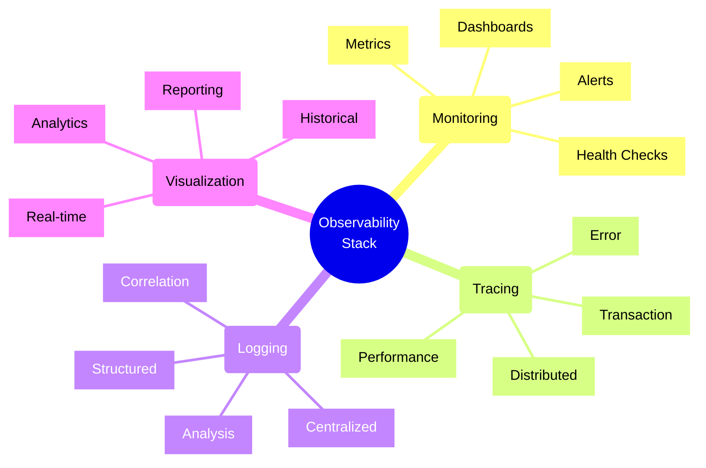
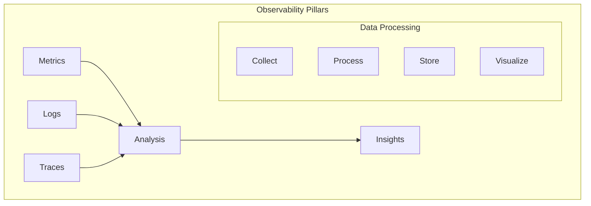
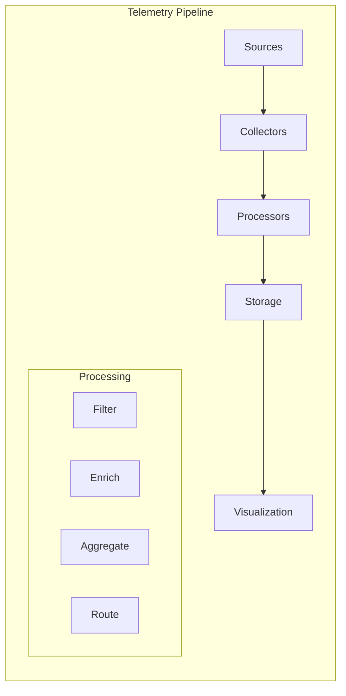
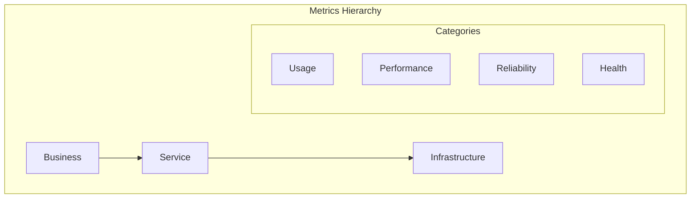

# Monitoring and Observability Patterns

## Observability Components

### 1. Three Pillars

### 2. Data Flow

## Implementation Checklist

### Metrics Collection
- [ ] Define key metrics
- [ ] Set up collectors
- [ ] Configure aggregation
- [ ] Set thresholds
- [ ] Implement alerting
- [ ] Configure dashboards
- [ ] Set up storage
- [ ] Test collection
- [ ] Validate accuracy

### Logging System
- [ ] Define log levels
- [ ] Configure log shipping
- [ ] Set up centralization
- [ ] Implement parsing
- [ ] Configure retention
- [ ] Set up analysis
- [ ] Enable search
- [ ] Configure backup
- [ ] Test recovery

### Tracing Implementation
- [ ] Set up trace collection
- [ ] Configure sampling
- [ ] Implement correlation
- [ ] Set up visualization
- [ ] Configure storage
- [ ] Enable analysis
- [ ] Test trace flow
- [ ] Validate coverage
- [ ] Monitor overhead

### Alerting Configuration
- [ ] Define alert rules
- [ ] Set up notifications
- [ ] Configure escalations
- [ ] Implement SLOs
- [ ] Set up on-call
- [ ] Configure runbooks
- [ ] Test alert flow
- [ ] Validate responses
- [ ] Monitor effectiveness

## Trade-offs

### Data Granularity vs. Storage
- **High Granularity**
  - Pros:
    * Detailed insights
    * Better debugging
    * Fine-grained analysis
  - Cons:
    * Higher storage costs
    * More processing needed
    * Increased complexity

### Real-time vs. Batch Processing
- **Real-time Processing**
  - Pros:
    * Immediate insights
    * Faster responses
    * Better alerting
  - Cons:
    * Higher resource usage
    * More complex
    * Increased cost

### Sampling vs. Full Collection
- **Full Collection**
  - Pros:
    * Complete data
    * No missing events
    * Better analysis
  - Cons:
    * Higher costs
    * More storage
    * Processing overhead

### Retention vs. Cost
- **Long Retention**
  - Pros:
    * Historical analysis
    * Trend detection
    * Compliance
  - Cons:
    * Higher storage costs
    * More management
    * Query performance

## Best Practices

1. **Data Collection**
   - Use structured logging
   - Implement correlation IDs
   - Configure proper sampling
   - Set appropriate levels
   - Monitor collection health
   - Regular validation
   - Document formats

2. **Storage Management**
   - Plan retention policies
   - Implement archiving
   - Configure compression
   - Monitor usage
   - Regular cleanup
   - Backup strategy
   - Recovery testing

3. **Analysis & Visualization**
   - Create useful dashboards
   - Set up proper alerts
   - Configure thresholds
   - Enable quick search
   - Regular reviews
   - User training
   - Document procedures

4. **Operations**
   - Monitor collector health
   - Manage capacity
   - Regular maintenance
   - Update procedures
   - Train team
   - Review effectiveness
   - Continuous improvement

## Metrics Framework

## Performance Indicators Matrix

| Category | Metric | Warning | Critical | Collection |
|----------|--------|---------|----------|------------|
| Infrastructure | CPU Usage | 70% | 85% | Real-time |
| Application | Error Rate | 0.1% | 1% | Real-time |
| Business | Transaction Rate | -10% | -20% | Hourly |
| User Experience | Latency | 200ms | 500ms | Real-time |
| Security | Auth Failures | 5/min | 20/min | Real-time |
| Availability | Uptime | 99.9% | 99% | Daily |

Remember: A good observability strategy provides insights across all layers of your system. Focus on collecting meaningful data that helps understand system behavior and troubleshoot issues effectively.