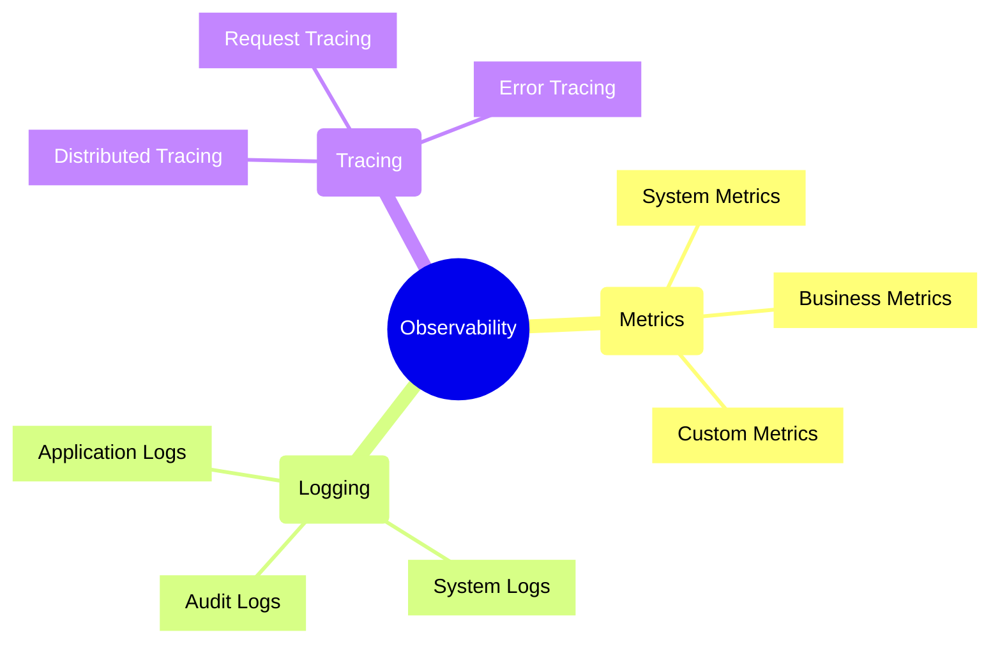
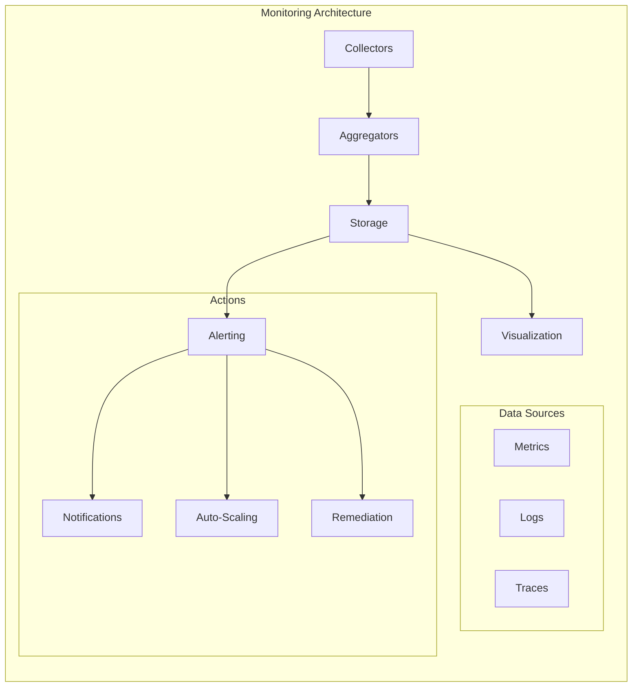
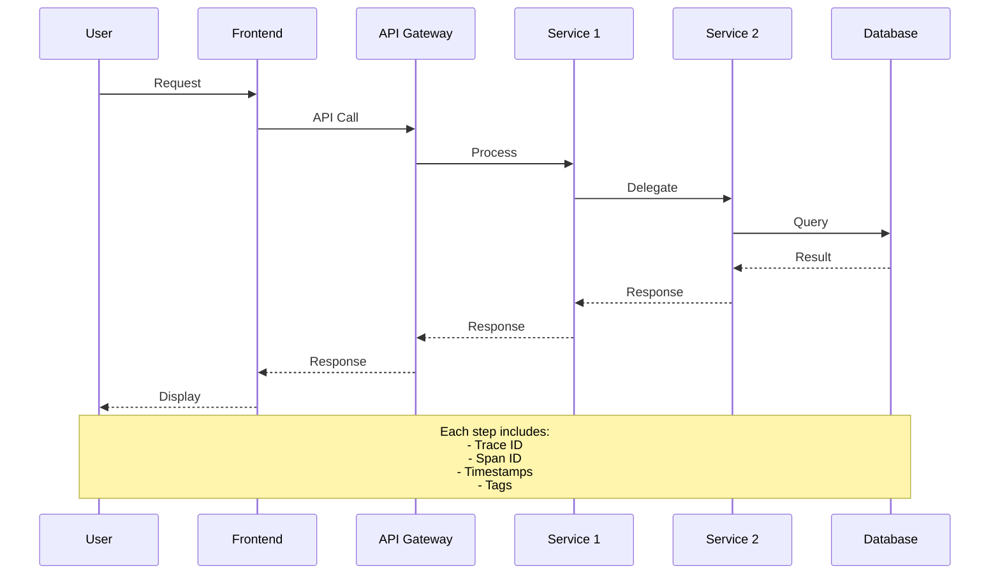
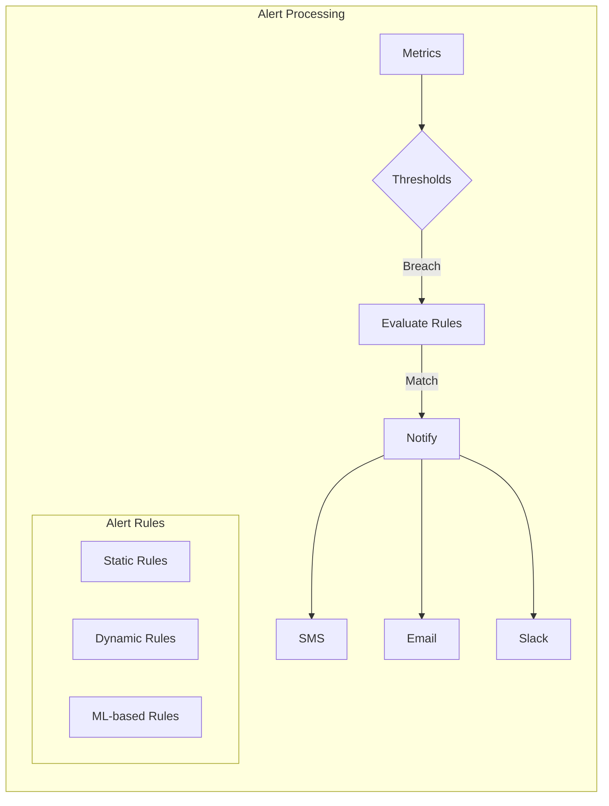
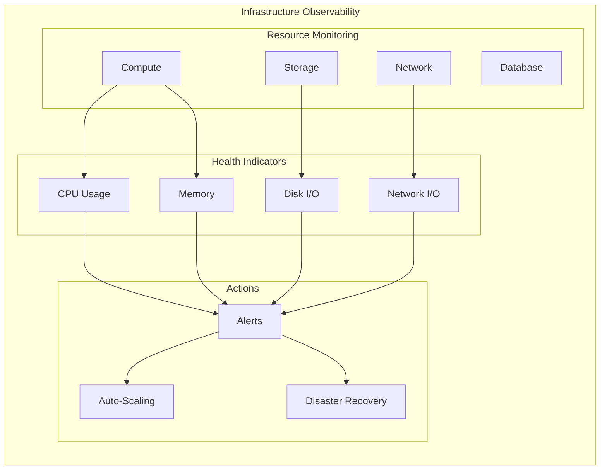
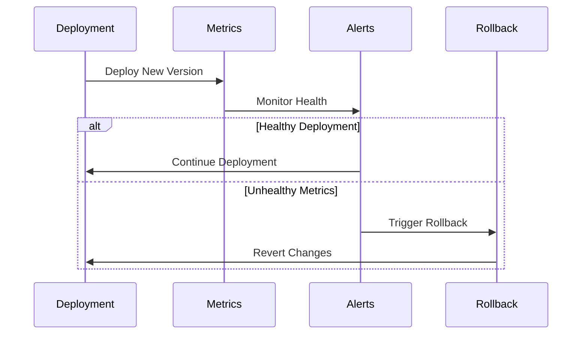
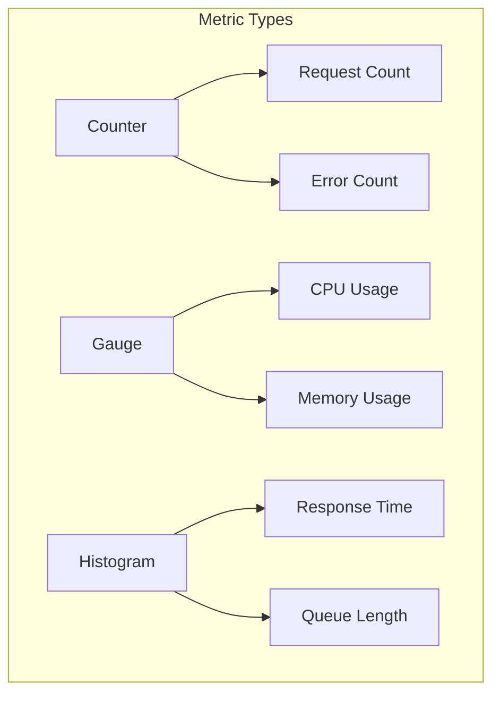
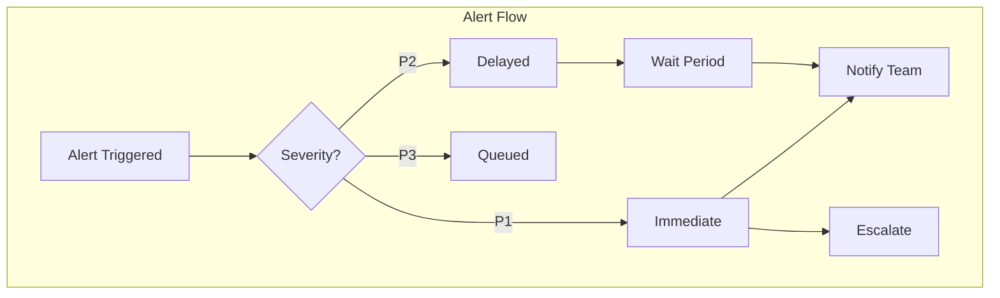

# Monitoring and Observability Patterns



## Observability Pillars and Patterns

### 1. Metrics Patterns
- Golden Signals (Latency, Traffic, Errors, Saturation)
- USE Method (Utilization, Saturation, Errors)
- RED Method (Rate, Errors, Duration)
- Custom Business Metrics

### 2. Logging Patterns
- Structured Logging
- Correlation Pattern
- Audit Trail Pattern
- Event Sourcing Logs

### 3. Tracing Patterns
- Distributed Context
- Span Correlation
- Sampling Strategies
- Error Tracking

## Monitoring Stack Components



## Design Patterns

### 1. Collection Patterns
- Push vs Pull Collection
- Agent-based Collection
- Sidecar Pattern
- Aggregation Pattern

### 2. Storage Patterns
- Time Series Storage
- Hot-Warm-Cold Architecture
- Retention Management
- Data Partitioning

### 3. Visualization Patterns
- Dashboard Hierarchy
- Real-time Views
- Correlation Views
- Business Views

## Tracing Flow



## Alerting Patterns



### Alert Pattern Types
1. **Static Threshold**
   - Fixed value monitoring
   - Simple breach detection
   - Clear violation boundaries

2. **Dynamic Threshold**
   - Adaptive baselines
   - Time-based variations
   - Seasonal adjustments

3. **Anomaly Detection**
   - Machine learning based
   - Pattern recognition
   - Behavioral analysis

4. **Composite Alerts**
   - Multiple condition correlation
   - Cross-metric analysis
   - Time-window aggregation

## Monitoring Implementation

## Implementation Examples

### 1. Metrics Collection

```typescript
// Prometheus metrics example
import { Counter, Gauge, Histogram } from 'prom-client';

class MetricsService {
    private requestCounter: Counter;
    private responseTime: Histogram;
    private activeUsers: Gauge;

    constructor() {
        // Track total requests
        this.requestCounter = new Counter({
            name: 'app_requests_total',
            help: 'Total number of requests',
            labelNames: ['method', 'endpoint', 'status']
        });

        // Track response time distribution
        this.responseTime = new Histogram({
            name: 'app_response_time_seconds',
            help: 'Response time in seconds',
            buckets: [0.1, 0.5, 1, 2, 5]
        });

        // Track current active users
        this.activeUsers = new Gauge({
            name: 'app_active_users',
            help: 'Number of currently active users'
        });
    }

    recordRequest(method: string, endpoint: string, status: number): void {
        this.requestCounter.labels(method, endpoint, status.toString()).inc();
    }
}
```

### 2. Distributed Tracing

```typescript
// OpenTelemetry tracing example
import { trace, context } from '@opentelemetry/api';

class OrderService {
    async processOrder(orderId: string): Promise<void> {
        const span = trace.getTracer('order-service')
            .startSpan('process-order', {
                attributes: { orderId }
            });

        try {
            await context.with(trace.setSpan(context.active(), span), async () => {
                await this.validateOrder(orderId);
                await this.processPayment(orderId);
                await this.updateInventory(orderId);
            });
        } finally {
            span.end();
        }
    }
}
```

### 3. Logging Pattern

```typescript
// Structured logging example
interface LogContext {
    requestId: string;
    userId?: string;
    service: string;
    environment: string;
}

class Logger {
    constructor(private context: LogContext) {}

    info(message: string, data?: object): void {
        this.log('INFO', message, data);
    }

    error(message: string, error?: Error, data?: object): void {
        this.log('ERROR', message, {
            ...data,
            errorMessage: error?.message,
            stackTrace: error?.stack
        });
    }

    private log(level: string, message: string, data?: object): void {
        console.log(JSON.stringify({
            timestamp: new Date().toISOString(),
            level,
            message,
            ...this.context,
            ...data
        }));
    }
}
```

### 4. Health Checks

```typescript
// Health check implementation
interface HealthCheck {
    name: string;
    check(): Promise<HealthStatus>;
}

interface HealthStatus {
    status: 'healthy' | 'degraded' | 'unhealthy';
    details?: object;
}

class DatabaseHealthCheck implements HealthCheck {
    name = 'database';

    async check(): Promise<HealthStatus> {
        try {
            await this.db.query('SELECT 1');
            return { status: 'healthy' };
        } catch (error) {
            return {
                status: 'unhealthy',
                details: { error: error.message }
            };
        }
    }
}
```

## Infrastructure Monitoring



## Deployment Monitoring



## Best Practices

### 1. Metrics Collection
- Use standardized naming conventions
- Include relevant labels/tags
- Choose appropriate metric types
- Set meaningful thresholds



### 2. Logging Strategy
- Use structured logging
- Include correlation IDs
- Define log levels appropriately
- Implement log rotation

### 3. Tracing Configuration
- Sample appropriately
- Add business-relevant tags
- Trace important transactions
- Monitor trace latency

### 4. Alert Design
- Avoid alert fatigue
- Define clear severity levels
- Include runbooks
- Implement escalation policies



### 5. Performance Impact
- Consider overhead
- Implement sampling
- Use async logging
- Buffer and batch metrics

### 6. Storage and Retention
- Define retention policies
- Plan for scaling
- Consider cost implications
- Implement archival strategy

### 7. Resource Monitoring
- Monitor key infrastructure metrics
- Set up capacity planning alerts
- Track resource utilization trends
- Implement cost monitoring

### 8. Deployment Health
- Monitor deployment success rates
- Track rollback frequency
- Measure deployment times
- Monitor configuration changes

### 9. Infrastructure as Code Observability
- Version control monitoring
- Configuration drift detection
- Compliance monitoring
- Security posture tracking

## Observability Maturity Framework

### 1. Collection Maturity
| Level | Description | Characteristics |
|-------|-------------|----------------|
| Basic | Manual collection | Ad-hoc, basic metrics |
| Standard | Automated collection | Structured, consistent |
| Advanced | Intelligent collection | Adaptive, predictive |

### 2. Analysis Maturity
| Level | Description | Characteristics |
|-------|-------------|----------------|
| Basic | Simple threshold | Direct metric analysis |
| Standard | Correlation analysis | Multi-metric correlation |
| Advanced | ML-based analysis | Predictive analytics |

### 3. Response Maturity
| Level | Description | Characteristics |
|-------|-------------|----------------|
| Basic | Manual response | Human intervention |
| Standard | Semi-automated | Guided remediation |
| Advanced | Automated response | Self-healing systems |

## Implementation Checklist

### 1. Infrastructure Setup
- [ ] Metrics collection agents
- [ ] Log aggregation system
- [ ] Tracing infrastructure
- [ ] Data storage solution
- [ ] Visualization platform

### 2. Application Integration
- [ ] Metrics instrumentation
- [ ] Logging framework
- [ ] Tracing implementation
- [ ] Health check endpoints
- [ ] Custom metrics

### 3. Alert Configuration
- [ ] Alert thresholds
- [ ] Notification channels
- [ ] Escalation policies
- [ ] On-call rotations
- [ ] Runbook documentation

### 4. Visualization Setup
- [ ] System dashboards
- [ ] Application dashboards
- [ ] Business dashboards
- [ ] SLA/SLO tracking
- [ ] Capacity planning views

### 5. Operational Procedures
- [ ] Incident response process
- [ ] Alert investigation guides
- [ ] Escalation procedures
- [ ] Recovery playbooks
- [ ] Post-mortem templates

Remember: Effective monitoring and observability require continuous refinement and evolution. Regular reviews and updates ensure the system remains effective as your architecture grows and changes.