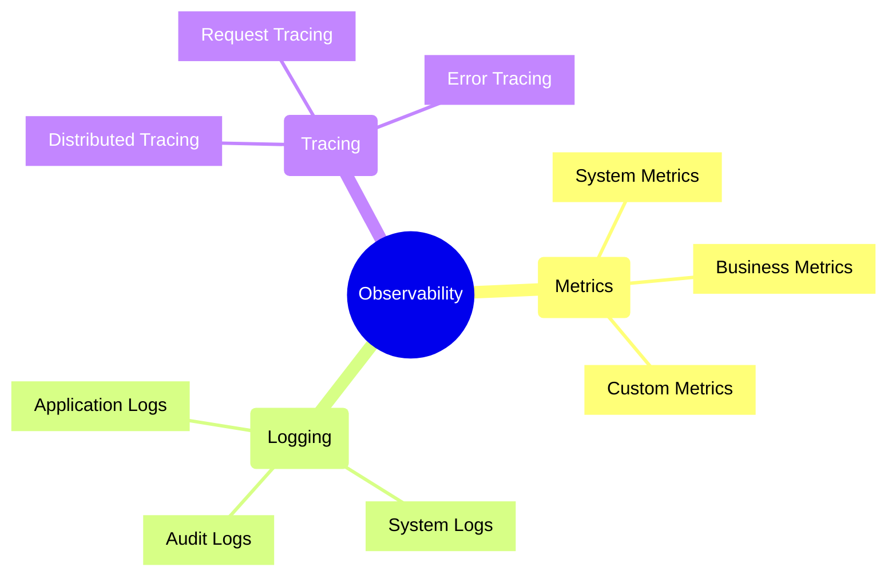
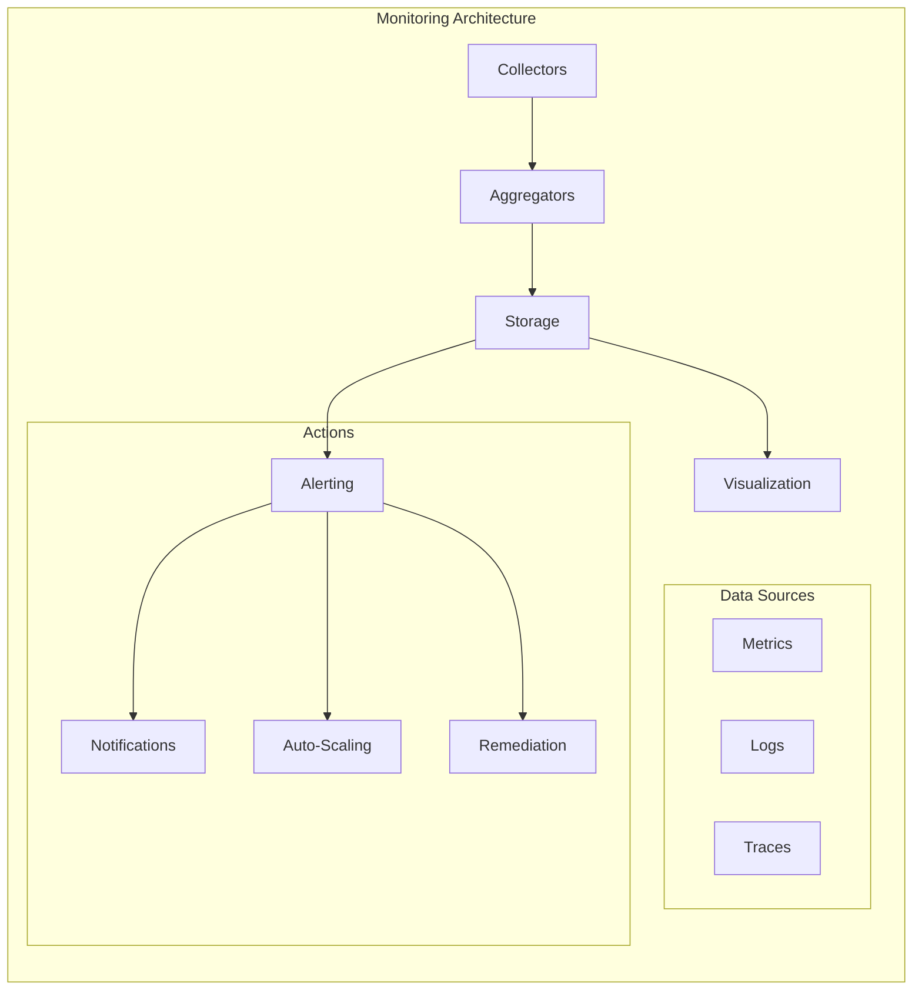
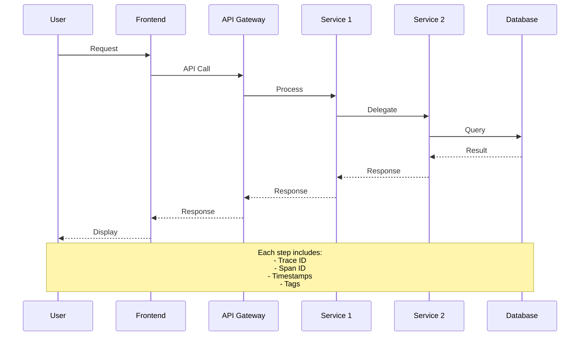
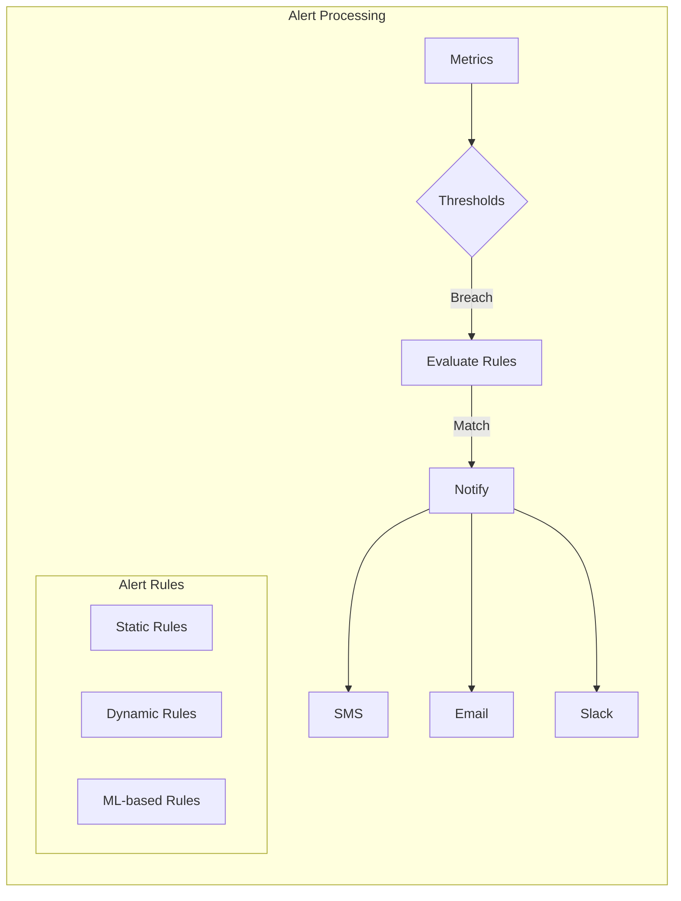
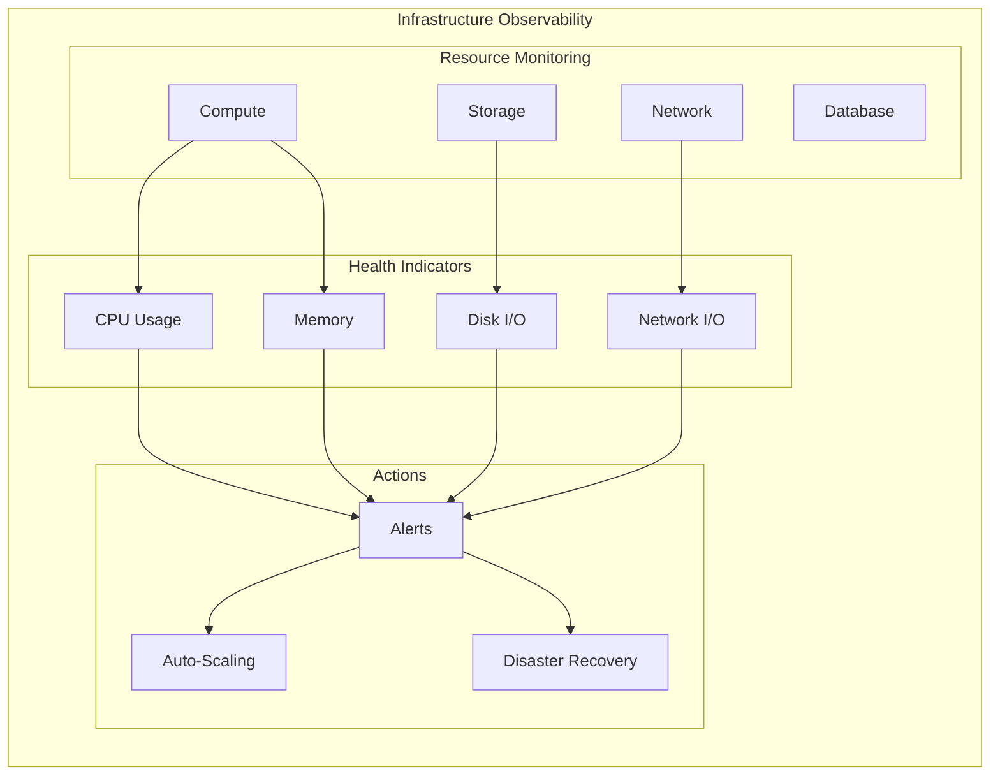
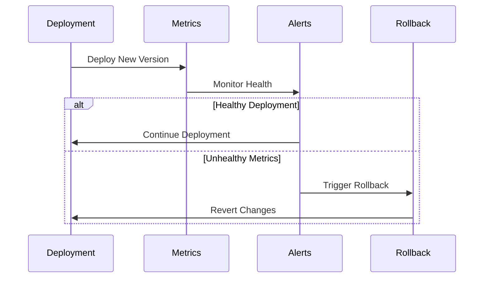
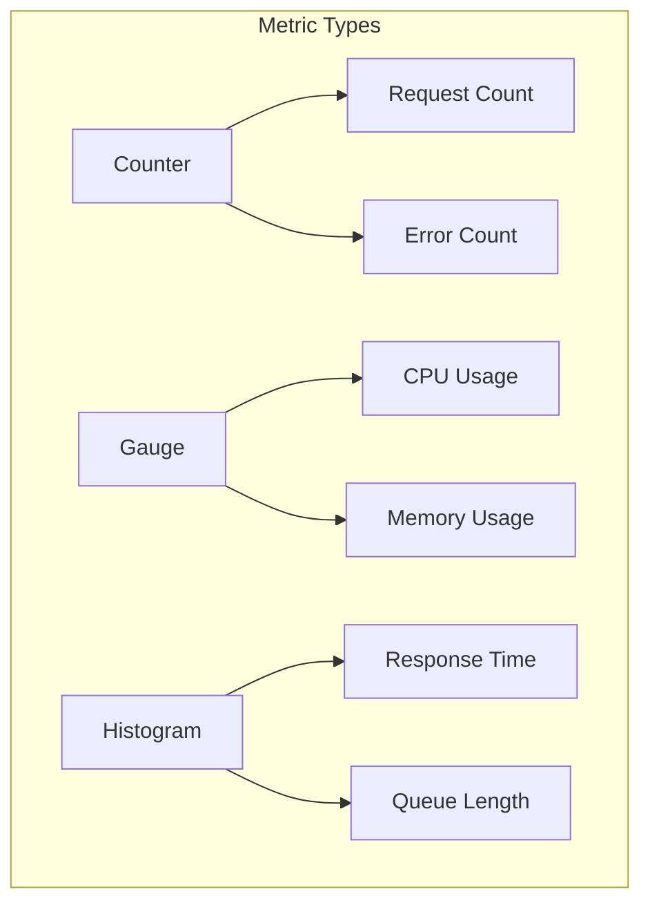
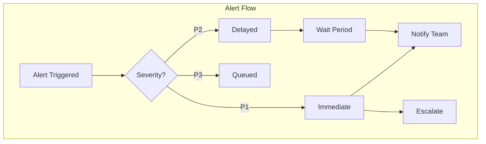
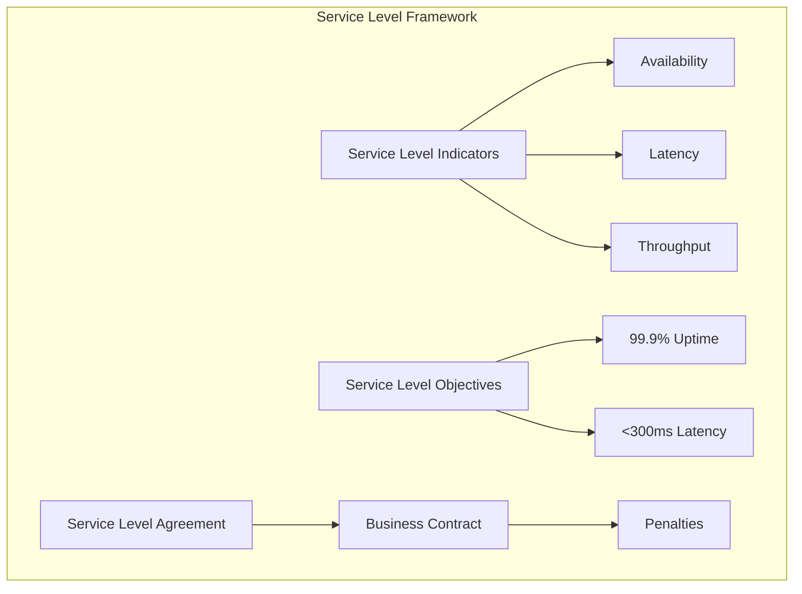
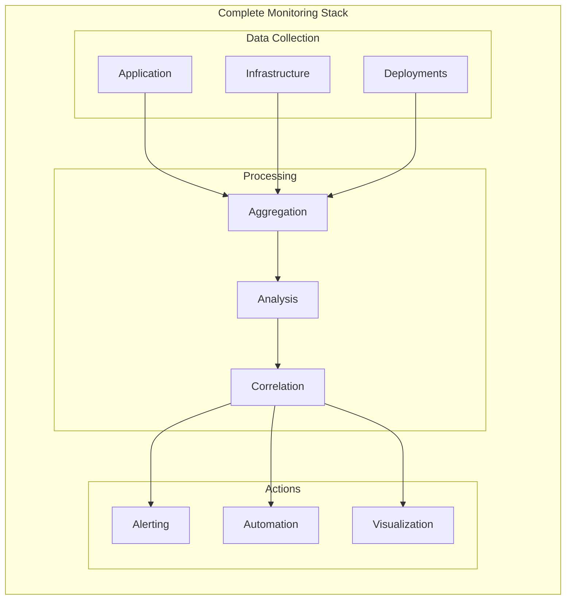

# Monitoring and Observability Patterns



## Monitoring Stack Components



## Tracing Flow



## Alerting Patterns



## Monitoring Implementation

## Implementation Examples

### 1. Metrics Collection

```typescript
// Prometheus metrics example
import { Counter, Gauge, Histogram } from 'prom-client';

class MetricsService {
    private requestCounter: Counter;
    private responseTime: Histogram;
    private activeUsers: Gauge;

    constructor() {
        // Track total requests
        this.requestCounter = new Counter({
            name: 'app_requests_total',
            help: 'Total number of requests',
            labelNames: ['method', 'endpoint', 'status']
        });

        // Track response time distribution
        this.responseTime = new Histogram({
            name: 'app_response_time_seconds',
            help: 'Response time in seconds',
            buckets: [0.1, 0.5, 1, 2, 5]
        });

        // Track current active users
        this.activeUsers = new Gauge({
            name: 'app_active_users',
            help: 'Number of currently active users'
        });
    }

    recordRequest(method: string, endpoint: string, status: number): void {
        this.requestCounter.labels(method, endpoint, status.toString()).inc();
    }
}
```

### 2. Distributed Tracing

```typescript
// OpenTelemetry tracing example
import { trace, context } from '@opentelemetry/api';

class OrderService {
    async processOrder(orderId: string): Promise<void> {
        const span = trace.getTracer('order-service')
            .startSpan('process-order', {
                attributes: { orderId }
            });

        try {
            await context.with(trace.setSpan(context.active(), span), async () => {
                await this.validateOrder(orderId);
                await this.processPayment(orderId);
                await this.updateInventory(orderId);
            });
        } finally {
            span.end();
        }
    }
}
```

### 3. Logging Pattern

```typescript
// Structured logging example
interface LogContext {
    requestId: string;
    userId?: string;
    service: string;
    environment: string;
}

class Logger {
    constructor(private context: LogContext) {}

    info(message: string, data?: object): void {
        this.log('INFO', message, data);
    }

    error(message: string, error?: Error, data?: object): void {
        this.log('ERROR', message, {
            ...data,
            errorMessage: error?.message,
            stackTrace: error?.stack
        });
    }

    private log(level: string, message: string, data?: object): void {
        console.log(JSON.stringify({
            timestamp: new Date().toISOString(),
            level,
            message,
            ...this.context,
            ...data
        }));
    }
}
```

### 4. Health Checks

```typescript
// Health check implementation
interface HealthCheck {
    name: string;
    check(): Promise<HealthStatus>;
}

interface HealthStatus {
    status: 'healthy' | 'degraded' | 'unhealthy';
    details?: object;
}

class DatabaseHealthCheck implements HealthCheck {
    name = 'database';

    async check(): Promise<HealthStatus> {
        try {
            await this.db.query('SELECT 1');
            return { status: 'healthy' };
        } catch (error) {
            return {
                status: 'unhealthy',
                details: { error: error.message }
            };
        }
    }
}
```

## Infrastructure Monitoring



## Deployment Monitoring



## Best Practices

### 1. Metrics Collection
- Use standardized naming conventions
- Include relevant labels/tags
- Choose appropriate metric types
- Set meaningful thresholds



### 2. Logging Strategy
- Use structured logging
- Include correlation IDs
- Define log levels appropriately
- Implement log rotation

### 3. Tracing Configuration
- Sample appropriately
- Add business-relevant tags
- Trace important transactions
- Monitor trace latency

### 4. Alert Design
- Avoid alert fatigue
- Define clear severity levels
- Include runbooks
- Implement escalation policies



### 5. Performance Impact
- Consider overhead
- Implement sampling
- Use async logging
- Buffer and batch metrics

### 6. Storage and Retention
- Define retention policies
- Plan for scaling
- Consider cost implications
- Implement archival strategy

### 7. Resource Monitoring
- Monitor key infrastructure metrics
- Set up capacity planning alerts
- Track resource utilization trends
- Implement cost monitoring

### 8. Deployment Health
- Monitor deployment success rates
- Track rollback frequency
- Measure deployment times
- Monitor configuration changes

### 9. Infrastructure as Code Observability
- Version control monitoring
- Configuration drift detection
- Compliance monitoring
- Security posture tracking

## Infrastructure Metrics Implementation

```typescript
// Infrastructure metrics collection
interface InfrastructureMetrics {
    cpu: {
        usage: number;
        cores: number;
    };
    memory: {
        total: number;
        used: number;
        free: number;
    };
    disk: {
        read_ops: number;
        write_ops: number;
        latency: number;
    };
    network: {
        ingress_bytes: number;
        egress_bytes: number;
        latency: number;
    };
}

class InfrastructureMonitor {
    private metricsClient: MetricsClient;
    
    constructor(metricsClient: MetricsClient) {
        this.metricsClient = metricsClient;
    }
    
    async collectMetrics(): Promise<InfrastructureMetrics> {
        const metrics = await Promise.all([
            this.collectCPUMetrics(),
            this.collectMemoryMetrics(),
            this.collectDiskMetrics(),
            this.collectNetworkMetrics()
        ]);
        
        return {
            cpu: metrics[0],
            memory: metrics[1],
            disk: metrics[2],
            network: metrics[3]
        };
    }
    
    private async evaluateHealth(
        metrics: InfrastructureMetrics
    ): Promise<HealthStatus> {
        // Evaluate against thresholds
        const cpuHealth = metrics.cpu.usage < 80;
        const memoryHealth = metrics.memory.free > 
            0.2 * metrics.memory.total;
        const diskHealth = metrics.disk.latency < 100;
        
        return {
            healthy: cpuHealth && memoryHealth && diskHealth,
            components: {
                cpu: cpuHealth ? 'healthy' : 'degraded',
                memory: memoryHealth ? 'healthy' : 'degraded',
                disk: diskHealth ? 'healthy' : 'degraded'
            }
        };
    }
}
```

### Deployment Observability Implementation

```typescript
interface DeploymentMetrics {
    version: string;
    timestamp: Date;
    duration: number;
    status: 'success' | 'failure' | 'rolling-back';
    healthChecks: {
        name: string;
        status: 'pass' | 'fail';
        duration: number;
    }[];
}

class DeploymentMonitor {
    private deploymentHistory: DeploymentMetrics[] = [];
    
    async trackDeployment(
        version: string,
        healthChecks: () => Promise<boolean>
    ): Promise<void> {
        const startTime = Date.now();
        const metrics: DeploymentMetrics = {
            version,
            timestamp: new Date(),
            duration: 0,
            status: 'success',
            healthChecks: []
        };
        
        try {
            // Run health checks
            const healthy = await healthChecks();
            if (!healthy) {
                metrics.status = 'rolling-back';
                await this.rollback(version);
            }
        } catch (error) {
            metrics.status = 'failure';
            throw error;
        } finally {
            metrics.duration = Date.now() - startTime;
            this.deploymentHistory.push(metrics);
        }
    }
}
```

## SLI/SLO Framework



## End-to-End Monitoring Strategy



## Monitoring Maturity Model

1. **Level 1: Basic Monitoring**
   - System uptime
   - Basic metrics
   - Simple alerts

2. **Level 2: Detailed Metrics**
   - Application metrics
   - Log aggregation
   - Alert rules

3. **Level 3: Service-Level Monitoring**
   - SLI/SLO tracking
   - Business metrics
   - Automated responses

4. **Level 4: Predictive Monitoring**
   - Trend analysis
   - Anomaly detection
   - Capacity planning

5. **Level 5: AIOps**
   - Machine learning
   - Automated remediation
   - Predictive maintenance

## Implementation Checklist

- [ ] Set up metrics collection
- [ ] Configure log aggregation
- [ ] Implement distributed tracing
- [ ] Define alerting rules
- [ ] Create dashboards
- [ ] Document runbooks
- [ ] Define escalation procedures
- [ ] Test monitoring system
- [ ] Review and update alerts
- [ ] Train team members

Remember: Effective monitoring and observability are critical for maintaining system reliability and performance. Regular review and updates of monitoring strategies ensure they remain effective as systems evolve.