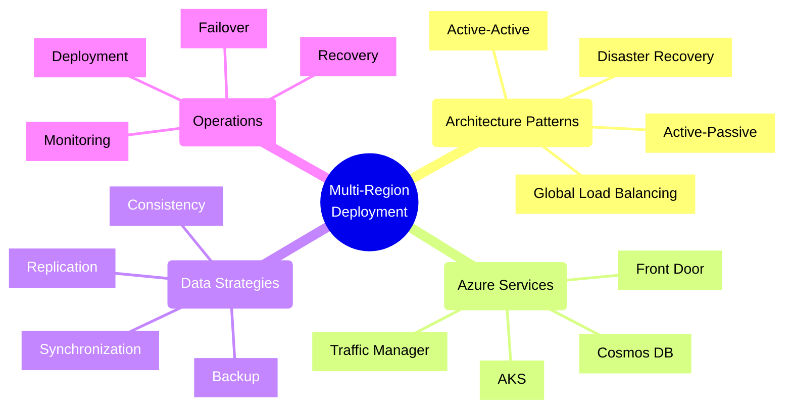
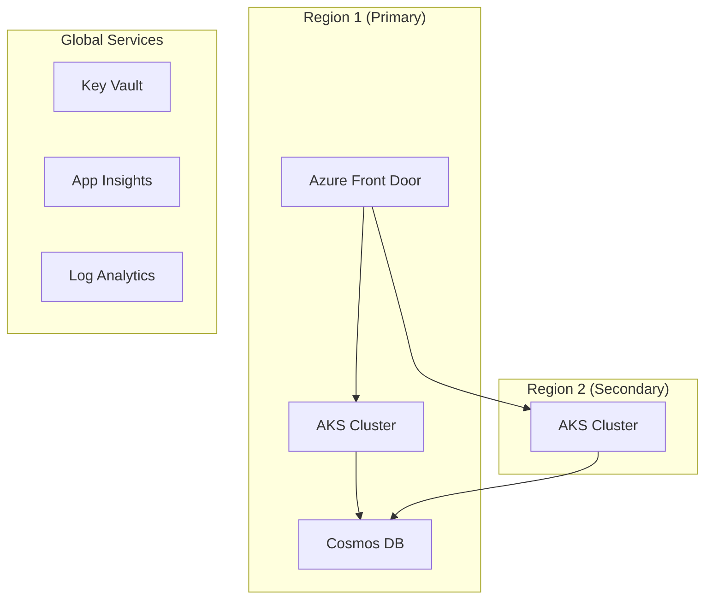
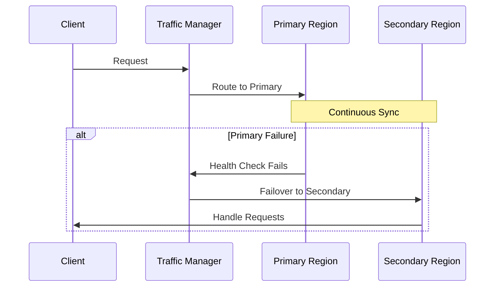
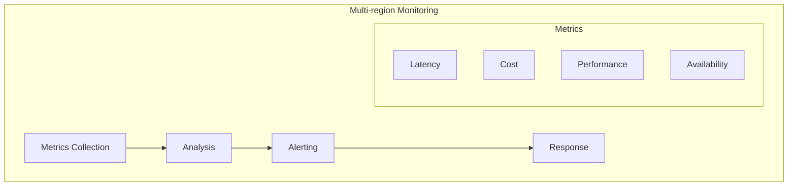

# Multi-region Deployment Strategies

## Overview



## Core Deployment Patterns

### 1. Active-Active Pattern



#### Key Characteristics
- Both regions actively serve traffic
- Automatic load balancing
- Higher availability
- Better resource utilization
- Higher operational cost

### 2. Active-Passive Pattern



#### Key Characteristics
- Secondary region on standby
- Lower operational cost
- Simpler configuration
- Longer recovery time
- Resource underutilization

## Azure Implementation Strategy

### 1. Traffic Management

```typescript
// Example: Configuring Azure Front Door
const frontDoorProfile = {
    name: 'global-app-frontend',
    sku: {
        name: 'Premium_AzureFrontDoor'
    },
    endpoints: [{
        name: 'primary-endpoint',
        routingRules: [{
            patterns: ['/*'],
            acceptedProtocols: ['Http', 'Https'],
            routeConfiguration: {
                '@type': 'Microsoft.Azure.FrontDoor.Models.FrontDoorForwardingConfiguration',
                backendPool: {
                    name: 'multi-region-pool',
                    backends: [{
                        address: 'app-eastus.azurewebsites.net',
                        weight: 50,
                        priority: 1
                    }, {
                        address: 'app-westus.azurewebsites.net',
                        weight: 50,
                        priority: 1
                    }]
                }
            }
        }]
    }]
};
```

### 2. Data Replication

```typescript
// Example: Configuring Cosmos DB Multi-region
const cosmosDbAccount = {
    name: 'global-data-store',
    locations: [{
        locationName: 'East US',
        failoverPriority: 0,
        isZoneRedundant: true
    }, {
        locationName: 'West US',
        failoverPriority: 1,
        isZoneRedundant: true
    }],
    consistencyPolicy: {
        defaultConsistencyLevel: 'BoundedStaleness',
        maxStalenessPrefix: 100000,
        maxIntervalInSeconds: 300
    }
};
```

## Implementation Checklist

### Design Phase
- [ ] Define region selection criteria
- [ ] Choose deployment pattern (Active-Active/Active-Passive)
- [ ] Design data replication strategy
- [ ] Plan network topology
- [ ] Define failover process
- [ ] Design monitoring approach

### Development Phase
- [ ] Implement service discovery
- [ ] Configure load balancing
- [ ] Set up data replication
- [ ] Implement health checks
- [ ] Configure logging across regions
- [ ] Implement retry logic

### Operations Phase
- [ ] Monitor regional health
- [ ] Test failover procedures
- [ ] Maintain configuration sync
- [ ] Monitor latency
- [ ] Track costs per region
- [ ] Regular DR drills

## Azure Services for Multi-region

### 1. Load Balancing Options
- **Azure Front Door**
  - Global load balancing
  - SSL offloading
  - WAF capabilities
  - Session affinity

- **Traffic Manager**
  - DNS-based routing
  - Multiple routing methods
  - Endpoint monitoring
  - Nested profiles

### 2. Data Services
- **Cosmos DB**
  - Multi-region writes
  - Automatic failover
  - Consistency options
  - Global distribution

- **Azure SQL**
  - Auto-failover groups
  - Read replicas
  - Geo-replication
  - Business continuity

## Best Practices

### 1. Region Selection
- Consider data sovereignty
- Evaluate latency requirements
- Analyze cost implications
- Check service availability
- Consider compliance needs

### 2. Data Management
- Use appropriate consistency levels
- Implement proper caching
- Monitor replication lag
- Handle conflict resolution
- Regular backup testing

### 3. Operational Excellence
- Implement proper monitoring
- Automate deployments
- Regular failover testing
- Document procedures
- Train operations team

## Cost Optimization Strategies

| Strategy | Description | Trade-offs |
|----------|-------------|------------|
| Reserved Instances | Pre-purchase capacity | Less flexibility |
| Auto-scaling | Dynamic resource adjustment | Configuration complexity |
| Traffic Shifting | Route based on cost | Potential latency impact |
| Resource Right-sizing | Optimize resource allocation | Regular monitoring needed |

## Monitoring Framework



## Disaster Recovery

### 1. Recovery Strategies
- Active-Active failover
- Active-Passive failover
- Pilot light
- Data backup and restore

### 2. RTO/RPO Considerations
- Define acceptable data loss
- Set recovery time objectives
- Plan backup strategies
- Test recovery procedures

Remember:
- Start with clear business requirements
- Consider compliance needs
- Plan for failure
- Test regularly
- Monitor continuously
- Document everything
- Keep procedures updated