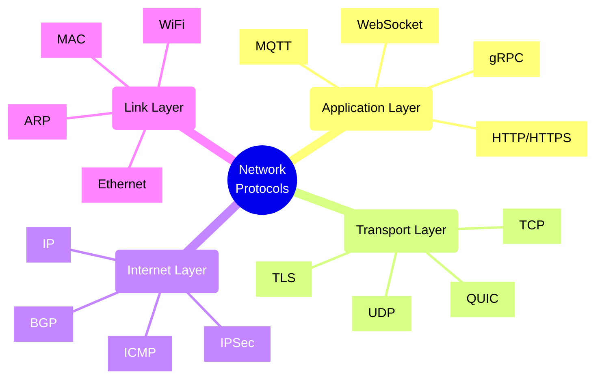
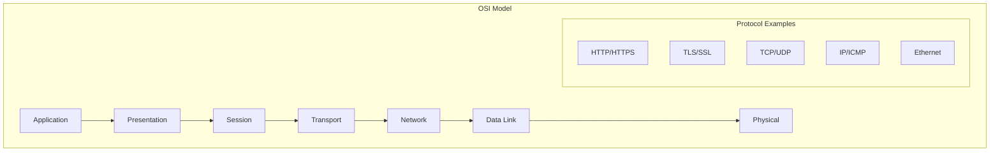
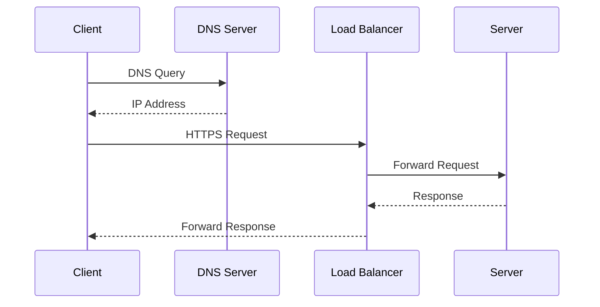
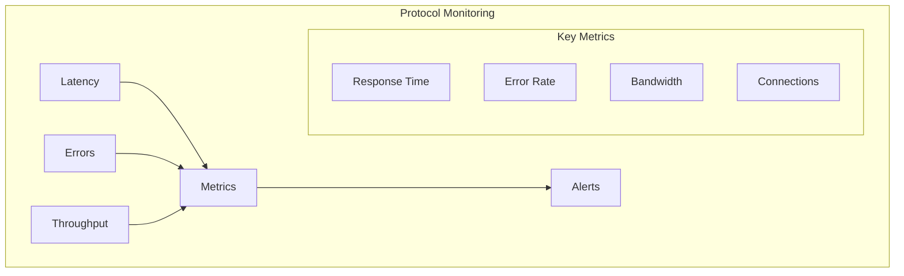

# Network Protocols

## Core Concepts Overview



## Protocol Stack Architecture

### 1. OSI Model Implementation



### 2. Request-Response Flow



## Implementation Examples

### 1. HTTP/HTTPS Usage
```typescript
// Example: HTTP Client with Retry and Circuit Breaker
class HttpClient {
    constructor(
        private baseUrl: string,
        private maxRetries: number = 3,
        private circuitBreaker: CircuitBreaker
    ) {}
    
    async get<T>(path: string, options: RequestOptions = {}): Promise<T> {
        let attempts = 0;
        
        while (attempts < this.maxRetries) {
            try {
                // Check circuit breaker
                if (!this.circuitBreaker.isOpen()) {
                    const response = await fetch(`${this.baseUrl}${path}`, {
                        ...options,
                        headers: {
                            'Content-Type': 'application/json',
                            ...options.headers
                        }
                    });
                    
                    if (!response.ok) {
                        throw new HttpError(response.statusText, response.status);
                    }
                    
                    return await response.json();
                }
                
                throw new CircuitBreakerError('Circuit breaker is open');
            } catch (error) {
                attempts++;
                if (attempts === this.maxRetries) {
                    throw error;
                }
                
                // Exponential backoff
                await delay(Math.pow(2, attempts) * 100);
            }
        }
        
        throw new Error('Request failed after retries');
    }
}
```

### 2. WebSocket Implementation
```typescript
// Example: WebSocket Server with Heartbeat
class WebSocketServer {
    private wss: WebSocket.Server;
    private clients: Map<string, WebSocket> = new Map();
    
    constructor(port: number) {
        this.wss = new WebSocket.Server({ port });
        this.setupHeartbeat();
    }
    
    private setupHeartbeat(): void {
        setInterval(() => {
            this.clients.forEach((ws, id) => {
                if (!ws.isAlive) {
                    ws.terminate();
                    this.clients.delete(id);
                    return;
                }
                
                ws.isAlive = false;
                ws.ping();
            });
        }, 30000);
    }
    
    private handleConnection(ws: WebSocket): void {
        const id = uuid();
        ws.isAlive = true;
        
        ws.on('pong', () => {
            ws.isAlive = true;
        });
        
        ws.on('message', (message: string) => {
            // Handle message
            this.broadcast(message, id);
        });
        
        this.clients.set(id, ws);
    }
    
    private broadcast(message: string, senderId: string): void {
        this.clients.forEach((client, id) => {
            if (id !== senderId && client.readyState === WebSocket.OPEN) {
                client.send(message);
            }
        });
    }
}
```

## Protocol Selection Guide

### 1. Communication Patterns
- Request-Response: HTTP/HTTPS
- Real-time: WebSocket
- Streaming: gRPC
- Pub/Sub: MQTT
- Low-latency: UDP
- Reliable: TCP

### 2. Protocol Characteristics
- **HTTP/HTTPS**
  - RESTful communication
  - Stateless
  - Text-based
  - Secure (with TLS)

- **WebSocket**
  - Bi-directional
  - Persistent connection
  - Low overhead
  - Real-time updates

- **gRPC**
  - Binary protocol
  - Strong typing
  - Code generation
  - Streaming support

## Implementation Checklist

### Design Phase
- [ ] Identify communication patterns
- [ ] Choose protocols
- [ ] Plan security measures
- [ ] Define message formats
- [ ] Consider performance needs
- [ ] Plan error handling

### Development Phase
- [ ] Implement protocol handlers
- [ ] Set up security
- [ ] Add monitoring
- [ ] Implement retry logic
- [ ] Handle timeouts
- [ ] Add logging

### Operations Phase
- [ ] Monitor performance
- [ ] Track errors
- [ ] Optimize settings
- [ ] Update certificates
- [ ] Regular testing
- [ ] Performance tuning

## Best Practices

### 1. Security
- Use TLS 1.3+
- Implement authentication
- Enable CORS properly
- Use strong ciphers
- Regular updates

### 2. Performance
- Connection pooling
- Keep-alive
- Compression
- Caching
- Load balancing

### 3. Reliability
- Retry mechanisms
- Circuit breakers
- Timeouts
- Health checks
- Fallback strategies

## Protocol Comparison

| Protocol | Use Case | Pros | Cons |
|----------|----------|------|------|
| HTTP/HTTPS | API Communication | Universal, Simple | Higher overhead |
| WebSocket | Real-time Updates | Bi-directional, Low latency | Connection management |
| gRPC | Microservices | Efficient, Type-safe | Learning curve |
| MQTT | IoT Communication | Lightweight, Scalable | Limited patterns |

## Monitoring Framework



## Common Protocol Patterns

### 1. Request-Response
- HTTP REST APIs
- GraphQL queries
- RPC calls
- Database queries

### 2. Streaming
- gRPC streams
- WebSocket feeds
- Server-sent events
- Video streaming

### 3. Messaging
- Message queues
- Pub/Sub systems
- Event streaming
- Push notifications

Remember:
- Choose appropriate protocols
- Implement proper security
- Monitor performance
- Handle errors gracefully
- Document patterns
- Test thoroughly
- Keep up with standards