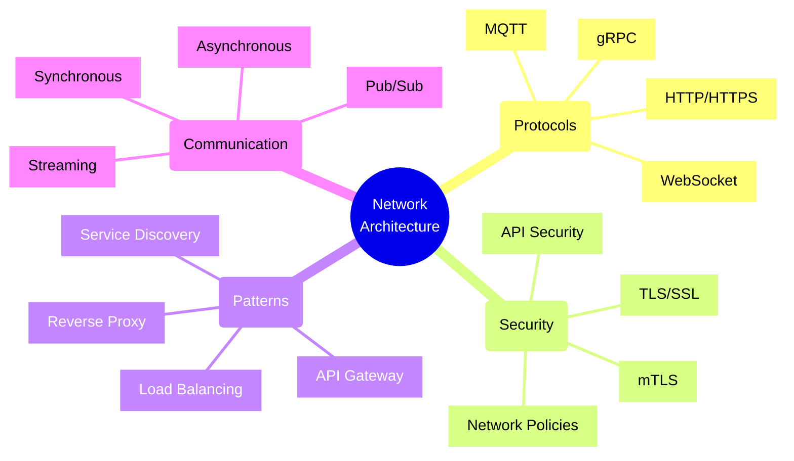
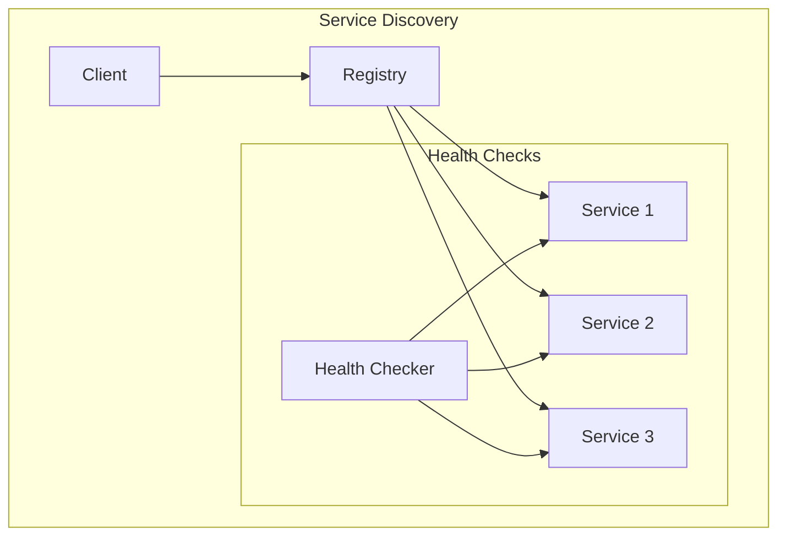
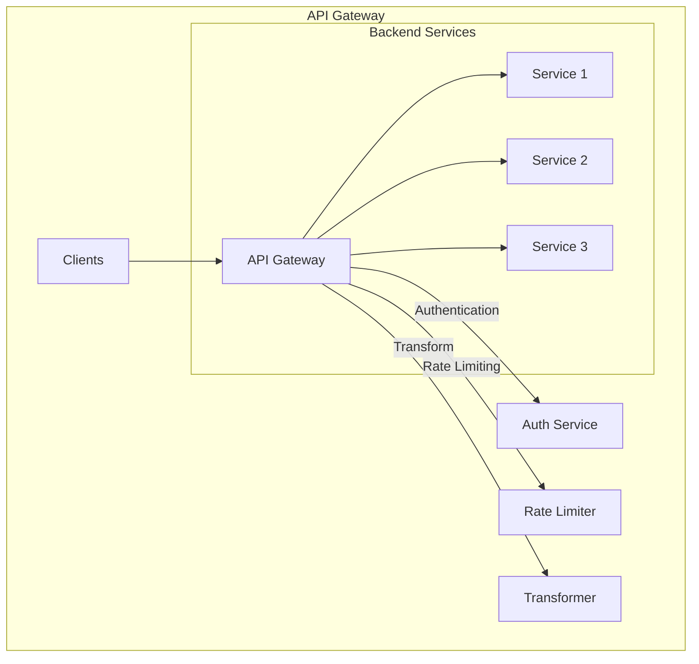

# Network and Protocol Design Patterns



## Protocol Selection Guide

### 1. HTTP/REST
Best for:
- Public APIs
- CRUD operations
- Broad client compatibility
- Caching requirements

Example Implementation:
```typescript
// Express.js REST API with middleware
import express from 'express';
import rateLimit from 'express-rate-limit';
import helmet from 'helmet';

const app = express();

// Security middleware
app.use(helmet());

// Rate limiting
const limiter = rateLimit({
    windowMs: 15 * 60 * 1000, // 15 minutes
    max: 100 // limit each IP to 100 requests per windowMs
});
app.use(limiter);

// CORS configuration
app.use(cors({
    origin: ['https://trusted-origin.com'],
    methods: ['GET', 'POST', 'PUT', 'DELETE'],
    allowedHeaders: ['Content-Type', 'Authorization']
}));

// API endpoints
app.get('/api/resources', async (req, res) => {
    try {
        const resources = await fetchResources();
        res.json(resources);
    } catch (error) {
        res.status(500).json({ error: 'Internal server error' });
    }
});
```

### 2. WebSocket
Best for:
- Real-time bidirectional communication
- Chat applications
- Live dashboards
- Gaming

Example Implementation:
```typescript
// WebSocket server with heartbeat
import { WebSocketServer } from 'ws';

const wss = new WebSocketServer({ port: 8080 });

wss.on('connection', (ws) => {
    ws.isAlive = true;

    ws.on('pong', () => {
        ws.isAlive = true;
    });

    ws.on('message', (data) => {
        // Broadcast to all clients
        wss.clients.forEach((client) => {
            if (client !== ws && client.readyState === WebSocket.OPEN) {
                client.send(data);
            }
        });
    });
});

// Implement heartbeat
const interval = setInterval(() => {
    wss.clients.forEach((ws) => {
        if (ws.isAlive === false) return ws.terminate();
        
        ws.isAlive = false;
        ws.ping();
    });
}, 30000);
```

### 3. gRPC
Best for:
- Microservices communication
- High-performance requirements
- Strong typing needs
- Streaming data

Example Implementation:
```protobuf
// user.proto
syntax = "proto3";

service UserService {
    rpc GetUser (UserRequest) returns (UserResponse) {}
    rpc StreamUpdates (UserRequest) returns (stream UserUpdate) {}
}

message UserRequest {
    string user_id = 1;
}

message UserResponse {
    string user_id = 1;
    string name = 2;
    string email = 3;
}

message UserUpdate {
    string user_id = 1;
    string field_name = 2;
    string new_value = 3;
}
```

## Network Patterns

### 1. Service Discovery Pattern



Implementation Example (using Consul):
```typescript
// Service registration
const consul = new Consul();

const serviceId = 'service-1';
await consul.agent.service.register({
    id: serviceId,
    name: 'my-service',
    address: '127.0.0.1',
    port: 3000,
    check: {
        http: 'http://localhost:3000/health',
        interval: '10s'
    }
});

// Service discovery
const services = await consul.catalog.service.nodes('my-service');
const serviceUrls = services.map(service => 
    `http://${service.ServiceAddress}:${service.ServicePort}`
);
```

### 2. API Gateway Pattern



Implementation Example (using Node.js):
```typescript
// API Gateway with routing and middleware
import express from 'express';
import proxy from 'express-http-proxy';
import jwt from 'express-jwt';

const app = express();

// Authentication middleware
const authenticate = jwt({
    secret: process.env.JWT_SECRET,
    algorithms: ['HS256']
});

// Rate limiting per service
const createServiceLimiter = (windowMs: number, max: number) => 
    rateLimit({ windowMs, max });

// Service routes with different policies
app.use('/users', 
    authenticate,
    createServiceLimiter(15 * 60 * 1000, 100),
    proxy('http://user-service:3001')
);

app.use('/orders',
    authenticate,
    createServiceLimiter(15 * 60 * 1000, 50),
    proxy('http://order-service:3002')
);

// Circuit breaker for services
const circuitBreaker = new CircuitBreaker({
    failureThreshold: 5,
    resetTimeout: 60000
});

app.use('/payments',
    authenticate,
    async (req, res, next) => {
        try {
            await circuitBreaker.execute(() => 
                proxy('http://payment-service:3003')(req, res, next)
            );
        } catch (error) {
            res.status(503).json({ error: 'Service temporarily unavailable' });
        }
    }
);
```

## Security Considerations

### 1. TLS/SSL Configuration
```typescript
// HTTPS server with modern TLS configuration
const https = require('https');
const fs = require('fs');

const options = {
    key: fs.readFileSync('private-key.pem'),
    cert: fs.readFileSync('certificate.pem'),
    ciphers: [
        'TLS_AES_128_GCM_SHA256',
        'TLS_AES_256_GCM_SHA384',
        'TLS_CHACHA20_POLY1305_SHA256'
    ].join(':'),
    minVersion: 'TLSv1.2',
    preferServerCiphers: true
};

https.createServer(options, app).listen(443);
```

### 2. Network Policies
```yaml
# Kubernetes Network Policy example
apiVersion: networking.k8s.io/v1
kind: NetworkPolicy
metadata:
  name: api-network-policy
spec:
  podSelector:
    matchLabels:
      app: api
  policyTypes:
    - Ingress
    - Egress
  ingress:
    - from:
        - podSelector:
            matchLabels:
              type: frontend
        - namespaceSelector:
            matchLabels:
              purpose: monitoring
      ports:
        - protocol: TCP
          port: 80
  egress:
    - to:
        - podSelector:
            matchLabels:
              app: database
      ports:
        - protocol: TCP
          port: 5432
```

## Best Practices

1. **Protocol Selection**
   - Choose based on requirements (latency, throughput, compatibility)
   - Consider client platform support
   - Evaluate tooling ecosystem
   - Account for security needs

2. **Network Security**
   - Implement defense in depth
   - Use TLS 1.2+ everywhere
   - Apply principle of least privilege
   - Regular security audits

3. **Performance Optimization**
   - Implement caching strategies
   - Use compression
   - Enable HTTP/2 where possible
   - Monitor network metrics

4. **Error Handling**
   - Implement retry policies
   - Use circuit breakers
   - Proper error status codes
   - Detailed error logging

Remember: Network design decisions have significant impact on system scalability, security, and maintainability. Always consider future growth and security implications when designing network architectures.