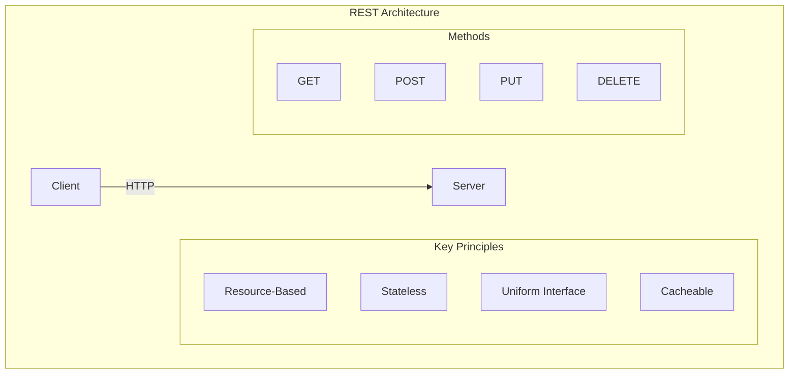
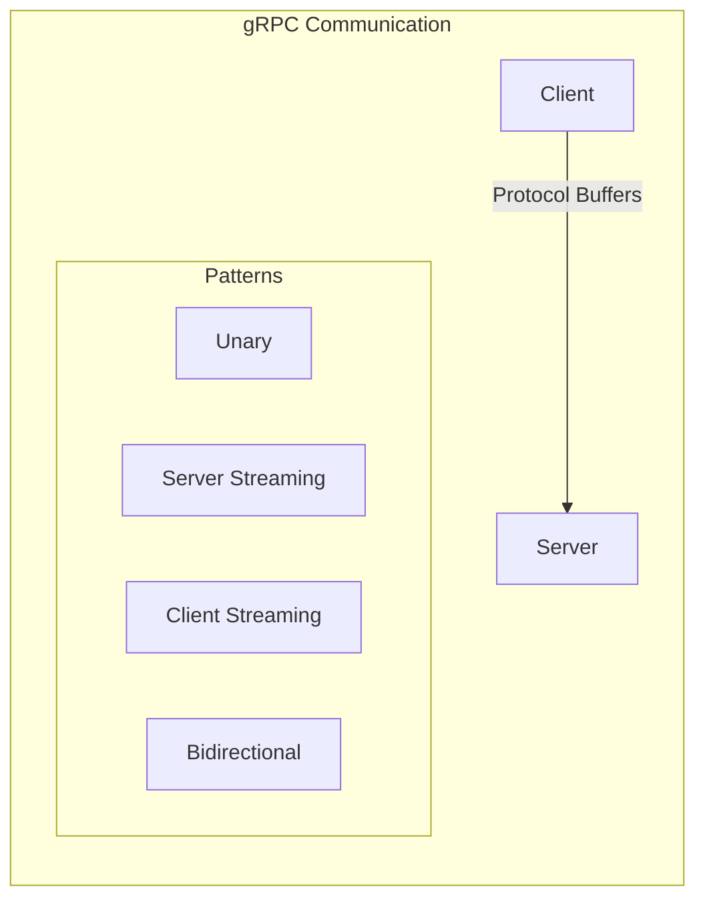
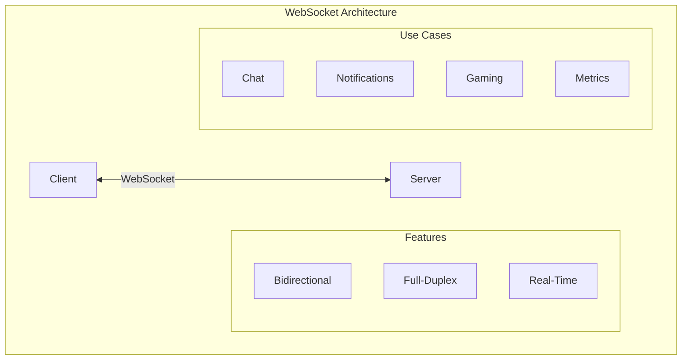
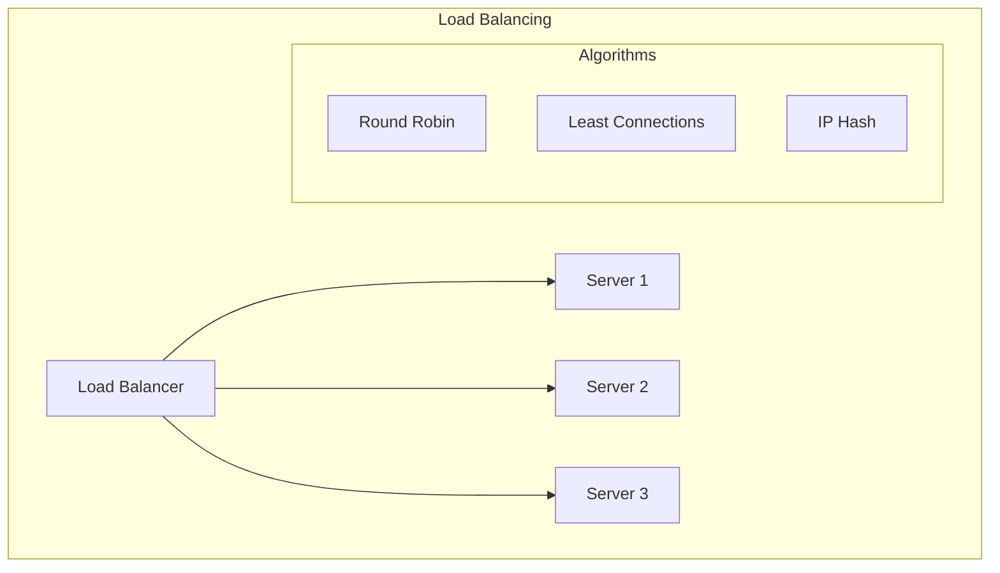
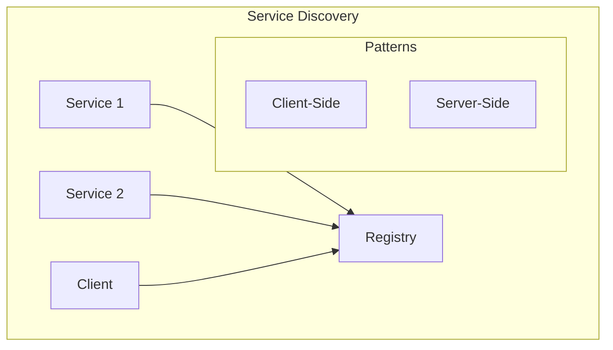
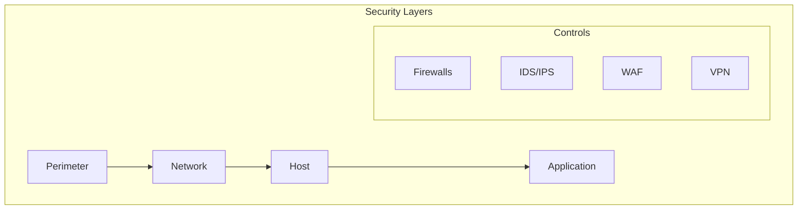
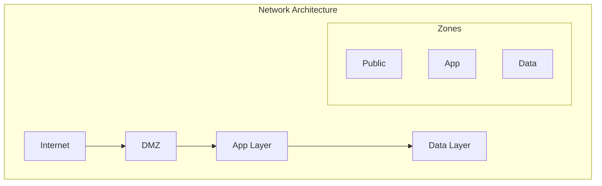

# Network and Protocol Design

## Protocol Design Patterns

### 1. RESTful Protocol Design

#### Design Principles
1. **Resource Identification**
   - URI structure
   - Resource naming
   - Relationship modeling
   - Version strategy

2. **Method Selection**
   - GET (Read)
   - POST (Create)
   - PUT (Update)
   - DELETE (Remove)
   - PATCH (Partial)

3. **Status Codes**
   - 2xx (Success)
   - 3xx (Redirection)
   - 4xx (Client Error)
   - 5xx (Server Error)

### 2. gRPC Protocol Design

#### Communication Patterns
1. **Unary RPC**
   - Single request
   - Single response
   - Traditional RPC

2. **Server Streaming**
   - Single request
   - Multiple responses
   - Real-time updates

3. **Client Streaming**
   - Multiple requests
   - Single response
   - Upload scenarios

4. **Bidirectional**
   - Multiple requests
   - Multiple responses
   - Chat/Gaming

### 3. WebSocket Protocol Design

#### Protocol Features
1. **Connection Setup**
   - HTTP upgrade
   - Handshake process
   - Protocol switch
   - Connection maintain

2. **Message Types**
   - Text frames
   - Binary frames
   - Control frames
   - Continuation frames

3. **Connection Management**
   - Heartbeat
   - Ping/Pong
   - Close frames
   - Error handling

## Network Design Patterns

### 1. Load Balancing

#### Algorithm Selection
| Algorithm | Use Case | Pros | Cons |
|-----------|----------|------|------|
| Round Robin | General Purpose | Simple | No State Awareness |
| Least Connections | Dynamic Loads | Better Balance | More Complex |
| IP Hash | Session Affinity | Consistent | Possible Imbalance |

### 2. Service Discovery

#### Discovery Methods
1. **Client-Side**
   - Direct service lookup
   - Local cache
   - Health monitoring
   - Load balancing

2. **Server-Side**
   - Gateway/proxy based
   - Central routing
   - Health checks
   - Service routing

### 3. Network Security

#### Security Components
1. **Perimeter Security**
   - Firewalls
   - IDS/IPS
   - DDoS protection
   - Access control

2. **Network Segmentation**
   - VLANs
   - Subnets
   - Security groups
   - Network ACLs

3. **Application Security**
   - WAF
   - SSL/TLS
   - API security
   - Authentication

## Protocol Best Practices

### 1. Design Principles
- Backward compatibility
- Forward compatibility
- Versioning strategy
- Error handling
- Rate limiting

### 2. Performance
- Connection pooling
- Keep-alive
- Compression
- Caching
- Batching

### 3. Security
- Transport security
- Authentication
- Authorization
- Auditing
- Encryption

## Network Architecture

### 1. Topology Design

### 2. Connectivity Patterns
1. **Hybrid Connectivity**
   - VPN
   - Direct connect
   - Service endpoints
   - Private links

2. **Cloud Networking**
   - Virtual networks
   - Peering
   - Transit gateway
   - Load balancing

Remember: Network and protocol design should prioritize security, performance, and reliability while maintaining simplicity where possible.