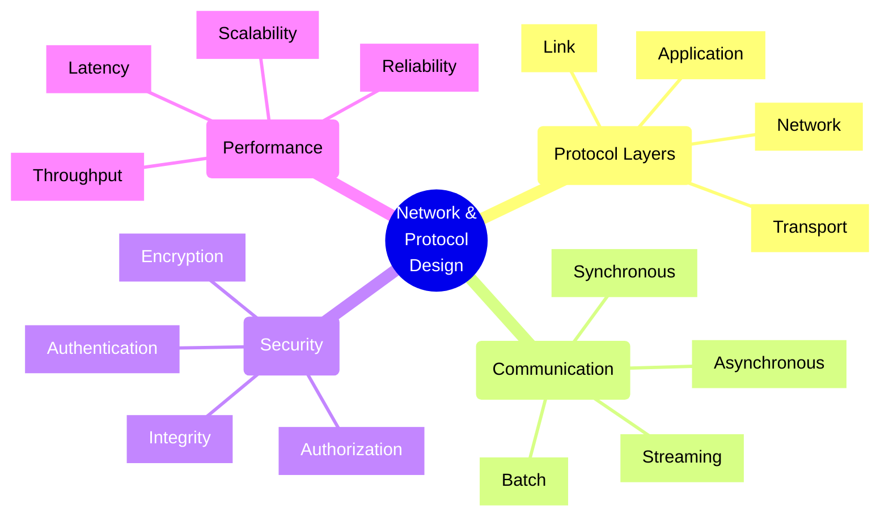

# Network and Protocol Design



## Protocol Design Patterns

### 1. RESTful Protocol Design


Implementation Example:
```typescript
// RESTful API protocol implementation
class RESTProtocol {
    constructor(
        private httpClient: HTTPClient,
        private baseUrl: string,
        private options: ProtocolOptions = {}
    ) {}

    async request<T>(
        method: HTTPMethod,
        resource: string,
        options: RequestOptions = {}
    ): Promise<T> {
        const url = this.buildUrl(resource);
        
        // Add standard headers
        const headers = {
            'Accept': 'application/json',
            'Content-Type': 'application/json',
            ...this.getAuthHeaders(),
            ...options.headers
        };

        // Add idempotency key for unsafe methods
        if (this.isUnsafeMethod(method)) {
            headers['Idempotency-Key'] = 
                options.idempotencyKey || uuidv4();
        }

        const response = await this.executeWithRetry(() =>
            this.httpClient.request({
                method,
                url,
                headers,
                body: options.body ? JSON.stringify(options.body) : undefined,
                timeout: options.timeout || this.options.defaultTimeout
            })
        );

        return this.handleResponse<T>(response);
    }

    private async handleResponse<T>(
        response: HTTPResponse
    ): Promise<T> {
        if (!response.ok) {
            throw this.createError(response);
        }

        // Handle empty responses
        if (response.status === 204) {
            return undefined as T;
        }

        return response.json();
    }

    private createError(response: HTTPResponse): Error {
        const error = new APIError(
            `HTTP ${response.status}: ${response.statusText}`
        );
        error.status = response.status;
        error.details = response.data;
        return error;
    }
}
```

### 2. gRPC Protocol Design


Implementation Example:
```typescript
// gRPC service implementation
interface OrderService {
    createOrder(request: CreateOrderRequest): Promise<Order>;
    streamOrders(request: StreamOrdersRequest): Observable<Order>;
}

class OrderServiceImpl implements OrderService {
    constructor(
        private orderRepository: OrderRepository,
        private validator: OrderValidator
    ) {}

    async createOrder(
        request: CreateOrderRequest
    ): Promise<Order> {
        // Validate request
        await this.validator.validate(request);

        // Create order with retry logic
        const order = await this.executeWithRetry(() =>
            this.orderRepository.create({
                customerId: request.customerId,
                items: request.items,
                status: 'PENDING'
            })
        );

        // Emit creation event
        await this.eventEmitter.emit('order.created', order);

        return order;
    }

    streamOrders(
        request: StreamOrdersRequest
    ): Observable<Order> {
        return new Observable<Order>(observer => {
            const query = this.buildQuery(request);
            const stream = this.orderRepository
                .watchOrders(query);

            stream.on('data', (order: Order) => {
                observer.next(order);
            });

            stream.on('error', (error: Error) => {
                observer.error(error);
            });

            stream.on('end', () => {
                observer.complete();
            });

            // Cleanup on unsubscribe
            return () => stream.destroy();
        });
    }
}
```

### 3. WebSocket Protocol Design


Implementation Example:
```typescript
// WebSocket server implementation
class WebSocketServer {
    private readonly clients: Map<string, WebSocket>;
    private readonly heartbeatInterval: number;

    constructor(
        private readonly server: Server,
        options: WebSocketOptions = {}
    ) {
        this.clients = new Map();
        this.heartbeatInterval = options.heartbeatInterval || 30000;
    }

    async start(): Promise<void> {
        this.server.on('upgrade', (request, socket, head) => {
            this.handleUpgrade(request, socket, head);
        });

        // Start heartbeat monitoring
        setInterval(() => this.checkHeartbeats(), 
            this.heartbeatInterval);
    }

    private handleUpgrade(
        request: Request,
        socket: Socket,
        head: Buffer
    ): void {
        this.authenticateRequest(request)
            .then(clientId => {
                const ws = new WebSocket(request, socket, head);
                this.setupWebSocket(clientId, ws);
            })
            .catch(error => {
                socket.write('HTTP/1.1 401 Unauthorized\r\n\r\n');
                socket.destroy();
            });
    }

    private setupWebSocket(
        clientId: string,
        ws: WebSocket
    ): void {
        this.clients.set(clientId, ws);

        ws.on('message', async (data: WebSocket.Data) => {
            try {
                const message = JSON.parse(data.toString());
                await this.handleMessage(clientId, message);
            } catch (error) {
                this.handleError(ws, error);
            }
        });

        ws.on('close', () => {
            this.clients.delete(clientId);
        });

        // Set up ping/pong
        ws.on('pong', () => {
            ws.isAlive = true;
        });
    }

    private async handleMessage(
        clientId: string,
        message: WebSocketMessage
    ): Promise<void> {
        switch (message.type) {
            case 'subscribe':
                await this.handleSubscribe(clientId, message);
                break;
            case 'publish':
                await this.handlePublish(clientId, message);
                break;
            default:
                throw new UnknownMessageTypeError(message.type);
        }
    }
}
```

## Network Design Patterns

### 1. Load Balancing


Implementation Example:
```typescript
// Load balancer implementation
class LoadBalancer {
    private readonly servers: Server[];
    private readonly healthChecks: Map<string, HealthCheck>;
    private strategy: BalancingStrategy;

    constructor(
        servers: Server[],
        strategy: BalancingStrategy = new RoundRobinStrategy()
    ) {
        this.servers = servers;
        this.strategy = strategy;
        this.healthChecks = new Map();
        
        this.setupHealthChecks();
    }

    async handleRequest(
        request: Request
    ): Promise<Response> {
        // Get available servers
        const availableServers = this.servers.filter(
            server => this.isHealthy(server)
        );

        if (availableServers.length === 0) {
            throw new NoAvailableServersError();
        }

        // Select server using strategy
        const server = this.strategy.selectServer(
            availableServers,
            request
        );

        try {
            return await server.handleRequest(request);
        } catch (error) {
            // Mark server as potentially unhealthy
            await this.checkServerHealth(server);
            throw error;
        }
    }

    private async checkServerHealth(
        server: Server
    ): Promise<boolean> {
        const healthCheck = this.healthChecks.get(server.id);
        return healthCheck ? await healthCheck.check() : false;
    }
}
```

### 2. Service Discovery


Implementation Example:
```typescript
// Service discovery implementation
class ServiceRegistry {
    private services: Map<string, ServiceInstance[]>;
    private readonly ttl: number;

    constructor(options: RegistryOptions = {}) {
        this.services = new Map();
        this.ttl = options.ttl || 30000;
    }

    async register(
        service: ServiceInstance
    ): Promise<void> {
        const instances = this.services.get(service.name) || [];
        instances.push({
            ...service,
            lastHeartbeat: Date.now()
        });

        this.services.set(service.name, instances);
    }

    async discover(
        serviceName: string
    ): Promise<ServiceInstance[]> {
        const instances = this.services.get(serviceName) || [];
        return instances.filter(instance => 
            this.isInstanceHealthy(instance)
        );
    }

    async deregister(
        serviceId: string
    ): Promise<void> {
        for (const [name, instances] of this.services) {
            const filtered = instances.filter(
                instance => instance.id !== serviceId
            );
            if (filtered.length < instances.length) {
                this.services.set(name, filtered);
                break;
            }
        }
    }

    private isInstanceHealthy(
        instance: ServiceInstance
    ): boolean {
        return Date.now() - instance.lastHeartbeat < this.ttl;
    }
}
```

## Best Practices

1. **Protocol Design**
   - Define clear contracts
   - Version your protocols
   - Handle backward compatibility
   - Document thoroughly

2. **Network Design**
   - Plan for scalability
   - Implement security
   - Monitor performance
   - Handle failures gracefully

3. **Performance**
   - Minimize latency
   - Optimize throughput
   - Use caching effectively
   - Compress data

4. **Security**
   - Encrypt in transit
   - Authenticate requests
   - Validate input
   - Monitor access

Remember: Network and protocol design decisions have long-lasting impacts on system performance, scalability, and maintainability. Choose protocols and patterns that align with your requirements while considering future growth and changes.