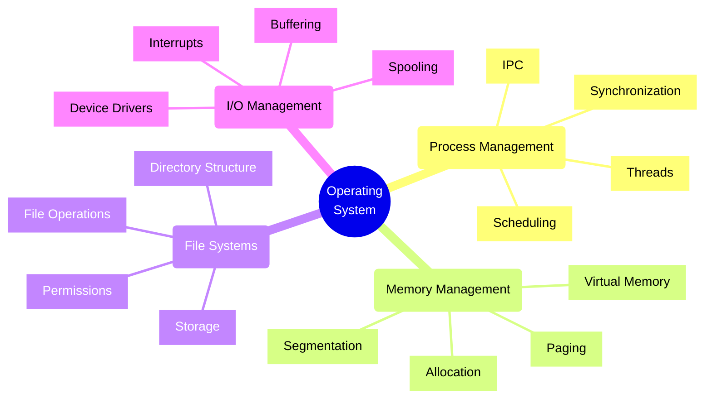
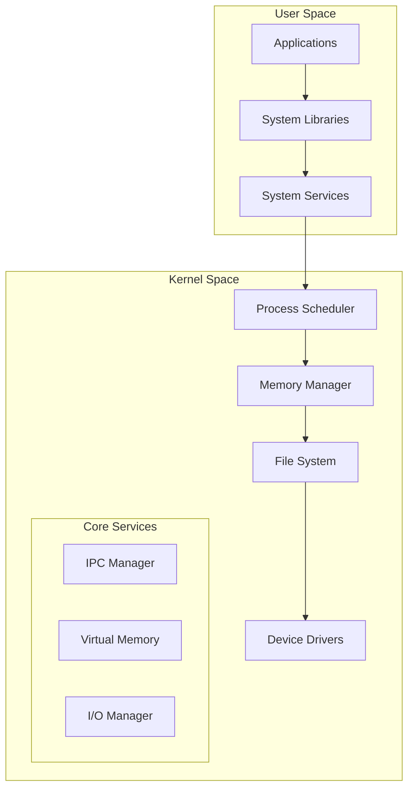
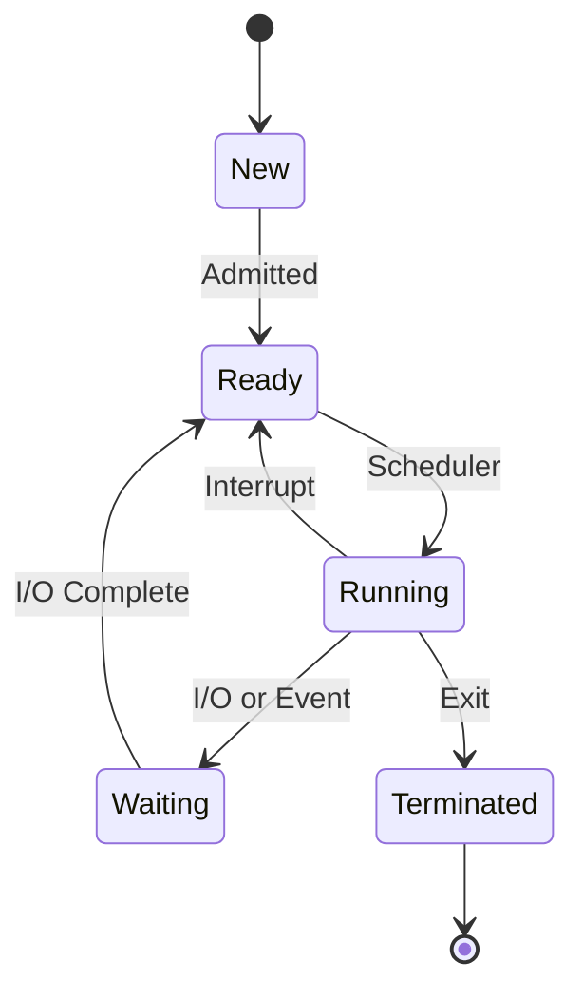
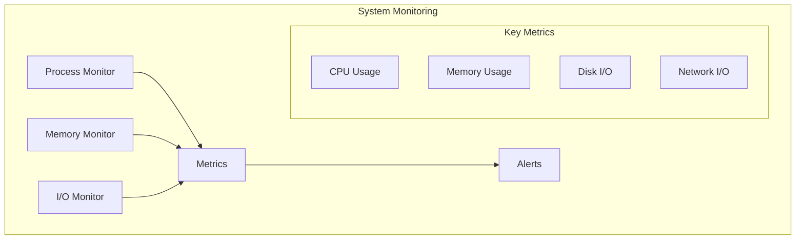

# Operating System Fundamentals

## Core Concepts Overview



## System Architecture

### 1. Kernel Architecture



### 2. Process States



## Implementation Examples

### 1. Process Management
```typescript
// Example: Process and Thread Management
class ProcessManager {
    private processes: Map<number, Process> = new Map();
    private scheduler: Scheduler;
    
    async createProcess(command: string, args: string[]): Promise<number> {
        try {
            // Create process with isolated memory space
            const process = await this.spawn(command, args);
            
            // Set up process monitoring
            process.on('exit', (code) => {
                this.handleProcessExit(process.pid, code);
            });
            
            // Store process reference
            this.processes.set(process.pid, process);
            
            return process.pid;
        } catch (error) {
            throw new ProcessError('Failed to create process');
        }
    }
    
    async createThread(processId: number): Promise<number> {
        const process = this.processes.get(processId);
        if (!process) {
            throw new ProcessError('Process not found');
        }
        
        // Create thread within process memory space
        const thread = await process.createThread();
        
        return thread.id;
    }
}
```

### 2. Memory Management
```typescript
// Example: Virtual Memory Management
class VirtualMemoryManager {
    private pageTable: Map<number, PageTableEntry> = new Map();
    private freePages: number[] = [];
    
    allocateMemory(size: number): VirtualAddress {
        const requiredPages = Math.ceil(size / PAGE_SIZE);
        const allocatedPages: number[] = [];
        
        try {
            // Allocate physical pages
            for (let i = 0; i < requiredPages; i++) {
                const physicalPage = this.getFreePage();
                if (!physicalPage) {
                    throw new OutOfMemoryError();
                }
                
                const virtualPage = this.mapPage(physicalPage);
                allocatedPages.push(virtualPage);
            }
            
            return new VirtualAddress(allocatedPages[0], size);
        } catch (error) {
            // Rollback on failure
            this.freePages.push(...allocatedPages);
            throw error;
        }
    }
    
    private mapPage(physicalPage: number): number {
        const virtualPage = this.getNextVirtualPage();
        this.pageTable.set(virtualPage, {
            physicalPage,
            present: true,
            permissions: PagePermissions.READ_WRITE
        });
        return virtualPage;
    }
}
```

## Core OS Concepts

### 1. Process Management
- Process creation and termination
- Thread management
- Scheduling algorithms
- Process synchronization
- Inter-process communication

### 2. Memory Management
- Virtual memory
- Page replacement
- Memory allocation
- Segmentation
- Memory protection

### 3. File Systems
- File operations
- Directory structure
- File permissions
- Storage management
- Caching strategies

### 4. I/O Management
- Device drivers
- Interrupt handling
- Buffering
- DMA operations
- I/O scheduling

## Implementation Checklist

### Design Phase
- [ ] Define resource requirements
- [ ] Plan process model
- [ ] Choose scheduling strategy
- [ ] Design memory layout
- [ ] Plan I/O handling
- [ ] Consider security model

### Development Phase
- [ ] Implement process management
- [ ] Set up memory management
- [ ] Configure file systems
- [ ] Handle I/O operations
- [ ] Add security controls
- [ ] Implement logging

### Operations Phase
- [ ] Monitor resource usage
- [ ] Track performance
- [ ] Handle failures
- [ ] Update systems
- [ ] Security patching
- [ ] Regular maintenance

## Best Practices

### 1. Resource Management
- Use resource limits
- Implement quotas
- Monitor usage
- Handle exhaustion
- Plan scaling

### 2. Security
- Implement isolation
- Access controls
- System hardening
- Regular updates
- Security monitoring

### 3. Performance
- Optimize scheduling
- Efficient memory use
- I/O optimization
- Cache effectively
- Monitor bottlenecks

## OS Feature Comparison

| Feature | Windows | Linux | macOS |
|---------|---------|-------|--------|
| Process Model | Win32 Processes | Fork/Exec | XNU Processes |
| File System | NTFS | ext4, xfs | APFS |
| Security | ACLs, UAC | DAC, MAC | SIP, Sandbox |
| IPC | Named Pipes, COM | Pipes, Sockets | XPC |

## Monitoring Framework



## Common Patterns

### 1. Process Management
- Process pools
- Thread pools
- Work queues
- Event loops
- Async I/O

### 2. Memory Management
- Memory pools
- Page caching
- Shared memory
- Memory mapping
- Garbage collection

### 3. I/O Management
- Buffered I/O
- Direct I/O
- Asynchronous I/O
- Scatter/Gather I/O
- Zero-copy operations

Remember:
- Understand resource limits
- Plan for failures
- Optimize performance
- Maintain security
- Monitor systems
- Regular updates
- Document configurations