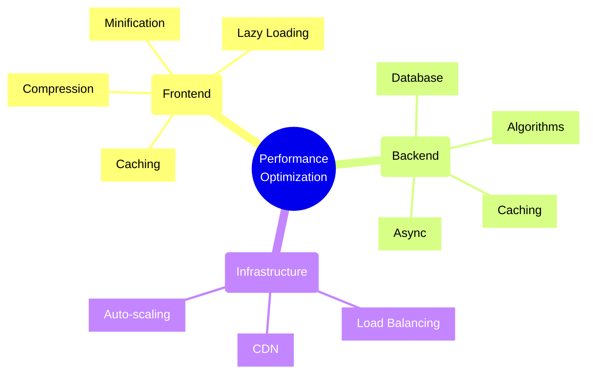
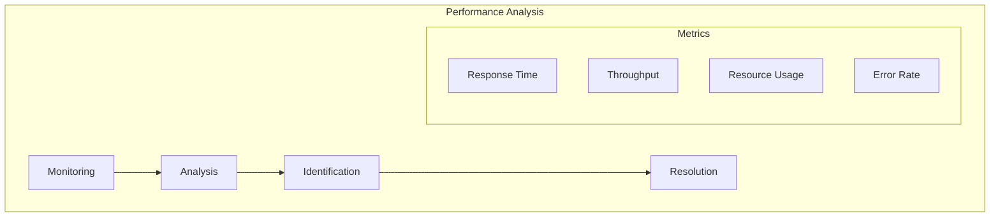
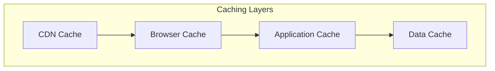
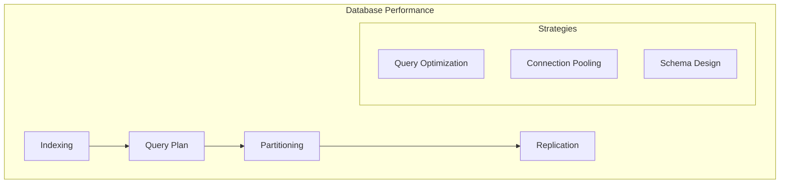
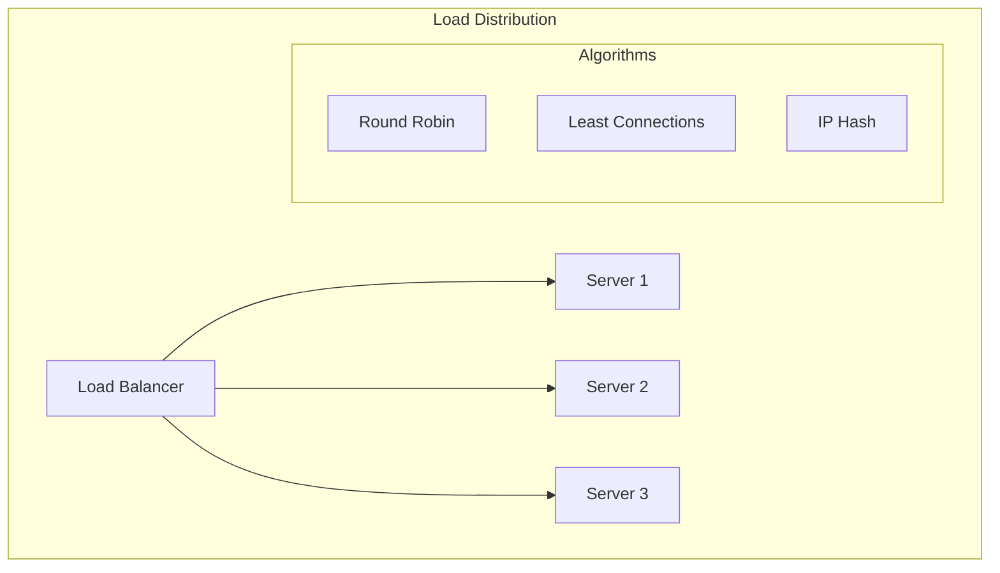
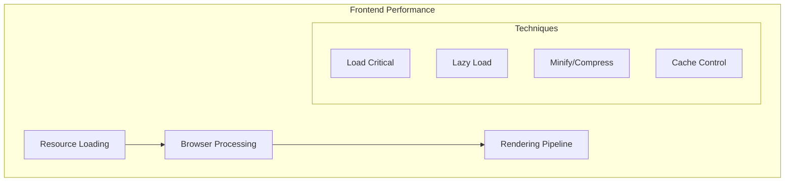
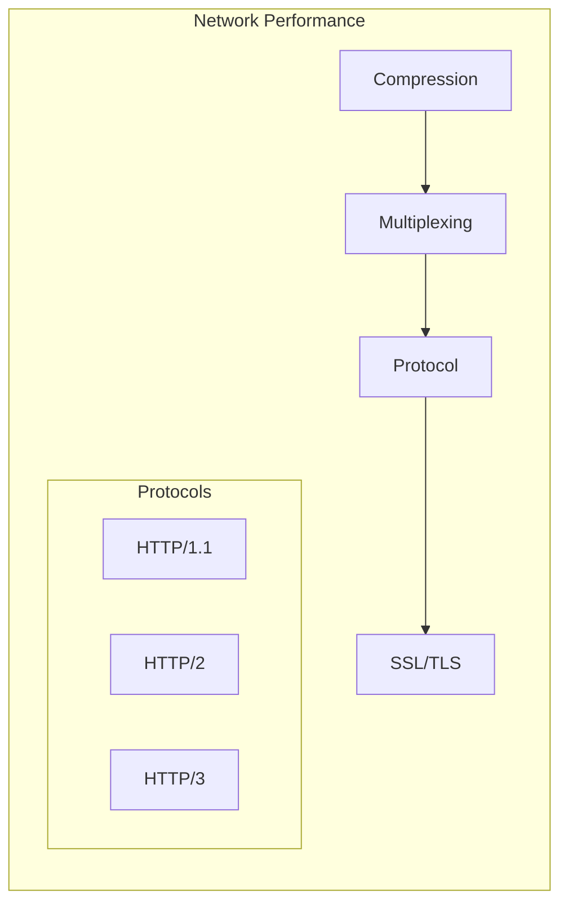
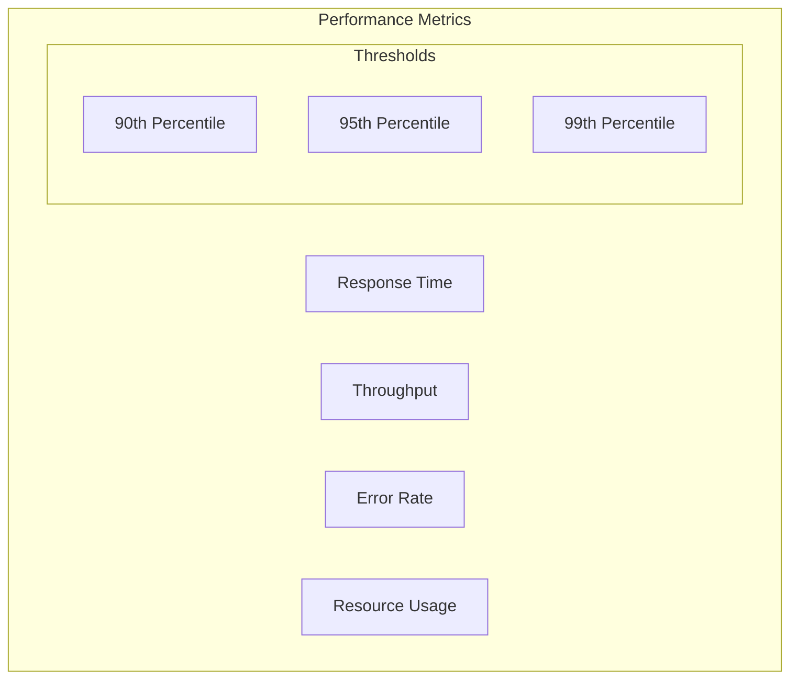

# Performance Optimization Techniques

## Overview

## Performance Bottlenecks

### 1. Identification Framework

### 2. Common Bottlenecks
1. **Database**
   - Query performance
   - Connection management
   - Index optimization
   - Lock contention

2. **Network**
   - Latency
   - Bandwidth
   - DNS resolution
   - Connection pooling

3. **Application**
   - Memory leaks
   - Thread management
   - Resource cleanup
   - Algorithm efficiency

## Optimization Strategies

### 1. Caching Framework

#### Cache Levels
| Level | Purpose | TTL | Invalidation |
|-------|---------|-----|--------------|
| CDN | Static Assets | Hours/Days | Version Change |
| Browser | UI Resources | Minutes/Hours | Cache Headers |
| Application | Business Logic | Seconds/Minutes | Event-based |
| Data | Database Results | Milliseconds/Seconds | Write-through |

### 2. Database Optimization

#### Optimization Checklist
- [ ] Index analysis
- [ ] Query optimization
- [ ] Connection pooling
- [ ] Data partitioning
- [ ] Cache strategy
- [ ] Monitoring setup

### 3. Load Balancing

#### Strategy Selection
| Algorithm | Use Case | Pros | Cons |
|-----------|----------|------|------|
| Round Robin | Simple Distribution | Easy to implement | No server state |
| Least Connections | Uneven loads | Better distribution | More overhead |
| IP Hash | Session affinity | Consistent routing | Potential imbalance |

### 4. Frontend Optimization

#### Optimization Areas
1. **Resource Loading**
   - Critical path
   - Asset optimization
   - Lazy loading
   - Preloading

2. **Rendering**
   - Virtual DOM
   - Tree shaking
   - Code splitting
   - Worker threads

### 5. Network Optimization

#### Protocol Features
| Protocol | Features | Benefits |
|----------|----------|----------|
| HTTP/1.1 | Keep-alive | Connection reuse |
| HTTP/2 | Multiplexing | Parallel requests |
| HTTP/3 | QUIC | Improved latency |

## Monitoring Framework

### 1. Key Metrics

### 2. Alerting Strategy
| Metric | Warning | Critical | Action |
|--------|---------|----------|--------|
| Response Time | P95 > 500ms | P95 > 1s | Scale up |
| Error Rate | > 1% | > 5% | Investigation |
| CPU Usage | > 70% | > 90% | Auto-scale |
| Memory | > 80% | > 90% | Heap analysis |

## Best Practices

### 1. Performance Testing
- Load testing
- Stress testing
- Endurance testing
- Spike testing
- Scalability testing

### 2. Optimization Process
1. **Measure**
   - Baseline metrics
   - User experience
   - Resource usage
   - Business impact

2. **Analyze**
   - Bottlenecks
   - Root causes
   - Dependencies
   - Patterns

3. **Optimize**
   - Implement changes
   - Validate impact
   - Monitor results
   - Document learnings

Remember: Performance optimization should be data-driven and focus on measurable improvements that impact user experience and business metrics.