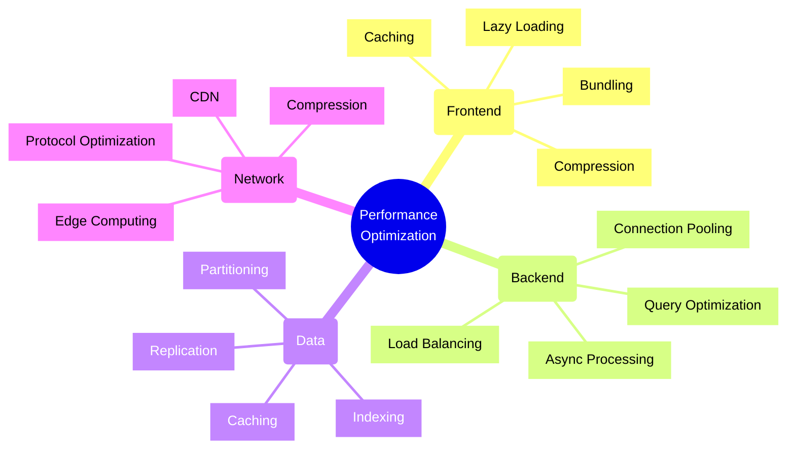
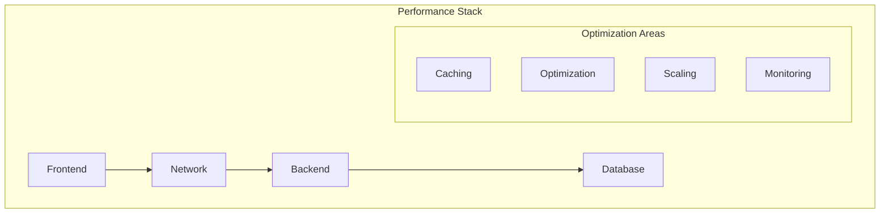
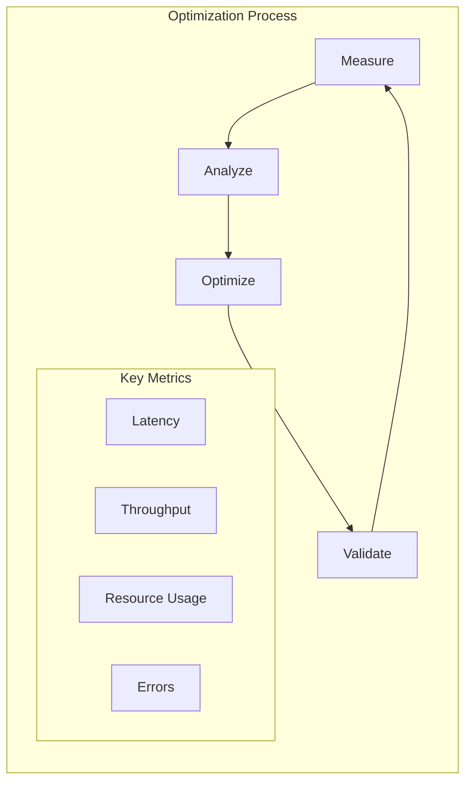

# Performance Optimization Techniques

## Core Components

### 1. Performance Areas

### 2. Optimization Flow

## Implementation Checklist

### Frontend Optimization
- [ ] Implement caching strategy
- [ ] Optimize bundle size
- [ ] Enable compression
- [ ] Configure lazy loading
- [ ] Optimize images
- [ ] Minimize HTTP requests
- [ ] Enable CDN
- [ ] Implement PWA features
- [ ] Regular performance audits

### Backend Optimization
- [ ] Query optimization
- [ ] Configure caching
- [ ] Implement connection pooling
- [ ] Set up async processing
- [ ] Configure thread pools
- [ ] Optimize memory usage
- [ ] Enable load balancing
- [ ] Implement rate limiting
- [ ] Regular profiling

### Database Optimization
- [ ] Index optimization
- [ ] Query tuning
- [ ] Configure partitioning
- [ ] Set up replication
- [ ] Implement caching
- [ ] Optimize schema
- [ ] Configure connections
- [ ] Regular maintenance
- [ ] Monitor performance

### Network Optimization
- [ ] Configure CDN
- [ ] Enable compression
- [ ] Optimize protocols
- [ ] Implement edge caching
- [ ] Configure load balancing
- [ ] Optimize DNS
- [ ] Monitor latency
- [ ] Test throughput
- [ ] Regular monitoring

## Trade-offs

### Performance vs. Cost
- **High Performance**
  - Pros:
    * Better user experience
    * Higher throughput
    * Improved reliability
  - Cons:
    * Higher infrastructure costs
    * More complexity
    * Increased maintenance

### Caching vs. Consistency
- **Aggressive Caching**
  - Pros:
    * Faster responses
    * Reduced load
    * Better scalability
  - Cons:
    * Data staleness
    * Cache invalidation complexity
    * More memory usage

### Optimization vs. Maintainability
- **Heavy Optimization**
  - Pros:
    * Better performance
    * Resource efficiency
    * Improved scaling
  - Cons:
    * Code complexity
    * Harder to maintain
    * More bugs potential

### Async vs. Sync
- **Asynchronous Processing**
  - Pros:
    * Better responsiveness
    * Improved throughput
    * Resource efficiency
  - Cons:
    * More complexity
    * Harder to debug
    * State management challenges

## Best Practices

1. **Measurement & Monitoring**
   - Define clear metrics
   - Establish baselines
   - Regular monitoring
   - Performance testing
   - User monitoring
   - System profiling
   - Regular reviews

2. **Frontend Optimization**
   - Minimize resources
   - Optimize loading
   - Implement caching
   - Reduce requests
   - Compress assets
   - Load balancing
   - Regular testing

3. **Backend Performance**
   - Query optimization
   - Connection pooling
   - Resource management
   - Caching strategy
   - Async processing
   - Regular profiling
   - Performance testing

4. **Database Optimization**
   - Index strategy
   - Query tuning
   - Schema optimization
   - Data partitioning
   - Connection management
   - Regular maintenance
   - Performance monitoring

## Performance Metrics Matrix

| Area | Metric | Target | Warning | Critical |
|------|--------|--------|---------|----------|
| Frontend | Page Load | <2s | >3s | >5s |
| Backend | Response Time | <100ms | >200ms | >500ms |
| Database | Query Time | <50ms | >100ms | >200ms |
| API | Latency | <200ms | >500ms | >1s |
| Cache | Hit Rate | >90% | <80% | <70% |
| Network | Bandwidth | <70% | >80% | >90% |

## Common Bottlenecks

1. **Frontend Issues**
   - Large bundle size
   - Unoptimized images
   - Too many requests
   - Render blocking
   - Poor caching

2. **Backend Problems**
   - Slow queries
   - Resource contention
   - Memory leaks
   - Thread blocking
   - Poor connection management

3. **Database Bottlenecks**
   - Missing indexes
   - Poor query plans
   - Lock contention
   - I/O bottlenecks
   - Connection pool exhaustion

4. **Network Issues**
   - High latency
   - Low bandwidth
   - DNS problems
   - Network congestion
   - Poor routing

Remember: Performance optimization is an iterative process. Always measure before and after optimizations to ensure improvements are effective and don't introduce new problems.