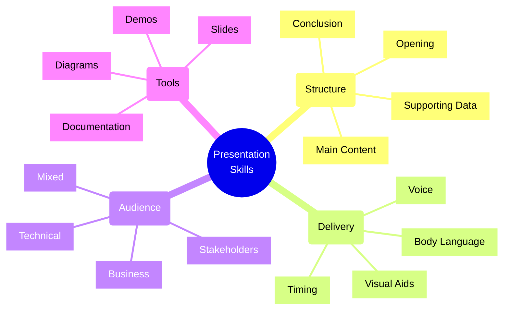
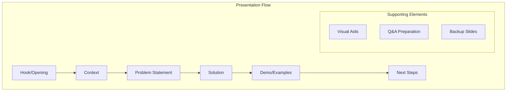
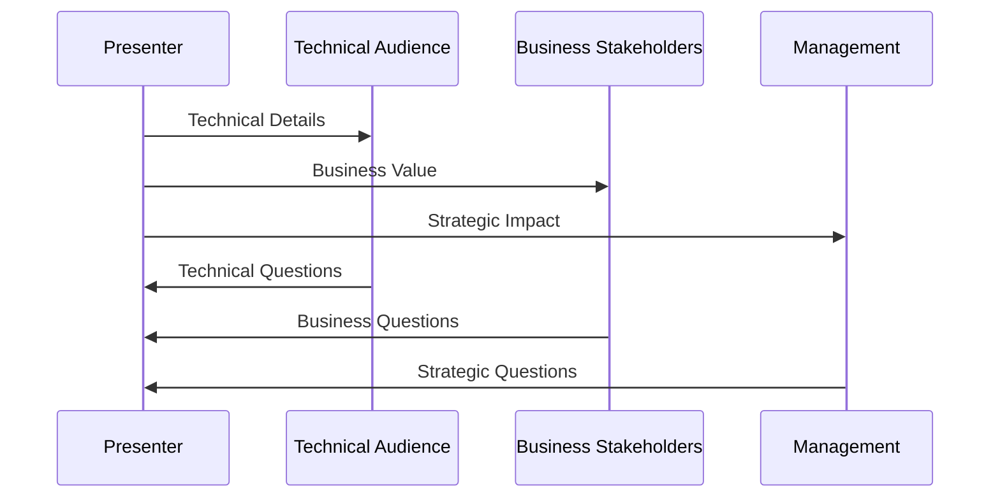
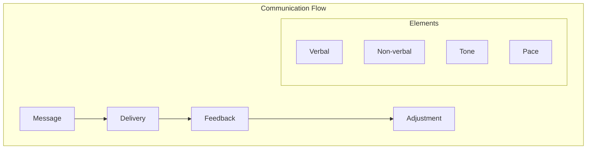

# Presentation Skills

## Core Concepts Overview



## Presentation Framework

### 1. Structure Flow



### 2. Audience Engagement



## Implementation Examples

### 1. Technical Architecture Presentation
```markdown
# Microservices Migration Strategy
## Overview
- Current monolithic challenges
- Proposed microservices architecture
- Migration approach
- Timeline and milestones

## Technical Details
### Current Architecture
- Monolithic pain points
- Performance bottlenecks
- Scaling limitations

### Proposed Solution
- Service boundaries
- Communication patterns
- Data management
- Security considerations

### Migration Strategy
- Strangler fig pattern
- Phase-wise migration
- Risk mitigation
- Rollback plans

## Business Impact
- Improved scalability
- Faster feature delivery
- Reduced maintenance costs
- Enhanced reliability

## Next Steps
- Team structure changes
- Training requirements
- Infrastructure needs
- Timeline overview
```

### 2. Project Status Update
```markdown
# Project Status Update: Q2 2025
## Key Achievements
- Service mesh implementation: 85% complete
- API gateway migration: Complete
- Performance improvements: 40% latency reduction

## Challenges & Solutions
### Technical Challenges
- Service discovery issues
  - Solution: Implemented Consul
  - Impact: Improved reliability

### Resource Challenges
- Team capacity
  - Solution: Added 2 senior engineers
  - Impact: Back on schedule

## Metrics & KPIs
- System uptime: 99.95%
- Response time: 150ms (p95)
- Deployment frequency: 3x/week

## Next Quarter Goals
- Complete service mesh migration
- Implement automated testing
- Reduce technical debt by 20%
```

## Presentation Types

### 1. Technical Deep Dives
- Architecture reviews
- Technical proposals
- System design sessions
- Code reviews
- Performance analysis
- Security assessments

### 2. Status Updates
- Project progress
- Sprint reviews
- Milestone reports
- Risk assessments
- Resource planning
- Budget updates

### 3. Strategic Presentations
- Technology roadmap
- Innovation proposals
- Vendor selections
- Cost-benefit analysis
- Team structure
- Process changes

## Implementation Checklist

### Preparation Phase
- [ ] Understand audience
- [ ] Define objectives
- [ ] Gather content
- [ ] Create outline
- [ ] Prepare visuals
- [ ] Practice delivery

### Delivery Phase
- [ ] Set context
- [ ] Present clearly
- [ ] Manage time
- [ ] Handle questions
- [ ] Gather feedback
- [ ] Follow up

### Follow-up Phase
- [ ] Share materials
- [ ] Address questions
- [ ] Document decisions
- [ ] Track actions
- [ ] Get feedback
- [ ] Apply learnings

## Best Practices

### 1. Content Preparation
- Know your audience
- Clear objectives
- Logical flow
- Supporting data
- Visual aids
- Practice runs

### 2. Delivery Techniques
- Clear voice
- Good pace
- Body language
- Eye contact
- Time management
- Energy level

### 3. Visual Design
- Clean slides
- Clear diagrams
- Consistent style
- Limited text
- Effective visuals
- Brand guidelines

## Presentation Framework

| Component | Purpose | Tools | Best Practices |
|-----------|---------|-------|----------------|
| Opening | Engage audience | Story, Stats | Clear hook |
| Content | Deliver message | Diagrams, Code | Logical flow |
| Examples | Demonstrate | Demos, Cases | Real scenarios |
| Closing | Call to action | Next steps | Clear actions |

## Communication Framework



## Common Scenarios

### 1. Architecture Reviews
- System overview
- Design decisions
- Trade-offs
- Constraints
- Future plans
- Risk analysis

### 2. Stakeholder Updates
- Progress reports
- Key achievements
- Challenges faced
- Solutions implemented
- Resource needs
- Next steps

### 3. Technical Training
- Concept introduction
- Practical examples
- Best practices
- Common pitfalls
- Hands-on exercises
- Q&A sessions

## Presentation Tools

### 1. Visual Tools
- PowerPoint/Keynote
- Draw.io/diagrams.net
- Mermaid
- Lucidchart
- Figma
- Whiteboard

### 2. Demo Tools
- IDEs
- Terminals
- Browsers
- Monitoring tools
- API clients
- Cloud consoles

### 3. Collaboration Tools
- Screen sharing
- Virtual whiteboards
- Chat platforms
- Polling tools
- Feedback systems
- Recording options

Remember:
- Know your audience
- Prepare thoroughly
- Practice delivery
- Manage time
- Handle questions well
- Follow up properly
- Learn from feedback
- Keep improving