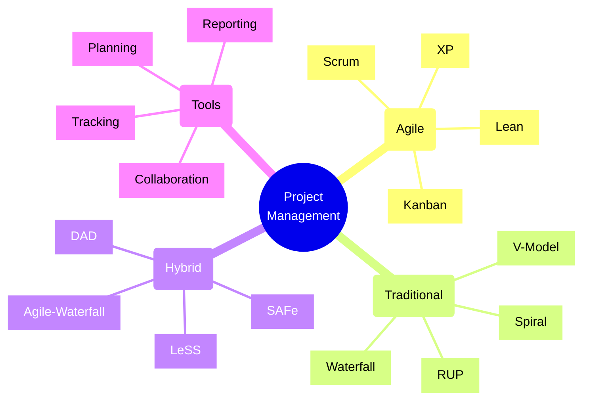
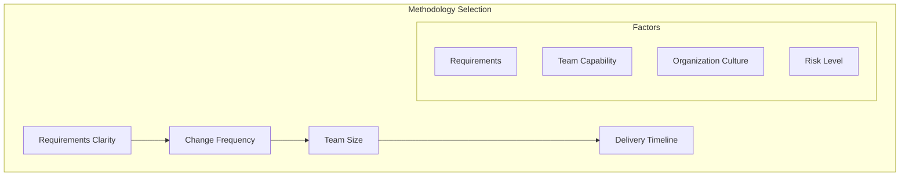
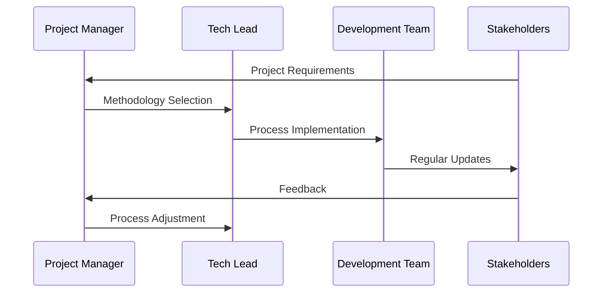
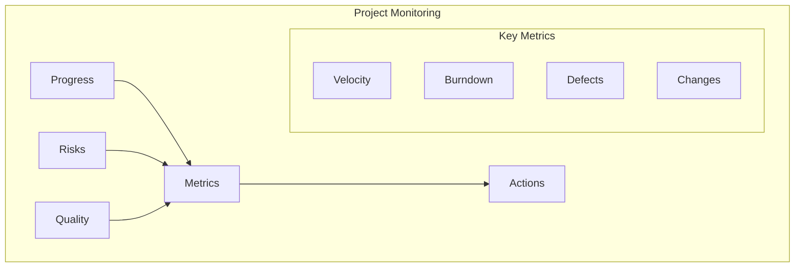

# Project Management Methodologies

## Core Concepts Overview



## Methodology Selection Framework

### 1. Decision Flow



### 2. Implementation Process



## Implementation Examples

### 1. Agile Implementation
```typescript
// Example: Agile Sprint Management
class SprintManager {
    private sprints: Map<string, Sprint> = new Map();
    private currentSprint: Sprint | null = null;
    
    startNewSprint(config: SprintConfig): void {
        const sprint = new Sprint({
            ...config,
            startDate: new Date(),
            duration: 2, // weeks
            capacity: this.calculateTeamCapacity()
        });
        
        // Plan sprint
        this.planSprint(sprint);
        
        // Set up monitoring
        this.setupMetrics(sprint);
        
        // Start daily processes
        this.initializeDailyProcesses(sprint);
        
        this.sprints.set(sprint.id, sprint);
        this.currentSprint = sprint;
    }
    
    private planSprint(sprint: Sprint): void {
        // Velocity-based planning
        const velocity = this.calculateVelocity();
        const stories = this.selectStories(velocity);
        
        sprint.addStories(stories);
        sprint.setGoals(this.defineSprintGoals());
    }
    
    private initializeDailyProcesses(sprint: Sprint): void {
        // Set up daily standups
        this.scheduleDailyStandup();
        
        // Initialize burndown tracking
        this.initializeBurndownChart();
        
        // Set up impediment tracking
        this.setupImpedimentLog();
    }
}
```

### 2. Project Tracking
```typescript
// Example: Project Metrics Tracking
class ProjectMetrics {
    private metrics: MetricsCollection;
    private thresholds: MetricThresholds;
    
    constructor(
        private config: ProjectConfig,
        private notificationService: NotificationService
    ) {
        this.initializeMetrics();
        this.setThresholds();
    }
    
    trackVelocity(sprintData: SprintData): void {
        const velocity = this.calculateVelocity(sprintData);
        this.metrics.velocity.push(velocity);
        
        if (velocity < this.thresholds.velocity.min) {
            this.notificationService.alert({
                level: 'warning',
                message: 'Velocity below threshold',
                data: { actual: velocity, threshold: this.thresholds.velocity.min }
            });
        }
    }
    
    generateBurndownChart(): BurndownData {
        return {
            ideal: this.calculateIdealBurndown(),
            actual: this.calculateActualBurndown(),
            trend: this.calculateTrendline()
        };
    }
}
```

## Methodology Comparison

### 1. Agile Methods
- **Scrum**
  - Iterative development
  - Fixed sprint length
  - Defined roles
  - Regular ceremonies

- **Kanban**
  - Continuous flow
  - WIP limits
  - Pull system
  - Visual management

### 2. Traditional Methods
- **Waterfall**
  - Sequential phases
  - Detailed planning
  - Documentation focus
  - Change control

- **V-Model**
  - Validation focus
  - Testing emphasis
  - Quality control
  - Regulatory compliance

## Implementation Checklist

### Selection Phase
- [ ] Assess project characteristics
- [ ] Evaluate team capability
- [ ] Consider stakeholder needs
- [ ] Review organizational culture
- [ ] Analyze risks
- [ ] Check compliance requirements

### Setup Phase
- [ ] Define processes
- [ ] Set up tools
- [ ] Train team
- [ ] Create templates
- [ ] Establish metrics
- [ ] Plan communication

### Execution Phase
- [ ] Implement processes
- [ ] Monitor progress
- [ ] Track metrics
- [ ] Manage changes
- [ ] Handle issues
- [ ] Report status

### Review Phase
- [ ] Evaluate effectiveness
- [ ] Gather feedback
- [ ] Identify improvements
- [ ] Document lessons
- [ ] Adjust processes
- [ ] Share learnings

## Best Practices

### 1. Process Management
- Clear definitions
- Consistent application
- Regular reviews
- Process adaptation
- Team feedback
- Continuous improvement

### 2. Team Management
- Clear roles
- Regular communication
- Skill development
- Empowerment
- Cross-training
- Recognition

### 3. Stakeholder Management
- Regular updates
- Clear expectations
- Feedback loops
- Risk communication
- Value delivery
- Relationship building

## Methodology Selection Matrix

| Factor | Agile | Waterfall | Hybrid |
|--------|-------|-----------|---------|
| Requirements | Evolving | Fixed | Mixed |
| Timeline | Flexible | Fixed | Moderate |
| Team Size | Small-Medium | Any | Medium-Large |
| Risk Level | Moderate | High | Variable |

## Project Tracking Framework



## Common Challenges & Solutions

### 1. Process Adaptation
- Start small
- Gradual changes
- Team involvement
- Regular feedback
- Measure impact
- Adjust as needed

### 2. Tool Integration
- Select appropriate tools
- Define workflows
- Automate processes
- Maintain consistency
- Monitor usage
- Regular updates

### 3. Team Alignment
- Clear communication
- Regular training
- Process documentation
- Support system
- Feedback channels
- Success recognition

Remember:
- Choose appropriate methodology
- Adapt to team needs
- Monitor effectiveness
- Gather feedback
- Make improvements
- Document learnings
- Support team growth