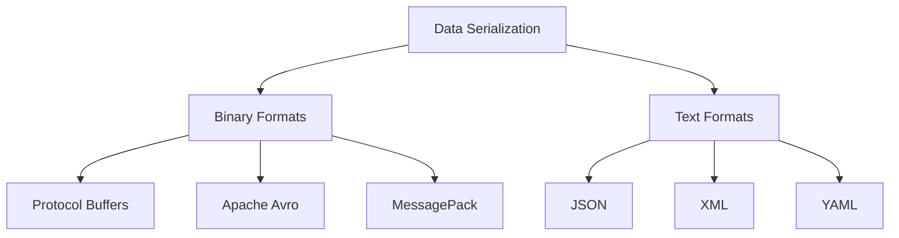
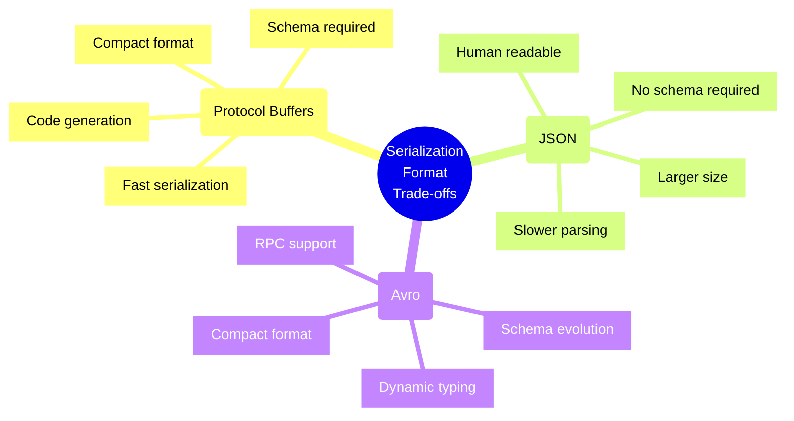
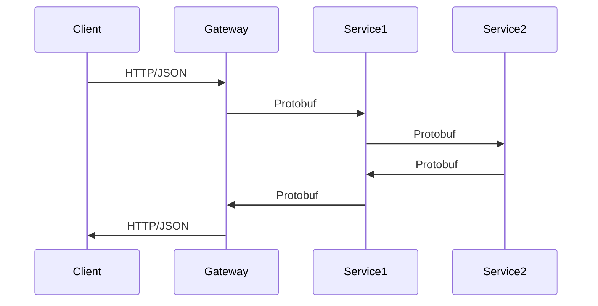

# Protocol Buffers and Data Serialization

## Overview
Protocol Buffers (protobuf) and other serialization formats enable efficient data exchange between different systems and languages.



## Serialization Formats

### Protocol Buffers
- Language-neutral
- Platform-neutral
- Extensible mechanism
- Strongly typed
- Backward compatible
- Forward compatible

### Apache Avro
- Rich data structures
- Compact binary format
- Schema evolution
- Dynamic typing
- Language independent
- RPC support

### JSON
- Human readable
- Wide support
- Schema optional
- Self-describing
- Web compatible
- Language independent

## Protocol Buffer Concepts

### Message Definition
```protobuf
syntax = "proto3";

message Person {
  string name = 1;
  int32 age = 2;
  repeated string hobbies = 3;
  
  enum PhoneType {
    MOBILE = 0;
    HOME = 1;
    WORK = 2;
  }
  
  message PhoneNumber {
    string number = 1;
    PhoneType type = 2;
  }
  
  repeated PhoneNumber phones = 4;
}
```

### Best Practices Checklist

#### Schema Design
- [ ] Use appropriate field numbers
- [ ] Plan for evolution
- [ ] Consider field deprecation
- [ ] Define clear messages
- [ ] Use proper types

#### Performance
- [ ] Optimize message size
- [ ] Use repeated fields
- [ ] Consider field ordering
- [ ] Plan for updates
- [ ] Cache compiled schemas

## Trade-offs Analysis



## Implementation Examples

### Protocol Buffers
```python
# Python implementation
from person_pb2 import Person

person = Person()
person.name = "John Doe"
person.age = 30
person.hobbies.append("reading")

# Serialize
serialized = person.SerializeToString()

# Deserialize
new_person = Person()
new_person.ParseFromString(serialized)
```

### JSON Comparison
```javascript
// JSON equivalent
const person = {
  name: "John Doe",
  age: 30,
  hobbies: ["reading"],
  phones: [
    { number: "555-1234", type: "MOBILE" }
  ]
};

// Serialize
const serialized = JSON.stringify(person);

// Deserialize
const newPerson = JSON.parse(serialized);
```

## Performance Considerations

### Size Comparison
```mermaid
bar
    title Message Size Comparison (bytes)
    Protocol Buffers : 38
    JSON : 82
    XML  : 143
```

### Serialization Speed
1. Binary Formats
   - Protocol Buffers
   - Avro
   - MessagePack

2. Text Formats
   - JSON
   - YAML
   - XML

## Schema Evolution

### Backward Compatibility
```protobuf
// Version 1
message User {
  string name = 1;
  int32 age = 2;
}

// Version 2 - Backward Compatible
message User {
  string name = 1;
  int32 age = 2;
  optional string email = 3;  // New field
}
```

### Forward Compatibility
- Required vs Optional fields
- Field numbering
- Default values
- Unknown fields

## Language Support

### Built-in Types
| Type | C++ | Java | Python | Go |
|------|-----|------|--------|-----|
| double | double | double | float | float64 |
| float | float | float | float | float32 |
| int32 | int32 | int | int | int32 |
| int64 | int64 | long | int | int64 |
| bool | bool | boolean | bool | bool |
| string | string | String | str | string |

## Tools and Ecosystem

### Development Tools
- Protocol Buffer Compiler (protoc)
- Language-specific plugins
- IDE integrations
- Schema validators

### Testing Tools
- Message generators
- Compatibility checkers
- Performance benchmarks

## Security Considerations
1. Input Validation
   - Size limits
   - Field validation
   - Type checking

2. Data Protection
   - Encryption
   - Access control
   - Field masking

## Best Practices

### Schema Design
1. Field Numbering
   - Reserve numbers
   - Plan for growth
   - Use ranges

2. Message Structure
   - Keep it simple
   - Group related fields
   - Use nested messages

### Implementation
1. Code Generation
   - Automate builds
   - Version control
   - Documentation

2. Error Handling
   - Validation
   - Default values
   - Unknown fields

## Integration Patterns

### Service Definition
```protobuf
service UserService {
  rpc GetUser (UserRequest) returns (User);
  rpc ListUsers (ListUsersRequest) returns (stream User);
  rpc UpdateUser (UpdateUserRequest) returns (User);
}
```

### Microservices Integration


## Additional Resources
1. Documentation
   - [Protocol Buffers Documentation](https://developers.google.com/protocol-buffers)
   - [Apache Avro Documentation](https://avro.apache.org/docs/)
   - [MessagePack Specification](https://msgpack.org/)

2. Learning Resources
   - Schema Design Patterns
   - Performance Optimization
   - Integration Strategies
   - Migration Guides