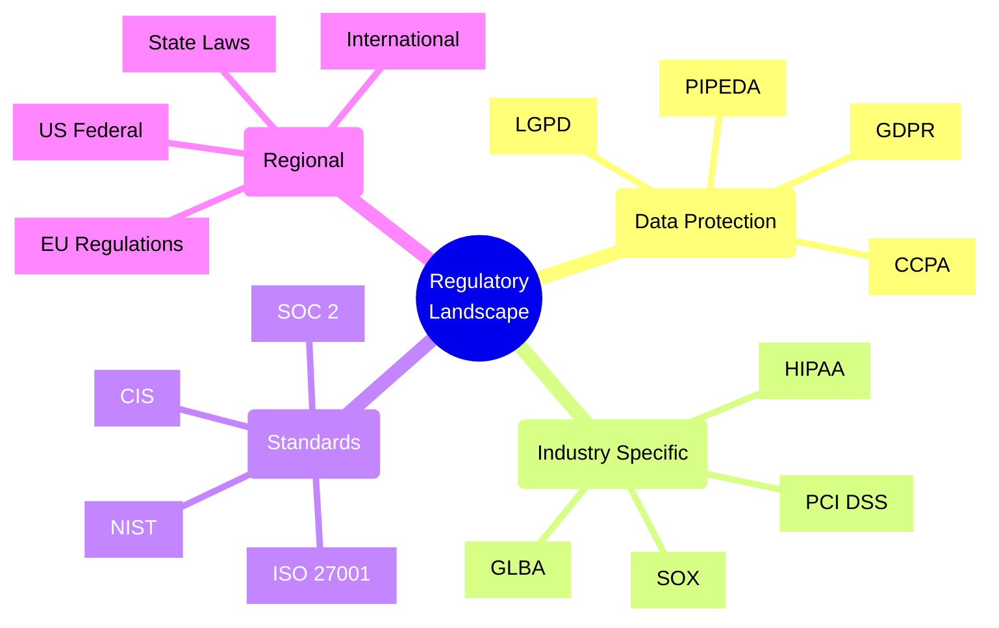
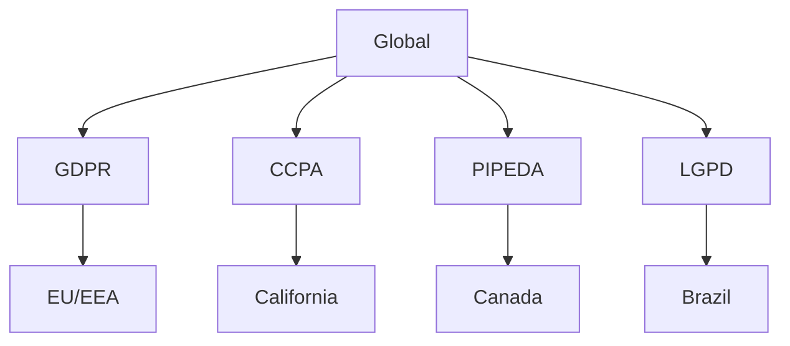
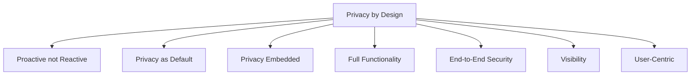
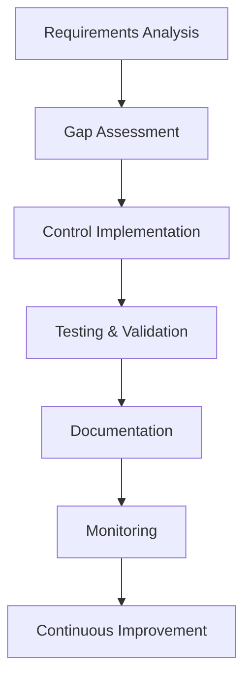
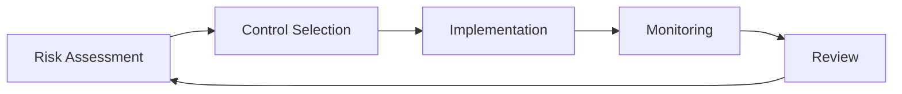
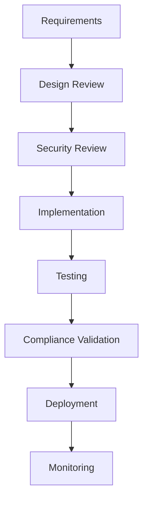

# Regulatory Environment

## Overview
Understanding the regulatory environment is crucial for software architects to ensure compliance and manage risk effectively.



## Key Regulatory Frameworks

### Data Protection and Privacy


### Compliance Requirements Matrix
| Regulation | Scope | Key Requirements | Penalties |
|------------|-------|-----------------|-----------|
| GDPR | EU Data Subjects | Data Protection, Consent, Rights | Up to 4% global revenue |
| CCPA | California Residents | Privacy Rights, Opt-out | $7,500 per violation |
| HIPAA | Healthcare Data | Security, Privacy, Access Control | Up to $1.5M per year |
| PCI DSS | Payment Card Data | Security Standards | Fines, Service Termination |

## Architectural Implications

### Security Requirements
```yaml
data_protection:
  encryption:
    - at_rest
    - in_transit
    - end_to_end
  access_control:
    - authentication
    - authorization
    - audit_logging
  data_governance:
    - classification
    - retention
    - disposal
```

### Privacy by Design Principles


## Compliance Checklist

### General Requirements
- [ ] Data Protection Impact Assessment
- [ ] Privacy Policy Documentation
- [ ] Consent Management
- [ ] Data Subject Rights Handling
- [ ] Breach Notification Process

### Technical Controls
- [ ] Encryption Implementation
- [ ] Access Control System
- [ ] Audit Logging
- [ ] Data Backup
- [ ] Incident Response

### Documentation
- [ ] System Architecture
- [ ] Data Flow Diagrams
- [ ] Risk Assessments
- [ ] Policy Documents
- [ ] Training Materials

## Implementation Strategy

### Compliance Framework


### Risk Management Approach


## Industry-Specific Requirements

### Healthcare (HIPAA)
```yaml
key_requirements:
  - Privacy Rule
  - Security Rule
  - Breach Notification
  - Enforcement Rule
technical_controls:
  - Access Controls
  - Audit Logs
  - Encryption
  - Backup
```

### Financial Services
```yaml
key_regulations:
  - SOX
  - GLBA
  - PCI DSS
  - KYC/AML
requirements:
  - Data Security
  - Audit Trail
  - Reporting
  - Identity Verification
```

## Tools and Technologies

### Compliance Management
1. GRC Platforms
   - ServiceNow GRC
   - MetricStream
   - IBM OpenPages

2. Security Tools
   - Identity Management
   - Encryption Solutions
   - Access Control Systems
   - Audit Tools

3. Documentation Tools
   - Policy Management
   - Process Documentation
   - Training Management

## Best Practices

### Architecture Design
| Aspect | Consideration | Implementation |
|--------|---------------|----------------|
| Data Storage | Location, Encryption | Region-specific datacenters, KMS |
| Access Control | Authentication, Authorization | IAM, MFA, RBAC |
| Monitoring | Logging, Auditing | SIEM, Log Analytics |
| Integration | APIs, Data Transfer | Secure Gateways, VPNs |

### Development Process


## Common Challenges

### Implementation Challenges
| Challenge | Strategy |
|-----------|----------|
| Multiple Jurisdictions | Modular Architecture |
| Changing Regulations | Adaptable Design |
| Legacy Systems | Gradual Modernization |
| Cost of Compliance | Risk-based Approach |

### Mitigation Strategies
```yaml
strategies:
  technical:
    - Automation
    - Standardization
    - Modularization
    - Continuous Monitoring
  organizational:
    - Training
    - Documentation
    - Process Improvement
    - Regular Audits
```

## Additional Resources

### References
1. Regulatory Bodies
   - EU Data Protection Board
   - US Federal Agencies
   - Industry Regulators
   - Standards Organizations

2. Guidelines
   - Implementation Guides
   - Technical Standards
   - Best Practices
   - Case Studies

3. Tools
   - Compliance Frameworks
   - Assessment Tools
   - Monitoring Solutions
   - Documentation Templates