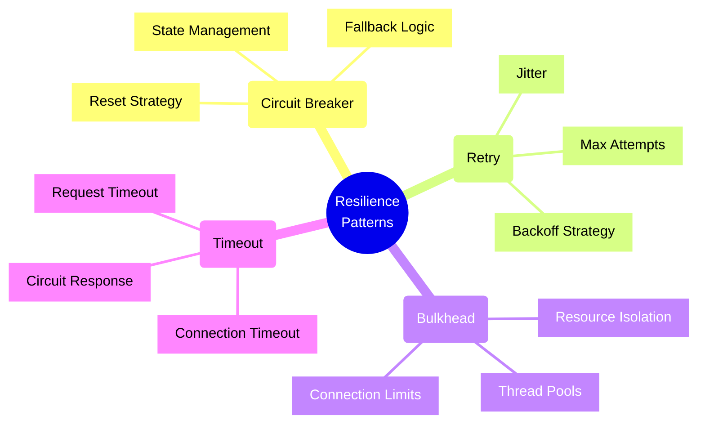
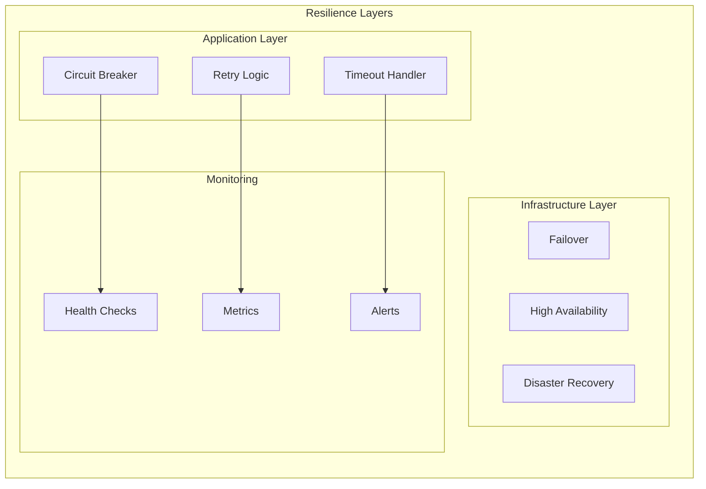
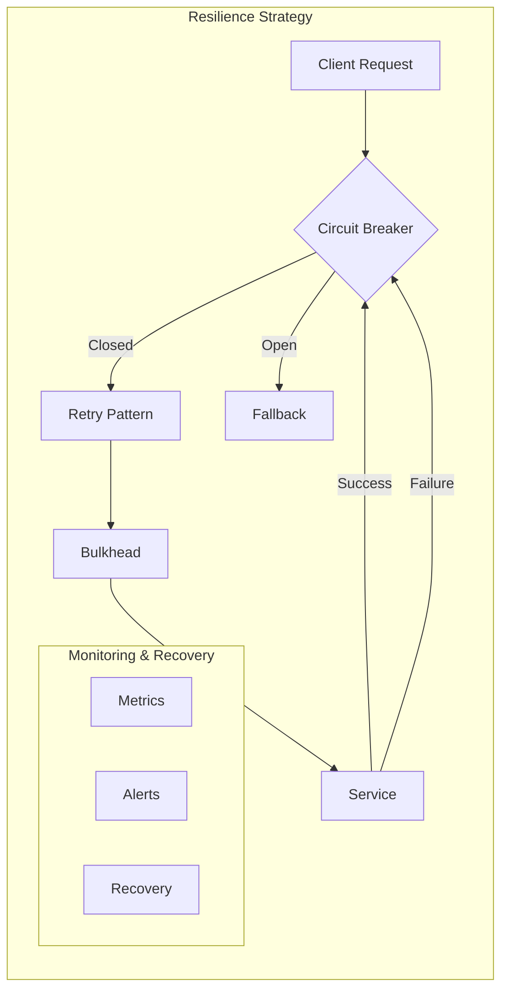
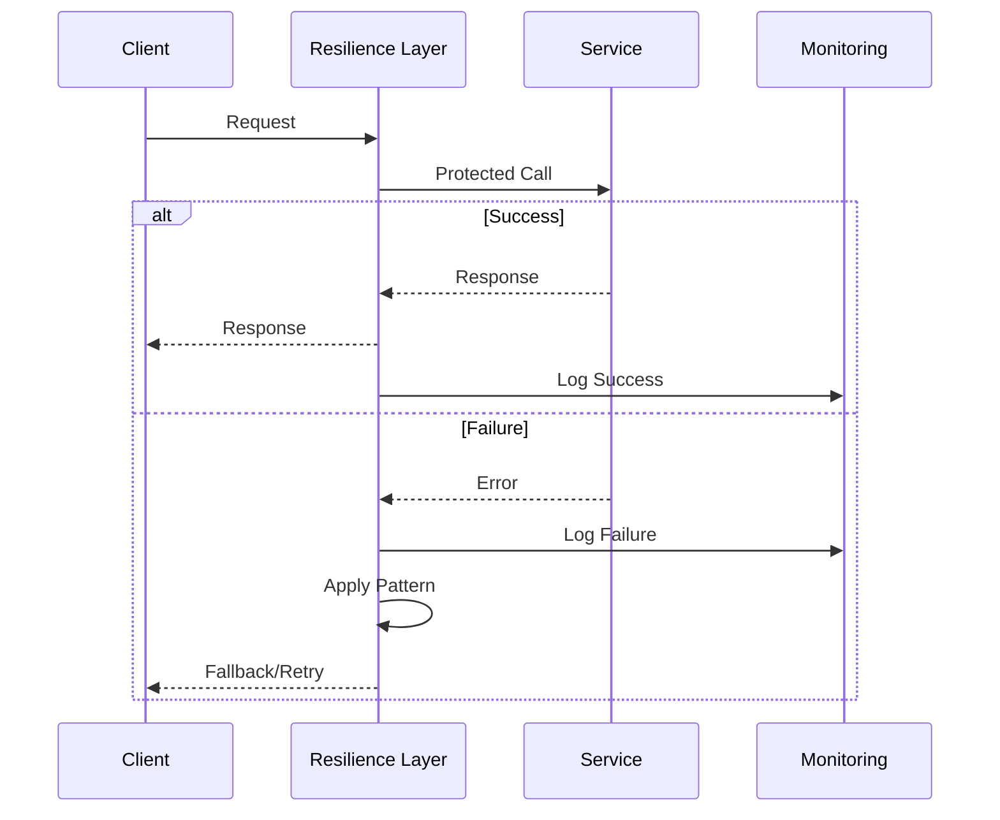
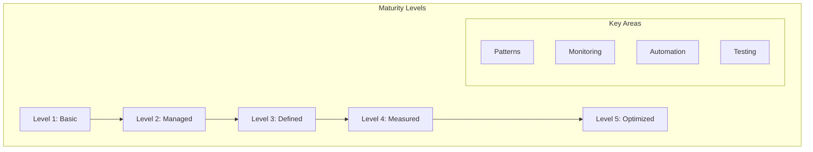

# Resilience Patterns and Implementation



## Fault Tolerance Architecture



## Implementation Examples

### 1. Circuit Breaker Pattern

```typescript
interface CircuitBreakerConfig {
    failureThreshold: number;
    resetTimeout: number;
    fallbackFn?: () => Promise<any>;
}

class CircuitBreaker {
    private failures: number = 0;
    private lastFailureTime?: Date;
    private state: 'CLOSED' | 'OPEN' | 'HALF_OPEN' = 'CLOSED';

    constructor(private config: CircuitBreakerConfig) {}

    async execute<T>(fn: () => Promise<T>): Promise<T> {
        if (this.state === 'OPEN') {
            if (this.shouldReset()) {
                this.state = 'HALF_OPEN';
            } else {
                return this.handleOpen();
            }
        }

        try {
            const result = await fn();
            this.handleSuccess();
            return result;
        } catch (error) {
            return this.handleFailure(error);
        }
    }

    private shouldReset(): boolean {
        if (!this.lastFailureTime) return false;
        const now = new Date();
        return (now.getTime() - this.lastFailureTime.getTime()) 
            >= this.config.resetTimeout;
    }

    private handleSuccess(): void {
        this.failures = 0;
        this.state = 'CLOSED';
    }

    private async handleFailure(error: Error): Promise<any> {
        this.failures++;
        this.lastFailureTime = new Date();

        if (this.failures >= this.config.failureThreshold) {
            this.state = 'OPEN';
        }

        if (this.config.fallbackFn) {
            return this.config.fallbackFn();
        }
        throw error;
    }

    private async handleOpen(): Promise<any> {
        if (this.config.fallbackFn) {
            return this.config.fallbackFn();
        }
        throw new Error('Circuit is OPEN');
    }
}
```

### 2. Retry Pattern with Exponential Backoff

```typescript
interface RetryConfig {
    maxAttempts: number;
    baseDelay: number;
    maxDelay: number;
    shouldRetry?: (error: Error) => boolean;
}

class RetryWithBackoff {
    constructor(private config: RetryConfig) {}

    async execute<T>(fn: () => Promise<T>): Promise<T> {
        let lastError: Error;
        
        for (let attempt = 1; attempt <= this.config.maxAttempts; attempt++) {
            try {
                return await fn();
            } catch (error) {
                lastError = error;
                
                if (this.config.shouldRetry && !this.config.shouldRetry(error)) {
                    throw error;
                }

                if (attempt === this.config.maxAttempts) {
                    throw error;
                }

                await this.delay(attempt);
            }
        }
        
        throw lastError;
    }

    private async delay(attempt: number): Promise<void> {
        const delay = Math.min(
            this.config.maxDelay,
            this.config.baseDelay * Math.pow(2, attempt - 1)
        );
        
        // Add jitter to prevent thundering herd
        const jitter = Math.random() * 100;
        await new Promise(resolve => setTimeout(resolve, delay + jitter));
    }
}
```

### 3. Bulkhead Pattern

```typescript
interface BulkheadConfig {
    maxConcurrentCalls: number;
    maxQueueSize: number;
    timeout: number;
}

class Bulkhead {
    private executingCalls: number = 0;
    private queue: Array<{
        resolve: (value: any) => void;
        reject: (error: Error) => void;
        fn: () => Promise<any>;
    }> = [];

    constructor(private config: BulkheadConfig) {}

    async execute<T>(fn: () => Promise<T>): Promise<T> {
        if (this.executingCalls >= this.config.maxConcurrentCalls) {
            return this.enqueue(fn);
        }

        return this.executeWithTimeout(fn);
    }

    private async enqueue<T>(fn: () => Promise<T>): Promise<T> {
        if (this.queue.length >= this.config.maxQueueSize) {
            throw new Error('Bulkhead queue is full');
        }

        return new Promise((resolve, reject) => {
            this.queue.push({ resolve, reject, fn });
        });
    }

    private async executeWithTimeout<T>(fn: () => Promise<T>): Promise<T> {
        this.executingCalls++;

        try {
            const timeoutPromise = new Promise((_, reject) => {
                setTimeout(() => reject(new Error('Operation timed out')), 
                    this.config.timeout);
            });

            const result = await Promise.race([fn(), timeoutPromise]);
            return result as T;
        } finally {
            this.executingCalls--;
            this.processQueue();
        }
    }

    private processQueue(): void {
        if (this.queue.length === 0) return;
        if (this.executingCalls >= this.config.maxConcurrentCalls) return;

        const next = this.queue.shift();
        if (next) {
            this.executeWithTimeout(next.fn)
                .then(next.resolve)
                .catch(next.reject);
        }
    }
}
```

## Resilience Strategy Patterns



## Monitoring and Recovery Flow



## Pattern Selection Framework

### 1. Decision Matrix
| Pattern | When to Use | Benefits | Trade-offs |
|---------|-------------|----------|------------|
| Circuit Breaker | High failure rates | Prevents cascade failures | Additional latency |
| Retry | Transient failures | Handles temporary issues | Increased load |
| Bulkhead | Resource contention | Isolates failures | Reduced throughput |
| Timeout | Slow responses | Bounds operations | Incomplete operations |

### 2. Pattern Combinations
1. **Circuit Breaker + Retry**
   - Retry on transient failures
   - Break circuit on persistent issues
   - Gradual recovery strategy

2. **Bulkhead + Timeout**
   - Resource pool management
   - Bounded execution time
   - Predictable failure modes

3. **Retry + Timeout**
   - Bounded retry attempts
   - Maximum operation time
   - Graceful degradation

## Resilience Maturity Model



### Level Characteristics

#### Level 1: Basic
- Basic error handling
- Manual recovery
- Limited monitoring
- Ad-hoc testing

#### Level 2: Managed
- Standard retry policies
- Basic circuit breakers
- Regular monitoring
- Planned testing

#### Level 3: Defined
- Multiple resilience patterns
- Automated recovery
- Comprehensive monitoring
- Regular chaos testing

#### Level 4: Measured
- Pattern effectiveness metrics
- Predictive monitoring
- Automated remediation
- Continuous resilience testing

#### Level 5: Optimized
- Self-tuning patterns
- ML-based predictions
- Autonomous operations
- Continuous optimization

## Implementation Guidelines

### 1. Pattern Implementation
- Start with core patterns
- Add complexity gradually
- Monitor effectiveness
- Adjust parameters based on data

### 2. Testing Strategy
- Unit tests for patterns
- Integration testing
- Chaos engineering
- Load testing
- Recovery validation

### 3. Monitoring Setup
- Pattern state changes
- Failure rates and types
- Recovery times
- Resource utilization

### 4. Documentation Requirements
- Pattern configurations
- Failure scenarios
- Recovery procedures
- Runbooks

## Implementation Checklist

### 1. Core Patterns
- [ ] Circuit breaker implementation
- [ ] Retry mechanism with backoff
- [ ] Bulkhead pattern setup
- [ ] Timeout handlers
- [ ] Fallback mechanisms

### 2. Monitoring
- [ ] Pattern state monitoring
- [ ] Failure rate tracking
- [ ] Recovery time measurement
- [ ] Resource usage monitoring
- [ ] Alert configuration

### 3. Testing
- [ ] Unit tests for patterns
- [ ] Integration test suite
- [ ] Chaos testing setup
- [ ] Performance test scenarios
- [ ] Recovery procedure validation

### 4. Operations
- [ ] Runbook documentation
- [ ] Alert response procedures
- [ ] Escalation paths
- [ ] Recovery playbooks
- [ ] Post-mortem templates

### 5. Continuous Improvement
- [ ] Pattern effectiveness metrics
- [ ] Regular pattern review
- [ ] Parameter optimization
- [ ] Failure analysis
- [ ] Pattern evolution strategy

## Anti-patterns to Avoid

### 1. Retry Storm
- Uncontrolled retries
- No backoff strategy
- Network amplification
- Resource exhaustion

### 2. Cascading Timeouts
- Nested timeout configurations
- Timeout propagation
- Unpredictable behavior
- Resource leaks

### 3. Hidden Dependencies
- Undocumented dependencies
- Unclear failure modes
- Unexpected cascading failures
- Complex recovery

### 4. Inconsistent Recovery
- Manual recovery procedures
- Undefined states
- Data inconsistency
- Partial failures

## Best Practices

1. **Pattern Combination**
   - Layer resilience patterns appropriately
   - Consider interaction between patterns
   - Monitor pattern effectiveness
   - Adjust thresholds based on metrics

2. **Configuration Guidelines**
   - Set appropriate timeouts
   - Configure reasonable retry limits
   - Implement gradual circuit breaker recovery
   - Use backoff strategies

3. **Monitoring Requirements**
   - Track pattern state changes
   - Monitor failure rates
   - Measure recovery times
   - Alert on pattern activation

4. **Testing Strategies**
   - Chaos engineering
   - Failure injection
   - Load testing
   - Recovery validation

Remember: Resilience is not just about implementing patterns, but about creating a comprehensive strategy that includes monitoring, testing, and continuous improvement. The goal is to build systems that can detect, respond to, and recover from failures automatically while maintaining system stability.