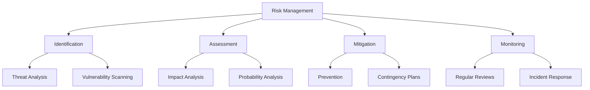
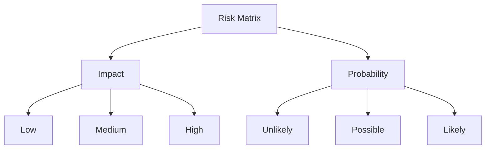
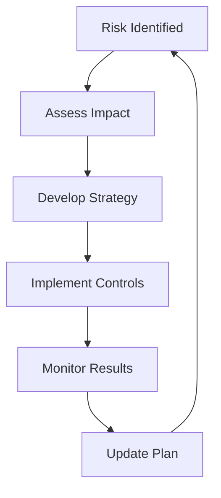

# Risk Assessment and Mitigation

## Overview
Risk assessment and mitigation involves identifying, analyzing, and addressing potential threats and vulnerabilities to ensure system reliability and business continuity.



## Key Components

### Risk Identification
- System vulnerabilities
- External threats
- Dependencies
- Resource constraints

### Risk Assessment
- Impact severity
- Occurrence probability
- Risk scoring
- Priority setting

### Risk Mitigation
- Prevention strategies
- Contingency plans
- Resource allocation
- Implementation timeline

### Risk Monitoring
- Regular reviews
- Metrics tracking
- Incident response
- Continuous improvement

## Risk Categories

### Technical Risks
- System failures
- Security breaches
- Performance issues
- Integration problems
- Data loss

### Operational Risks
- Resource unavailability
- Process failures
- Human error
- Communication gaps
- Service disruptions

### Strategic Risks
- Market changes
- Technology shifts
- Regulatory compliance
- Competition
- Business model changes

### External Risks
- Natural disasters
- Vendor issues
- Economic factors
- Political changes
- Legal requirements

## Risk Assessment Matrix


### Risk Scoring Table
| Impact     | Probability | Score | Priority |
|------------|------------|-------|----------|
| High       | Likely     | 9     | Critical |
| High       | Possible   | 6     | High     |
| Medium     | Likely     | 6     | High     |
| Medium     | Possible   | 4     | Medium   |
| Low        | Likely     | 3     | Low      |
| Low        | Possible   | 2     | Low      |

## Best Practices Checklist

### Risk Identification
- [ ] Conduct regular assessments
- [ ] Document all risks
- [ ] Classify risk types
- [ ] Identify dependencies

### Risk Assessment
- [ ] Evaluate impact
- [ ] Determine probability
- [ ] Calculate risk scores
- [ ] Prioritize risks

### Risk Mitigation
- [ ] Develop strategies
- [ ] Allocate resources
- [ ] Create action plans
- [ ] Assign responsibilities

### Risk Monitoring
- [ ] Track metrics
- [ ] Review regularly
- [ ] Update plans
- [ ] Document incidents

## Mitigation Strategies

### Prevention
- Implement security controls
- Regular maintenance
- Training and awareness
- Process automation
- Quality assurance

### Detection
- Monitoring systems
- Alert mechanisms
- Regular audits
- Performance metrics
- Security scanning

### Response
- Incident response plans
- Disaster recovery
- Business continuity
- Communication plans
- Escalation procedures

## Examples

### Risk Register Template
| Risk ID | Description | Category | Impact | Probability | Score | Mitigation Strategy | Owner | Status |
|---------|-------------|----------|---------|-------------|-------|-------------------|--------|--------|
| R001    | Data breach | Security | High    | Possible    | 6     | Encryption        | InfoSec| Active |
| R002    | System down | Technical| High    | Unlikely    | 3     | Redundancy       | DevOps | Active |

### Incident Response Template
```plaintext
Incident: [Description]

Severity: [High/Medium/Low]
Impact: [Description]
Time Detected: [DateTime]
Time Resolved: [DateTime]

Response Actions:
1. [Immediate actions taken]
2. [Escalation if needed]
3. [Resolution steps]

Root Cause Analysis:
- [Findings]
- [Contributing factors]

Prevention Measures:
1. [Short-term fixes]
2. [Long-term improvements]
```

### Risk Mitigation Plan


## Tools and Techniques

### Assessment Tools
- Risk assessment matrices
- Vulnerability scanners
- Monitoring systems
- Audit tools
- Analytics platforms

### Documentation Tools
- Risk registers
- Incident logs
- Action trackers
- Dashboards
- Report generators

## Common Challenges

### Assessment Challenges
- Incomplete information
- Changing environments
- Complex dependencies
- Resource constraints

### Implementation Challenges
- Budget limitations
- Time constraints
- Technical complexity
- Resistance to change

## Best Practices Examples

### Security Risks
```yaml
risk:
  type: Security
  description: Unauthorized system access
  impact: High
  probability: Medium
  mitigation:
    - Implement multi-factor authentication
    - Regular security audits
    - Access control reviews
    - Security awareness training
```

### Performance Risks
```yaml
risk:
  type: Performance
  description: System scalability issues
  impact: Medium
  probability: High
  mitigation:
    - Load testing
    - Performance monitoring
    - Capacity planning
    - Auto-scaling implementation
```

## Additional Resources
1. Books
   - "Risk Management in Software Engineering" by John Rittinghouse
   - "The Security Risk Assessment Handbook" by Douglas Landoll
   - "Managing Risk in Information Systems" by Darril Gibson

2. Online Courses
   - Risk Management for IT Projects
   - Information Security Risk Assessment
   - Business Continuity Planning

3. Tools
   - Risk management software
   - Security assessment tools
   - Monitoring platforms