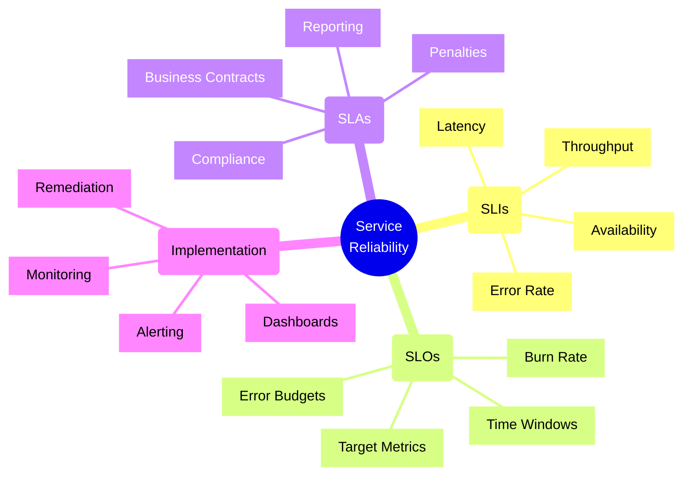
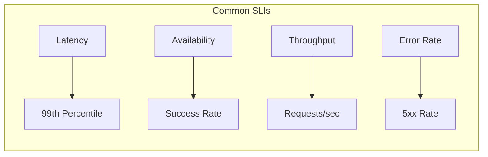
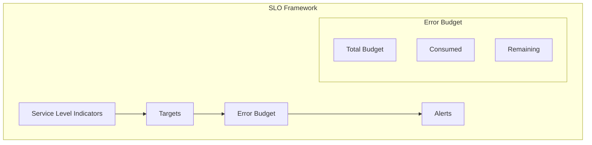
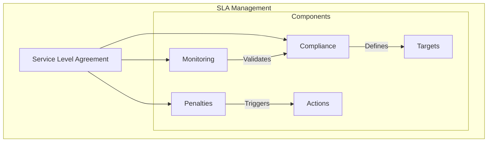
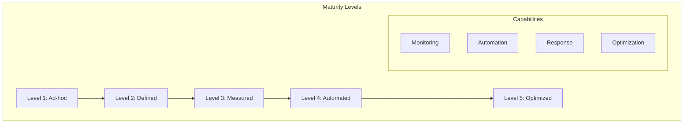

# SLI/SLO/SLA Frameworks

## Core Concepts

### 1. Service Level Indicators (SLIs)

### 2. Service Level Objectives (SLOs)

### 3. Service Level Agreements (SLAs)

## Implementation Checklist

### SLI Implementation
- [ ] Define key metrics for each service
- [ ] Set up metric collection
- [ ] Implement data aggregation
- [ ] Configure visualization
- [ ] Set up alerting thresholds
- [ ] Document measurement methods
- [ ] Validate data accuracy

### SLO Configuration
- [ ] Define service objectives
- [ ] Set realistic targets
- [ ] Calculate error budgets
- [ ] Configure monitoring
- [ ] Set up alerts
- [ ] Document dependencies
- [ ] Plan remediation actions

### SLA Management
- [ ] Define service commitments
- [ ] Document penalties
- [ ] Set up compliance monitoring
- [ ] Configure reporting
- [ ] Plan incident response
- [ ] Define escalation paths
- [ ] Review and update regularly

## Trade-offs

### Availability vs. Cost
- **High Availability**
  - Pros:
    * Better user experience
    * Higher reliability
    * Fewer incidents
  - Cons:
    * Higher infrastructure costs
    * More complex architecture
    * Increased operational overhead

### Monitoring Granularity vs. Performance
- **High Granularity**
  - Pros:
    * Better insights
    * Faster troubleshooting
    * Detailed analysis
  - Cons:
    * Performance impact
    * Storage costs
    * Processing overhead

### Error Budget vs. Feature Velocity
- **Conservative Error Budget**
  - Pros:
    * Higher reliability
    * Better user trust
    * Fewer incidents
  - Cons:
    * Slower feature delivery
    * Increased development time
    * Higher development costs

### Automated vs. Manual Response
- **Automated Response**
  - Pros:
    * Faster resolution
    * Consistent handling
    * 24/7 coverage
  - Cons:
    * Potential false positives
    * Complex setup
    * Higher maintenance

## Service Level Maturity Model

## Best Practices

1. **Metric Selection**
   - Choose meaningful metrics
   - Focus on user experience
   - Keep metrics simple
   - Ensure measurability
   - Regular validation
   - Document methodology
   - Review periodically

2. **Target Setting**
   - Use historical data
   - Set realistic goals
   - Consider dependencies
   - Account for growth
   - Plan for reviews
   - Document assumptions
   - Get stakeholder buy-in

3. **Monitoring Setup**
   - Implement redundancy
   - Use proper tools
   - Set up alerting
   - Configure dashboards
   - Regular testing
   - Document procedures
   - Train team members

4. **Incident Response**
   - Define clear procedures
   - Set up escalation paths
   - Document runbooks
   - Regular drills
   - Post-mortems
   - Continuous improvement
   - Knowledge sharing

## Metrics Classification Matrix

| Category | Metric Type | SLI Example | Target SLO | Typical SLA |
|----------|------------|-------------|------------|-------------|
| Availability | Uptime | Success Rate | 99.9% | 99.5% |
| Performance | Latency | P95 Response | 200ms | 500ms |
| Throughput | Capacity | RPS | 1000/s | 800/s |
| Error Rate | Failures | 5xx Rate | 0.1% | 0.5% |
| Durability | Data Loss | Corruption Rate | 0.001% | 0.01% |

Remember: SLIs, SLOs, and SLAs form a hierarchy of service reliability measures. Start with good SLIs, set realistic SLOs, and only then consider SLA commitments.