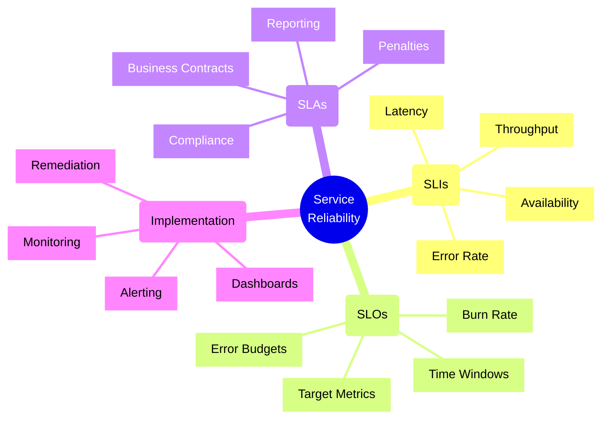
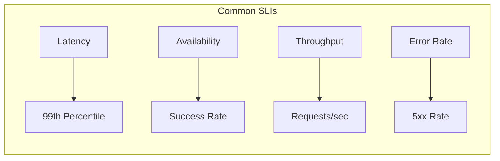
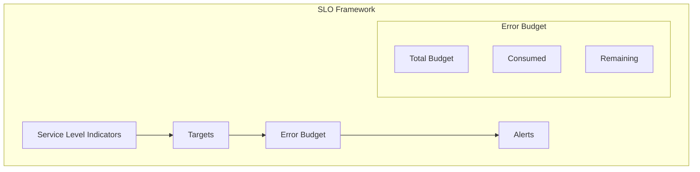
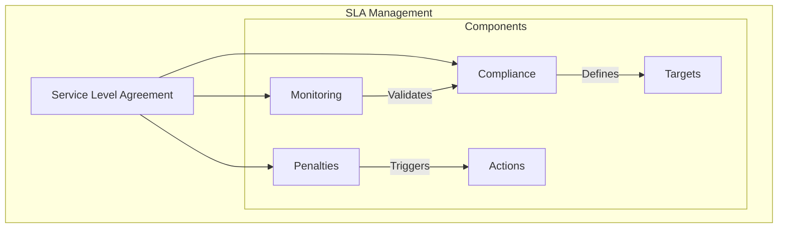
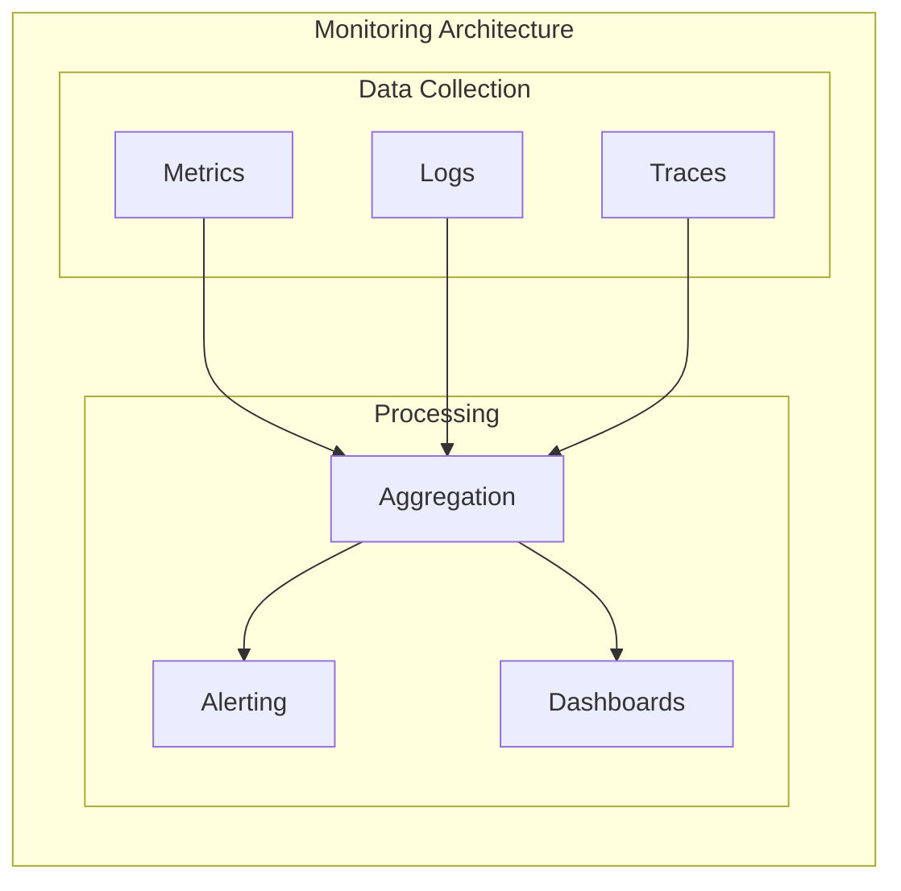
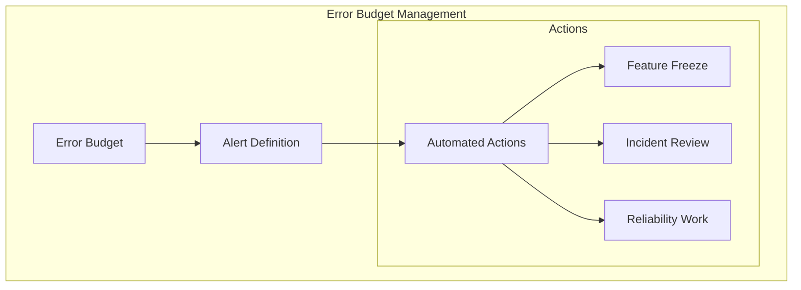

# SLI/SLO/SLA Frameworks



## Core Concepts

### 1. Service Level Indicators (SLIs)
Key metrics that measure service performance:



Implementation Example:
```typescript
// SLI monitoring with Prometheus and Node.js
import client from 'prom-client';

// Latency histogram
const httpRequestDuration = new client.Histogram({
    name: 'http_request_duration_seconds',
    help: 'HTTP request duration in seconds',
    labelNames: ['method', 'route', 'status_code'],
    buckets: [0.1, 0.3, 0.5, 0.7, 1, 3, 5, 7, 10]
});

// Error rate counter
const httpErrors = new client.Counter({
    name: 'http_request_errors_total',
    help: 'Total count of HTTP errors',
    labelNames: ['method', 'route', 'error_type']
});

// Middleware for Express.js
app.use((req, res, next) => {
    const start = Date.now();
    
    res.on('finish', () => {
        const duration = (Date.now() - start) / 1000;
        
        httpRequestDuration
            .labels(req.method, req.route?.path ?? 'unknown', res.statusCode.toString())
            .observe(duration);
            
        if (res.statusCode >= 500) {
            httpErrors
                .labels(req.method, req.route?.path ?? 'unknown', 'server_error')
                .inc();
        }
    });
    
    next();
});
```

### 2. Service Level Objectives (SLOs)
Target values for service performance:



Implementation Example:
```typescript
// Error budget calculation and monitoring
class ErrorBudgetTracker {
    private readonly monthlyBudget: number;  // 99.9% = 0.001 error budget
    private consumed: number = 0;

    constructor(sloPercentage: number) {
        // Calculate monthly error budget in minutes
        this.monthlyBudget = (100 - sloPercentage) * 43200 / 100; // 43200 minutes in 30 days
    }

    trackIncident(durationMinutes: number): void {
        this.consumed += durationMinutes;
        
        const remaining = this.monthlyBudget - this.consumed;
        const burnRate = this.consumed / this.monthlyBudget;

        if (burnRate > 0.75) {  // Alert if we've used 75% of budget
            this.alertHighBurnRate(burnRate, remaining);
        }
    }

    getRemainingBudget(): number {
        return Math.max(0, this.monthlyBudget - this.consumed);
    }
}

// Usage example
const sloTracker = new ErrorBudgetTracker(99.9);

// Track an incident
sloTracker.trackIncident(30);  // 30-minute outage
```

### 3. Service Level Agreements (SLAs)
Business contracts defining service commitments:



Implementation Example:
```typescript
// SLA compliance monitoring system
interface SLADefinition {
    service: string;
    metric: string;
    target: number;
    window: string;
    penalty: PenaltyTier[];
}

class SLAMonitor {
    constructor(
        private sla: SLADefinition,
        private metricsClient: MetricsClient
    ) {}

    async checkCompliance(startTime: Date, endTime: Date): Promise<ComplianceReport> {
        const metrics = await this.metricsClient.getMetrics(
            this.sla.metric,
            startTime,
            endTime
        );

        const achieved = this.calculateAchievedSLA(metrics);
        const compliant = achieved >= this.sla.target;
        
        if (!compliant) {
            const penalty = this.calculatePenalty(achieved);
            await this.notifyStakeholders(achieved, penalty);
        }

        return {
            service: this.sla.service,
            target: this.sla.target,
            achieved,
            compliant,
            window: { startTime, endTime }
        };
    }

    private calculatePenalty(achieved: number): number {
        const breach = this.sla.target - achieved;
        const applicableTier = this.sla.penalty
            .find(tier => breach >= tier.threshold);
            
        return applicableTier ? applicableTier.amount : 0;
    }
}
```

## Implementation Strategies

### 1. Monitoring Setup



Implementation Example (using Azure Monitor):
```typescript
import { MetricsClient } from '@azure/monitor-query';

class ServiceMonitor {
    constructor(private metricsClient: MetricsClient) {}

    async monitorSLIs(resourceId: string): Promise<SLIMetrics> {
        const now = new Date();
        const startTime = new Date(now.getTime() - 3600000); // Last hour

        // Query multiple metrics in parallel
        const [availability, latency, errors] = await Promise.all([
            this.queryAvailability(resourceId, startTime, now),
            this.queryLatency(resourceId, startTime, now),
            this.queryErrors(resourceId, startTime, now)
        ]);

        return {
            availability,
            latency: latency.p99,
            errorRate: errors / availability.requests,
            timestamp: now
        };
    }

    private async queryLatency(
        resourceId: string,
        startTime: Date,
        endTime: Date
    ): Promise<LatencyMetrics> {
        const metrics = await this.metricsClient.queryResource({
            resourceUri: resourceId,
            metricNames: ['RequestDuration'],
            timespan: { startTime, endTime },
            aggregations: ['Average', 'Maximum', 'P99']
        });

        return {
            avg: metrics.average,
            max: metrics.maximum,
            p99: metrics.p99
        };
    }
}
```

### 2. Error Budget Policy



Example Policy Implementation:
```typescript
// Error budget policy implementation
class ErrorBudgetPolicy {
    private readonly budgetThresholds = {
        warning: 0.75,  // 75% consumed
        critical: 0.90, // 90% consumed
        depleted: 1.0   // 100% consumed
    };

    constructor(
        private errorBudget: ErrorBudget,
        private releaseManager: ReleaseManager,
        private notificationSystem: NotificationSystem
    ) {}

    async evaluateBudget(): Promise<void> {
        const consumption = await this.errorBudget.getConsumption();
        
        if (consumption >= this.budgetThresholds.depleted) {
            await this.handleDepleted();
        } else if (consumption >= this.budgetThresholds.critical) {
            await this.handleCritical();
        } else if (consumption >= this.budgetThresholds.warning) {
            await this.handleWarning();
        }
    }

    private async handleDepleted(): Promise<void> {
        // Automatically freeze non-critical releases
        await this.releaseManager.freezeNonCriticalReleases();
        
        // Notify stakeholders
        await this.notificationSystem.sendHighPriorityAlert({
            title: 'Error Budget Depleted',
            description: 'All non-critical releases are frozen. Focus on reliability improvements.',
            actions: ['Schedule Post-Mortem', 'Review Reliability Metrics']
        });
    }
}
```

## Best Practices

1. **SLI Selection**
   - Choose meaningful metrics
   - Keep metrics simple and clear
   - Focus on user experience
   - Ensure metrics are measurable

2. **SLO Definition**
   - Set realistic targets
   - Consider business impact
   - Plan for iteration
   - Document assumptions

3. **SLA Management**
   - Align with business goals
   - Include measurement methods
   - Define clear penalties
   - Review periodically

4. **Implementation**
   - Use appropriate monitoring tools
   - Implement automated alerts
   - Create clear dashboards
   - Plan remediation steps

Remember: SLI/SLO/SLA frameworks are essential for maintaining service reliability and meeting business commitments. Regular review and adjustment of these metrics helps ensure continuous improvement of service quality.