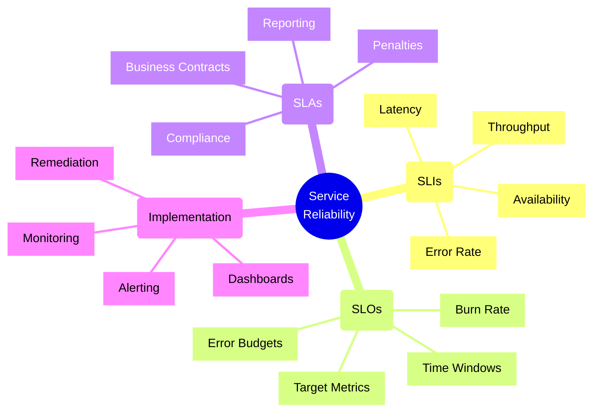
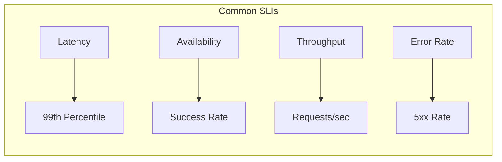
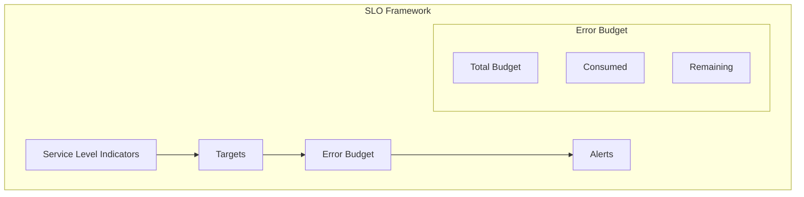
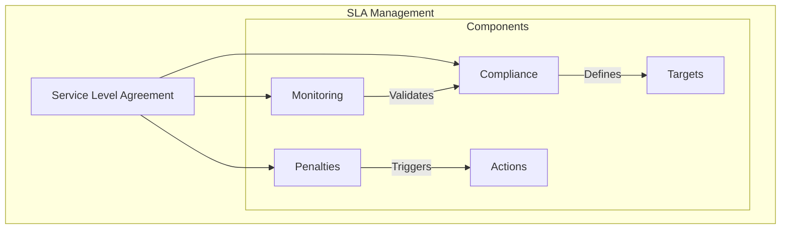
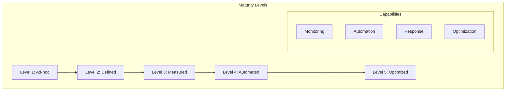

# SLI/SLO/SLA Frameworks



## Core Concepts

### 1. Service Level Indicators (SLIs)
Key metrics that measure service performance:



Implementation Example:
```typescript
// SLI monitoring with Prometheus and Node.js
import client from 'prom-client';

// Latency histogram
const httpRequestDuration = new client.Histogram({
    name: 'http_request_duration_seconds',
    help: 'HTTP request duration in seconds',
    labelNames: ['method', 'route', 'status_code'],
    buckets: [0.1, 0.3, 0.5, 0.7, 1, 3, 5, 7, 10]
});

// Error rate counter
const httpErrors = new client.Counter({
    name: 'http_request_errors_total',
    help: 'Total count of HTTP errors',
    labelNames: ['method', 'route', 'error_type']
});

// Middleware for Express.js
app.use((req, res, next) => {
    const start = Date.now();
    
    res.on('finish', () => {
        const duration = (Date.now() - start) / 1000;
        
        httpRequestDuration
            .labels(req.method, req.route?.path ?? 'unknown', res.statusCode.toString())
            .observe(duration);
            
        if (res.statusCode >= 500) {
            httpErrors
                .labels(req.method, req.route?.path ?? 'unknown', 'server_error')
                .inc();
        }
    });
    
    next();
});
```

### 2. Service Level Objectives (SLOs)
Target values for service performance:



Implementation Example:
```typescript
// Error budget calculation and monitoring
class ErrorBudgetTracker {
    private readonly monthlyBudget: number;  // 99.9% = 0.001 error budget
    private consumed: number = 0;

    constructor(sloPercentage: number) {
        // Calculate monthly error budget in minutes
        this.monthlyBudget = (100 - sloPercentage) * 43200 / 100; // 43200 minutes in 30 days
    }

    trackIncident(durationMinutes: number): void {
        this.consumed += durationMinutes;
        
        const remaining = this.monthlyBudget - this.consumed;
        const burnRate = this.consumed / this.monthlyBudget;

        if (burnRate > 0.75) {  // Alert if we've used 75% of budget
            this.alertHighBurnRate(burnRate, remaining);
        }
    }

    getRemainingBudget(): number {
        return Math.max(0, this.monthlyBudget - this.consumed);
    }
}

// Usage example
const sloTracker = new ErrorBudgetTracker(99.9);

// Track an incident
sloTracker.trackIncident(30);  // 30-minute outage
```

### 3. Service Level Agreements (SLAs)
Business contracts defining service commitments:



Implementation Example:
```typescript
// SLA compliance monitoring system
interface SLADefinition {
    service: string;
    metric: string;
    target: number;
    window: string;
    penalty: PenaltyTier[];
}

class SLAMonitor {
    constructor(
        private sla: SLADefinition,
        private metricsClient: MetricsClient
    ) {}

    async checkCompliance(startTime: Date, endTime: Date): Promise<ComplianceReport> {
        const metrics = await this.metricsClient.getMetrics(
            this.sla.metric,
            startTime,
            endTime
        );

        const achieved = this.calculateAchievedSLA(metrics);
        const compliant = achieved >= this.sla.target;
        
        if (!compliant) {
            const penalty = this.calculatePenalty(achieved);
            await this.notifyStakeholders(achieved, penalty);
        }

        return {
            service: this.sla.service,
            target: this.sla.target,
            achieved,
            compliant,
            window: { startTime, endTime }
        };
    }

    private calculatePenalty(achieved: number): number {
        const breach = this.sla.target - achieved;
        const applicableTier = this.sla.penalty
            .find(tier => breach >= tier.threshold);
            
        return applicableTier ? applicableTier.amount : 0;
    }
}
```

## Service Level Maturity Model



### Level Characteristics

#### Level 1: Ad-hoc
- Basic uptime monitoring
- Manual incident response
- Undefined SLIs
- Reactive maintenance

#### Level 2: Defined
- Defined SLIs and SLOs
- Basic monitoring setup
- Manual reporting
- Documented procedures

#### Level 3: Measured
- Comprehensive monitoring
- Regular SLA reporting
- Error budget tracking
- Automated alerts

#### Level 4: Automated
- Automated responses
- Proactive monitoring
- Integrated dashboards
- Automated reporting

#### Level 5: Optimized
- ML-based predictions
- Self-healing systems
- Continuous optimization
- Automated adjustments

## Additional Implementation Examples

### 1. SLI Aggregator
```typescript
interface SLIConfig {
    name: string;
    description: string;
    metric: string;
    aggregation: 'avg' | 'sum' | 'p95' | 'p99';
    window: number; // minutes
    labels?: Record<string, string>;
}

class SLIAggregator {
    private cache: Map<string, SLIValue[]> = new Map();

    constructor(
        private config: SLIConfig,
        private metricClient: MetricClient
    ) {}

    async getCurrentValue(): Promise<SLIValue> {
        const endTime = new Date();
        const startTime = new Date(endTime.getTime() - this.config.window * 60000);

        const rawMetrics = await this.metricClient.queryMetrics({
            name: this.config.metric,
            startTime,
            endTime,
            labels: this.config.labels
        });

        const value = this.aggregate(rawMetrics);
        this.updateCache(value);

        return {
            name: this.config.name,
            value,
            timestamp: endTime,
            window: this.config.window
        };
    }

    private aggregate(metrics: MetricValue[]): number {
        switch (this.config.aggregation) {
            case 'avg':
                return this.calculateAverage(metrics);
            case 'sum':
                return this.calculateSum(metrics);
            case 'p95':
                return this.calculatePercentile(metrics, 95);
            case 'p99':
                return this.calculatePercentile(metrics, 99);
            default:
                throw new Error(`Unsupported aggregation: ${this.config.aggregation}`);
        }
    }
}
```

### 2. SLO Evaluator
```typescript
interface SLOEvaluation {
    sloName: string;
    target: number;
    current: number;
    status: 'healthy' | 'warning' | 'critical';
    remainingBudget: number;
    burnRate: number;
}

class SLOEvaluator {
    private readonly warningThreshold = 0.75; // 75% of error budget consumed
    private readonly criticalThreshold = 0.90; // 90% of error budget consumed

    constructor(private sliAggregator: SLIAggregator) {}

    async evaluateSLO(slo: SLODefinition): Promise<SLOEvaluation> {
        const currentValue = await this.sliAggregator.getCurrentValue();
        const errorBudget = this.calculateErrorBudget(slo.target);
        const consumed = this.calculateBudgetConsumed(currentValue.value, slo.target);
        const remaining = Math.max(0, errorBudget - consumed);
        const burnRate = consumed / errorBudget;

        return {
            sloName: slo.name,
            target: slo.target,
            current: currentValue.value,
            status: this.determineStatus(burnRate),
            remainingBudget: remaining,
            burnRate
        };
    }

    private determineStatus(burnRate: number): 'healthy' | 'warning' | 'critical' {
        if (burnRate >= this.criticalThreshold) return 'critical';
        if (burnRate >= this.warningThreshold) return 'warning';
        return 'healthy';
    }
}
```

### 3. SLA Reporter
```typescript
interface SLAReport {
    service: string;
    period: {
        start: Date;
        end: Date;
    };
    sloResults: SLOEvaluation[];
    compliance: boolean;
    penalties?: PenaltyCalculation[];
}

class SLAReporter {
    constructor(
        private sloEvaluator: SLOEvaluator,
        private notifier: NotificationSystem
    ) {}

    async generateReport(sla: SLADefinition): Promise<SLAReport> {
        const endTime = new Date();
        const startTime = this.getReportingPeriodStart(sla.reportingPeriod);

        const sloResults = await Promise.all(
            sla.objectives.map(slo => this.sloEvaluator.evaluateSLO(slo))
        );

        const compliance = this.checkCompliance(sloResults, sla.minimumThreshold);
        const report = {
            service: sla.service,
            period: { start: startTime, end: endTime },
            sloResults,
            compliance
        };

        if (!compliance) {
            report.penalties = this.calculatePenalties(sloResults, sla.penalties);
            await this.notifier.sendAlert({
                severity: 'high',
                title: 'SLA Breach Detected',
                details: report
            });
        }

        return report;
    }

    private calculatePenalties(
        results: SLOEvaluation[],
        penalties: PenaltyDefinition[]
    ): PenaltyCalculation[] {
        return results
            .filter(result => result.status === 'critical')
            .map(result => this.calculatePenalty(result, penalties));
    }
}
```

## Validation Framework

### 1. SLI Validation Matrix
| Aspect | Validation Criteria | Method | Frequency |
|--------|-------------------|---------|-----------|
| Data Quality | Accuracy, Completeness | Automated Tests | Hourly |
| Collection | Coverage, Reliability | System Check | Daily |
| Aggregation | Correctness, Timeliness | Validation Rules | Real-time |
| Reporting | Consistency, Accessibility | Manual Review | Weekly |

### 2. SLO Validation Guidelines
1. **Target Setting**
   - Historical analysis
   - Business alignment
   - Technical feasibility
   - Customer impact

2. **Error Budget**
   - Budget calculation
   - Consumption tracking
   - Alert thresholds
   - Action triggers

3. **Review Process**
   - Regular reviews
   - Stakeholder feedback
   - Adjustment process
   - Documentation

### 3. SLA Compliance Checklist
- [ ] Metric validation
- [ ] Data collection verification
- [ ] Calculation accuracy
- [ ] Reporting timeliness
- [ ] Alert functionality
- [ ] Documentation completeness
- [ ] Stakeholder communication
- [ ] Review procedures

## Operational Procedures

### 1. Monitoring Implementation
1. **Data Collection**
   - Define data sources
   - Set up collectors
   - Configure aggregation
   - Validate accuracy

2. **Alert Configuration**
   - Define thresholds
   - Set up notifications
   - Configure escalations
   - Test alert flow

3. **Dashboard Setup**
   - Create overview
   - Define drill-downs
   - Configure filters
   - Set up exports

### 2. Review Process
1. **Weekly Review**
   - Performance analysis
   - Trend evaluation
   - Issue identification
   - Action planning

2. **Monthly Review**
   - SLO achievement
   - Error budget status
   - Improvement proposals
   - Documentation updates

3. **Quarterly Review**
   - SLA compliance
   - Target adjustment
   - Process improvement
   - Strategy alignment

## Best Practices

1. **SLI Selection**
   - Choose meaningful metrics
   - Keep metrics simple and clear
   - Focus on user experience
   - Ensure metrics are measurable

2. **SLO Definition**
   - Set realistic targets
   - Consider business impact
   - Plan for iteration
   - Document assumptions

3. **SLA Management**
   - Align with business goals
   - Include measurement methods
   - Define clear penalties
   - Review periodically

4. **Implementation**
   - Use appropriate monitoring tools
   - Implement automated alerts
   - Create clear dashboards
   - Plan remediation steps

Remember: SLI/SLO/SLA frameworks are essential for maintaining service reliability and meeting business commitments. Regular review and adjustment of these metrics helps ensure continuous improvement of service quality.