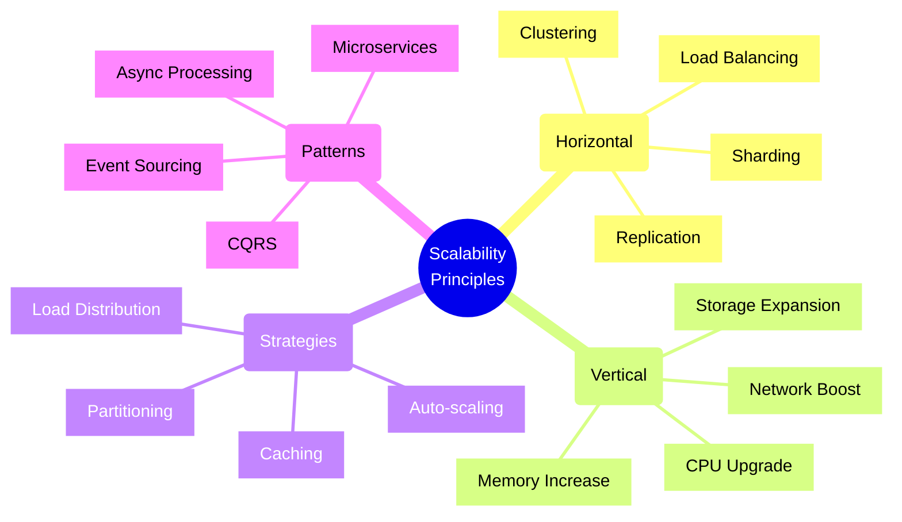
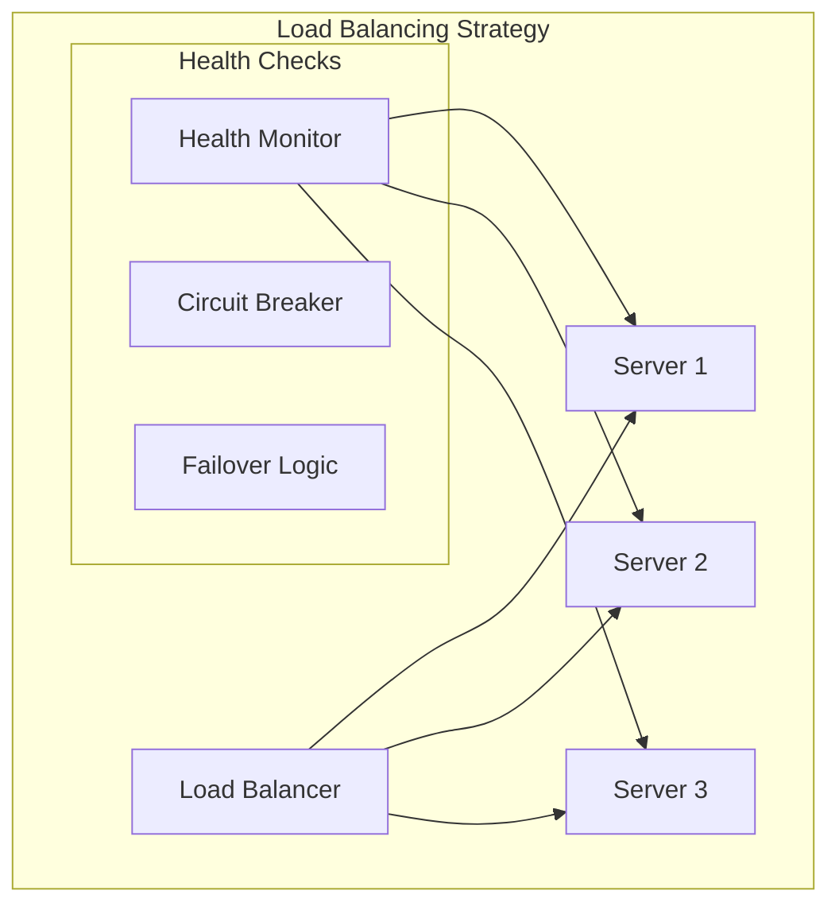
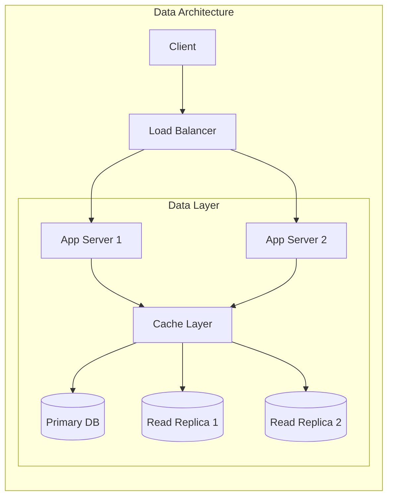
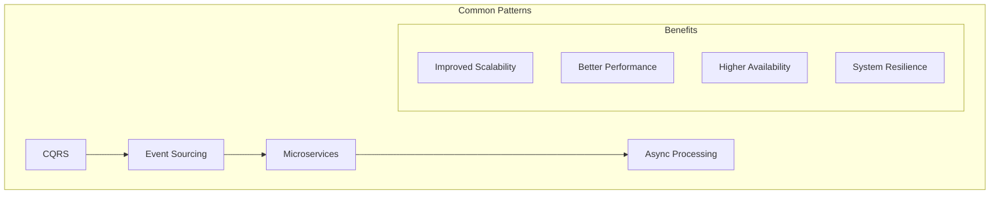

# Scalability Principles and Implementations

## Architectural Components

### 1. Load Distribution

### 2. Data Management

## Implementation Checklist

### Infrastructure Scalability
- [ ] Implement auto-scaling configuration
- [ ] Set up load balancing
- [ ] Configure health checks
- [ ] Implement circuit breakers
- [ ] Set up monitoring and alerts
- [ ] Configure resource limits
- [ ] Plan capacity thresholds
- [ ] Document scaling procedures
- [ ] Test failover scenarios

### Application Layer
- [ ] Implement caching strategy
- [ ] Configure session management
- [ ] Set up connection pooling
- [ ] Implement retry logic
- [ ] Configure timeouts
- [ ] Optimize database queries
- [ ] Implement asynchronous processing
- [ ] Set up message queues
- [ ] Configure rate limiting

### Data Layer
- [ ] Configure data partitioning
- [ ] Set up read replicas
- [ ] Implement sharding strategy
- [ ] Configure backup systems
- [ ] Set up data synchronization
- [ ] Implement cache invalidation
- [ ] Configure data consistency
- [ ] Plan data migration
- [ ] Monitor data growth

### Performance Monitoring
- [ ] Set up resource monitoring
- [ ] Configure performance metrics
- [ ] Implement logging strategy
- [ ] Set up alerting thresholds
- [ ] Configure tracing
- [ ] Monitor error rates
- [ ] Track response times
- [ ] Measure throughput
- [ ] Monitor saturation points

## Trade-offs

### Consistency vs. Availability
- **Strong Consistency**
  - Pros:
    * Data accuracy
    * Predictable behavior
    * Simpler application logic
  - Cons:
    * Higher latency
    * Reduced availability
    * Lower throughput

### Performance vs. Cost
- **High Performance**
  - Pros:
    * Better user experience
    * Higher throughput
    * Improved reliability
  - Cons:
    * Higher infrastructure costs
    * More complex architecture
    * Increased operational overhead

### Scalability vs. Complexity
- **High Scalability**
  - Pros:
    * Better growth handling
    * Improved reliability
    * Future-proof
  - Cons:
    * More complex architecture
    * Higher development costs
    * Increased maintenance

### Automation vs. Control
- **Full Automation**
  - Pros:
    * Faster response
    * Reduced human error
    * 24/7 operation
  - Cons:
    * Higher setup complexity
    * Less direct control
    * Potential over-provisioning

## Scalability Patterns

## Best Practices

1. **Architecture Design**
   - Design for failure
   - Keep components loosely coupled
   - Implement proper segmentation
   - Use appropriate patterns
   - Plan for growth
   - Document decisions
   - Regular architecture reviews

2. **Performance**
   - Optimize critical paths
   - Implement caching
   - Use connection pooling
   - Regular performance testing
   - Monitor bottlenecks
   - Profile applications
   - Optimize resource usage

3. **Operations**
   - Automate scaling operations
   - Monitor system health
   - Regular capacity planning
   - Document procedures
   - Train operations team
   - Regular disaster recovery tests
   - Keep systems updated

4. **Data Management**
   - Plan data distribution
   - Implement proper indexing
   - Regular data cleanup
   - Monitor data growth
   - Plan for backups
   - Test recovery procedures
   - Maintain data consistency

## Scalability Assessment Matrix

| Aspect | Metrics | Scale Triggers | Monitoring |
|--------|---------|---------------|------------|
| CPU | Usage % | >70% | Real-time |
| Memory | Available MB | <20% | Real-time |
| Storage | Used Space | >80% | Daily |
| Network | Bandwidth | >85% | Real-time |
| Requests | RPS | >1000/s | Real-time |
| Response | Latency | >200ms | Real-time |

Remember: Scalability is not just about handling more load—it's about doing so efficiently while maintaining system reliability and performance. Always consider the trade-offs between different scaling approaches and choose the one that best fits your specific needs.