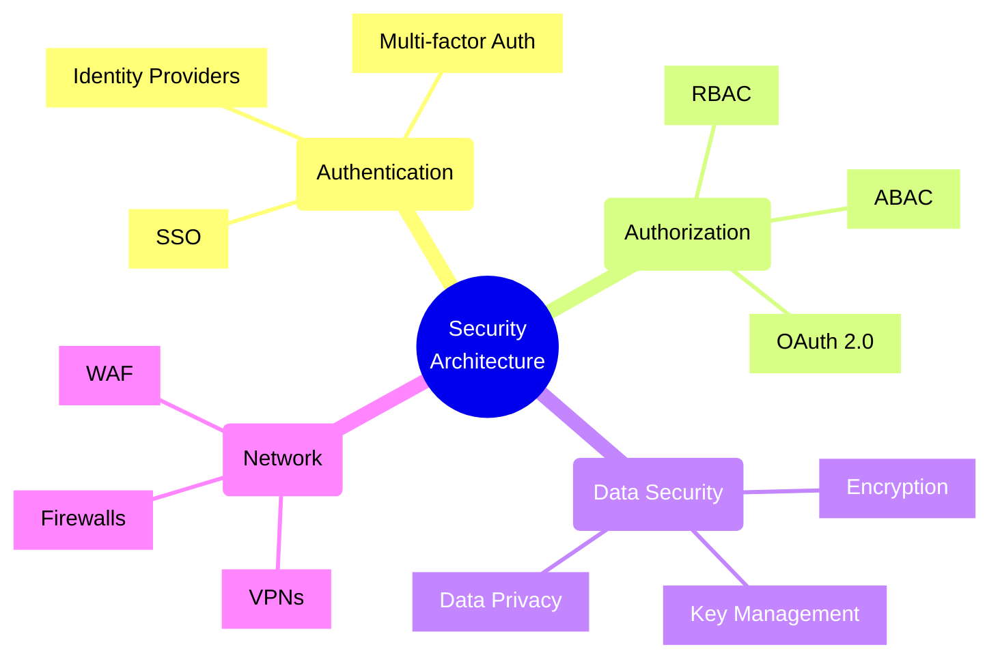
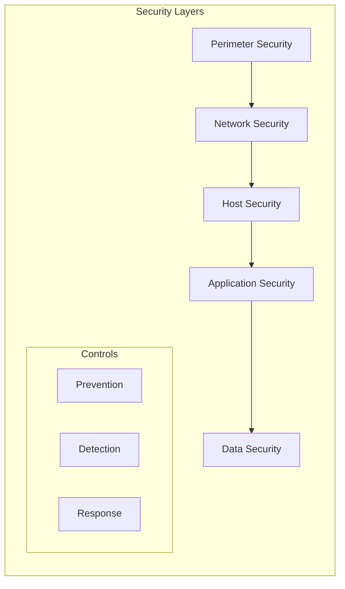
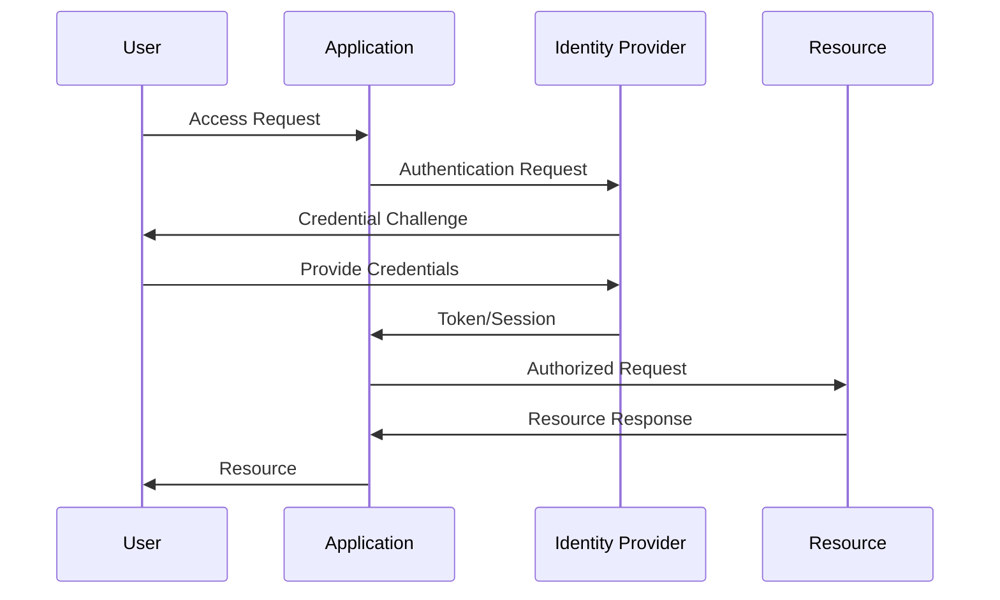
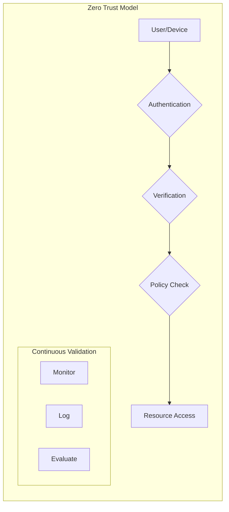
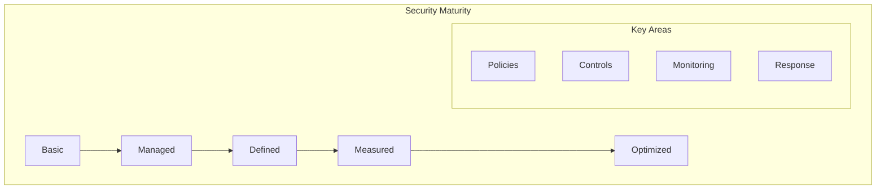

# Security Architecture Patterns

## Defense in Depth

## Authentication Flow

## Zero Trust Architecture

## Implementation Checklist

### Authentication Controls
- [ ] Implement MFA
- [ ] Set up SSO integration
- [ ] Configure password policies
- [ ] Implement account lockout
- [ ] Set up session management
- [ ] Enable secure password reset
- [ ] Configure social auth (if needed)

### Authorization Framework
- [ ] Implement RBAC/ABAC
- [ ] Set up permission management
- [ ] Configure access policies
- [ ] Implement OAuth 2.0/OIDC
- [ ] Set up API authentication
- [ ] Configure service accounts
- [ ] Enable audit logging

### Data Security
- [ ] Enable encryption at rest
- [ ] Configure TLS/SSL
- [ ] Set up key management
- [ ] Implement secrets management
- [ ] Configure backup encryption
- [ ] Set up DLP policies
- [ ] Enable audit trails

### Network Security
- [ ] Configure firewalls
- [ ] Set up WAF
- [ ] Implement VPN
- [ ] Enable DDoS protection
- [ ] Configure network segmentation
- [ ] Set up intrusion detection
- [ ] Enable traffic monitoring

## Trade-offs

### Security Level vs. User Experience
- **High Security**
  - Pros:
    * Better protection
    * Reduced risk
    * Compliance adherence
  - Cons:
    * User friction
    * Slower access
    * Higher complexity

### Centralized vs. Distributed Security
- **Centralized Security**
  - Pros:
    * Easier management
    * Consistent policies
    * Better visibility
  - Cons:
    * Single point of failure
    * Performance bottleneck
    * Higher impact on failure

### Prevention vs. Detection
- **Prevention Focus**
  - Pros:
    * Proactive protection
    * Reduced incidents
    * Lower risk
  - Cons:
    * Higher costs
    * More restrictions
    * Potential false positives

### Automation vs. Manual Control
- **Automated Security**
  - Pros:
    * Faster response
    * Consistent enforcement
    * 24/7 protection
  - Cons:
    * Complex setup
    * Potential false positives
    * Higher initial cost

## Security Maturity Model

## Best Practices

1. **Authentication**
   - Implement MFA everywhere
   - Use secure session management
   - Enforce password policies
   - Regular access reviews
   - Monitor auth attempts
   - Enable account recovery
   - Audit authentication logs

2. **Authorization**
   - Follow least privilege
   - Regular permission reviews
   - Monitor access patterns
   - Implement separation of duties
   - Document access policies
   - Automate access controls
   - Regular compliance checks

3. **Data Protection**
   - Encrypt sensitive data
   - Secure key management
   - Regular key rotation
   - Implement backup security
   - Monitor data access
   - Enable data masking
   - Regular security audits

4. **Network Security**
   - Segment networks
   - Monitor traffic
   - Regular security scans
   - Update security rules
   - Monitor endpoints
   - Implement zero trust
   - Regular penetration testing

## Security Controls Matrix

| Domain | Control Type | Implementation | Monitoring |
|--------|-------------|----------------|------------|
| Authentication | Preventive | MFA, Password Policy | Auth Logs |
| Authorization | Detective | RBAC, ABAC | Access Logs |
| Data Security | Preventive | Encryption, DLP | Data Access Logs |
| Network | Preventive/Detective | Firewalls, IDS/IPS | Traffic Logs |
| Application | Preventive | Input Validation, CSRF | App Logs |
| Physical | Preventive | Access Cards, Cameras | Security Logs |

Remember: Security is a continuous process, not a one-time implementation. Regular reviews, updates, and monitoring are essential components of a robust security architecture.