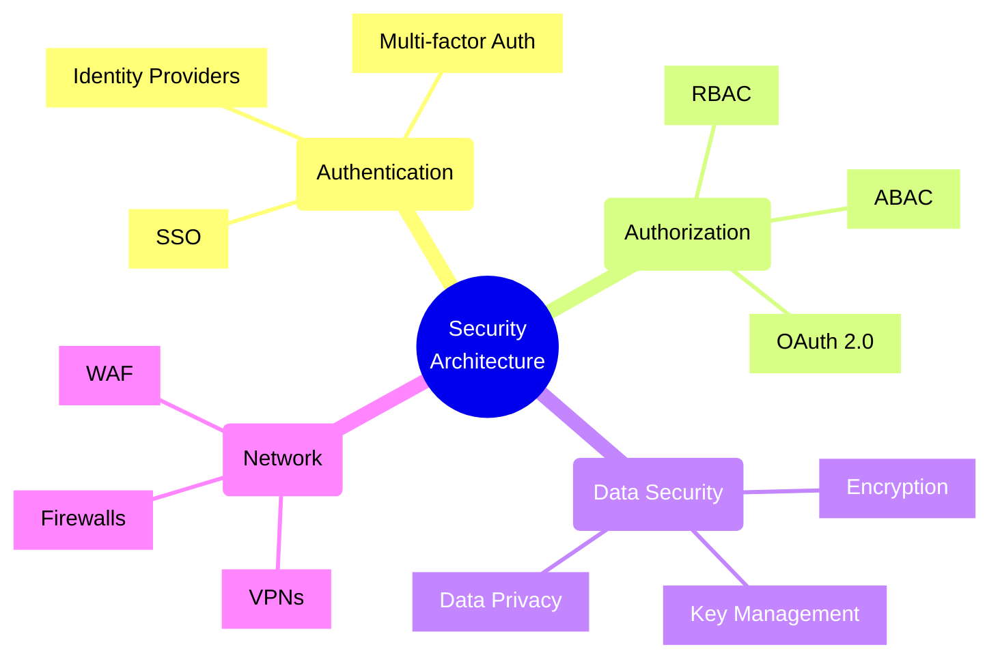
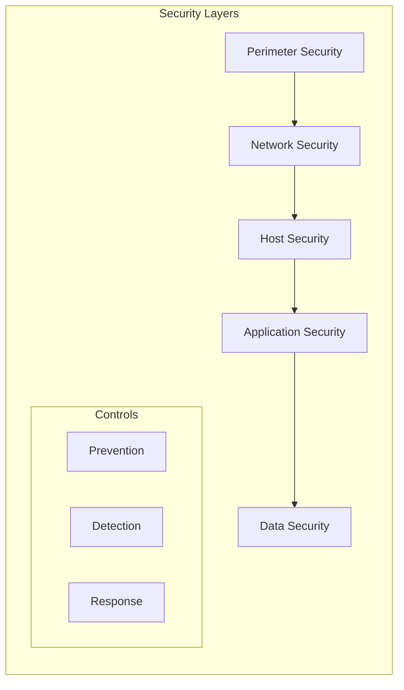
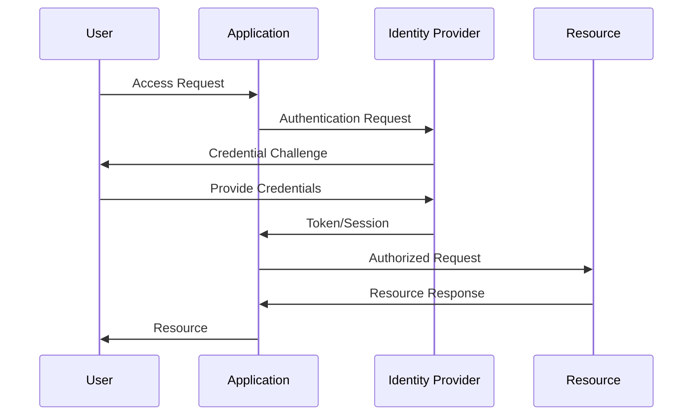
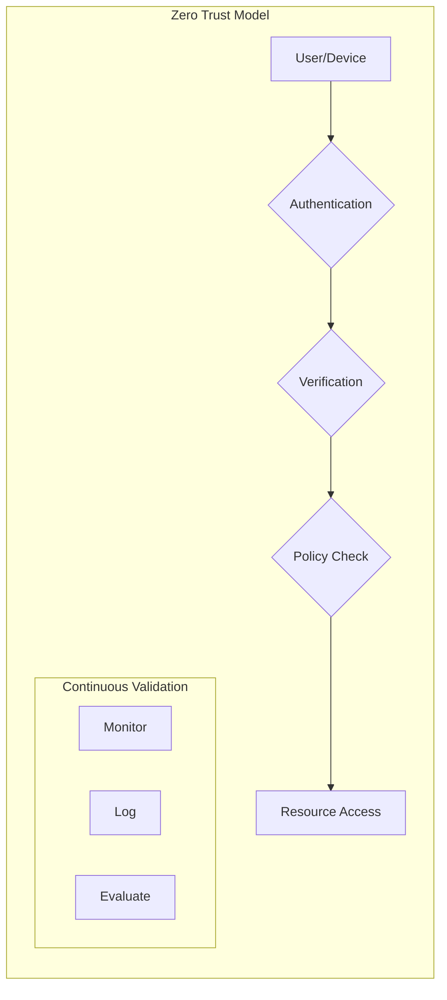

# Security Architecture Patterns



## Defense in Depth



## Authentication Flow



## Zero Trust Architecture



## Security Patterns and Implementation

### 1. Identity and Access Management (IAM)

```typescript
// OAuth 2.0 Implementation Example
interface OAuthConfig {
    clientId: string;
    clientSecret: string;
    redirectUri: string;
    scope: string[];
}

class OAuth2Provider {
    constructor(private config: OAuthConfig) {}
    
    async authenticate(code: string): Promise<TokenResponse> {
        // Exchange authorization code for tokens
        const tokens = await this.exchangeCode(code);
        
        // Verify token and extract claims
        const claims = await this.verifyToken(tokens.accessToken);
        
        return {
            accessToken: tokens.accessToken,
            refreshToken: tokens.refreshToken,
            claims: claims
        };
    }
}
```

### 2. Data Encryption

```typescript
// End-to-End Encryption Example
class E2EEncryption {
    private async generateKeyPair(): Promise<CryptoKeyPair> {
        return await window.crypto.subtle.generateKey(
            {
                name: "RSA-OAEP",
                modulusLength: 2048,
                publicExponent: new Uint8Array([1, 0, 1]),
                hash: "SHA-256"
            },
            true,
            ["encrypt", "decrypt"]
        );
    }
    
    async encryptMessage(message: string, publicKey: CryptoKey): Promise<ArrayBuffer> {
        const encoder = new TextEncoder();
        const data = encoder.encode(message);
        
        return await window.crypto.subtle.encrypt(
            { name: "RSA-OAEP" },
            publicKey,
            data
        );
    }
}
```

### 3. Role-Based Access Control (RBAC)

```typescript
// RBAC Implementation
interface Role {
    name: string;
    permissions: Permission[];
}

interface Permission {
    resource: string;
    action: 'create' | 'read' | 'update' | 'delete';
}

class RBACService {
    private roles: Map<string, Role> = new Map();
    
    async checkPermission(
        userId: string,
        resource: string,
        action: string
    ): Promise<boolean> {
        const userRoles = await this.getUserRoles(userId);
        
        return userRoles.some(role => 
            role.permissions.some(perm =>
                perm.resource === resource &&
                perm.action === action
            )
        );
    }
}
```

### 4. Secure Communication

```typescript
// TLS Configuration Example
interface TLSConfig {
    cert: string;
    key: string;
    minVersion: string;
    cipherSuites: string[];
}

class SecureServer {
    constructor(private config: TLSConfig) {}
    
    async start(): Promise<void> {
        const httpsOptions = {
            cert: await fs.readFile(this.config.cert),
            key: await fs.readFile(this.config.key),
            minVersion: 'TLSv1.3',
            cipherSuites: [
                'TLS_AES_128_GCM_SHA256',
                'TLS_AES_256_GCM_SHA384'
            ]
        };
        
        // Start HTTPS server with secure configuration
        https.createServer(httpsOptions, this.requestHandler);
    }
}
```

## Security Best Practices

1. **Authentication**
   - Implement MFA
   - Use secure session management
   - Enforce password policies
   - Implement account lockout

2. **Authorization**
   - Follow principle of least privilege
   - Implement role-based access
   - Use OAuth 2.0/OpenID Connect
   - Regular access reviews

3. **Data Protection**
   - Encrypt data in transit
   - Encrypt sensitive data at rest
   - Implement key rotation
   - Secure backup procedures

4. **Network Security**
   - Use firewalls and WAFs
   - Implement network segmentation
   - Regular security scans
   - DDoS protection

5. **Application Security**
   - Input validation
   - Output encoding
   - Security headers
   - Regular updates and patches

Remember: Security is an ongoing process, not a one-time implementation. Regular audits, updates, and monitoring are essential components of a robust security architecture.