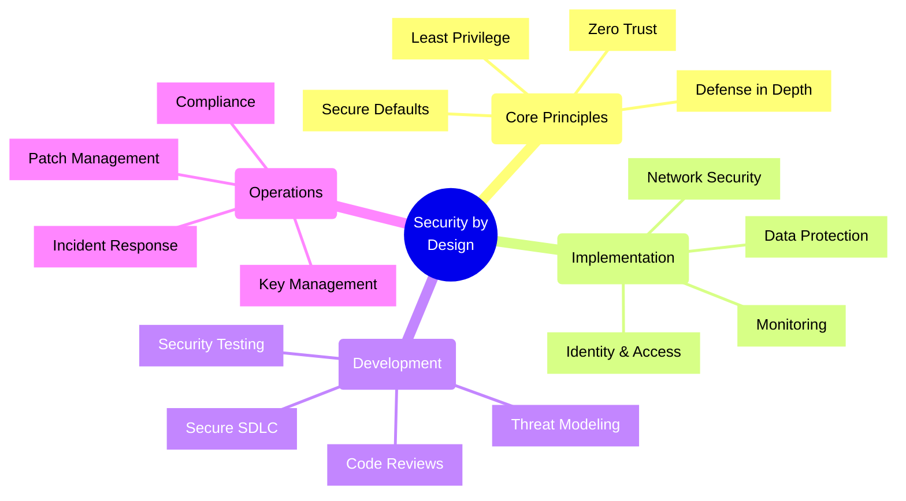
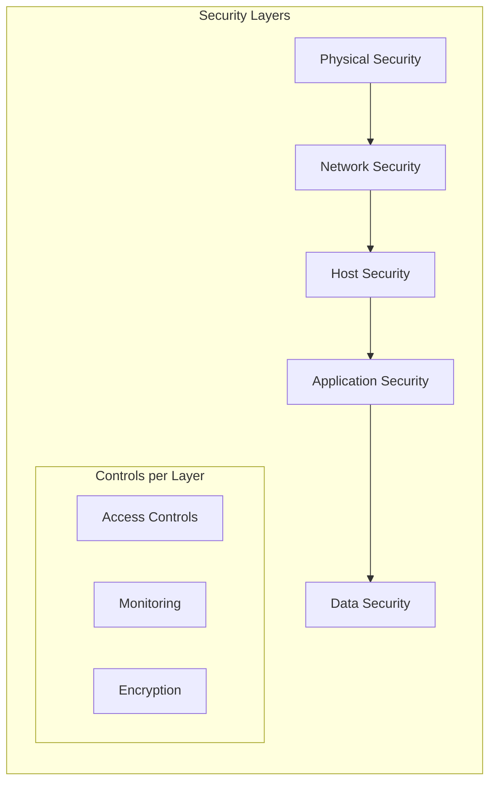
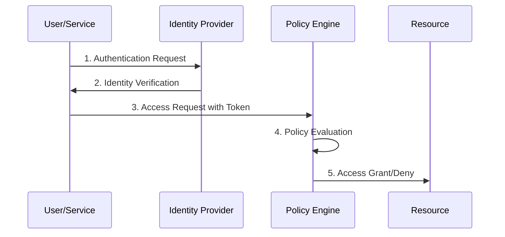
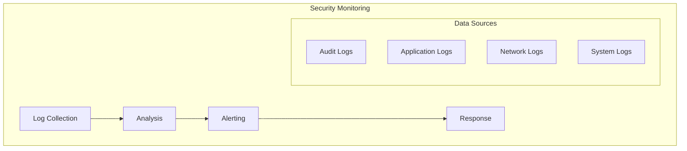

# Security by Design Principles

## Core Concepts Overview



## Fundamental Principles

### 1. Defense in Depth



### 2. Zero Trust Architecture



## Azure Implementation Patterns

### 1. Identity and Access Management
- Use Azure AD for identity management
- Implement Managed Identities for services
- Enable Multi-Factor Authentication (MFA)
- Use Conditional Access policies
- Implement Just-In-Time (JIT) access

### 2. Data Protection
- Enable encryption at rest and in transit
- Use Azure Key Vault for secret management
- Implement data classification
- Enable audit logging
- Use Azure Information Protection

### 3. Network Security
- Implement Network Security Groups (NSGs)
- Use Azure Private Link/Private Endpoints
- Enable DDoS Protection
- Implement Web Application Firewall (WAF)
- Use Azure Front Door for edge security

## Implementation Checklist

### Design Phase
- [ ] Conduct threat modeling
- [ ] Define security requirements
- [ ] Plan security controls
- [ ] Design monitoring strategy
- [ ] Plan incident response

### Development Phase
- [ ] Use secure coding practices
- [ ] Implement input validation
- [ ] Enable proper logging
- [ ] Use secure dependencies
- [ ] Implement error handling

### Operations Phase
- [ ] Enable monitoring and alerting
- [ ] Implement backup strategy
- [ ] Plan disaster recovery
- [ ] Regular security updates
- [ ] Audit access regularly

## Best Practices

### 1. Authentication & Authorization
```typescript
// Example: Using Managed Identity with Key Vault
class SecureConfigurationManager {
    constructor(private keyVaultClient: KeyVaultClient) {}
    
    async getSecret(secretName: string): Promise<string> {
        try {
            // Use DefaultAzureCredential for managed identity
            const credential = new DefaultAzureCredential();
            const client = new SecretClient(vaultUrl, credential);
            
            const secret = await client.getSecret(secretName);
            return secret.value;
        } catch (error) {
            this.logSecurityEvent('Secret retrieval failed', error);
            throw new SecurityError('Failed to retrieve secret');
        }
    }
}
```

### 2. Data Protection
```typescript
// Example: Implementing encryption for sensitive data
class DataProtectionService {
    async encryptData(data: Buffer): Promise<EncryptedData> {
        try {
            // Use Azure Key Vault for key management
            const key = await this.keyVaultClient.getKey('encryption-key');
            const encryptedData = await encrypt(data, key);
            
            return {
                data: encryptedData,
                keyId: key.id,
                algorithm: 'AES-256'
            };
        } catch (error) {
            this.logSecurityEvent('Encryption failed', error);
            throw new SecurityError('Failed to encrypt data');
        }
    }
}
```

## Trade-offs Analysis

| Security Measure | Benefits | Trade-offs |
|-----------------|----------|------------|
| Managed Identity | No credential management, secure | Initial setup complexity |
| Private Endpoints | Network isolation | Additional cost, setup complexity |
| Always Encrypt | Data protection | Performance impact |
| JIT Access | Reduced attack surface | Operational overhead |
| WAF | Protection against attacks | Potential false positives |

## Tools and Technologies

### Azure Security Tools
1. **Azure Security Center**
   - Unified security management
   - Threat protection
   - Resource security hygiene

2. **Azure Sentinel**
   - SIEM and SOAR capabilities
   - Threat intelligence
   - Incident response

3. **Azure Key Vault**
   - Secret management
   - Key management
   - Certificate management

### Development Tools
1. **Static Analysis**
   - SonarQube
   - Microsoft Security CodeAnalysis
   - Checkmarx

2. **Dynamic Analysis**
   - OWASP ZAP
   - Burp Suite
   - Azure Penetration Testing

## Security Monitoring Framework



## Compliance and Audit

### 1. Compliance Requirements
- Define compliance scope
- Map controls to requirements
- Implement monitoring
- Regular assessments
- Documentation maintenance

### 2. Audit Process
- Regular security reviews
- Access audits
- Configuration audits
- Compliance checks
- Incident reviews

Remember:
- Security is a continuous process, not a one-time implementation
- Always follow the principle of least privilege
- Implement defense in depth
- Use secure defaults
- Monitor and audit regularly
- Keep documentation updated
- Train teams on security practices