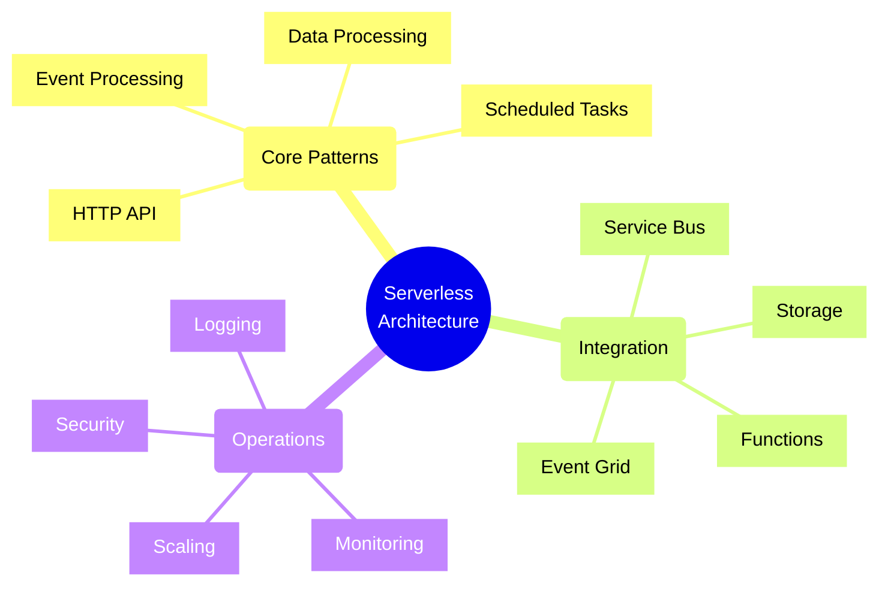
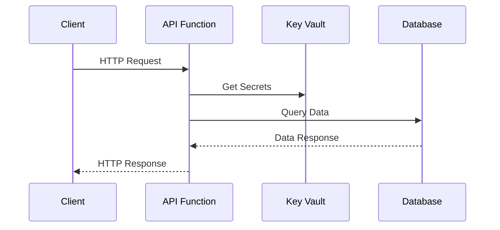
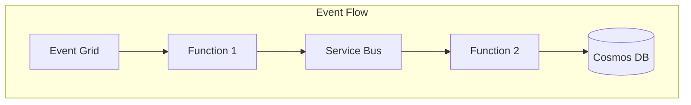
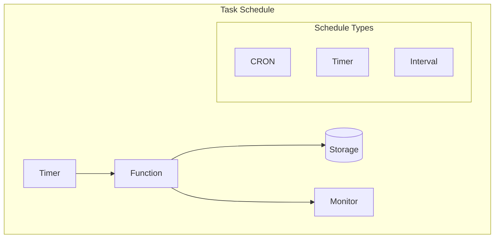
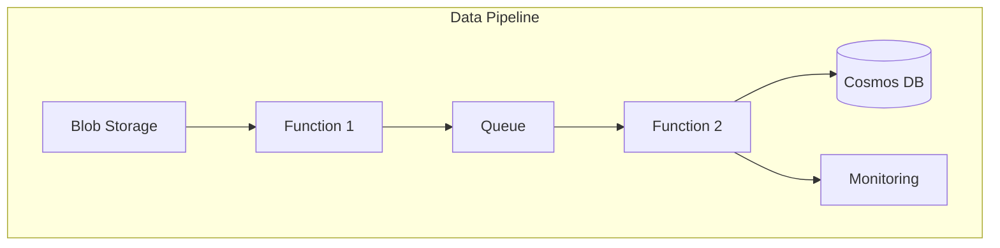
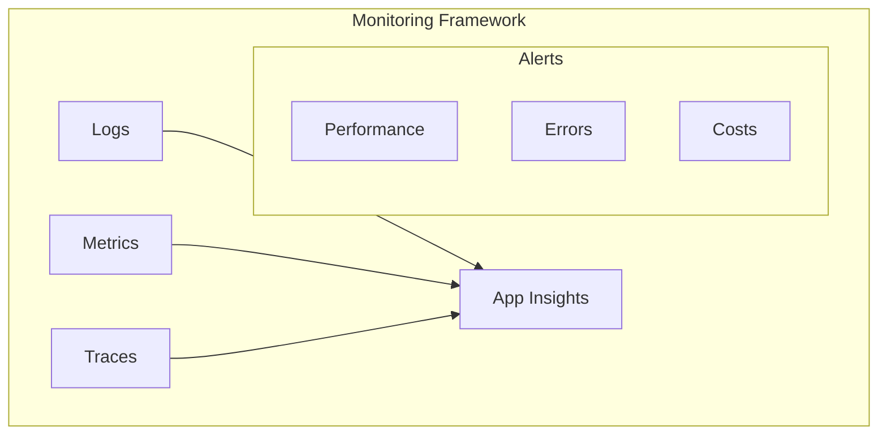

# Serverless Architecture Patterns

## Overview

## Common Serverless Patterns

### 1. HTTP API Pattern

#### Key Components
1. **Function Trigger**
   - HTTP endpoint
   - Route templates
   - Method bindings

2. **Authentication**
   - Managed identity
   - Key vault integration
   - Token validation

3. **Response Handling**
   - Status codes
   - Error handling
   - Content negotiation

### 2. Event Processing Pattern

#### Components
1. **Event Sources**
   - Event Grid
   - Service Bus
   - Event Hubs
   - Storage Events

2. **Processing Patterns**
   - Fan-out
   - Aggregation
   - Filtering
   - Transformation

3. **State Management**
   - Checkpointing
   - Dead-letter handling
   - Retry policies

### 3. Scheduled Tasks Pattern

#### Design Considerations
1. **Timing**
   - CRON expressions
   - Fixed intervals
   - Time zones

2. **Reliability**
   - Singleton execution
   - Past-due handling
   - Error recovery

3. **Monitoring**
   - Execution tracking
   - Duration metrics
   - Success rates

### 4. Data Processing Pattern

#### Processing Stages
1. **Ingestion**
   - Blob triggers
   - Queue messages
   - Event streams

2. **Transformation**
   - Data mapping
   - Enrichment
   - Validation

3. **Storage**
   - Data persistence
   - State tracking
   - Archival

## Best Practices

### 1. Security
- Use managed identities
- Secure secrets in Key Vault
- Implement RBAC
- Enable SSL/TLS
- Input validation

### 2. Performance
- Optimize cold starts
- Memory management
- Connection pooling
- Async operations
- Batch processing

### 3. Monitoring

### 4. Cost Optimization
- Execution duration
- Memory allocation
- Resource cleanup
- Scaling rules
- Cold start management

## Decision Framework

### Pattern Selection Matrix

| Pattern | Use Case | Scalability | Complexity |
|---------|----------|-------------|------------|
| HTTP API | RESTful Services | High | Low |
| Event Processing | Async Workflows | Very High | Medium |
| Scheduled Tasks | Periodic Jobs | Medium | Low |
| Data Processing | ETL Operations | High | Medium |

### Integration Considerations
1. **Event-Driven**
   - Event consistency
   - Delivery guarantees
   - Order preservation
   - Idempotency

2. **Storage Options**
   - Data consistency
   - Access patterns
   - Cost efficiency
   - Performance needs

3. **Security Model**
   - Authentication
   - Authorization
   - Network security
   - Data protection

Remember: Serverless architectures should focus on business logic while delegating infrastructure concerns to the platform.