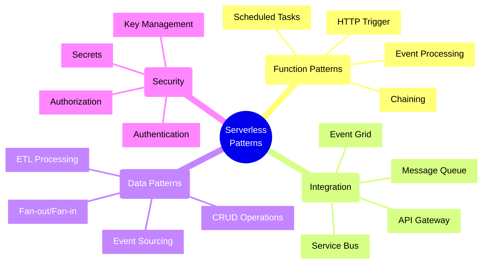
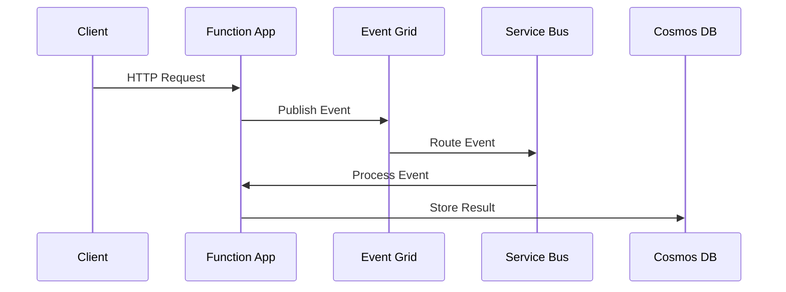
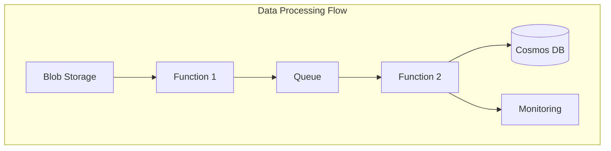

# Serverless Architecture Patterns



## Overview

Serverless architecture allows you to build and run applications without managing infrastructure. This guide covers common patterns and their implementations using Azure Functions with both Python and TypeScript examples.

## Common Serverless Patterns

### 1. HTTP API Pattern

This pattern handles HTTP requests directly, commonly used for RESTful APIs and webhooks.

#### TypeScript Implementation
```typescript
import { AzureFunction, Context, HttpRequest } from "@azure/functions"
import { DefaultAzureCredential } from "@azure/identity";
import { SecretClient } from "@azure/keyvault-secrets";

const httpTrigger: AzureFunction = async function (context: Context, req: HttpRequest): Promise<void> {
    try {
        // Use managed identity for secure key vault access
        const credential = new DefaultAzureCredential();
        const vaultName = process.env["KEY_VAULT_NAME"];
        const secretName = process.env["API_KEY_SECRET_NAME"];
        const vaultUrl = `https://${vaultName}.vault.azure.net`;
        
        const secretClient = new SecretClient(vaultUrl, credential);
        const apiKey = await secretClient.getSecret(secretName);

        const name = (req.query.name || (req.body && req.body.name));
        
        // Implement proper input validation
        if (!name) {
            context.res = {
                status: 400,
                body: "Please pass a name on the query string or in the request body"
            };
            return;
        }

        // Add structured logging
        context.log('HTTP trigger processed a request for name:', name);
        
        context.res = {
            status: 200,
            headers: {
                'Content-Type': 'application/json'
            },
            body: { message: `Hello, ${name}` }
        };
    } catch (error) {
        // Proper error handling with logging
        context.log.error('Error processing request:', error);
        context.res = {
            status: 500,
            body: "Internal server error occurred"
        };
    }
};

export default httpTrigger;
```

#### Python Implementation
```python
import azure.functions as func
from azure.identity import DefaultAzureCredential
from azure.keyvault.secrets import SecretClient
import logging
import json

def main(req: func.HttpRequest) -> func.HttpResponse:
    try:
        # Use managed identity for secure key vault access
        credential = DefaultAzureCredential()
        vault_name = os.environ["KEY_VAULT_NAME"]
        secret_name = os.environ["API_KEY_SECRET_NAME"]
        vault_url = f"https://{vault_name}.vault.azure.net"
        
        secret_client = SecretClient(vault_url=vault_url, credential=credential)
        api_key = secret_client.get_secret(secret_name)

        name = req.params.get('name')
        if not name:
            try:
                req_body = req.get_json()
                name = req_body.get('name')
            except ValueError:
                pass

        if not name:
            return func.HttpResponse(
                json.dumps({
                    "error": "Please pass a name on the query string or in the request body"
                }),
                status_code=400,
                mimetype="application/json"
            )

        # Structured logging
        logging.info('HTTP trigger processed a request for name: %s', name)
        
        return func.HttpResponse(
            json.dumps({
                "message": f"Hello, {name}"
            }),
            status_code=200,
            mimetype="application/json"
        )
    except Exception as e:
        # Proper error handling with logging
        logging.error('Error processing request: %s', str(e))
        return func.HttpResponse(
            json.dumps({
                "error": "Internal server error occurred"
            }),
            status_code=500,
            mimetype="application/json"
        )

```

### 2. Event Processing Pattern

This pattern processes events from various sources like Event Grid, Service Bus, or Event Hubs.

#### TypeScript Implementation
```typescript
import { AzureFunction, Context } from "@azure/functions"
import { ServiceBusClient } from "@azure/service-bus";
import { DefaultAzureCredential } from "@azure/identity";

const serviceBusQueueTrigger: AzureFunction = async function(context: Context, message: any): Promise<void> {
    try {
        // Use managed identity for service bus access
        const credential = new DefaultAzureCredential();
        const serviceBusEndpoint = process.env["SERVICE_BUS_ENDPOINT"];
        const queueName = process.env["QUEUE_NAME"];
        
        const sbClient = new ServiceBusClient(serviceBusEndpoint, credential);
        const sender = sbClient.createSender(queueName);

        // Implement retry logic for processing
        const maxRetries = 3;
        let currentTry = 0;
        
        while (currentTry < maxRetries) {
            try {
                // Process the message
                const result = await processMessage(message);
                
                // Send processed result to another queue
                await sender.sendMessages({
                    body: result,
                    contentType: "application/json"
                });
                
                break;
            } catch (error) {
                currentTry++;
                if (currentTry === maxRetries) {
                    throw error;
                }
                // Exponential backoff
                await new Promise(resolve => setTimeout(resolve, Math.pow(2, currentTry) * 1000));
            }
        }

        context.log('Successfully processed message:', message.id);
    } catch (error) {
        context.log.error('Error processing message:', error);
        throw error; // Allow the runtime to handle the retry
    }
};

async function processMessage(message: any): Promise<any> {
    // Add your message processing logic here
    return {
        id: message.id,
        processedTimestamp: new Date().toISOString(),
        status: 'processed'
    };
}

export default serviceBusQueueTrigger;
```

#### Python Implementation
```python
import azure.functions as func
from azure.identity import DefaultAzureCredential
from azure.servicebus import ServiceBusClient
import json
import logging
import time
from typing import Any, Dict

async def main(msg: func.ServiceBusMessage) -> None:
    try:
        # Use managed identity for service bus access
        credential = DefaultAzureCredential()
        servicebus_endpoint = os.environ["SERVICE_BUS_ENDPOINT"]
        queue_name = os.environ["QUEUE_NAME"]
        
        servicebus_client = ServiceBusClient(
            servicebus_endpoint,
            credential=credential
        )
        sender = servicebus_client.get_queue_sender(queue_name)

        # Implement retry logic for processing
        max_retries = 3
        current_try = 0
        
        while current_try < max_retries:
            try:
                # Process the message
                message_body = msg.get_body().decode('utf-8')
                message_json = json.loads(message_body)
                result = await process_message(message_json)
                
                # Send processed result to another queue
                sender.send_message(
                    json.dumps(result).encode('utf-8'),
                    content_type="application/json"
                )
                
                break
            except Exception as e:
                current_try += 1
                if current_try == max_retries:
                    raise e
                # Exponential backoff
                time.sleep(2 ** current_try)

        logging.info('Successfully processed message: %s', msg.message_id)
    except Exception as e:
        logging.error('Error processing message: %s', str(e))
        raise  # Allow the runtime to handle the retry

async def process_message(message: Dict[str, Any]) -> Dict[str, Any]:
    # Add your message processing logic here
    return {
        'id': message['id'],
        'processedTimestamp': datetime.datetime.utcnow().isoformat(),
        'status': 'processed'
    }
```

### 3. Scheduled Tasks Pattern

This pattern executes code on a timer trigger, useful for periodic jobs like data cleanup, report generation, or health checks.

#### TypeScript Implementation
```typescript
import { AzureFunction, Context } from "@azure/functions";
import { CosmosClient } from "@azure/cosmos";
import { DefaultAzureCredential } from "@azure/identity";

const timerTrigger: AzureFunction = async function (context: Context, myTimer: any): Promise<void> {
    const timeStamp = new Date().toISOString();
    
    if (myTimer.isPastDue) {
        context.log('Timer function is running late!');
    }

    try {
        // Use managed identity for Cosmos DB access
        const credential = new DefaultAzureCredential();
        const endpoint = process.env["COSMOS_ENDPOINT"];
        const client = new CosmosClient({ endpoint, credential });
        
        const database = client.database(process.env["COSMOS_DATABASE"]);
        const container = database.container(process.env["COSMOS_CONTAINER"]);

        // Query for old records
        const thresholdDate = new Date();
        thresholdDate.setDays(thresholdDate.getDays() - 30);

        const querySpec = {
            query: "SELECT * FROM c WHERE c.timestamp < @threshold",
            parameters: [
                { name: "@threshold", value: thresholdDate.toISOString() }
            ]
        };

        const { resources: oldRecords } = await container.items.query(querySpec).fetchAll();

        // Delete old records in batches
        const batchSize = 100;
        for (let i = 0; i < oldRecords.length; i += batchSize) {
            const batch = oldRecords.slice(i, i + batchSize);
            await Promise.all(batch.map(record => 
                container.item(record.id, record.partitionKey).delete()
            ));
            context.log(`Deleted batch of ${batch.length} records`);
        }

        context.log('Timer trigger function ran!', timeStamp);
    } catch (error) {
        context.log.error('Error in timer trigger:', error);
        throw error;
    }
};

export default timerTrigger;
```

#### Python Implementation
```python
import azure.functions as func
from azure.identity import DefaultAzureCredential
from azure.cosmos import CosmosClient
import datetime
import logging
from typing import List

async def main(mytimer: func.TimerRequest) -> None:
    utc_timestamp = datetime.datetime.utcnow().isoformat()

    if mytimer.past_due:
        logging.info('Timer function is running late!')

    try:
        # Use managed identity for Cosmos DB access
        credential = DefaultAzureCredential()
        endpoint = os.environ["COSMOS_ENDPOINT"]
        client = CosmosClient(endpoint, credential=credential)
        
        database = client.get_database_client(os.environ["COSMOS_DATABASE"])
        container = database.get_container_client(os.environ["COSMOS_CONTAINER"])

        # Query for old records
        threshold_date = datetime.datetime.utcnow() - datetime.timedelta(days=30)
        
        query = "SELECT * FROM c WHERE c.timestamp < @threshold"
        parameters = [{"name": "@threshold", "value": threshold_date.isoformat()}]
        
        old_records = list(container.query_items(
            query=query,
            parameters=parameters,
            enable_cross_partition_query=True
        ))

        # Delete old records in batches
        batch_size = 100
        for i in range(0, len(old_records), batch_size):
            batch = old_records[i:i + batch_size]
            operations = [
                {"operationType": "Delete", "id": record['id']} 
                for record in batch
            ]
            
            if operations:
                container.execute_batch(operations)
                logging.info(f"Deleted batch of {len(operations)} records")

        logging.info('Timer trigger function ran at %s', utc_timestamp)
    except Exception as e:
        logging.error('Error in timer trigger: %s', str(e))
        raise
```

### 4. Data Processing Pattern

This pattern demonstrates batch processing and transformation of data, commonly used in ETL scenarios.

#### TypeScript Implementation
```typescript
import { AzureFunction, Context } from "@azure/functions";
import { BlobServiceClient } from "@azure/storage-blob";
import { DefaultAzureCredential } from "@azure/identity";
import { CosmosClient } from "@azure/cosmos";

const blobTrigger: AzureFunction = async function(context: Context, myBlob: any): Promise<void> {
    try {
        // Use managed identity for storage access
        const credential = new DefaultAzureCredential();
        const blobServiceClient = BlobServiceClient.fromConnectionString(
            process.env["STORAGE_CONNECTION_STRING"]
        );

        // Process the data
        const data = JSON.parse(myBlob.toString());
        const transformedData = await transformData(data);

        // Store results in Cosmos DB
        const cosmosClient = new CosmosClient({
            endpoint: process.env["COSMOS_ENDPOINT"],
            credential
        });

        const database = cosmosClient.database(process.env["COSMOS_DATABASE"]);
        const container = database.container(process.env["COSMOS_CONTAINER"]);

        // Batch insert with bulk operations
        const operations = transformedData.map(item => ({
            operationType: "Create",
            resourceBody: item
        }));

        const bulkOperations = await container.items.bulk(operations);
        
        context.log(`Processed ${transformedData.length} records`);
        
        // Upload summary to new blob
        const summaryData = generateSummary(transformedData);
        const containerClient = blobServiceClient.getContainerClient("summaries");
        const blobName = `summary-${new Date().toISOString()}.json`;
        const blockBlobClient = containerClient.getBlockBlobClient(blobName);
        
        await blockBlobClient.upload(JSON.stringify(summaryData), Buffer.byteLength(JSON.stringify(summaryData)));
        
    } catch (error) {
        context.log.error('Error processing blob:', error);
        throw error;
    }
};

async function transformData(data: any[]): Promise<any[]> {
    return data.map(item => ({
        id: item.id,
        processedData: item.data.toUpperCase(),
        timestamp: new Date().toISOString(),
        metadata: {
            source: item.source,
            type: item.type
        }
    }));
}

function generateSummary(data: any[]): any {
    return {
        totalRecords: data.length,
        processedTimestamp: new Date().toISOString(),
        types: Array.from(new Set(data.map(item => item.metadata.type))),
        sources: Array.from(new Set(data.map(item => item.metadata.source)))
    };
}

export default blobTrigger;
```

#### Python Implementation
```python
import azure.functions as func
from azure.identity import DefaultAzureCredential
from azure.storage.blob import BlobServiceClient
from azure.cosmos import CosmosClient
import json
import logging
from datetime import datetime
from typing import Any, Dict, List

async def main(myblob: func.InputStream):
    try:
        # Use managed identity for storage access
        credential = DefaultAzureCredential()
        blob_service_client = BlobServiceClient.from_connection_string(
            os.environ["STORAGE_CONNECTION_STRING"]
        )

        # Process the data
        data = json.loads(myblob.read())
        transformed_data = await transform_data(data)

        # Store results in Cosmos DB
        cosmos_client = CosmosClient(
            os.environ["COSMOS_ENDPOINT"],
            credential=credential
        )

        database = cosmos_client.get_database_client(os.environ["COSMOS_DATABASE"])
        container = database.get_container_client(os.environ["COSMOS_CONTAINER"])

        # Batch insert with bulk operations
        operations = [
            {
                'operationType': 'Create',
                'resourceBody': item
            }
            for item in transformed_data
        ]

        container.execute_batch(operations)
        
        logging.info(f"Processed {len(transformed_data)} records")
        
        # Upload summary to new blob
        summary_data = generate_summary(transformed_data)
        container_client = blob_service_client.get_container_client("summaries")
        blob_name = f"summary-{datetime.utcnow().isoformat()}.json"
        
        container_client.upload_blob(
            name=blob_name,
            data=json.dumps(summary_data),
            overwrite=True
        )
        
    except Exception as e:
        logging.error('Error processing blob: %s', str(e))
        raise

async def transform_data(data: List[Dict[str, Any]]) -> List[Dict[str, Any]]:
    return [{
        'id': item['id'],
        'processedData': item['data'].upper(),
        'timestamp': datetime.utcnow().isoformat(),
        'metadata': {
            'source': item['source'],
            'type': item['type']
        }
    } for item in data]

def generate_summary(data: List[Dict[str, Any]]) -> Dict[str, Any]:
    return {
        'totalRecords': len(data),
        'processedTimestamp': datetime.utcnow().isoformat(),
        'types': list(set(item['metadata']['type'] for item in data)),
        'sources': list(set(item['metadata']['source'] for item in data))
    }
```

## Best Practices for Serverless Applications

1. **Security**
   - Use managed identities instead of connection strings
   - Store secrets in Azure Key Vault
   - Implement proper authentication and authorization
   - Follow the principle of least privilege

2. **Performance**
   - Keep functions focused and lightweight
   - Optimize cold start times
   - Use async/await patterns effectively
   - Implement proper connection pooling

3. **Reliability**
   - Implement proper error handling
   - Use retry patterns with exponential backoff
   - Monitor function execution and failures
   - Implement proper logging and tracing

4. **Cost Optimization**
   - Optimize function execution time
   - Use consumption plan appropriately
   - Monitor and optimize memory usage
   - Implement proper caching strategies

## Common Serverless Architecture Diagrams

### Event Processing Architecture


### Data Processing Pipeline


## Monitoring and Observability

1. **Application Insights Integration**
   - Enable automatic correlation
   - Track custom metrics
   - Monitor performance
   - Set up alerts

2. **Logging Strategy**
   - Use structured logging
   - Include correlation IDs
   - Log appropriate detail levels
   - Implement proper retention policies

Remember: Serverless architectures require careful consideration of statelessness, idempotency, and proper error handling. Always design with these principles in mind.