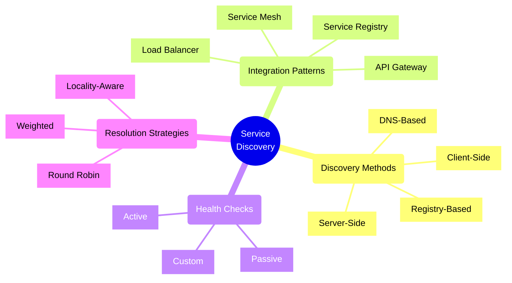
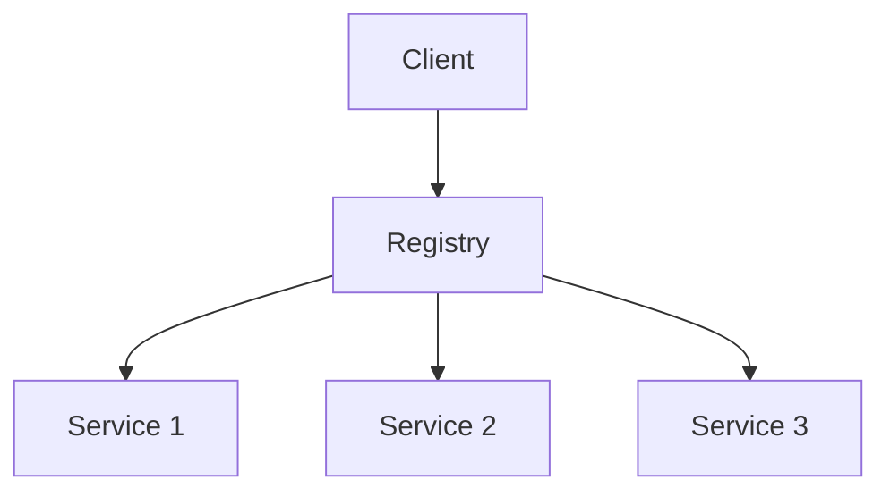
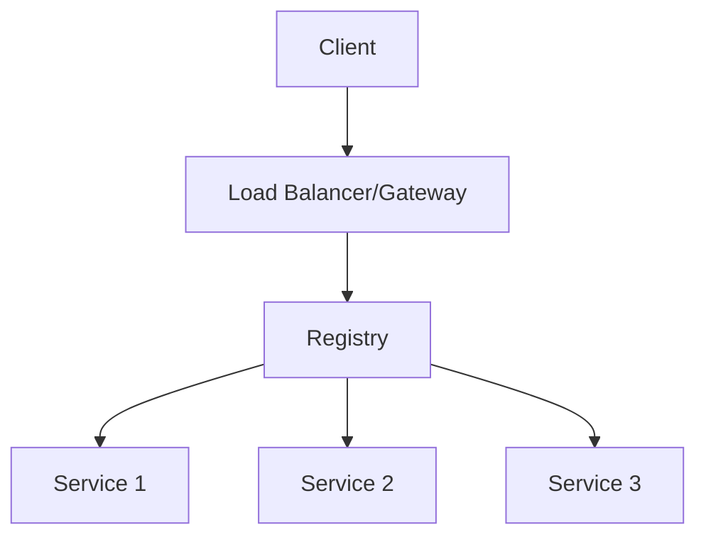
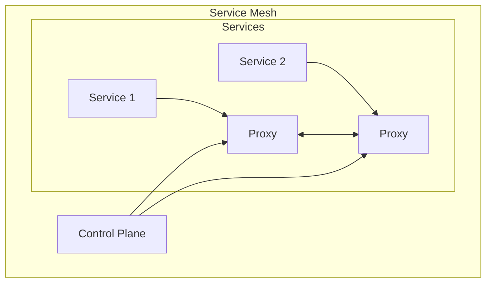
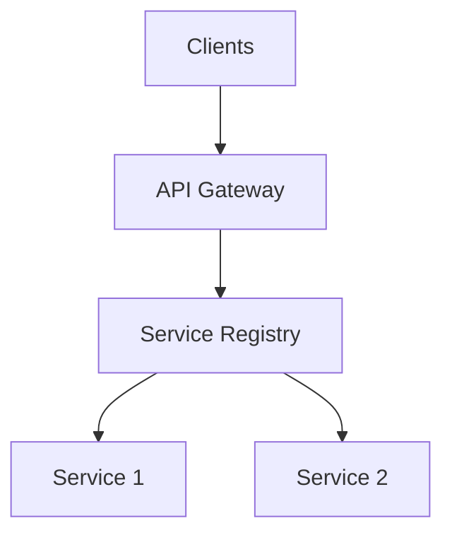

# Service Discovery Patterns

## Core Patterns

## Pattern Comparison Matrix

| Pattern | Complexity | Scalability | Reliability | Use Case |
|---------|------------|-------------|-------------|----------|
| Client-Side | High | High | Medium | Microservices with direct communication |
| Server-Side | Medium | High | High | API Gateway-based architectures |
| DNS-Based | Low | Medium | High | Simple service discovery needs |
| Registry-Based | High | High | High | Complex microservices ecosystems |

## Architectural Decision Framework

### 1. Client-Side Discovery

**Considerations:**
- Direct service-to-service communication
- Client maintains service registry cache
- More complex client implementation
- Better performance (fewer hops)

### 2. Server-Side Discovery

**Considerations:**
- Simpler client implementation
- Centralized control
- Additional network hop
- Gateway as potential bottleneck

## Health Check Patterns

### Active Health Checks
- Regular polling of services
- Customizable check intervals
- Higher network overhead
- More accurate health status

### Passive Health Checks
- Monitor actual traffic
- Lower overhead
- May miss issues between requests
- Good for high-traffic services

## Integration Strategies

### 1. Service Mesh Integration

### 2. API Gateway Integration

## Operational Considerations

1. **Reliability**
   - Cache service locations
   - Implement circuit breakers
   - Handle network partitions
   - Regular health checks

2. **Performance**
   - Local caching
   - DNS TTL optimization
   - Load balancing strategies
   - Health check intervals

3. **Security**
   - Service authentication
   - Network segmentation
   - Access control
   - TLS communication

4. **Maintainability**
   - Service versioning
   - Graceful degradation
   - Documentation
   - Monitoring

## Decision Checklist

- [ ] Scale of deployment
- [ ] Network topology
- [ ] Security requirements
- [ ] Client capabilities
- [ ] Operational overhead
- [ ] Monitoring requirements
- [ ] Integration needs
- [ ] Performance requirements

Remember: Service Discovery is a critical architectural component that should be chosen based on your specific use case, scale, and operational capabilities.