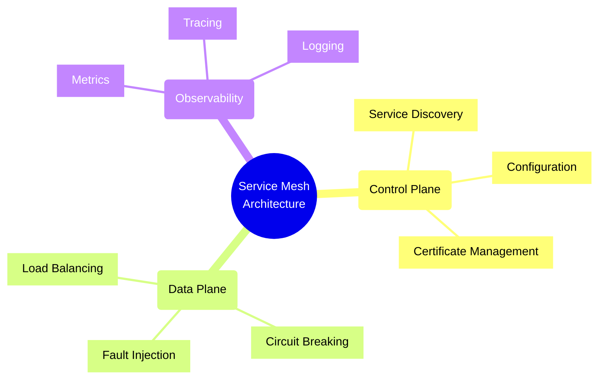
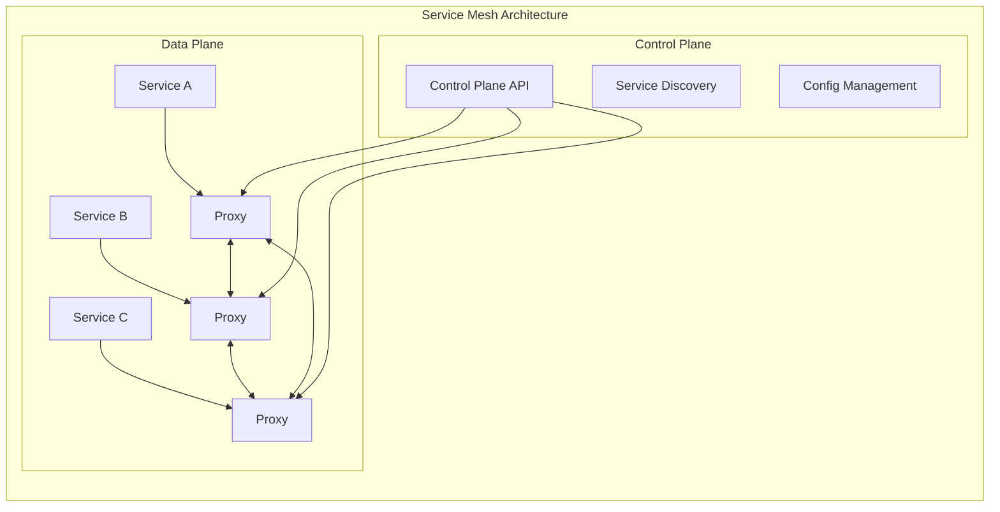

# Service Mesh Patterns

## Service Mesh Components

## Implementation Checklist

### Control Plane Setup
- [ ] Configure service discovery mechanism
- [ ] Set up configuration management
- [ ] Implement certificate management
- [ ] Define traffic policies
- [ ] Configure access controls
- [ ] Set up monitoring and metrics
- [ ] Implement logging and tracing

### Data Plane Configuration
- [ ] Deploy service proxies
- [ ] Configure load balancing
- [ ] Set up circuit breakers
- [ ] Implement retry logic
- [ ] Configure timeouts
- [ ] Set up fault injection
- [ ] Enable traffic splitting

### Security Setup
- [ ] Enable mTLS
- [ ] Configure authentication
- [ ] Set up authorization policies
- [ ] Implement rate limiting
- [ ] Configure network policies
- [ ] Set up encryption
- [ ] Enable audit logging

### Observability Configuration
- [ ] Set up metrics collection
- [ ] Configure distributed tracing
- [ ] Implement logging
- [ ] Set up dashboards
- [ ] Configure alerts
- [ ] Enable performance monitoring
- [ ] Set up service graphs

## Trade-offs

### Complexity vs. Control
- **High Control**
  - Pros:
    * Fine-grained traffic management
    * Detailed observability
    * Advanced security features
  - Cons:
    * Increased complexity
    * Higher learning curve
    * More resources needed

### Performance vs. Features
- **Rich Features**
  - Pros:
    * Advanced capabilities
    * Better control
    * More flexibility
  - Cons:
    * Additional latency
    * Higher resource usage
    * More complex troubleshooting

### Centralization vs. Resilience
- **Centralized Control**
  - Pros:
    * Easier management
    * Consistent policies
    * Single source of truth
  - Cons:
    * Single point of failure risk
    * Higher blast radius
    * Potential bottlenecks

### Automation vs. Flexibility
- **High Automation**
  - Pros:
    * Reduced manual work
    * Consistent deployment
    * Faster operations
  - Cons:
    * Less customization
    * More upfront setup
    * Harder to debug

## Best Practices

1. **Architecture Design**
   - Start small and scale gradually
   - Use sidecar pattern consistently
   - Implement proper segmentation
   - Plan for failure scenarios

2. **Security**
   - Enable mTLS by default
   - Implement zero-trust networking
   - Use strong authentication
   - Regular security audits

3. **Observability**
   - Implement comprehensive monitoring
   - Use distributed tracing
   - Set up proper logging
   - Create useful dashboards

4. **Performance**
   - Optimize proxy configuration
   - Monitor resource usage
   - Implement proper caching
   - Regular performance testing

5. **Operations**
   - Automate deployment
   - Regular backup procedures
   - Document configurations
   - Train operations team

Remember: Service mesh adds complexity to your infrastructure. Start with essential features and gradually add more as your team becomes comfortable with the implementation.